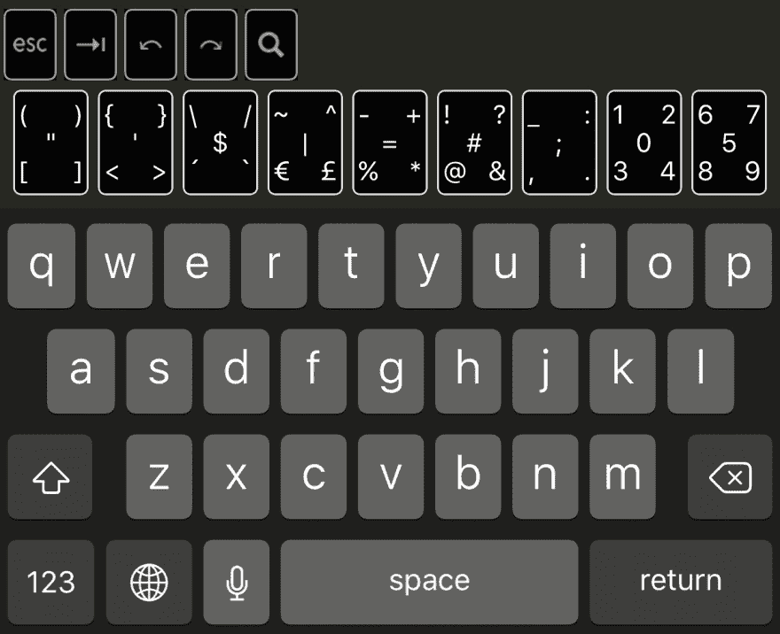
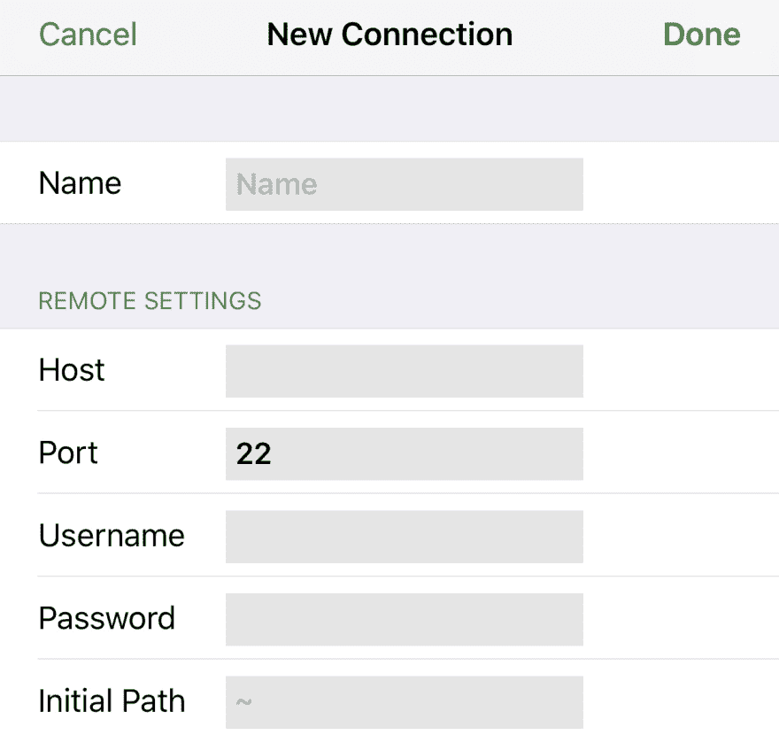

# 粗糙的 It 开发风格:不用计算机编码

> 原文：<https://dev.to/chazonacodes/roughing-it-dev-style-coding-without-a-computer>

这个月，我遇到了一件非常糟糕、可怕、不好、非常糟糕的事情:我的专用个人和工作电脑 Surface Pro 死机了。尽管我找到了一个便宜的替代品，但我无法想象一周不编码的日子。我完全吓坏了。

在仅仅阅读关于 web 开发主题的几天令人不满意的经历后，我开始思考如何才能完成一些真正的工作，只带着我的 iPhone。

## 试错

如果没有必要，我不想寻找新的解决方案，我首先求助于我以前用过的工具:

### 码笔

Codepen 在紧要关头并不可怕。然而，布局和屏幕键盘并没有为手机上的编码进行优化。做一些小的改动会花费很多时间，并且很容易以错误的代码结束。

### Cloud9 IDE

Cloud9 也有同样的问题，但是界面已经更加混乱。它明确地[不支持移动浏览器](https://community.c9.io/t/supported-browsers/1988/4),而且它已经多次明确表示，让 Cloud9 对移动设备友好或为其开发原生移动应用不在路线图的任何地方。

### CodeAnywhere

在探索 Cloud9 问题时，我看到提到了一种替代的跨平台云 IDE，称为 CodeAnywhere。然而，iOS 应用程序似乎自 2014 年以来就没有更新过，在四次尝试创建帐户和登录失败后，我认为应该有更好的东西。

## 什么终于奏效了

经过一些令人沮丧的经历后，我遇到了超出我预期的工具和技术，让我只用一部手机就能高效地编写代码，也能让你这样做。

### 编辑:[缓冲区编辑](http://buffereditor.com/)

缓冲编辑器曾是 App Store 中隐藏的瑰宝。它没有广告或口碑，甚至没有足够的评论来保证评级。人们很容易低估缓冲。

然而，当实际下载时，很明显 Buffer Editor 是一个真正的、强大的编辑器，真正针对移动体验进行了优化。吸引我的功能包括:

*   一种扩展键盘，使打字快速(单手)且有目的性。
*   精心设计的内置终端。
*   全屏编辑，在这么小的屏幕上的必需品。
*   40 多种语言和技术的语法高亮和自动完成。
*   能够通过 SSH、FTP、SFTP、GitHub、Dropbox 和 iCloud 进行连接。
*   通过电子邮件发送文件。

[T2】](https://res.cloudinary.com/practicaldev/image/fetch/s--SfY5Q6qy--/c_limit%2Cf_auto%2Cfl_progressive%2Cq_auto%2Cw_880/https://thepracticaldev.s3.amazonaws.com/i/91wdnmj76i0r0uqyd2ha.jpg)

它还包含了一些我没有用到的有用的[特性](http://buffereditor.com/features/)，比如 Vim 支持和蓝牙键盘支持。

虽然它不是免费的，但 4.99 美元的价格非常值得，尤其是与流行的 Coda 的近 25 美元相比。

### 服务器:[数字海洋](https://www.digitalocean.com/)

受限于一部手机给了我动力，让我开始直接在像 [Digital Ocean](https://www.digitalocean.com/solutions/) 这样的 VPS 解决方案中建立更多的网站和应用程序，而不是仅仅在本地机器上开始。使用虚拟专用服务器(Digital Ocean 称之为 droplets)允许建立开发环境和管理文件/服务器，而不需要本地环境，因为它在云中的另一台计算机上。VPS 的另一个好处是，从一开始，项目就不局限于一台本地机器，即使它还没有被签入版本控制。

数字海洋已经被证明易于使用(并且不贵)，并且有大量的文档和指南供不熟悉运行服务器的人使用。

在 Buffer Editor 中远程访问 droplet 很容易，只需添加一个新的 SSH 连接，并用 droplet 中的信息填充相关设置。

[T2】](https://res.cloudinary.com/practicaldev/image/fetch/s--GexO45y5--/c_limit%2Cf_auto%2Cfl_progressive%2Cq_auto%2Cw_880/https://thepracticaldev.s3.amazonaws.com/i/gbb7k3irbt7uz0y2juyw.jpg)

### 浏览器访问:本地服务器绑定

当然，web 开发的奇妙之处和问题在于，你需要的首要东西是浏览器。使用 VPS 进行开发，您可以访问终端控制台，但不能访问图形用户界面或传统的 web 浏览器。

当开发一个 web 应用程序时，您通常需要能够启动一个本地服务器并在 web 浏览器中访问`localhost`,因为这是开发服务器显示应用程序的地方。不幸的是，`localhost`意味着*这台电脑*，因此除了托管应用程序文件的 VPS 之外，它是不可访问的。

这里的解决方法包括了解更多关于服务器和请求的信息:

当启动一个服务器时，它发送一个 bind 请求来表明它已经准备好接收与一个 IP 地址相关的请求。本地服务器通常绑定到`127.0.0.1`,因为该 IP 地址用于回送请求的计算机；每台电脑只能向自己请求`127.0.0.1`，通常方便开发。

这显然不是一个选项。相反，您需要让服务器绑定请求指示其可公开访问的 IP 地址，以便可以从该电脑之外的浏览器访问它。这个 IP 地址很容易从 Digital Ocean 获得，解决方法是添加一个类似这样的`--binding`标志，用于启动一个 Rails 服务器:

```
rails s --binding=XX.XX.XX.XX 
```

现在，不用在浏览器的地址栏中输入`localhost:3000`来查看应用程序，你可以输入公开的 IP 地址，比如`XX.XX.XX.XX:3000`。只要本地服务器使用绑定标志运行，就可以从服务器的 IP 地址远程访问应用程序。

Buffer Editor 特别方便，因为它可以在退出终端后保持服务器运行(这样您就可以再次打开它并继续开发)。起初这可能会令人困惑，但要停止服务器，锁定和解锁您的手机。

### 回到编码生产力

从这里，您可以像往常一样使用 git，开始工作并调试您的代码，无论您在哪里，也不管 WiFi/以太网是否可用。事实上，在我的新电脑到达的前一天，我能够进行 6 次提交并将其推送到 GitHub，所有这些都来自我的 iPhone。

虽然我的日常编码将在传统的台式机或笔记本电脑上进行(因为两只手比一只手快)，但当我无法将笔记本电脑带到某个地方或当我只能使用移动互联网时，例如在车上，我会继续利用这些工具来完成我的项目。

实际上，我很感激失去使用电脑的经历，因为它迫使我找到一种解决方案，现在它允许我几乎在任何地方编码。