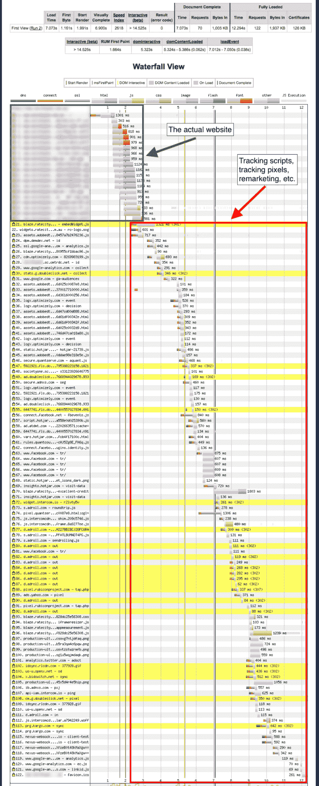
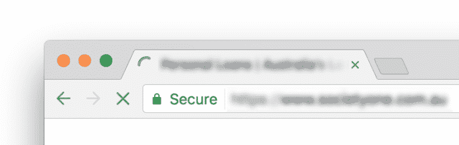
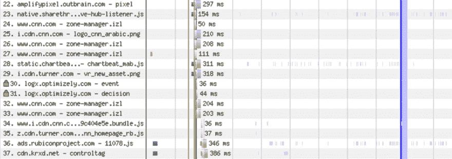

# 标签疯了！管理标签管理器

> 原文:[https://dev . to/gaijinity/tags-gone-wild-managing-tag-managers-DHF](https://dev.to/gaijinity/tags-gone-wild-managing-tag-managers-dhf)

# 标签狂放！管理标签管理器

### 像 Google Tag Man ag er 和 Adobe Tag Man ag er 这样的工具提供了强大的功能，但是它们可能会对用户体验产生不利影响

安德鲁·韦尔奇

[T2】](https://res.cloudinary.com/practicaldev/image/fetch/s--YrbJPoVF--/c_limit%2Cf_auto%2Cfl_progressive%2Cq_auto%2Cw_880/https://nystudio107-ems2qegf7x6qiqq.netdna-ssl.com/img/blog/_1200x675_crop_center-center_82_line/buried-in-tag-manager-tags.jpg)

像 [Google Tag Man ag er](https://www.google.com/analytics/tag-manager/) (GTM)和 [Adobe Tag Man ag er](http://www.adobe.com/marketing-cloud/activation.html) (ATM)这样的工具因其提供的营销跟踪能力而在广告界大受欢迎。但是如果管理不当，它们会损害网站性能和用户体验。

这些工具的作用是允许你管理从一个友好的控制面板网络接口注入到一个网页中的“标签”。本文中的“标签”是任意的 JavaScript 代码，用来做一些事情(通常是某种跟踪)。

这对于营销和分析专业人员来说是个好消息，因为他们可以在网页上添加内容跟踪、评论、跟踪“像素”等等，而不需要讨厌的开发人员来实现。

一旦 Tag Man ager 的 JavaScript 被放到页面上，它就会负责为您加载其他 JavaScript(也称为“标签”)。

<aside>Non-devel­op­ers can then inject arbi­trary JavaScript code into every web­page on your site.</aside>

标签管理员“作为一种东西”出现是出于市场营销和分析专业人员的需要，他们不需要学习 HTML、JavaScript 等等就可以完成他们的工作。

他们提供了一个集中的地方，在那里各种各样的坏事都可能发生。

## pos si bly 会出什么问题？

事实证明，很多事情都可能出错。市场营销类型通常不理解他们添加到页面上的“标签”的含义——期望他们理解是不公平的。

我想提醒一下，无论尤尔什么时候看到“标签”这个词，它都是指在用户浏览器中执行的任意 JavaScript 代码。

<aside>When you include a tag on a page, it can do what­ev­er it wants.</aside>

标签可以——而且经常——加载其他标签。所以你可能只包含了 5 个标签，但是每个标签都可以加载任意多的标签。就像 20 世纪 80 年代的电视连续剧一样，标签会像一种社会疾病一样传播。

[T2】](https://res.cloudinary.com/practicaldev/image/fetch/s--maWKlYFw--/c_limit%2Cf_auto%2Cfl_progressive%2Cq_auto%2Cw_880/https://nystudio107-ems2qegf7x6qiqq.netdna-ssl.com/img/blog/_576x412_crop_center-center_100_line/they-told-two-friends.png)

那么，这种材料为什么会变热呢？谁在乎加载了多少标签？

加载的每个标签都是另一个浏览器请求。诚然，它们相当小，但它们累积起来，特别是在高延迟的移动连接上。

它们也不可避免地从不同的地方提供，因此需要进行额外的 DNS 查找，并且您还处于标签的源 web 服务器的合并中，以获得它们的`expires`标题缓存策略。

根据[一个正确的网站，你精心调整的网站是不够的](https://dev.to/gaijinity/a-pretty-website-isn-8217-t-enough-1nbj-temp-slug-3932740)这篇文章可以确定这样的事情:

[T2】](https://res.cloudinary.com/practicaldev/image/fetch/s--WfMj1NIm--/c_limit%2Cf_auto%2Cfl_progressive%2Cq_auto%2Cw_880/https://nystudio107-ems2qegf7x6qiqq.netdna-ssl.com/img/blog/_992x2441_crop_center-center_100_line/tag-manager-tags-gone-wild.png)

这看起来很糟糕，但是真的很糟糕吗？毕竟，这些标签是在网页加载完毕后异步加载的。这是我从一些人那里听到的观点(他们都是从事追踪标签业务的 T2 人)。

像这样的标签蔓延是不好的，因为当所有这些标签都被加载的时候，你的浏览器正在努力把请求拉进来。

有没有见过网页加载，但谷歌 Chrome 浏览器的活动图标在看起来像页面加载后很久还在旋转？

[T2】](https://res.cloudinary.com/practicaldev/image/fetch/s--mRHDTDv4--/c_limit%2Cf_auto%2Cfl_progressive%2Cq_auto%2Cw_880/https://nystudio107-ems2qegf7x6qiqq.netdna-ssl.com/img/blog/_768x244_crop_center-center_100_line/google-chrome-activity-indicator.png)

这些是你的标签。

不仅仅是下载标签的 DNS 查找和网络带宽，还有每个标签都是需要执行的 JavaScript。看一下这个网页的摘录，显示标签加载:

[T2】](https://res.cloudinary.com/practicaldev/image/fetch/s--e7oG2k3O--/c_limit%2Cf_auto%2Cfl_progressive%2Cq_auto%2Cw_880/https://nystudio107-ems2qegf7x6qiqq.netdna-ssl.com/img/blog/_1200x423_crop_center-center_100_line/tag-javascript-executing.png)

所有的粉色块都表示标签 JavaScript 被执行时的 CPU 使用率。我设想通过加载到网站上的每个标签来实现这一点，不难看出这会对性能产生怎样的影响。

DNS 查找、网络请求和 JavaScript 执行的组合——由加载的每个标签来完成——对桌面计算机来说是一件烦人的事情，但在移动设备上却是如此。

移动设备的 CPU 能力有限，所有这些活动可能会在一段时间内使其不堪重负，导致网页不稳定或无法使用，直到加载完所有标签。

<aside>Not to men­tion that we’re adding to the over­all page weight, and chew­ing up their data plan.</aside>

这很糟糕。谷歌认为这太糟糕了，所以他们创建了谷歌专门解决移动网络性能差的问题。谷歌最初的目标是新闻网站，因为在以标签的形式向网页添加数字垃圾方面，它们并不坏。

有多糟？让我们来看看知名新闻网 [CNN .com](http://www.cnn.com/) 。他们的主页上总共有`254`个请求，其中绝大部分是标签。

如果你对戈尔感兴趣，看看 CNN .com 的[完整页面《水落》](https://nystudio107-ems2qegf7x6qiqq.netdna-ssl.com/img/blog/cnn_waterfall_tags.png)。&藏女人孩子。

## 那么标签是邪恶的吗？

标签并不邪恶；他们实际上是狂热的，因为他们把权力交到了你的营销和分析人员手中。

同样重要的是要注意，给自己贴标签并没有错；他们擅长使用有用的工具。最终发布这些标签的是个人(或多人)，并且需要确保他们负责任地这样做。

冒着看 sil ly 和 quot 一本漫画的风险:

<aside>With great pow­er comes great responsibility.</aside>

我把标签比作处方药；如果使用得当，它们可以形成微粒。如果它们被滥用，无论如何，它们都是有害的。

[T2】](https://res.cloudinary.com/practicaldev/image/fetch/s--CQ_d6033--/c_limit%2Cf_auto%2Cfl_progressive%2Cq_auto%2Cw_880/https://nystudio107-ems2qegf7x6qiqq.netdna-ssl.com/img/blog/_1200x675_crop_center-center_82_line/tags-are-prescription-drugs.jpg)

这里最具讽刺意味的是，标签最常被添加到网站上以跟踪欺诈行为。但是正如我们在文章中所说的，一个好的网站是不够的，差的网站会对客户产生负面影响。在很大程度上。

这让我想起了物理学中的[观测效应](https://en.wikipedia.org/wiki/Observer_effect_(physics)):

<aside>In physics, the term observ­er effect refers to changes that the act of obser­va­tion will make on a phe­nom­e­non being observed.</aside>

因此，通过把所有这些标签塞进我们的网页来确定转化率，我们可能会降低转化率。不对不对。

## 标记您的标签

那么我们能做些什么呢？我们需要一个 *per son* 为我们的标签管理员做标签管理员，让我们的标签成形。如果你愿意的话，可以说是一个训狮员。

[T2】](https://res.cloudinary.com/practicaldev/image/fetch/s--VcI0u13p--/c_limit%2Cf_auto%2Cfl_progressive%2Cq_auto%2Cw_880/https://nystudio107-ems2qegf7x6qiqq.netdna-ssl.com/img/blog/_1200x675_crop_center-center_82_line/taming-tags-whip.jpg)

这个人应该为他们的组织建立一个标签策略。以下是我的建议:

*   每个标签都应该有一个自己的 er，即负责该标签的人员
*   每个标签都应该被记录下来，说明它的作用，并证明它的存在
*   标签应该只出现在真正需要它们的页面上，而不是全部出现在网站的每个页面上
*   带有标记的硬币识别标签应设置为在适当的日期过期
*   标签应定期审核，并定期修剪

我和不止一个组织合作过，他们甚至不知道他们所有的标签在做什么。在这种情况下，我发现[标签检查服务是处理标签泛滥的良好开端。](https://taginspector.com/)

通过 [Web PageTest .org](https://www.webpagetest.org/) 来检查你的网页的加载量，看看当有人访问你的网站时，什么是真正的加载量，这也是令人大开眼界的。

<aside>And make sure your tags are actu­al­ly accom­plish­ing your goals!</aside>

此外，注意事物的逻辑方面:

*   你不需要 5 个不同的标签来追踪同一件事。
*   如果您的标签旨在跟踪冲突，请确保它们不会阻止冲突本身！
*   确保没有更好的方法来跟踪你试图跟踪的东西，比如通过[谷歌分析测量协议](https://developers.google.com/analytics/devguides/collection/protocol/v1/)进行服务器端跟踪
*   如果您使用标签管理器来执行 A/B 测试，请确保[您做得正确](https://unbounce.com/a-b-testing/simple-ab-testing-mistake-thats-killing-conversion-rates/)
*   如果你的 A/B 测试对你的曼彻斯特或 UX 网站有负面影响，你的 A/B 测试结果可能会有问题

在坚果壳里，标签负责。你应该明白，你所做的跟踪是有成本的。

开发人员需要让营销和分析人员意识到标签的成本，营销和分析人员需要让开发人员意识到他们试图实现的目标。

这个对话将会帮助你把一些事情变得真正奇妙。

Hap py 标签！

## 进一步阅读

如果你想获得新文章的通知，请在 Twitter 上关注[纽约时报 107](https://twitter.com/nystudio107) 。

版权所有 2020 nystudio107。由 nystudio107 设计