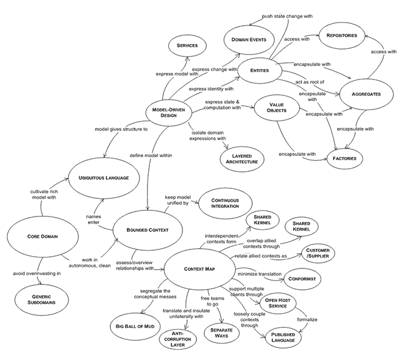

# 在领域驱动设计的核心解决复杂性

> 原文:[https://dev . to/vladikk/处理领域驱动设计的核心复杂性](https://dev.to/vladikk/tackling-complexity-in-the-heart-of-domain-driven-design)

让我们做一个小实验:试着向一个对此一无所知的人解释领域驱动设计的要点。这一点，尤其是简洁地做到这一点，并不容易。见鬼，我自己也在纠结。有界的上下文、实体、域事件、值对象、域、集合、存储库…你从哪里开始呢？

为了在明显的混乱中找到秩序，我想从一个不同寻常的角度来分析 DDD 方法论——通过将领域驱动设计应用于领域驱动设计本身。毕竟，这种方法是为了处理复杂的领域，不是吗？

让我们从确定核心领域开始:DDD 的主要竞争优势是什么，以及实现它的手段是什么？

## 核心领域:无处不在的语言

在“领域驱动的设计:解决软件核心的复杂性”(蓝皮书)中，Eric Evans 认为领域专家和软件开发团队之间的不良合作导致了许多开发努力的失败。DDD 的目标是通过弥合这种合作和沟通的差距来提高成功率。

为了能够流畅地分享知识，DDD 呼吁培养一种共享的、面向商业的语言:无处不在的语言。这种语言应该类似于业务领域及其术语、实体和过程。

无处不在的语言应该在整个项目中广泛使用。所有的交流都应该使用通用语言。所有文件都应在其中制定。甚至代码也应该“说”这种无处不在的语言。

许多方法都致力于降低风险和增加软件项目的成功率，但是由于无处不在的语言是 DDD 实现它的手段，我认为它是领域驱动设计的核心领域。

定义一种无处不在的语言不是一件小事。由于软件不能很好地处理歧义，每个无处不在的语言术语应该只有一个意思。不幸的是，人类语言并不是这样工作的——通常单词在不同的上下文中有不同的意思。为了克服这一障碍并支持培养严谨语言的过程，采用了另一种 DDD 模式:有界上下文。

## 支持子域:有界上下文

为了防止术语有多重含义，DDD 要求每种语言都有严格的适用性语境，称为有界语境。这个模式定义了一个边界，在这个边界内，无处不在的语言可以自由使用。除此之外，该语言的术语可能有不同的含义。

尽管有界上下文模式是领域驱动设计的重要部分，但我认为它是一个支持子域，因为它的目的是支持一种无处不在的语言的形成，即核心域。

正如我前面提到的，代码还应该“说”实现它的有界上下文中无处不在的语言。但是如何用代码实现业务域呢？实现业务领域没有一种通用的模式。有多种选择，那就是我们的下一站。警告:神圣的牛即将受到伤害...

## 通用子域:实现域

这些模式提供了实现业务领域逻辑的不同方式:

1.  交易脚本
2.  活动记录
3.  领域模型
4.  事件源领域模型

这些模式中的每一种都适合不同级别的领域复杂性。您选择的模式应该具有足够的表现力，以便在代码中具体化无处不在的语言。必须指出的是，这个决定并不是一成不变的。随着业务的发展和通用语言复杂性的增长，实现模式可以升级到更精细的模式。

前面提到的四种业务领域实现模式是我目前所熟悉的。

事实上，可能还有我目前不知道的其他人。

将来可能会发明新的。

它们的实现在不同的编程范例中有很大的不同。

有些最适合某种编程范式，但在其他情况下实现起来很复杂。

考虑到所有这些易变性，它们是领域驱动设计的重要部分吗？

由于领域驱动的设计方法不能包含所有的业务领域实现模式，这种技术可以也应该从其他来源借鉴。例如，事务脚本、活动记录，甚至域模型都在 Martin Fowler 的《企业应用架构模式》一书中有所描述。根据定义，依赖“现成”解决方案的能力使它们成为一个通用的子域。是的，甚至是领域模型模式。

## 寓意

领域驱动设计从战术建模模式中分离出来，对 DDD 的可访问性和采用率有着积极而深远的影响。我想详细阐述其中的三个:降低 DDD 的复杂性，扩大其适用性，以及通过加入微服务潮流来获得大量牵引力的能力。

### 1。降低复杂性

Eric Evans 的思维导图描述了构成领域驱动设计方法的模式:

[T2】](https://res.cloudinary.com/practicaldev/image/fetch/s--g5lq0p7I--/c_limit%2Cf_auto%2Cfl_progressive%2Cq_auto%2Cw_880/http://vladikk.cimg/ddd/ddd-patterns.png)

如果我们放弃战术建模模式，这将是它的样子:

[T2】](https://res.cloudinary.com/practicaldev/image/fetch/s--j1CsGS_w--/c_limit%2Cf_auto%2Cfl_progressive%2Cq_auto%2Cw_880/http://vladikk.cimg/ddd/ddd-patterns2.png)

沙邦！你觉得哪个会更容易把握和解释？

将 DDD 从战术建模模式中分离出来将会避免许多新来者经历的误解和困难——例如，阅读蓝皮书的前四章，感觉他们已经很好地掌握了 DDD。说到蓝皮书，许多人抱怨它没有提供足够的代码样本。你猜怎么着？一旦 DDD 从战术建模模式中分离出来，它就不再需要任何代码样本。这是一种纯粹的系统建模方法，可以应用于任何技术堆栈和任何软件范例。

### 2。适用性更广

我强烈反对领域驱动设计应该只应用于复杂项目的观点。这个概念是由 DDD 与领域模型模式的强耦合驱动的。一旦我们打破这种耦合，一个全新的可能性世界就展现出来了。

#### 沟通

无论业务领域有多简单，如果团队成员对相同的工件使用不同的术语，他们迟早会发现自己处于意外复杂的领域。无处不在的语言模式防止了这种情况，并在所有团队成员之间产生了清晰的交流媒介。

#### 业务增长

一个领域的复杂性增加的次数比减少的次数多。这种增加的可能性对于所谓不复杂的项目来说是最高的。一旦发生这种情况，应该重新考虑实现模式决策，并使其适应新的复杂性级别。

### 3。微服务

微服务如今红得发紫。将 DDD 的适用性扩展到更多的项目类型将允许许多基于微服务的解决方案利用宝贵的 DDD 工具。有界上下文模式提供了一种业务驱动的方式，将系统划分为一组独立的服务，而结构图是映射服务的拓扑和它们之间的交互模式的好方法。

## “你疯了吗？”

这可能就是你现在的想法。然而，我不认为我的提议——把战术模式从 DDD 带走——像最初听起来那样疯狂。回到 2016 年 DDD 欧洲会议，Eric Evans 本人表示，蓝皮书中描述的领域模型实现旨在成为实现*领域模型*的*一种*方式，但许多人将其误解为实现*领域驱动设计*的*方式。看，战术建模模式从来没有打算成为唯一的方法来做 DDD，但许多人认为他们是这样。它们会产生额外的噪音，分散人们对最重要的、DDD 独有的材料的注意力。*

同样，你不能说领域驱动的设计方法处于完美的状态，也没有理由改变。不幸的是，它的低采用率不言自明。DDD 应该得到比现在更多的关注。蓝皮书十几年前就出来了，从那以后方法论几乎没变过。我认为它应该改变。不是因为它不好，相反，因为它很棒。但是它的潜力比它目前意识到的要大得多。

## 最后的想法

我绝不是想贬低战术建模的重要性。恰恰相反:这个问题应该得到更多的关注。但是在它自己的背景下。除了领域模型之外，还有更多的模式和实现它们的方法，这在一本 DDD 的书中是写不完的。此外，这些模式甚至可以在非 DDD 项目中实现，一个项目可以遵循 DDD 原则，即使它没有一个单独的集合。

## 你怎么看？

我很想在评论中听到你对此的看法。

* * *

*本帖最初发表于[vladikk.com](http://vladikk.com/2016/04/05/tackling-complexity-ddd/)T3】*