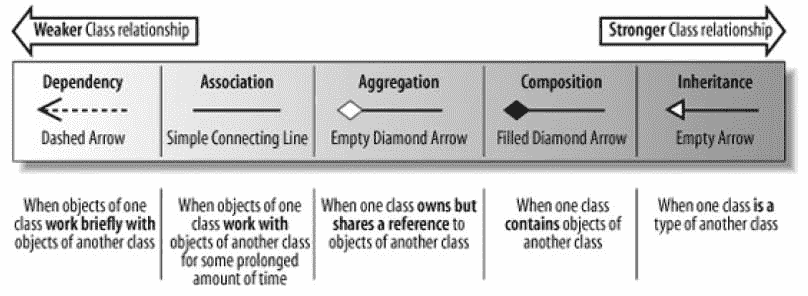
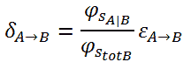
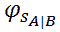
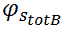
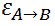
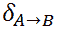
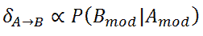
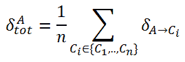

# 依赖性。

> 原文:[https://dev.to/riccardo_cardin/dependency](https://dev.to/riccardo_cardin/dependency)

*原贴于:[大泥球](http://rcardin.github.io)T3】*

编程中依赖的概念是什么意思？在现代发展过程中重要吗？当我们谈论过程式编程、面向对象编程或函数式编程时，依赖的概念有不同的含义吗？在这篇文章中，我将尝试总结我作为一名软件开发人员所获得的所有知识。

# 最开始

首先，我们需要清楚了解日常语言中依赖的概念。*韦氏词典*给出了依赖的如下定义:

> 受他人影响、决定或服从他人的性质或状态。

澄清。有时候，我们只是需要回到我们的根本，以深入理解一个概念。因此，依赖于另一个组件的组件会受到这个组件的影响。这是什么意思？如果一个组件在内部、其实现或者外部、其接口发生了变化，那么所有依赖的组件都应该相应地发生变化。

我们刚刚推导出，两个组件之间的*依赖性是对一个组件的变化可能影响另一个*的概率的度量。组件之间的依赖性越强，上述概率越高。

## 耦合

组件之间的耦合精确地度量了它们的依赖程度。紧密耦合的组件更有可能一起改变；松散耦合的组件概率较低。

在软件工程中，我们有一个*咒语*，它从一开始就教导我们:

> 组件之间的依赖性必须最小化，使组件松散耦合。

为什么这个原则如此重要？其背后的主要概念是，我们应该可以自由地更改组件来解决 bug，或者添加新功能，或者做我们想做的任何事情，而不必担心架构的其他组件的更改。

为什么在软件开发中变更被认为是如此危险？每当我们改变一个组件，就有引入一个 bug 的风险。为了避免回归，我们必须重新执行所有与变更的组件相关的测试(如果我们没有自动化测试会怎样？询问罗伯特·c·马丁...)

此外，我们可能不直接拥有依赖组件。在这种情况下，必须与外部开发人员讨论变更，合理安排变更时间，等等。这是停止架构发展的主要原因之一。

最后，由于软件架构的动态性，这个原则非常重要。没有一个软件产品在其生命周期中不会改变。变化在发生，变化是软件世界的一部分。

# 面向对象编程与依赖

在面向对象编程中，组件的上述概念通常由一个*类型*来标识。基本上，在面向对象编程中，我们感兴趣的是类型之间的依赖关系，即具体类型，也称为类，或者抽象类型，也称为抽象类和接口。

下图很好地总结了类型之间不同种类的依赖关系。

[T2】](https://res.cloudinary.com/practicaldev/image/fetch/s--NAGRk0Vq--/c_limit%2Cf_auto%2Cfl_progressive%2Cq_auto%2Cw_880/http://rcardin.github.io/assets/2017-04-10/types_dependencies.png)

该图将所有可能的类型依赖关系映射到四个等价集。使用的符号是 UML。大家简单看一下。

## 依赖关系

左边是最弱的依赖形式。用 UML 中两种类型之间的虚线箭头，我们建模一个依赖关系

> 声明一个类需要知道另一个类才能使用该类的对象。

下面的代码完全符合上面的定义。

```
class A {
  def methodOfA = ...
}
class B {
  def methodWithAParameter(a: A) = ...
  def methodWithAReturn: A = ...
} 
```

如您所见，`B`需要知道的`A`的唯一部分是由`A`方法推断的接口。所以，如果`A`改变了它的接口，也就是方法`methodA`的签名，那么`B`可能需要改变。

## 联想

随着依赖程度的增加，我们发现*关联*。

> 关联意味着一个类实际上将包含对另一个类
> 的一个或多个对象的引用(以属性的形式)。

翻译成代码，我们有类似下面的东西。

```
class A {
  // ... }
class B(val a: A) {
  // ... } 
```

与前面的不同，关联意味着一个类是由对其他类的引用组成的。它们的行为开始变得更加耦合，因为类型之间的关系不再是暂时的，而是开始成为永久的(例如，对象的整个生命周期)。

在我们的例子中，在后者的每个方法中都允许引用`B`中的`A`，这扩大了从`A`可能依赖的范围。

## 聚集和组成

聚合和组合是关联关系的更强版本:它们向后者添加了额外的属性。本质上，聚合声明一个类型*拥有另一个类型*，这意味着它负责其*创建*和*删除*。

组合增加了一个特性，如果`B`是`A`的组合，那么只有第一个的实例拥有第二个的实例。`A` *的实例不在`B`的不同实例间共享*。

下面的代码展示了一个组合的例子。

```
class B() {
  val a: A = new A()
  // ...
  class A {
    // ...
  }
} 
```

这些关系在类型之间产生了很强的依赖性，因为一种类型必须知道如何构建另一种类型的实例。

## 继承

*继承*表示可以在两个不同类型之间定义的最强类型的依赖关系。

> 如果您发现自己说这个类是另一个类的类型，那么您可能想考虑使用继承(或泛化)。

```
class A(i: int) {
  def methodOfA = ...
}
class B(i: int) extends A(i) {
  def methodOfB1 = ...
  def methodOfB2 = ...
} 
```

`A`被称为*父类*，而`B`被称为*子类*。

> 子类继承并重用父类包含的、具有公共可见性、受保护可见性或默认可见性的所有属性和方法。

继承也被称为*实现重用*。这两种类型共享的代码量是巨大的。有可能对`A`的每次改变都会导致对`B`的改变。这才是真正的*紧耦合*！你有没有注意到，使用继承，*信息隐藏*原则不再被尊重了？

然而，并不是所有类型的继承都是坏人。从抽象类型继承减少了这种关系的缺点。为什么？共享代码越低，依赖程度越低。*类型继承*，这意味着一个类实现了一个接口，这没有坏处:只有接口方法的签名是共享的。

# 计算依赖程度

你应该从上面的描述中注意到一个模式。两种类型之间共享代码的数量越多，依赖性就越强。同样真实的是，就时间而言，这种依赖性的范围越广，依赖性就越强。

如果有一个数学公式来计算两个类之间的耦合度就好了。有了我们给的信息，我们可以尝试形式化它。

给定两个类`A`和`B`，它们之间的依赖程度可以使用下面的公式导出。

[T2】](https://res.cloudinary.com/practicaldev/image/fetch/s--QBhTP1G0--/c_limit%2Cf_auto%2Cfl_progressive%2Cq_auto%2Cw_880/http://rcardin.github.io/assets/2017-04-10/dependency_formula.png)

[](https://res.cloudinary.com/practicaldev/image/fetch/s--ML8O9i_x--/c_limit%2Cf_auto%2Cfl_progressive%2Cq_auto%2Cw_880/http://rcardin.github.io/assets/2017-04-10/numerator.png) 是在类型`A`和`B`之间共享的代码数量(即 SLOC)。 [](https://res.cloudinary.com/practicaldev/image/fetch/s--_vWud1MH--/c_limit%2Cf_auto%2Cfl_progressive%2Cq_auto%2Cw_880/http://rcardin.github.io/assets/2017-04-10/denominator.png) 是`B`类的总代号(即 SLOC)。最后， [](https://res.cloudinary.com/practicaldev/image/fetch/s--jUfdygBk--/c_limit%2Cf_auto%2Cfl_progressive%2Cq_auto%2Cw_880/http://rcardin.github.io/assets/2017-04-10/epsilon_factor.png) 是一个介于 0 和 1 之间的因子，`A`和`B`之间的范围越大，因子越大。

[](https://res.cloudinary.com/practicaldev/image/fetch/s--7VBEmOH2--/c_limit%2Cf_auto%2Cfl_progressive%2Cq_auto%2Cw_880/http://rcardin.github.io/assets/2017-04-10/dependency.png) 取值范围在 0 到 1 之间:值 0 对应无依赖，值 1 对应最大依赖程度。

当`A`和`B`之间的依赖关系最弱时，
[](https://res.cloudinary.com/practicaldev/image/fetch/s--7VBEmOH2--/c_limit%2Cf_auto%2Cfl_progressive%2Cq_auto%2Cw_880/http://rcardin.github.io/assets/2017-04-10/dependency.png) 接近于 0，而当继承关系成立时，它接近于 1。

例如，如果`B`从`A`继承，那么，共享代码由没有`private`范围的`A`的所有代码表示。然而，如果一个`B`的方法只是在它的参数中引用一个`A`的实例，那么共享代码将只由`A`的`public`方法的签名来表示。

需要注意的是，`A`和`B`之间的依赖程度与如果`B`被改变，`A`也应该被相应改变的概率成正比。

[T2】](https://res.cloudinary.com/practicaldev/image/fetch/s--nOloeNey--/c_limit%2Cf_auto%2Cfl_progressive%2Cq_auto%2Cw_880/http://rcardin.github.io/assets/2017-04-10/degree_proportionality.png)

最后，一个类型`A`的总依赖度可以被计算为*相对于架构中每一个其他单个类型的依赖度的平均值*。

[T2】](https://res.cloudinary.com/practicaldev/image/fetch/s--RJFw-yuE--/c_limit%2Cf_auto%2Cfl_progressive%2Cq_auto%2Cw_880/http://rcardin.github.io/assets/2017-04-10/total_dependency_degree.png)

# 结论

综上所述，我们给出了软件工程中依赖的定义。我们试图理解为什么组件之间的依赖性应该被最小化。我们修改了 UML 如何帮助我们在面向对象的世界中可视化地管理依赖关系。有了这些信息，我们试图形式化一个公式来计算两个类之间的依赖程度。

# 参考文献

*   [韦氏词典，依赖性定义](https://www.merriam-webster.com/dictionary/dependence)
*   [专业性和 TDD(重新定价)](https://8thlight.com/blog/uncle-bob/2014/05/02/ProfessionalismAndTDD.html)
*   第五章:系统逻辑结构建模:高级类图。《学习 UML 2.0》，拉斯·迈尔斯，金·汉密尔顿，2006 年，奥赖利媒体