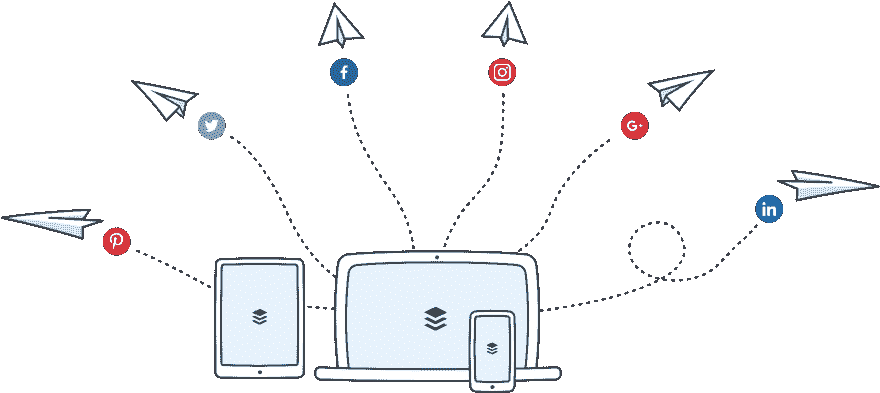

# 我的博客推广的自动化

> 原文:[https://dev . to/funky si1701/automation-of-promotion-of-my-blog-1ei 0](https://dev.to/funkysi1701/automation-of-the-promotion-of-my-blog-1ei0)

我想自动推广这个博客。目前，为了在社交媒体上推广这个博客，我使用了一些不同的服务。[T2】](https://res.cloudinary.com/practicaldev/image/fetch/s--Dxlh0jIk--/c_limit%2Cf_auto%2Cfl_progressive%2Cq_auto%2Cw_880/https://storageaccountblog9f5d.blob.core.windows.net/blazor/wp-content/uploads/2017/04/img-buffer-illustration-hub-960%402x.png%3Fw%3D1780%26ssl%3D1)

buffer([buffer.com](https://buffer.com))是一项服务，可以让你安排主要社交媒体渠道(脸书、Twitter、LinkedIn 和 Google+)的更新

IFTTT 或 If This Then([ifttt.com](https://ifttt.com))是一种允许你连接不同在线服务的服务。例如，当您的日历中发生特定事件时，您可以发送电子邮件。

我一直在结合使用这些服务，在社交媒体上分享我过去的一些博客帖子。然后，我会在日历上添加我博客文章的详细信息。然后我使用 IFTTT 将事件添加到 Buffer 中，然后按计划缓冲 tweets。

这很好，但是这是一个手动过程来添加我的文章到我的日历。我一直在使用电子表格来帮助我生成一个 ics 日历文件，并将其导入到我的谷歌日历中。做这件事一定有更好的方法。

我已经编写了一些代码来读取我的博客的 RSS 提要，然后使用 Buffer API 将其共享到缓冲区。我正在创建的代码远未完成，但我正试图使用干净代码的概念，使其尽可能灵活。

我有一个名为 ISocial 的接口，我的缓冲区代码实现了它，但是添加一个实现相同接口但使用 twitter 或 facebook APIs 的类会很容易。我的代码从一个特定的 WordPress RSS 提要中读取，但是它应该很容易适应从 SQL 数据库或任何其他数据源中读取。

我目前不确定该用什么样的界面。我可以创建一个控制功能的网页，或者只是一个 windows 应用程序，或者这两者都是复杂的事情，我需要的只是一个可以作为计划任务添加的控制台应用程序。