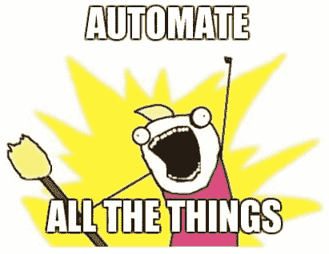

# 招聘机器人-协作演示

> 原文:[https://dev.to/greenkey/recruiterbot 合作展示](https://dev.to/greenkey/recruiterbot---a-collaborative-presentation)

我在米兰参加一个关于聊天机器人的会议已经有一段时间了。

这个话题非常有趣，而且发展很快，此外，meetup 总是充满了具有不同技能的有趣的人。

对于 4 月份的约会，Paolo montras io(meetup 组织者)问是否有人有想法可以谈论。我提议谈论一个招聘机器人，这篇文章是我的陈述/头脑风暴的报告——如果你懂意大利语，你可以看它的视频。

## 员工、公司机器人、代理机器人？

第一个想法是在第 n 个猎头问我同样的问题后出现的:你有 X 的经验吗？你喜欢大公司还是小公司？你期望的薪水是多少？等等。

[T2】](https://res.cloudinary.com/practicaldev/image/fetch/s--Q9ZXLMk2--/c_limit%2Cf_auto%2Cfl_progressive%2Cq_auto%2Cw_880/https://thepracticaldev.s3.amazonaws.com/i/cwco9itwgcud4tqnrh5l.jpg)

我是那些想让一切自动化的怪胎之一，所以我认为回答常见问题的机器人会节省很多时间。

我的第一个想法是一个由求职者编写的机器人，被公司和招聘人员用来寻找候选人。姑且称之为**个人机器人**。

当我第一次和其他人谈论这个想法时，我很清楚这还不够。对某些人来说，更好的做法是逆转游戏:由提供工作的人编写的机器人，被试图申请工作的人使用。一个**公司 Bot** 。
这可能是一个更有趣的机器人，因为公司更有可能付钱给一个人。

有人还向我建议了第三种类型的机器人，一种可以夹在中间，与求职者和出价者聊天的机器人，一种代理机器人。

## 简报

我对观众的陈述非常简短，只是一个关于我自己的陈述(在你的陈述中总是放一张*我是谁*的幻灯片！)和简介。目标是让观众说话。

演讲结束后，我打开了一个为这个场合准备的 [Trello 板](https://trello.com/b/4xHTPOGv/chatbot-per-recruitment),有以下几栏:

*   超出范围-目前不感兴趣的想法
*   优势——这个机器人与其他解决方案的区别是什么？
*   公司——公司机器人的创意
*   给候选人-个人的想法
*   对于招聘人员-代理机器人的想法

然后我让观众说话。

## 一些一般注意事项

在深入每个机器人的想法之前，我在头脑风暴中发现了一些有趣的事情。

机器人应该立即声明它的性质。
就像语音信箱里的留言，你听到的第一句话总是“*嗨，我们现在不在家...*”。
有一次，我在答录机上设置了这样一条信息:“*喂？-暂停-哦，对不起，我现在不在家，请留言。这很有趣，直到他们开始侮辱我。*

## 超出范围

#### 没什么爬虫

已经有人尝试使用机器人自动回复工作邀请。那个家伙学到了很多关于招聘的知识，但是机器人并没有帮他找到工作。

## 力量

#### 开门见山

我们厌倦了阅读大量的内容来寻找我们感兴趣的内容(打倒网站和简历)。在你面前有一个机器人，你可以随意提问，没有拐弯抹角的表达，你甚至可以很严厉(但不要太过分，有人可以阅读日志！).

#### 节省时间

想象一下，打一个 20 分钟的电话，我们谈论我们的经验、技能、团队的活动、需要的角色，然后提问:“*你愿意在冰岛工作吗？*”。

## 为公司出谋划策- CompanyBot

#### 脱脂

公司最大的需求之一就是列出所有候选人的名单。机器人可以被编程来问一些问题，以了解候选人是否具备所有要求。

#### 聚类

如果机器人的决策树制作得很好，候选人可以分组或分类，这样公司就能够确定合适的人，可能是其他职位的人。

#### 预评估

你可以设置机器人提出关于职位的技术问题。您也可以交换文件！那么为什么不用它来问考生作品的例子呢？对于程序员来说，可以提出一个问题，然后要求输出文件(我正在考虑类似于[谷歌代码堵塞](https://code.google.com/)中的问题)。

#### 某工作岗位太短

一个职位不能太长，也不能包含所有的信息。候选人可以向机器人询问工作岗位上没有的所有数据:“*你写了 Java，但你在使用某个特定的框架吗？*，*tha 套餐包括哪些险种？*

## 候选人的想法-个人机器人

#### 简历太短

简历不能太长，也不能包含所有的信息。一家公司可以向机器人询问简历中没有的所有数据:“*你写了 Java，但你在使用某个特定的框架吗？*，*能给我举个你作品的例子吗？*

#### 时间很重要

有时候你会找到一份最适合某个职位的简历，但它已经有两年了。你可以询问机器人信息，比如工作机会(也许他们现在对新职位不感兴趣)或者最新版本的简历。

## 招聘者的想法- AgentBot

#### 面试模拟器

这可能是为没有经验的候选人提供的服务，他们希望了解将会面临什么类型的问题。此外，机器人可以记录答案，并识别一些有趣的个人资料。

#### 代理

这是一个非常宽泛的概念，其理念是拥有一个私人助理，随时更新最新的经验，并随时与寻找候选人的公司保持联系。代理可以通知这个人一个新的工作机会，但也可以通知公司一个候选人的新技能。

## 结论

我把所有这些信息公之于众，我不确定这样做是否正确，我不知道我是否会开发它。也许这些想法会被越来越多的人大量使用，将一个纯粹的人类过程变成一个完全自动化的过程，让人工智能驱动我们的职业生涯和我们的生活选择，最终在这个世界里，我们人类除了听从他们所说的*之外无事可做...*

所以现在我要么写那个机器人，要么写科幻小说。