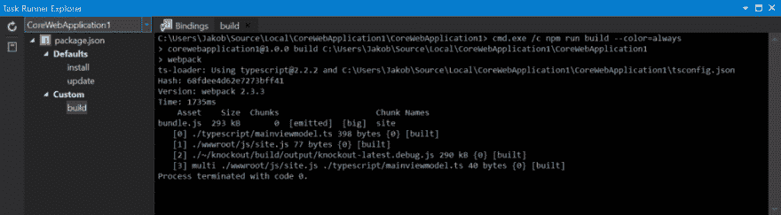

# 使用 npm、webpack 和 TypeScript 在 Visual Studio 2017 中设置 ASP.NET 核心:第二部分

> 原文:[https://dev . to/t4rzsan/setting-up-aspnet-core-in-visual-studio-2017-with-NPM-web pack-and-typescript-part-ii](https://dev.to/t4rzsan/setting-up-aspnet-core-in-visual-studio-2017-with-npm-webpack-and-typescript-part-ii)

这篇文章最初出现在我的个人博客上。

*Github 上的示例代码。*

这是我关于 ASP.NET 核心的小系列的第二部分，也是最酷的 JavaScript 库，只是在我写完这篇文章的时候它们可能已经过时了。

在[第一部分][1]中，我们研究了如何将 npm 和 webpack 安装到我们的 ASP.NET 核心项目中。在这一部分，我们将设置 TypeScript。Visual Studio (VS)会自动为您编译 TypeScript，但我们会禁用该功能，让 webpack 来完成 TypeScript 构建，只是为了好玩。

**设置 TypeScript**
从使用 npm 安装 TypeScript 开始(这在[webpack 的文档][2]中有详细描述):

T2`npm install --save-dev typescript ts-loader`

注意 package.json 是如何用 typescript 和 ts-loader 更新的。您可能想知道[ts-loader][3]是什么。我知道我是。它是一个“webpack 的 TypeScript loader ”,实际上并没有说太多，但它是让 webpack 负责我们的 TypeScript 代码的东西。

现在让我们安装[Knockout.js][4]，我们将使用它在 TypeScript 中构建视图模型。

T2`npm install --save-dev knockout @types/knockout`

通过使用@types，我们告诉 npm 也安装敲除的类型。我倾向于认为打字就是打字，就像头文件对于 C++一样。类型和其他东西一样放在 node_modules 文件夹中。

接下来，我们需要为 TypeScript 创建一个配置文件。在 VS 解决方案资源管理器中右键单击项目节点，然后单击“添加新项”。在模板对话框中搜索“json”，选择“TypeScript JSON 配置文件”。该文件必须命名为“tsconfig.json”。更改内容，使其看起来像这样:

```
{
  "compilerOptions": {
    "outDir": "./wwwroot/build/",
    "noImplicitAny": false,
    "noEmitOnError": true,
    "removeComments": false,
    "sourceMap": true,
    "target": "es5",
    "module": "commonjs",
    "moduleResolution": "node",
    "compileOnSave": true
  },
  "exclude": [
    "node_modules",
    "wwwroot"
  ]
} 
```

请注意，我已经告诉 TypeScript 加载程序将生成的。js 文件，我已经告诉它使用["node"] [5](i.e.%20it%20will%20look%20in%20the%20) 来解析任何第三方模块。

**Test TypeScript build**
让我们测试一下我们是否可以构建 TypeScript 文件。默认情况下，VS 会构建任何东西。添加到项目中的 ts 文件。首先在 wwwroot 文件夹旁边的项目中创建 af 脚本文件夹。将名为“myviewmodel.ts”的 TypeScript 文件添加到文件夹中。我们将创建一个挖空视图模型类，因此首先将挖空导入到。ts 文件，方法是在顶部添加下面一行。

```
import * as ko from "knockout" 
```

请注意 VS IntelliSense 是如何在您键入时启动的。非常酷。上面我们将“modeResolution”设置为“node ”,这样 TypeScript 加载器就知道在 node_modules 中查找 Knockout。现在让我们使用敲除类型脚本定义添加一个具有两个可观察字段的视图模型。最后一行将挖空绑定应用于视图。

```
import * as ko from "knockout"

class MyViewModel {
    firstname: KnockoutObservable<string>;
    lastname: KnockoutObservable<string>;

    constructor(firstname: string, lastname: string) {
        this.firstname = ko.observable(firstname);
        this.lastname = ko.observable(lastname);
    }
}

ko.applyBindings(new MyViewModel("Jakob", "Christensen")); 
```

现在，如果您在 VS 中构建您的项目，您将在“wwwroot/build”下看到一个新文件夹，其中包含编译后的。js 文件。

**设置 webpack 类型脚本加载**
不是让 VS 来做类型脚本构建，我们希望 webpack 来做，我们已经安装了 ts-loader 来帮我们做。既然 VS 可以为我们做到这一点，我们为什么还要这样做呢？我喜欢这样做，因为我喜欢把所有的事情都放在一起。因此，webpack 完成构建、捆绑、代码拆分等工作。

现在，将名为 webpack.config.js 的文件添加到项目根目录下的项目中。将以下内容粘贴到文件中。

```
var path = require('path');

module.exports = {
    entry: {
        site: [
            './wwwroot/js/site.js', 
            './scripts/myviewmodel.ts']
    },
    output: {
        filename: 'bundle.js',
        path: path.resolve(__dirname, 'wwwroot/dist/')
    },
    module: {
        rules: [
            {
                test: /\.tsx?$/,
                loader: 'ts-loader',
                exclude: /node_modules/,
            },
        ]
    },
    resolve: {
        extensions: [".tsx", ".ts", ".js"]
    }
}; 
```

这将配置 webpack 来编译。ts 文件。它还指示 webpack 将编译后的。js 文件，并将其与我们项目中可能有的其他 site.js 文件捆绑在一起，然后将其全部放入“wwwroot/dist”中一个名为 bundle.js 的文件中。这是您想要在 HTML 文件中引用的文件。顺便说一下，编译的。js 文件将不再位于“wwwroot/build”文件夹中，因此您可以删除它。

**Webpack build**
要构建和捆绑，首先编辑您的 package.json，使构建块看起来像这样。

```
 "scripts": {
    "build": "webpack"
  }, 
```

然后从 tsconfig.json 中删除包含“compileOnSave”的行。

最后，转到 cmd 提示符，从项目文件夹中运行下面的 npm 命令。

T2`npm run build`

现在，您应该可以在“wwwroot/dist”中看到 bundle.js 文件。

当然，您不希望每次在您的。ts 文件，所以我们希望 VS 运行 npm 构建。幸运的是，无处不在的 Mads Kristensen 已经创建了一个 VS [extension][6]来为您完成这项工作。安装扩展后，您可以在 Visual Studio 的任务运行器资源管理器中看到 npm 自定义构建任务。右键单击“build ”,告诉 VS 在正常的 VS 构建之前或之后运行构建任务。

[T2】](https://res.cloudinary.com/practicaldev/image/fetch/s--dzgOOX1U--/c_limit%2Cf_auto%2Cfl_progressive%2Cq_auto%2Cw_880/http://leruplund.dk/wp-content/uploads/2017/04/Task-Explorer-1024x283.png)

这将在 package.json 文件中添加一行。

```
"-vs-binding":{"BeforeBuild":["build"]} 
```

**清理**
上面我说了，VS 自动捡拾。ts 文件和版本。使用 webpack 时，您不会希望这样。要禁用 VS 构建，请在解决方案资源管理器中右键单击您的项目，然后选择“编辑[您的项目名]”。csproj”。在
下添加以下一行

```
 element. 
```

T3】！-...——>
真实的

```
 Also, you might want to remove bower.json and bundleconfig.json if present, as package.json and webpack.config.js replace them.  As far as I know bundleconfig.json works with another Mads Kristensen extension to bundle .js files.

That's it.  Now it is up to you to take fully advantage of webpack for [code splitting][7] and [uglifying][8] and [what not][9]. 
```