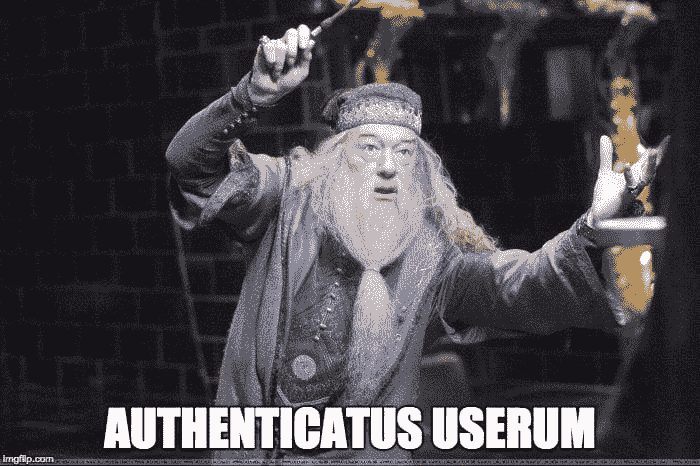
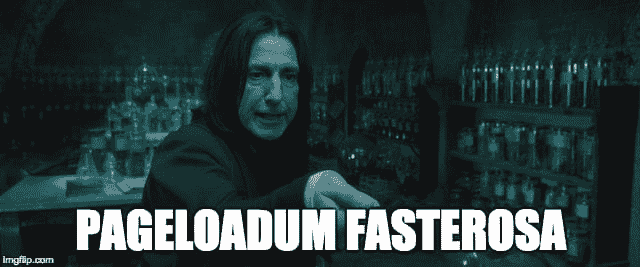
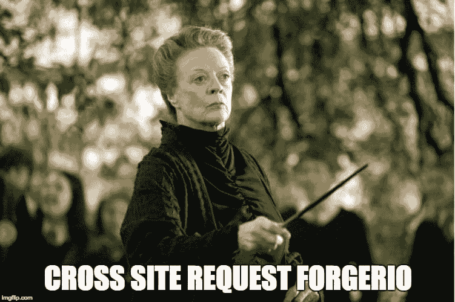
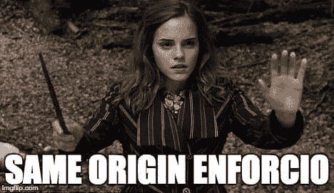
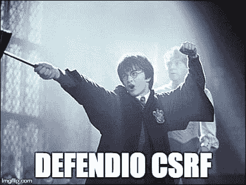

# 黑魔法防御术:CSRF 攻击

> 原文:[https://dev . to/rtfeldman/defense-against-the-dark-arts-csrf-attacks](https://dev.to/rtfeldman/defense-against-the-dark-arts-csrf-attacks)

在一次不明的“狼人事件”后，我们成为了`hogwarts.edu`网络应用的新维护者。

我们工作的第一天从邓布利多教授找到我们开始，他解释说他的官方账户最近开始向所有学生发送神秘的信息，比如“波特·苏克斯，马尔福·鲁勒兹”。

由于邓布利多有一个管理员账户，这个安全漏洞可能会导致比恶作剧更糟糕的问题。他要求我们在有人利用这个漏洞造成更严重的损害之前修复它。

## 1.证明

[T2】](https://res.cloudinary.com/practicaldev/image/fetch/s--nb2S40H0--/c_limit%2Cf_auto%2Cfl_progressive%2Cq_auto%2Cw_880/https://i.imgflip.com/1n1j6w.jpg)

我们做的第一件事是查看处理发布消息的服务器端代码。很简单。它是这样做的:

1.  监听对`"hogwarts.edu/dumbledore/send-message?to=all_students&msg=blahblah"`的 HTTP 请求
2.  从`@dumbledore`向所有学生发送`"blahblah"`(或`msg`参数设置的任何值)。

没有尝试检查请求是否真的来自于`@dumbledore`账户的所有者，这意味着任何攻击者都可以向`hogwarts.edu/dumbledore/send-message`发送 HTTP 请求，它将被视为合法的。可能我们的狼人前辈认为这没问题。

为了防止将来发生这种情况，我们引入了一个身份验证系统。

首先，我们为每个用户的帐户添加一个秘密的身份验证密钥，当用户登录时我们会随机生成这个密钥，当用户注销时我们会删除这个密钥。

我们听说 [cookies](https://developer.mozilla.org/en-US/docs/Web/HTTP/Cookies) 有安全问题，所以我们不走那条路。相反，当用户登录时，我们将这个键记录在 [`localStorage`](https://developer.mozilla.org/en-US/docs/Web/API/Window/localStorage) 中，并让一些 JavaScript 代码将它作为标题`"secret-authentication-key"`包含在我们(合法的)HTTP 请求中。

接下来，我们向服务器端逻辑添加一个步骤来验证密钥。我们的新流程:

1.  监听对`"hogwarts.edu/dumbledore/send-message?to=all_students&msg=blahblah"`的 HTTP 请求
2.  检查名为`"secret-authentication-key"`的头，确保它与我们为`@dumbledore`帐户存储在数据库中的秘密认证密钥相匹配。如果不匹配，拒绝请求。
3.  从`@dumbledore`向所有学生发送`"blahblah"`(或`msg`参数之后的任何内容)。

现在，当我们试图以邓布利多的身份发送虚假信息时，服务器会因为缺少正确的认证密钥而拒绝它们。当邓布利多自己登录并试图发送它们时，它就工作了。万岁。

## 2.饼干

[T2】](https://res.cloudinary.com/practicaldev/image/fetch/s--S_hLEtvn--/c_limit%2Cf_auto%2Cfl_progressive%2Cq_auto%2Cw_880/https://i.imgflip.com/1n1jiy.jpg)

在我们推出这个新的认证方案的第二天，斯内普教授带着一份抱怨出现了。当他访问`hogwarts.edu/snape/messages`查看他的私人信息时，在他的信息出现之前，会有一个短暂的加载旋转。斯内普要求我们把它放回老路，在那里信息立即被加载。

为什么我们要添加装载旋转器？嗯，我们意识到`hogwarts.edu/snape/messages`也是不安全的，所以很自然地我们用新的`"secret-authentication-key"`头来保护它。

问题是，当 Snape 访问`hogwarts.edu/snape/messages`时，浏览器不知道如何在最初的 HTTP 请求中将自定义头发送给服务器。相反，服务器发回一些包含加载微调器和一些 JavaScript 的 HTML。JavaScript 从`localStorage`中读取密钥并发出*第二个*请求(这一次设置`"secret-authentication-key"`头)，最终被允许从服务器获取斯内普的消息。

当第二个请求被处理时，斯内普看到的只是那个引起愤怒的旋转器。

我们通过用`Cookie`头替换自定义的`"secret-authentication-key"`头来解决这个可用性问题。现在，当斯内普登录时，我们不再使用`localStorage`——或者任何 JavaScript 来存储密钥。相反，我们的服务器在响应中放入了一个`"Set-Cookie: key_info_goes_here"`头；浏览器知道，当它在 HTTP 响应上看到一个 [`Set-Cookie`报头](https://developer.mozilla.org/en-US/docs/Web/HTTP/Headers/Set-Cookie)时，它应该在斯内普的机器上以 [cookie](https://developer.mozilla.org/en-US/docs/Web/HTTP/Cookies) 的形式保存密钥。

现在，每当斯内普的浏览器向`hogwarts.edu`发出 HTTP 请求时，它会自动在`Cookie`报头中发送 cookie 的内容。甚至对于斯内普访问`hogwarts.edu/snape/messages`时发出的最初的`HTTP GET`请求也是如此——这意味着现在我们的服务器可以在第一次请求时就对他进行身份验证，并在第一次响应中提供消息，而不需要第二次 HTTP 往返。

这是我们的新流程:

1.  监听对`"hogwarts.edu/snape/send-message?to=all_students&msg=blahblah"`的 HTTP 请求
2.  检查名为`"Cookie"`的头，确保它与我们为`@snape`帐户存储在数据库中的秘密认证密钥相匹配。如果不匹配，拒绝请求。
3.  从`@snape`向所有学生发送`"blahblah"`(或`msg`参数之后的任何内容)。

性能问题解决！

## 3.Cookie 获取漏洞

[T2】](https://res.cloudinary.com/practicaldev/image/fetch/s--F6n4KDjF--/c_limit%2Cf_auto%2Cfl_progressive%2Cq_auto%2Cw_880/https://i.imgflip.com/1n1jbl.jpg)

难道没有什么原因让我们一开始没有用饼干吗？哦，对了。安全问题。

果然，在我们推出基于饼干的解决方案的第二天，麦格教授带来了一个奇怪的故事。就在她访问德拉科·马尔福的博客后，她的官方账户又给所有学生发了一条“波特 sux，马尔福 rulez”的信息。怎么会发生这种事？

虽然 cookies 解决了我们的性能问题，但它们也给我们打开了一个新的攻击角度:跨站点请求伪造，或简称为 [CSRF 攻击](https://www.owasp.org/index.php/Cross-Site_Request_Forgery_(CSRF))。(通常读作“C-Surf”。)

查看 Draco 博客的 HTML 源代码，我们注意到:

```
 
```

麦格教授一访问他的博客，她的浏览器就像往常遇到``时一样:向其`src`中指定的 URL 发送一个`HTTP GET`请求。因为浏览器正在向`hogwarts.edu`发送这个请求，所以它会自动在`Cookie`头中包含麦格教授存储的认证 cookie。我们的服务器检查 cookie 是否匹配——当然匹配——并忠实地发布恶意消息。

啊！

避免这种形式的 CSRF 攻击是我们所有的`GET`请求不会导致我们的服务器采取任何重要行动的一个重要原因。它们应该是只读的，可能会有一些日志记录。

我们可以通过在列表中添加新的第二步来解决这个问题:

1.  监听对`"hogwarts.edu/mcgonagall/send-message?to=all_students&msg=blahblah"`的 HTTP 请求
2.  如果不是一个`POST`请求，[拒绝它](https://httpstatuses.com/405)。
3.  检查名为`"Cookie"`的头，确保它与我们为`@mcgonagall`帐户存储在数据库中的秘密认证密钥相匹配。如果不匹配，拒绝请求。
4.  从`@mcgonagall`向所有学生发送`"blahblah"`(或`msg`参数之后的任何内容)。

太好了！现在`` CSRF 攻击不再有效，因为``只会导致`GET`请求加载`src`。麦格教授应该可以毫无问题地再次访问德拉科的博客了。

## 4.Cookie 发布漏洞

[T2】](https://res.cloudinary.com/practicaldev/image/fetch/s--fjkqvc8O--/c_limit%2Cf_auto%2Cfl_progressive%2Cq_auto%2Cw_880/https://i.imgflip.com/1n1jgq.jpg)

不幸的是，几天后，德拉科找到了一个变通办法。他用一个表单代替了``标签:

```
<form method="POST" action="http://hogwarts.edu/mcgonagall/send-message?to=all_students&msg=Potter_sux"> 
```

他还在页面上放了一些 JavaScript，当页面加载时，它会自动提交这个`<form>`。麦格教授一访问这个页面，她的浏览器就提交这个表单——导致一个自动包含 cookie 的`HTTP POST`——我们的服务器再次发布这个消息。

双倍啊！

为了使事情变得更加困难，我们将`msg`和`to`字段从 URL 查询参数更改为要求在请求体中通过 JSON 发送该信息。这又解决了一两天的问题，但是 Draco 很快变得聪明起来，将 JSON 放在表单内的一个`<input type="hidden">`中。我们又回到了起点。

我们考虑将端点从`POST`改为`PUT`，因为`<form>`只支持`GET`和`POST`，但是从语义上来说，这显然更像是`POST`。我们尝试升级到 HTTPS(没有修复它)并使用一种叫做[“安全 cookie”](https://en.wikipedia.org/wiki/Secure_cookies)(仍然没有修复它)，并最终偶然发现 OWASP 的[列表中的其他方法没有解决这个问题](https://www.owasp.org/index.php/Cross-Site_Request_Forgery_(CSRF)#Prevention_measures_that_do_NOT_work)，然后最终找到*可以*工作的东西。

## 5.强制同源

[T2】](https://res.cloudinary.com/practicaldev/image/fetch/s--WaHvRrFt--/c_limit%2Cf_auto%2Cfl_progressive%2Cq_auto%2Cw_880/https://i.imgflip.com/1n1k4h.jpg)

OWASP 对如何防御 CSRF 袭击 T2 有一些明确的建议。最可靠的防御方式是验证请求是由运行在`hogwarts.edu`页面上的代码发出的。

当浏览器发送 HTTP 请求时，这些请求包括这两个报头中的至少一个(可能两个都包括，这取决于它是否是 HTTPS 请求以及浏览器的历史): [`Referer`](https://developer.mozilla.org/en-US/docs/Web/HTTP/Headers/Referer) 和 [`Origin`](https://developer.mozilla.org/en-US/docs/Web/HTTP/Headers/Origin) 。

如果 HTTP 请求是在用户位于`hogwarts.edu`页面时创建的，那么`Referer`和`Origin`将以`https://hogwarts.edu`开始。如果它是在用户查看非`hogwarts.edu`页面(如 Draco 的博客)时创建的，那么浏览器会尽职尽责地将`Referer`和`Origin`头设置为他博客的域名，而不是`hogwarts.edu`。

如果我们要求将`Referer`和`Origin`设置为`hogwarts.edu`，我们可以拒绝所有源自 Draco 博客(或任何其他第三方网站)的 HTTP 请求，认为它们是恶意的。

让我们把这个检查加入到我们的算法中:

1.  监听对`"hogwarts.edu/mcgonagall/send-message"`的 HTTP 请求
2.  如果不是`POST`请求，拒绝它。
3.  如果`Origin`和/或`Referer`接头存在，验证它们是否与`hogwarts.edu`匹配。如果两者都不存在，根据 [OWASP 的建议](https://www.owasp.org/index.php/Cross-Site_Request_Forgery_(CSRF)_Prevention_Cheat_Sheet#Checking_the_Origin_Header)，假设请求是恶意的[拒绝它](https://httpstatuses.com/400)。
4.  检查名为`"Cookie"`的头，确保它与我们为`@mcgonagall`帐户存储在数据库中的秘密认证密钥相匹配。如果不匹配，[拒绝请求](https://httpstatuses.com/403)。
5.  基于请求体中的 JSON 从`@mcgonagall`发送消息。

太好了！现在，如果一个请求来自浏览器外部，它将没有必要的`Cookie`头，如果它通过德拉科·马尔福的恶意博客来自浏览器内部，它将无法通过`Referer` / `Origin`同源头检查。

重要的是，我们不应该对所有的请求都执行相同的来源检查。

例如，如果我们对所有的`GET`请求都这样做，那么没有人能从不同的网站链接到`hogwarts.edu`页面，因为他们会因为有不同的`Referer`而被拒绝！我们只想对没有人能够从`hogwarts.edu`页面之外访问的端点进行同源检查。

这就是为什么`GET`请求本质上是“只读”的如此重要——任何时候我们必须跳过这种相同的起源检查，Draco 可以使用前面的``技巧来使端点的逻辑运行。如果逻辑所做的只是返回信息，那么结果只会是德拉科的博客上出现一个破碎的``。另一方面，如果结果是消息从当前用户的帐户发送，这意味着攻击者可能会使用 CSRF 从当前用户的帐户发送消息！

## 6.第二道防线

[T2】](https://res.cloudinary.com/practicaldev/image/fetch/s--hV3E-G9A--/c_limit%2Cf_auto%2Cfl_progressive%2Cq_auto%2Cw_880/https://i.imgflip.com/1n1jpa.jpg)

虽然 OWASP 没有列出任何已知的攻击者可以绕过这种同源检查防御的方法(除了成功的[跨站点脚本攻击](https://www.owasp.org/index.php/Cross-site_Scripting_(XSS))，这必须单独防御，因为[这样的攻击可以绕过任何数量的 CSRF 对策](https://www.owasp.org/index.php/Cross-Site_Request_Forgery_(CSRF)_Prevention_Cheat_Sheet#Warning:_No_Cross-Site_Scripting_.28XSS.29_Vulnerabilities))，但他们仍然建议“进行第二次检查，作为额外的预防措施，以真正确保”

进行第二次检查的一个很好的理由是浏览器可能会有错误。偶尔，这些错误会导致攻击者利用新的漏洞，总有一天有人会在流行的浏览器中发现一个漏洞，允许他们伪造`Origin`和`Referer`头。

拥有第二道防线意味着，如果我们的第一道防线突然被攻破，我们已经有了后备防线，而浏览器供应商正在努力修补漏洞。

OWASP 推荐的补充防御措施中最容易实现的是[自定义请求头](https://www.owasp.org/index.php/Cross-Site_Request_Forgery_(CSRF)_Prevention_Cheat_Sheet#Protecting_REST_Services:_Use_of_Custom_Request_Headers)。它是这样工作的。

当浏览器通过 [`XMLHttpRequest`](https://developer.mozilla.org/en-US/docs/Web/API/XMLHttpRequest?redirectlocale=en-US&redirectslug=DOM%2FXMLHttpRequest) (又名 XHR，又名 AJAX 请求)发送 HTTP 请求时，它们被迫服从[同源策略](https://developer.mozilla.org/en-US/docs/Web/Security/Same-origin_policy)。相比之下，通过`<form>`、``和其他元素发送的 HTTP 请求没有这样的限制。这意味着即使 Draco 可以在他的博客上放一个向`hogwarts.edu`提交 HTTP 请求的`<form>`，他也不能让他的博客使用 XHR 向`hogwarts.edu`发送请求。(也就是说，除非我们已经明确地配置了`hogwarts.edu`来启用[跨来源资源共享](https://developer.mozilla.org/en-US/docs/Web/HTTP/Access_control_CORS)，当然我们还没有。)

太好了！现在我们知道，如果我们可以确定我们的请求来自一个 XHR，而不是类似于`<form>`或``的东西，那么不管`Origin`或`Referer`头说了什么，它一定来自于`hogwarts.edu`(当然，假设是一个有效的`Cookie`头)。

默认情况下，无法判断请求是否来自 XHR。来自普通 XHR 的`POST`和来自 T2 的`POST`没有什么区别。然而，XHR 支持一个`<form>`没有的特性:配置自定义标题。

通过让我们的 XHR 设置一个`"Content-Type: application/json"`头(这是一个我们无论如何都要发送的语义合理的头，因为我们现在正在发送 JSON)，我们将创建一个`<form>`不能创建的 HTTP 请求。如果我们的服务器然后检查一个`"Content-Type: application/json"`头，这将足以确保请求来自一个 XHR。如果它来自一个 XHR，那么它一定尊重同源策略，因此一定来自一个`hogwarts.edu`页面！

这种方法是比第一道防线更好的第二道防线，因为[它可以通过 Flash](https://hackerone.com/reports/44146) 绕过。所以我们绝对不应该跳过`Origin` / `Referer`同源检查！我们应该把它仅仅作为一个额外的防御层，来抵御`Origin` / `Referer`中理论上的未来漏洞。

## 最终过程

[T2】](https://res.cloudinary.com/practicaldev/image/fetch/s--q_WlJdNt--/c_limit%2Cf_auto%2Cfl_progressive%2Cq_auto%2Cw_880/https://i.imgflip.com/1n1jrt.jpg)

下面是我们最后的服务器端流程:

1.  侦听对`"hogwarts.edu/mcgonagall/send-message`的 HTTP 请求
2.  如果不是一个`POST`请求，[拒绝它](https://httpstatuses.com/405)。
3.  如果`Origin`和/或`Referer`接头存在，验证它们是否与`hogwarts.edu`匹配。如果两者都不存在，假设请求是恶意的，并且[拒绝它](https://httpstatuses.com/400)。
4.  检查名为`"Content-Type"`的标题，并确保其设置为`application/json`。
5.  检查名为`"Cookie"`的头，确保它与我们为`@mcgonagall`帐户存储在数据库中的秘密认证密钥相匹配。如果不匹配，[拒绝请求](https://httpstatuses.com/403)。
6.  基于请求体中的 JSON 从`@mcgonagall`发送消息。

这涵盖了我们当前的用例，但对于潜在的未来需求，还需要记住其他一些事情。

*   如果有一天我们想要自己使用一个真实的`<form>`(而不是 XHR)，并且我们仍然想要在相同的原点检测之上的第二道防线，我们可以[使用一个同步令牌](https://www.owasp.org/index.php/Cross-Site_Request_Forgery_(CSRF)_Prevention_Cheat_Sheet#Synchronizer_.28CSRF.29_Tokens)。
*   如果我们仍然想使用 XHR，但不想设置自定义头(如`Content-Type`)，或使用[同步令牌](https://www.owasp.org/index.php/Cross-Site_Request_Forgery_(CSRF)_Prevention_Cheat_Sheet#Synchronizer_.28CSRF.29_Tokens)，我们可以使用[双提交 cookie](https://www.owasp.org/index.php/Cross-Site_Request_Forgery_(CSRF)_Prevention_Cheat_Sheet#Double_Submit_Cookie) 或[加密令牌](https://www.owasp.org/index.php/Cross-Site_Request_Forgery_(CSRF)_Prevention_Cheat_Sheet#Encrypted_Token_Pattern)来代替。
*   如果我们想支持 CORS，那么...那么我们需要彻底反思我们的身份验证方法！

## 摘要

现在身体状况好多了。以下是我们所做的:

1.  引入了一个身份验证系统来防止攻击者假冒用户。
2.  使用 cookies 以一种不需要两次 HTTP 往返(中间有一个 loading spinner)的方式来查看带有私人信息的页面，比如列出用户私人消息的页面。
3.  通过要求改变事物的端点使用 HTTP 动词而不是 T2 来抵御 CSRF 攻击。(在这种情况下，我们使用了`POST`。)
4.  通过检查`Origin`和/或`Referer`报头是否与`hogwarts.edu`匹配来抵御`<form>`和`POST` CSRF 攻击(如果两个报头都不存在，则拒绝请求)。
5.  通过要求将`Content-Type`头设置为`application/json`，增加了针对未来潜在`Origin`和/或`Referer`漏洞的第二道防线。

将所有这些放在一起，我们现在对 CSRF 的黑魔法攻击有了一些坚实的防御！

[T2】](https://res.cloudinary.com/practicaldev/image/fetch/s--YckSiMx5--/c_limit%2Cf_auto%2Cfl_progressive%2Cq_auto%2Cw_880/https://thepracticaldev.s3.amazonaws.com/i/x11g4n1c6t4uuef10itb.png)

如果你觉得这很有用，可以看看[我为曼宁出版社](https://manning.com/books/elm-in-action?a_aid=elm_in_action&a_bid=b15edc5c)写的书。我投入了大量的时间和爱来写它！