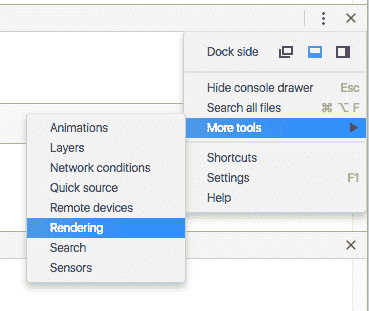
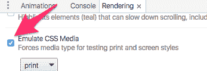
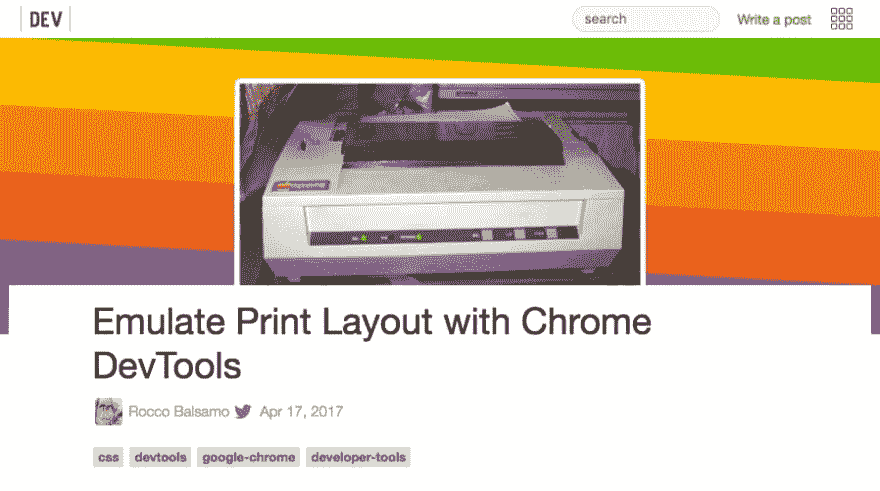
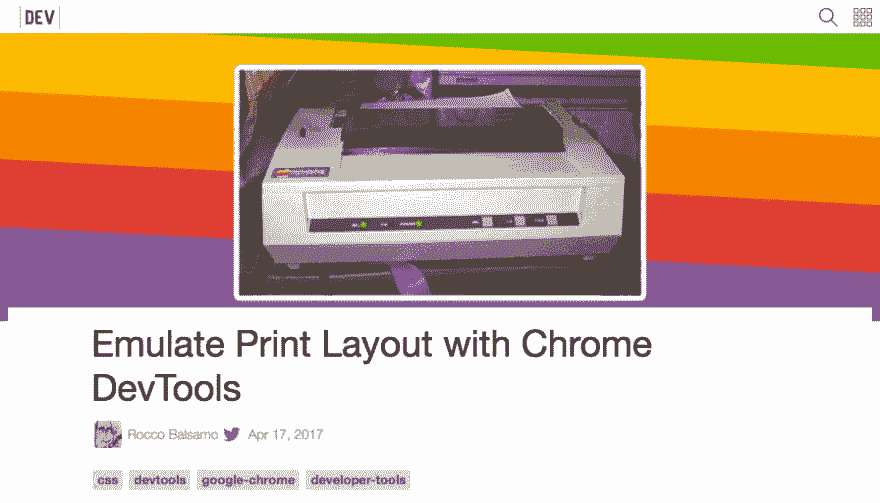
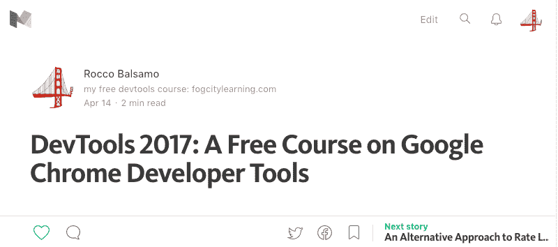
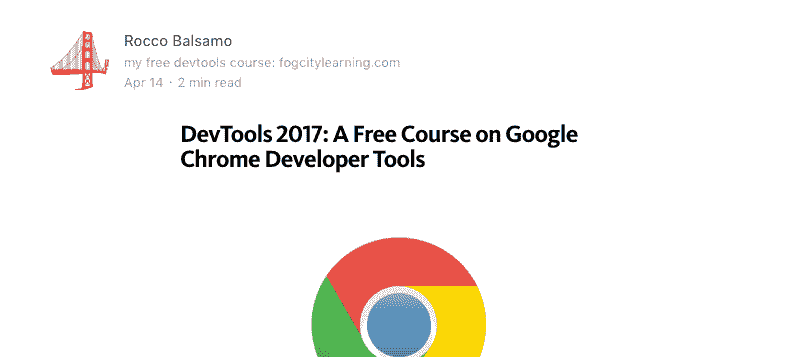

# 使用 Chrome DevTools 模拟打印布局

> 原文:[https://dev . to/the roccob/emulate-print-layout-with-chrome-dev tools](https://dev.to/theroccob/emulate-print-layout-with-chrome-devtools)

曾经想让你的网站在打印布局上看起来不错吗？很多网站做得很好，但其他网站表现平平，当你去打印时，你会被大量讨厌的标题卡住。

我知道，我知道，你可能会嘲笑打印东西的想法，但是当我想把一篇文章保存为 PDF 格式时，我实际上一直在“打印”东西。

[dev.to](/) 在打印模式下很好地移除了页眉和页脚，所以你可以在本文中直接尝试。

按`ctrl + shift + i`(或 Mac 上的`cmd + shift + i`)打开 Chrome 开发者工具。然后在 devtools 窗口右上角选择羊肉串，选择更多工具- >渲染

[T2】](https://res.cloudinary.com/practicaldev/image/fetch/s--1mlzZRo4--/c_limit%2Cf_auto%2Cfl_progressive%2Cq_auto%2Cw_880/https://thepracticaldev.s3.amazonaws.com/i/3w9y5193b6po9r81iqd5.png)

然后滚动到底部，选择“模拟 CSS 媒体”和下拉菜单中的“打印”。

[T2】](https://res.cloudinary.com/practicaldev/image/fetch/s--XlLCfsqV--/c_limit%2Cf_auto%2Cfl_progressive%2Cq_auto%2Cw_880/https://thepracticaldev.s3.amazonaws.com/i/gsj8ef6itdcfk3h9iko2.png)

这样就改变了页面的视图:

对此:

Medium 在这方面也做得很好。查看这篇文章:[https://medium . com/@ theroccob/dev tools-2017-a-free-course-on-Google-chrome-developer-tools-43 af 9 C4 F8 d 5d](https://medium.com/@theroccob/devtools-2017-a-free-course-on-google-chrome-developer-tools-43af9c4f8d5d)

这里是无打印仿真:

带打印仿真:

感谢阅读！

如果你对一些免费的 DevTools 视频教程感兴趣，请查看我在[fogcitylearning.com](https://fogcitylearning.com)的免费视频课程