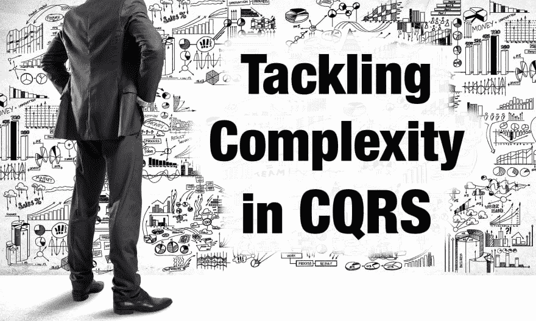
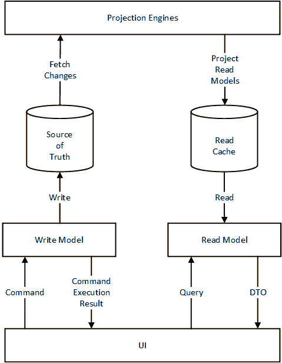
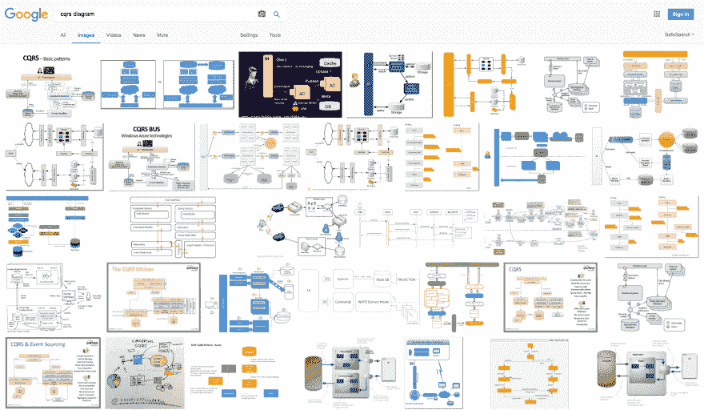

# 解决 CQRS 的复杂性

> 原文：<https://dev.to/vladikk/tackling-complexity-in-cqrs>

[T2】](https://res.cloudinary.com/practicaldev/image/fetch/s--PH4CqxFQ--/c_limit%2Cf_auto%2Cfl_progressive%2Cq_auto%2Cw_880/http://vladikk.cimg/cqrs/title-img.jpg)

CQRS 模式可以创造奇迹:它可以最大化可伸缩性、性能、安全性，甚至“击败”上限定理。尽管如此，CQRS 因其引入的复杂性而获得了一个有争议的名字。例如，[在他关于 CQRS 的文章](https://martinfowler.com/bliki/CQRS.html)中，马丁·福勒认为应该谨慎甚至小心地应用这种模式:

*   “……对于大多数系统来说，CQRS 增加了风险的复杂性”
*   “……你应该非常谨慎地使用 CQRS”
*   “因此，虽然 CQRS 是一个很好的工具箱中的模式，但要小心，它很难很好地使用，如果处理不当，你很容易砍掉重要的部分。”

在我看来，CQRS 引发的复杂性很大程度上是偶然的，因此是可以避免的。为了说明我的观点，我想讨论 CQRS 的目标，然后分析基于 CQRS 的系统中意外复杂性的三个常见来源。

## CQRS 的目标

CQRS 的目标是支持使用多种模型来表示相同的数据。不是可扩展性，不是可用性，不是安全性，不是性能。多个模型中的数据相同。就是这样。剩下的都是副产品。不相信我？听听 Greg Young 在 DDDEU2016 大会上的讲话，他说 CQRS 是为了支持事件采购的实现而发明的。而且，您可能知道，事件源模型对于写数据来说很棒，但是对于读来说很糟糕。这就是当时他需要 CQRS 的原因:*在多个模型中表示相同的数据*。

CQRS 是如何实现这一目标的？通过确保只有一个模型作为真理的来源，并且所有的变更都只提交给这个模型。

让我们看看这种理解如何帮助我们解决一些复杂问题。

## 复杂性陷阱#1:单向命令，或过度隔离

据我所知，CQRS 的所有定义都遵循这一模式:

1.  CQRS 基于 CQS 原则，该原则认为操作应该分为两组:更改数据的命令和返回数据的查询。一旦我们将这一原则提升到架构层次，我们就会得到一个用例被分成同样两组的系统:命令和查询。每个用例可以是命令或查询，但不能同时是命令和查询。
2.  一旦用例被分离，我们会得到很多好处:多模型，不同的持久化机制，独立的可伸缩性，等等。

你感觉到这里有什么不对吗？这个问题很微妙:对 CQRS 的所有定义通常都是从解决方案——隔离开始，然后才定义问题——多重模型。这引起了对分离的过多关注:甚至将命令定义为单向的，在这种情况下，您从服务器获得 Ack/Nack 响应，但必须轮询一些读取模型存储以获得实际的命令执行结果。换句话说，复杂性释放了。

### 解决方法:放松隔离

让我们退一步，重新考虑种族隔离。我们已经看到，根据 CQRS 的说法，为了在多个模型中表示相同的数据，一个用例既可以写数据也可以读数据。显而易见，一个读取模型不应该更新任何东西，因为否则我们会得到多个真实的来源。但是你真的应该让你的命令无效吗？

不完全是。在不违反任何原则的情况下，命令可以安全地返回以下数据:

*   执行结果-成功/失败；
*   失败时的错误消息或验证错误；
*   如果成功，则为聚合的新版本号；

这些信息将极大地改善您系统的用户体验，因为:

*   您不必轮询命令执行结果的外部来源，您马上就可以得到它。验证命令和返回错误消息变得很简单；和
*   如果您想要刷新显示的数据，您可以使用聚合的新版本来确定视图模型是否反映了所执行的命令。不再显示陈旧的数据。

说到数据，我们能不能把隔离放宽一点？在许多情况下，受影响的集合中包含的任何数据都可以作为命令执行结果的一部分返回。然而，这里有一个细微的差别:确保返回的数据可以在以后从一个读取模型中查询。否则，在响应没有到达客户端的情况下，数据可能会有轻微的丢失风险。

你可以在 Daniel Whittaker 的博客中看到这种方法的例子，他在博客中讨论了使用命令执行对象来验证命令。

同样，在这个[要点](https://gist.github.com/vladikk/86da55d0eb09d7a291b9f9a5b406f2c9)中，你可以看到我在 C#中使用的命令执行结果对象。

## 复杂性陷阱#2:事件采购

由于历史原因，CQRS 与活动采购模式密切相关。毕竟，CQRS 的发明是为了让事件采购成为可能。但是让我们重新评估这两种模式之间的耦合。

正如我以前说过的，CQRS 的目标是允许在不同的模型中表示相同的数据。如果您正在使用事件源域模型，您绝对需要 CQRS 能够执行查询。然而，还有许多其他完全正当的理由来实施 CQRS，这些理由与事件源无关:

*   您的系统应该在不同的表示模型中显示其实体。
*   你必须支持不同的查询模型(搜索、图表、文档等。).
*   写入和读取之间的差异非常大，您希望独立地扩展它们。
*   你讨厌 O/RMs。

这是否意味着在所有这些情况下，你都必须走活动采购路线？如果你这样做了，你就陷入了复杂性陷阱。事件源是对业务领域建模的一种方式。不仅仅是一种方式，可能是最复杂的方式。因此，当且仅当您的业务领域证明有必要时，您应该使用事件源。让我们看看如何在其他情况下实现 CQRS。

### 解:CQRS！=事件采购

我们被教导通过为事件编写处理程序来生成投影。但是如何在没有事件的情况下实现投影呢？还有另一种方法来做预测，我称之为“基于状态的预测”。这个主题值得一文，但我将简要描述实现“基于状态的预测”的三种方法:

#### 1。“脏”标志

您可以通过引发 IsDirty 标志来标记已更新的实体，并实现一个投影引擎，该引擎将查询脏实例并将更新的数据投影到不同的模型中。要重建预测，您只需将所有记录的标志升回即可。

#### 2。追赶

在关系数据库中，可以在表级别跟踪提交。例如，在 SQL Server 中有一个内置的机制，即[“row version”列](https://msdn.microsoft.com/en-us/library/ms182776.aspx)。这种功能也可以为其他关系数据库实现。投影引擎将以一种类似于追赶订阅的方式查询更新的行，并投影更新的数据。要从头开始重新构建一个投影，您必须将最后一个已知的提交 id“回滚”到 0。

#### 3。数据库视图

如果您使用关系数据库，并且您所需要的就是用不同的模型表示它的数据，那么数据库视图将会非常有用。是的，一个完全有效的 CQRS 系统可以在数据库中实现。这可能是最不性感的解决方案——但它不仅有效，还自然而然地遵循了 CQRS 模式。

这些投射模特的方式可能并不酷也不性感，但它们确实有效。我已经看到很多项目使用了他们，他们工作起来很有魅力，没有不合理地淹没在与事件采购相关的复杂性中。

等等，我刚才是不是建议不要考虑事件采购，因为它很复杂？绝对不会。事件源是您工具箱中最重要的工具之一。但是像任何工具一样，在它的上下文中使用它——带来商业价值的商业领域:核心子域。另一方面，通用子域和支持子域非常简单，可以用事务脚本或活动记录模式实现，仍然可以从 CQRS 中受益。在这种情况下，使用最简单的工具就可以了，用基于国家的预测来剥夺 CQRS 的利益。

## 复杂性陷阱#3:过犹不及

微服务的宣传吸引了很多人对 CQRS 的关注:如果你有一套需要查询彼此数据的独立服务， [CQRS 是常见的解决方案](https://www.ibm.com/developerworks/cloud/library/cl-build-app-using-microservices-and-cqrs-trs/)。然而，我已经看到这种方法产生了巨大的服务数据流图，在它们之间投射了大量的数据。

[T2】](https://res.cloudinary.com/practicaldev/image/fetch/s--LR1_9i2E--/c_limit%2Cf_auto%2Cfl_progressive%2Cq_auto%2Cw_880/http://vladikk.cimg/cqrs/microservices.jpg)

这并不总是不好的，但是在很多情况下，这可能是一个信号，让你后退一步，重新考虑你的分解策略。您的服务可能过于细粒度，不能反映业务领域的边界。如果是这种情况，您可以通过将服务边界与它们对应的业务域重新对齐来大大降低您的架构的复杂性。

## CQRS:去复杂化

我想用一张 CQRS 的图表来总结这一切:

[T2】](https://res.cloudinary.com/practicaldev/image/fetch/s--WU8a83tv--/c_limit%2Cf_auto%2Cfl_progressive%2Cq_auto%2Cw_880/http://vladikk.cimg/cqrs/cqrs-diagram.png)

此图表不同于您可以在 web 上找到的其他图表:

[T2】](https://res.cloudinary.com/practicaldev/image/fetch/s--pj1kTetL--/c_limit%2Cf_auto%2Cfl_progressive%2Cq_auto%2Cw_880/http://vladikk.cimg/cqrs/google-cqrs.png)

这就是我所看到和实现的 CQRS 模式。命令有响应。定义的投影机制是抽象的，没有任何实现细节。在内部，它可能基于事件、状态，甚至是数据库视图。最后，没有看到活动采购。按照业务领域的要求对系统的业务逻辑建模:活动记录、领域模型或事件源领域模型。

正如每一个正确应用的工具一样，CQRS 应该降低复杂性，而不是诱导它。如果你的架构变得越来越复杂，那你就做错了。

* * *

*本帖最初发表于[vladikk.com](http://vladikk.com/2017/03/20/tackling-complexity-in-cqrs/)T3】*