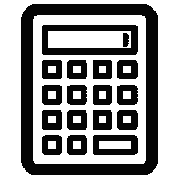
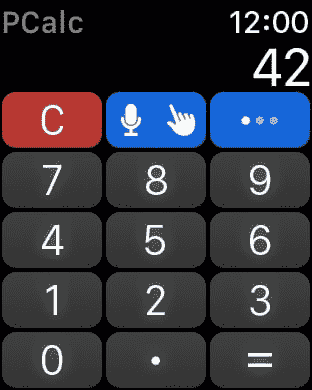
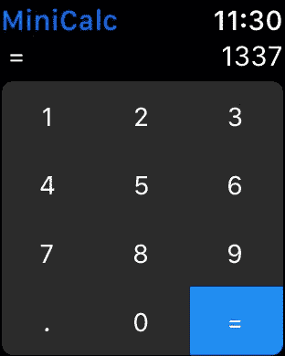
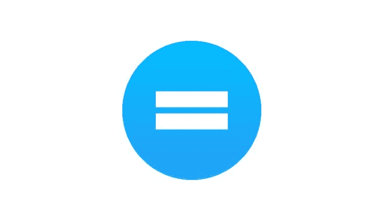

# 制造一个计算器不是那么容易的

> 原文：<https://dev.to/justin/making-a-calculator-isnt-that-easy>

我买了我的 Apple Watch，作为开发我的第一个 iOS 应用程序的动力。我知道我并不真的需要，但我认为这是一项投资，将推动我学习苹果的编程语言 Swift。我并不是特别想开发一款手表应用，但是我认为小屏幕的限制会让界面变得简单，限制功能；因此，使应用程序简单且易于编码。

* * *

### 第一步:找到想法

我想建造一个简单的东西，我可以建造它的每一个方面。我不想为我的第一个应用程序依赖库或框架。我想亲自动手编写代码。出于这个原因，我想建立一个自包含的应用程序，没有网络连接或外部数据源。我想过造一个计算器。我没有多想，开始做一些研究。

[T2】](https://res.cloudinary.com/practicaldev/image/fetch/s--qYlv-Jmq--/c_limit%2Cf_auto%2Cfl_progressive%2Cq_auto%2Cw_880/https://thepracticaldev.s3.amazonaws.com/i/fe0smbt7mh0t17bv0v9e.png)

### 第二步:看竞争对手，找弱点

我知道在 iOS 计算器领域有一些大玩家。我的两个案例研究是 [PCalc](http://www.pcalc.com/iphone/index.html) 和 [Calcbot](https://tapbots.com/calcbot/) 。

#### **案例一:PCalc**

[T2】](https://res.cloudinary.com/practicaldev/image/fetch/s--lMTJ3D5N--/c_limit%2Cf_auto%2Cfl_progressive%2Cq_auto%2Cw_880/https://thepracticaldev.s3.amazonaws.com/i/r2lkm1d2xs6attwvclqw.jpeg)

在 PCalc 应用程序中，操作不会显示在屏幕上。它们可通过第二页获得。有多种输入方式可供选择。主屏幕上有 15 个按钮。

#### **案例二:Calcbot**

[T2】](https://res.cloudinary.com/practicaldev/image/fetch/s--1UHgpWrx--/c_limit%2Cf_auto%2Cfl_progressive%2Cq_auto%2Cw_880/https://thepracticaldev.s3.amazonaws.com/i/rqqim8b30h4cuqkilu6o.jpeg)

Calcbot 在主界面上有 12 个可见按钮。它支持四种操作(+)，可通过 force touch 菜单使用。

#### **调查结果**

由于 Apple Watch 的屏幕较小，应用程序应该尽量减少按钮，以使剩余的按钮更大。该应用程序还应该提供一个快速的方式来输入操作。

#### **解**

1.  从主界面上移除操作按钮
2.  主要操作是通过刷卡完成的
3.  最不常用的操作使用强制触摸完成
4.  为从表盘快速操作提供了复杂功能

### 第三步:打造手表 app

手表 app 的主体部分是 24 小时完成的。界面非常简单。我把它做得尽可能简单，因为我不太了解手表的布局。这些限制实际上是有帮助的，因为它们指导我构建界面。第一天之后，应用程序开始运行。

[T2】](https://res.cloudinary.com/practicaldev/image/fetch/s--9fHn4_vV--/c_limit%2Cf_auto%2Cfl_progressive%2Cq_auto%2Cw_880/https://thepracticaldev.s3.amazonaws.com/i/du97sqco6hfulnbtc9o8.jpeg)

#### **浮点 vs 双精度**

> 1.111111 ≠1.111111111111111

计算器的一个重要方面是精度。我想拥有适合屏幕的最高精度。浮动对于手表来说是完美的，因为小数位可以放在屏幕上。Double 是有问题的，因为它几乎有两位小数。我想要最好的精度，所以我选了 double。

#### **新功能:“变精度**

为了在手表屏幕上获得尽可能高的精度，精度(有效位数)根据符号、实际位数、指数符号和大小而变化。基本上，数字精度被重新格式化以适合屏幕。虽然显示器上的精度会改变，但实际的双精度值总是用于计算。Michel Chatmajian 帮我实现了这个功能。

### **第四步:制作 logo**

我在 webgradients.com 上找到了一个渐变，并发送给了米歇尔。他接着在中间放了一个等号。这是生成的图标:

[T2】](https://res.cloudinary.com/practicaldev/image/fetch/s--QuEKFsm_--/c_limit%2Cf_auto%2Cfl_progressive%2Cq_auto%2Cw_880/https://thepracticaldev.s3.amazonaws.com/i/fdy6t9ey7jt793yc4zmo.png)

### **第五步:制作 iPhone app**

由于应用计算器只适用于手表，所以我没有费心去做一个手机计算器。手机应用将用于解释如何使用手表应用。这让我的生活变得简单多了，因为我不必构建复杂的布局。它有两个视图:主视图和指令视图。我还欺骗了使用 webview 作为指令视图。我用 HTML/CSS **#win** 编码了整个事情。

### 第六步:构建、打包、运输(并等待)

> Justin Leger@ jus leg让等待开始！ [@MiniCalc](https://twitter.com/MiniCalc) 已提交至[@ app store](https://twitter.com/AppStore)2017 年 3 月 20 日下午 19:09

### 第七步:成功！

MiniCalc 于 2017 年 3 月 23 日在 App Store 获得批准

[T2】](https://i.giphy.com/media/lnlAifQdenMxW/giphy.gif)

如果你想试试 MiniCalc，可以在 App Store 下载

[T2】](http://appsto.re/ca/ekvKib.i)

关于我其他项目的更多信息，你可以查看我的个人网站 [justinleger.ca](https://justinleger.ca/)