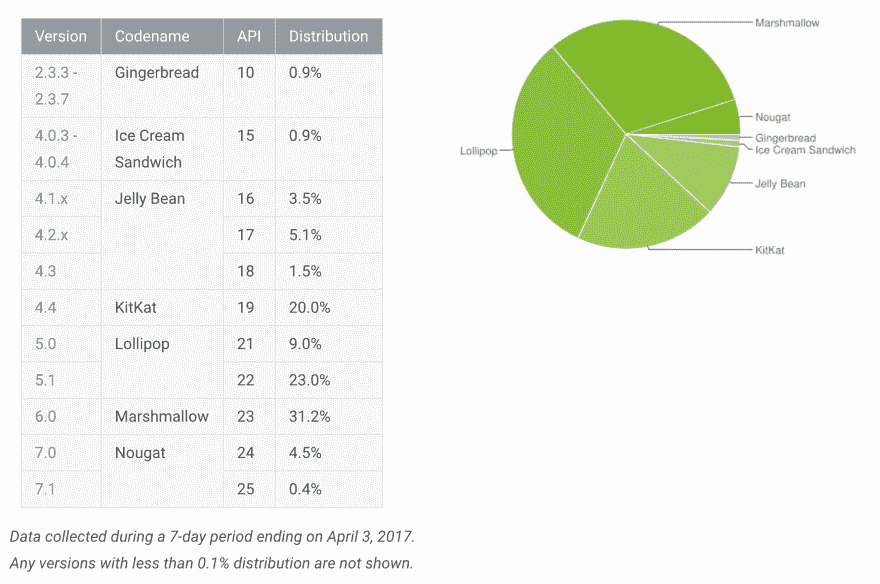
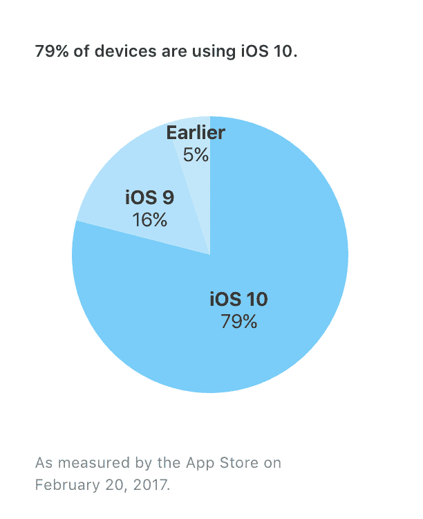

# 切换到 Android:一个长期 iOS 用户的观点

> 原文:[https://dev . to/Justin oboyle/switching-to-Android-a-long-time-IOs-users-perspective-9kf](https://dev.to/justinoboyle/switching-to-android-a-long-time-ios-users-perspective-9kf)

最近，[我的朋友](https://asharahmed.com)把他的旧 Nexus 6P 递给了我，这样我就可以试用 Android 了(也因为我的 iPhone 6 慢得让人无法忍受)。

我几乎一直都是智能手机的鼓手；我几乎一直都有一部越狱手机，并且一直很开心。越狱的 iOS 对我来说是可调整性和可用性之间的完美平衡。然而，在苹果公司去年“鼓起勇气”取消耳机插孔转而支持无线或闪电耳塞之后，以及对旧设备电池寿命的持续忽视，让我的好奇心达到了顶峰，鼓起“勇气”尝试其他东西。

我没有获得 Nexus 6P 的开箱体验，但我做的第一件事是闪存 [ElementalX](https://forum.xda-developers.com/nexus-6p/orig-development/kernel-elementalx-n6p-t3240571) 和 [PureNexus](https://forum.xda-developers.com/nexus-6/development/rom-pure-nexus-project-t3148214) (以及用于 root 的 [Magisk](https://forum.xda-developers.com/apps/magisk/official-magisk-v7-universal-systemless-t3473445) )。我在安装过程中得到了指导，一切都准备好了。首先映入我眼帘的是 Nexus 6P 上漂亮的屏幕。来自 iPhone，1440p AMOLED 屏幕不是我习惯的东西。

##### 好人

作为一名软件开发人员，当我开始从 Play Store 安装更多应用程序时，我真的很欣赏对应用程序集成的关注。(“你想使用什么应用程序打开此地图链接？”分享按钮直接进入 Telegram 和 Twitter DMs 等中的对话。

[T2】](https://res.cloudinary.com/practicaldev/image/fetch/s--ULrf_XLA--/c_limit%2Cf_auto%2Cfl_progressive%2Cq_auto%2Cw_880/https://static.justinoboyle.com/android-picker.png)

让我们面对现实吧:我们大多数人的手机上都有大量的应用程序，我们使用这些程序足够保留，但不足以保证在主屏幕上占有一席之地。Android(嗯，大多数启动器)很好地解决了这个问题，它允许你有一个“应用抽屉”(对于现有的 iOS 用户，可以把它想象成你电脑上的一个“应用文件夹”)来隐藏所有半用的应用。没有人希望自己的手表应用占据主屏幕的宝贵空间。(说真的，你多久打开一次那个？有一次，去修理你的手表，因为一些粗略的在线指南告诉你它可以解决一些问题？)

Android 社区很棒。这并不是说 iOS 社区不那么伟大(尽管 [/r/jailbreak](https://reddit.com/r/jailbreak) 可能会稍微冷静一点)，但是我注意到 Android 社区似乎很重视开源项目——这是 iOS 社区刚刚开始更重视的东西(仍然不是那么重视)。另外，谷歌不会把你锁定在最新的两三个次要版本上。Substratum 之类的主题引擎有时会有点问题，但似乎比大多数 iOS 主题引擎做得更好(除了 Eclipse 4，但这与其说是主题，不如说是调整)。

Android 上的通知实际上很酷。起初，我对需要取消通知以便它们在锁定屏幕上消失感到困惑，但我已经真正发现了持久通知(以及分组！)一个非常简洁有用的特性。

在我看来，所有关于应用程序比 iOS“不发达”或应用程序比 iOS 好的论点都是站不住脚的。他们基本上是一样的。你真的不会有任何第三方应用兼容的问题。(Snapchat 除外)

##### 坏了

这不是 Android 的错，但 iMessage 确实是一个大失误。短信是错误和缓慢的，要求人们切换到像电报或视频这样的东西有时不是一个选择。(我真的希望我们能有一个真正加密的消息标准，而不是受运营商或供应商的控制，但遗憾的是，我们仍然没有。)这也不是 Android 的错，但让 Snapchat 在除了普通 Android 之外的任何东西上工作都是一场噩梦(顺便说一下，我在这里记录了[如何做到这一点)。](https://blog.justinoboyle.com/switching-to-android-a-long-time-ios-users-perspective/)

不幸的是，我不认为绝大多数 Android 用户会有和我一样的体验。Android 在补丁和更新方面存在巨大问题。截至 2017 年 4 月，[谷歌报告](https://developer.android.com/about/dashboards/index.html)只有 4.9%的用户在使用 Android 牛轧糖，这是 Android 的最新版本(7.0 或 7.1)。

[T2】](https://res.cloudinary.com/practicaldev/image/fetch/s--1hq1b_R8--/c_limit%2Cf_auto%2Cfl_progressive%2Cq_auto%2Cw_880/https://static.justinoboyle.com/android-version.png)

相比之下，苹果有 79%的设备运行 iOS 10。

[T2】](https://res.cloudinary.com/practicaldev/image/fetch/s--u7Y62-f9--/c_limit%2Cf_auto%2Cfl_progressive%2Cq_auto%2Cw_880/https://static.justinoboyle.com/ios-version.png)

这种碎片化对谷歌来说是一个大问题——他们似乎正在通过自动像素和即时 Nexus 更新来解决这个问题。然而，更便宜的智能手机很容易受到攻击和利用。

##### 总结

iOS 和 Android 是很棒的平台。我将继续使用这两种手机，但目前我的速度更快的手机是 Android 设备，所以我会坚持使用它。我会发布更新。