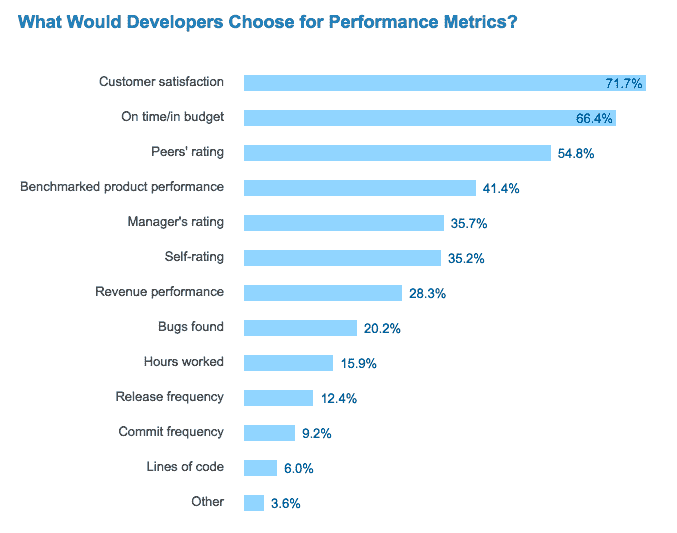
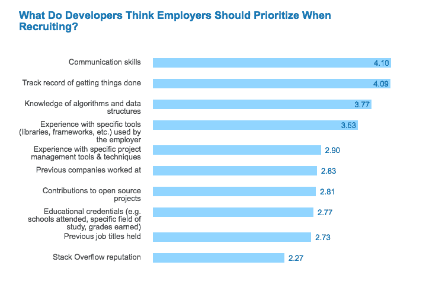
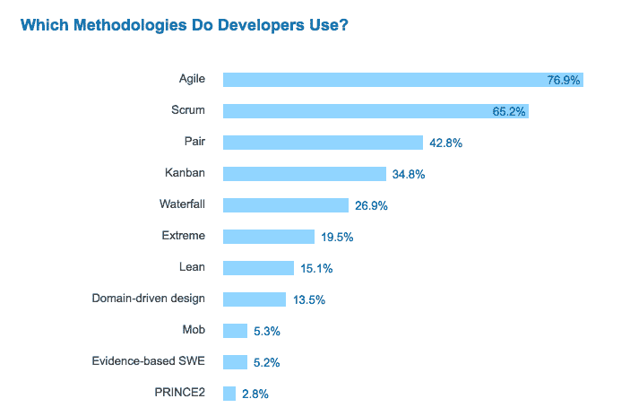

# 聪明地工作:开发人员重视什么样的绩效指标，什么时候他们感觉效率最高？

> 原文:[https://dev . to/walker/working-smart-what-performance-metrics-do-developers-value-and-when-do-them-feel-most-productive](https://dev.to/walker/working-smart-what-performance-metrics-do-developers-value-and-when-do-they-feel-most-productive)

如果你正在阅读这篇文章，你可能关心成为一个更好的开发人员和以更高的效率生产。然而，衡量这一领域业绩的最佳手段并不总是很清楚。不幸的是，参考的 dev.to 文章的数量(还)没有赶上作为可靠的性能指标的速度——但是有一些现有的测量方法可以探索。

作为他们的 [2017 开发者调查](https://stackoverflow.com/insights/survey/2017#evaluating-developers)的一部分，Stack Overflow 要求用户选择评估项目的最重要方式:

[T2】](https://res.cloudinary.com/practicaldev/image/fetch/s--dt1225D2--/c_limit%2Cf_auto%2Cfl_progressive%2Cq_auto%2Cw_880/https://d1ax1i5f2y3x71.cloudfront.net/items/2d0d1P3Z3G3j2d3Z3Z0G/Screen%2520Shot%25202017-04-14%2520at%252012.54.44%2520PM.png%3FX-CloudApp-Visitor-Id%3D2119651)

虽然这些结果并不具有突破性，但仍有一些清晰的趋势。开发人员在销售数字(28%)之前为客户(72%)和产品(41%)服务，也许是理解完美的产品可能在财务上表现不佳，反之亦然。

他们也重视效率，因此像“代码行数”(6%)、“提交频率”(9%)和“工作时间”(16%)这样有问题的统计数据并不那么重要。在给合适的人留下深刻印象方面，比起他们的上级(36%)甚至他们自己(35%)，开发人员更信任他们的直接同事(55%)。

> 编程智慧[@ code Wisdom](https://dev.to/codewisdom)“用代码的行数来衡量编程进度，就像用重量来衡量飞机的建造进度。”——比尔盖茨2017 年 03 月 03 日下午 19:39

那么，你如何确保雇佣能够执行这些优先事项的人呢？调查还询问了雇主应该如何招聘和评估潜在雇员:

[T2】](https://res.cloudinary.com/practicaldev/image/fetch/s--EN6RwQOs--/c_limit%2Cf_auto%2Cfl_progressive%2Cq_auto%2Cw_880/https://d1ax1i5f2y3x71.cloudfront.net/items/001J0y2i3H3i271b3V45/Screen%2520Shot%25202017-04-14%2520at%25201.05.31%2520PM.png%3FX-CloudApp-Visitor-Id%3D2119651)

有趣的是，前两个答案，“沟通技巧”(5 分制，4.10 分)和“完成事情的记录”(4.09 分)，通常不是明确的量化标准。它们也是你甚至可以在获得面试机会之前，分别使用一份强有力的简历或求职信来表达的东西。当然，硬技能也非常重要，因为我们看到算法、数据和框架方面的知识占据了接下来的两个最高位置。

一旦你选择了正确的人，你需要确保他们有效地协作，这就是为什么 Stack Overflow 也询问了受欢迎的开发实践:

在这三个问题中，这个图表中的奇偶性最小。大多数程序员欣赏敏捷方法(77%)和 scrum(65%)提供的速度和灵活性，而不是像瀑布(27%)这样的老式方法，在当今加速的环境中，这些方法可能会感觉反应迟钝。

总的来说，调查的这一部分可以作为完成工作的蓝图。雇佣善于沟通的程序员，并用正确的工具记录成功的案例；允许他们经常迭代，快速适应；在理解时间和预算限制的同时，崇拜客户或用户的体验。

这几乎就像...

[T2】](https://res.cloudinary.com/practicaldev/image/fetch/s--bX1R_Bey--/c_limit%2Cf_auto%2Cfl_progressive%2Cq_auto%2Cw_880/https://thepracticaldev.s3.amazonaws.com/i/cs483mkag9pbdiiv557g.png)