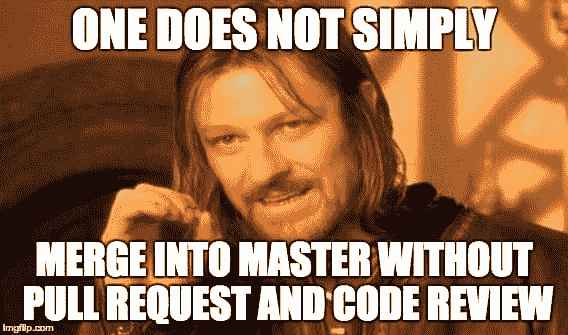
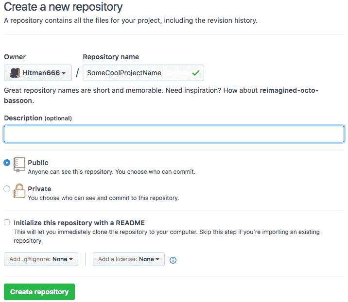
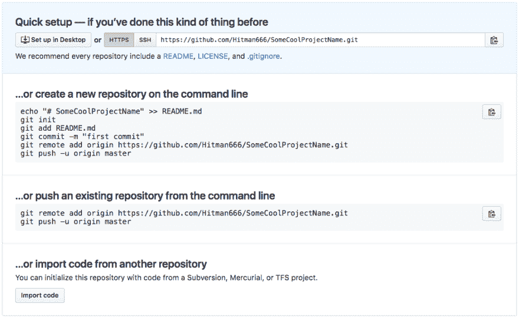
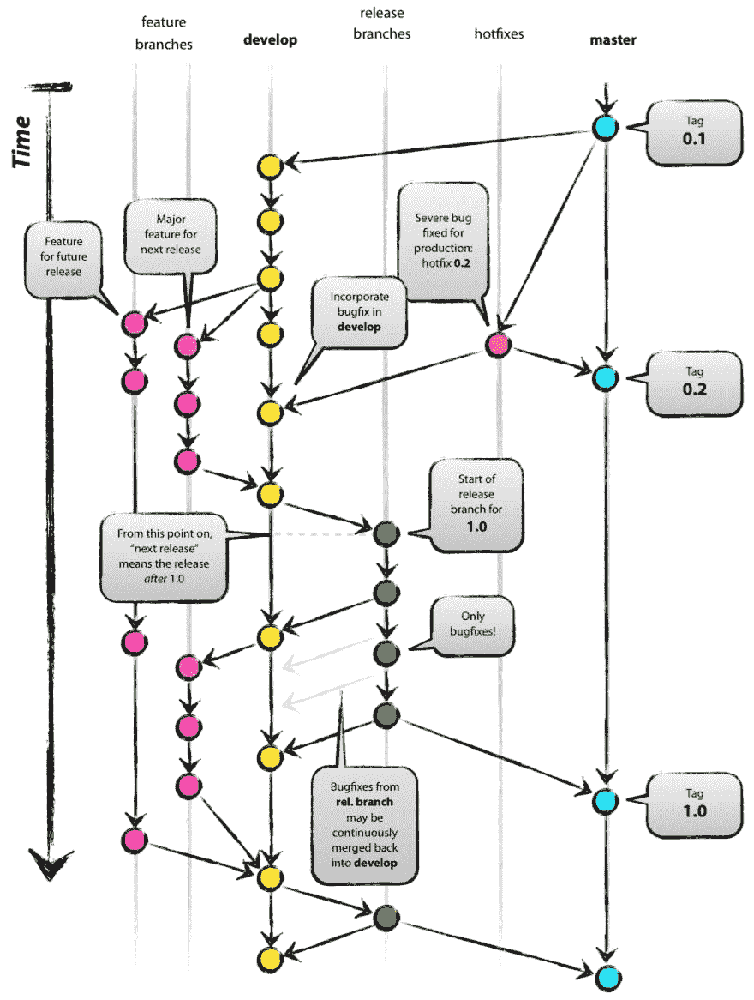
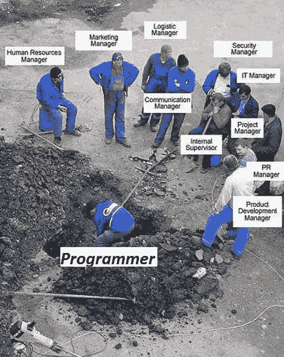
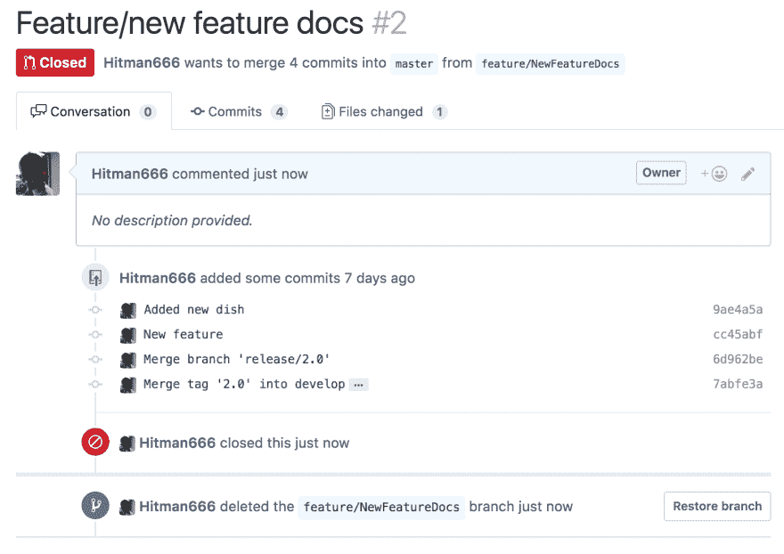

# 用 Gitflow 做正确的 Git 分支&用代码评审提高代码质量

> 原文:[https://dev.to/nikola/git-branching-done-right-with-gitflow 通过代码评审提高代码质量](https://dev.to/nikola/git-branching-done-right-with-gitflow--improving-code-quality-with-code-reviews)

[T2】](https://res.cloudinary.com/practicaldev/image/fetch/s--ImRssYOF--/c_limit%2Cf_auto%2Cfl_progressive%2Cq_auto%2Cw_880/https://thepracticaldev.s3.amazonaws.com/i/br6553k0wsftuyxxhbn7.jpg)

*原载于[我的博客](http://www.nikola-breznjak.com/blog/miscellaneou/git-branching-done-right-gitflow-improving-code-quality-code-reviews/)*

## Meetup 笔记

上周四(2017 年 4 月 6 日)，我们举行了第八次 MeCoDe 会议，这次是关于 Git 分支和 Gitflow 以及代码评审。

这一次，主讲人是真正的你:)这似乎是一个非常有趣的话题，因为这是我们迄今为止参加人数最多的聚会< 3

## 演示

*应大众需求:)* [这是演示幻灯片的链接](http://nikola-breznjak.com/portfolio/GitflowPresentation.pdf)。

## 教程

在这篇文章中，我已经简要地在博客[中介绍了 Gitflow，但是在这篇文章中，我将稍微解释一下如何从**命令行**使用 git。然后，我将介绍使用 git 需要知道的基本命令。之后，我将展示如何使用 **gitflow** 来管理分支，最后，我将展示如何进行**代码审查**。](http://www.nikola-breznjak.com/blog/miscellaneou/gitflow-successful-git-branching-model/)

### 源代码控制

[](https://res.cloudinary.com/practicaldev/image/fetch/s--3geGny5c--/c_limit%2Cf_auto%2Cfl_progressive%2Cq_auto%2Cw_880/http://i.imgur.com/YZ4W1Ao.jpg) 
我希望每个人都支持源代码管理，或者至少你在考虑这么做。但是老实说，我认为现在每个人都在使用某种形式的源代码控制。别担心，我们不会举手表决的

### 去吧

[T2】](https://res.cloudinary.com/practicaldev/image/fetch/s--X2QCkOW0--/c_limit%2Cf_auto%2Cfl_progressive%2Cq_auto%2Cw_880/http://i.imgur.com/ZQk7r6P.jpg)

Git 是一个分布式版本控制系统(VCS)。

**版本控制**意味着你用它来存储你的文档版本。的确，它似乎在开发人员中很受欢迎，但是设计师和其他人(稍微懂点技术的)也用它来跟踪他们文件的版本。

这整个**分布式**部分是它与其他 VCS 不同的地方之一。

在 Git 中，每个开发人员的工作副本也是一个储存库，可以包含所有变更的**完整历史**，而不是像 CVS 或 Subversion 这样在*曾经流行的* VCS 中常见的只有一个单一的位置来存放软件的完整版本历史。

这位*谈吐优雅的绅士*创造了 Git:

[T2】](https://res.cloudinary.com/practicaldev/image/fetch/s--aKG-ivCS--/c_limit%2Cf_auto%2Cfl_progressive%2Cq_auto%2Cw_880/http://i.imgur.com/ESoSiQq.jpg)

当然，他是 Linus Torvalds，Linux 的创造者。

### 那么，我们如何开始呢？

首先，确保你已经为你的操作系统安装了 Git。

然后，创建存储库所需要做的就是执行:

`git init`在某个文件夹里。

让我们现在就这样做；在你的命令行上说，在桌面上(是的，我们将是原始的)你创建一个名为`GitflowMeetup`的文件夹。

在文件夹内，执行`git init`。

现在我们有了一个空的 git 库。

### 添加文件

现在创建一个简单的`README.md`文件，编写如下内容:

```
# GitflowMeetup

I love these meetups! 
```

并保存文件。

您会经常用到的一个有用的命令是`git status`，它会告诉您 git 项目的状态。如果在命令行中执行(在 Git 项目中),您会看到 Git 没有跟踪`README.md`文件。

这个文件现在不在 Git 中，但是**我们如何告诉它添加它**？嗯，我们使用命令`git add README.md`。当然，如果你有多个文件，你不需要列出每一个文件，你只需要使用`git add .`

如果您再次运行`git status`命令，您会看到我们已经添加了一个新文件。

### 提交变更

要将添加的更改提交到您的本地存储库，只需运行:

`git commit -m "Added the README.md file"`

当然，提交消息可以是任何东西，但是请帮自己一个忙，写一些**有意义的提交消息**。

### 推送到远程回购

在这个例子中，我们将使用 Github (Bitbucket 和 Gitlab 是我所知道的其他几种流行的选项)。

首先，如果你没有的话，在 [Github](https://github.com/) 上创建一个账号。

然后，点击主页上的`Start a project`按钮，为你的项目选择一个名字。默认情况下，您可以保留所有其他选项:

[T2】](https://res.cloudinary.com/practicaldev/image/fetch/s--UurgqKgj--/c_limit%2Cf_auto%2Cfl_progressive%2Cq_auto%2Cw_880/http://i.imgur.com/frX5zzP.png)

由于我们已经在本地创建了一个项目，我们将使用第二个选项(`...or push an existing`)来添加一个`remote`原点:

[T2】](https://res.cloudinary.com/practicaldev/image/fetch/s--Wis__1E0--/c_limit%2Cf_auto%2Cfl_progressive%2Cq_auto%2Cw_880/http://i.imgur.com/BYEry4u.png)

### 树枝

Git 使得分支的整个概念变得非常简单。假设我们现在在一个`master`分支上，我们想尝试一些基于我们的`master`分支的新特性:

> 您只需使用一个简单的命令来创建一个新的分支，然后在那里做一些工作。当你完成一个特性时，你只需要把它合并回主分支。

让我们现在就这样做；制作新的分支:`git checkout -b new_feature`。这将在`master`分支(或您当前所在的分支)之外创建一个名为`new_feature`的新分支，并且它将检查它(这意味着，您将被‘定位’在`new_feature`分支而不是`master`)。

对您的`README.md`文件进行一些更改，保存它，并使用以下命令提交当前分支中的更改，并将它们合并回主文件:

```
git add .
git commit -m "New feature changes"
git checkout master
git merge new_feature 
```

### Gitflow

既然您已经看到了这些分支是如何容易使用的，那么很多人想出自己的方法来管理分支就不足为奇了。

[T2】](https://res.cloudinary.com/practicaldev/image/fetch/s--pB6uRdWL--/c_limit%2Cf_auto%2Cfl_progressive%2Cq_auto%2Cw_880/http://i.imgur.com/tn2vFN4.jpg)

不过，好像其中一个在社区里挺受欢迎的。那么，让我给你介绍一个流行的 git 分支模型，由 Vincent Driessen 开发，名为 [Gitflow:](http://nvie.com/posts/a-successful-git-branching-model/)

[T2】](https://res.cloudinary.com/practicaldev/image/fetch/s--9QmJbQRD--/c_limit%2Cf_auto%2Cfl_progressive%2Cq_auto%2Cw_880/http://i.imgur.com/jbfetKH.png)

这张图第一次看的时候很乱，一步一步来。您有两个主要分支:

*   掌握
*   发展

`master`分支包含与当前生产中的源代码完全相同的状态。

所有的工作都发生在`develop`分支上。

您使用从`develop`分支创建的所谓的`feature`分支。你可以有多个`feature`分支机构。

然后您有一个`release`分支，它是用于准备新发布的分支。

最后，您有一个`hotfix`分支，例如，当您在产品代码中发现一些 bug，并且您需要尽快修复它时，就会用到这个分支。

以下是 Gitflow 在理论上的一个常见工作流程:

*   首先，您必须有一个 Git 存储库
*   然后初始化 Gitflow 存储库
*   你将开始在一个`develop`分支上开发
*   然后，假设你想尝试一个新的特性——你可以创建一个新的特性分支，并在那里进行一些提交
*   完成后，你将通过完成一个特征合并回`develop`
*   如果你对你当前的版本满意，并且想做一个更新，那么你可以使用`release`分支。此外，您可以在这里修复任何错误
*   当完美完成时，你将**完成**分支`release`，这意味着你将合并到`master`并回到`develop`
*   此外，你会在那个时候**标记**你的`master`分支

### Gitflow -工具

现在我们将一步一步来做，但是首先，你需要确保你在你的电脑上安装了 [Gitflow 工具](https://github.com/petervanderdoes/gitflow-avh)(没有更好的名字了:)。这非常简单，例如，在 Mac 上，这就是一个简单的`brew install git-flow-avh`。

那么，**你问 Gitflow 模型和工具**有什么区别？？这个工具实际上是:

> Git 扩展的集合，为 Vincent Driessen 的分支模型提供高级存储库操作

该工具使您的生活更轻松，因为它执行一些重复的命令，所以您不必。例如，当你完成一个功能，它会确保将它合并回开发并删除它。当然，**你可以自己遵循 Gitflow 模型**，不需要 Gitflow 工具，但是这个工具为你节省了一些击键时间，并确保你在遵循 Gitflow 模型时不会错过任何一个步骤。

> 已经有很多关于 Gitflow 的帖子和教程，但是[这个](https://danielkummer.github.io/git-flow-cheatsheet/)有一个漂亮的小图表，你可能想看看。

作为 Gitflow 的先决条件，您需要有一个 Git 存储库。幸运的是，如果你是一个优秀的运动员，并且一直坚持到现在，你已经准备好了。接下来，您需要通过执行以下命令来初始化 Gitflow 存储库:

`git-flow init`

您将被问及几个问题，您可以用默认选项回答这些问题。它将按照 Gitflow 模型设置分支名称。

> 如果您的机器上没有 git-flow，请尝试`git flow`。这取决于你如何安装 Gitflow 工具。

当你完成这个后，你可以看到你在`develop`分支上。现在，让我们开始一项新功能，方法是:

`git-flow feature start new_docs`

接下来，打开`README.md`文件并添加一些新文本。然后，在本地提交您的更改:

```
git add .
git commit -m "Added new documentation" 
```

现在，既然我们对这一功能变化感到满意，让我们来完成这一功能:

`git-flow feature finish new_docs`

正如您将在命令行输出中看到的，该命令现在做了一些事情:

*   它将`new_docs`分支合并到了`develop`分支
*   它在本地删除了`new_docs`分支
*   它签出了`develop`分支，因此您可以继续工作

假设现在我们对我们的功能非常满意，我们已经在我们的测试服务器上进行了测试(我不会深入讨论这个问题，但是有些人倾向于设置持续部署，这样一旦你进入`develop`它就会进入测试服务器，测试人员可以在那里检查功能是否完成了它需要做的事情)，现在我们想要发布一个新的版本。

首先，我们必须执行:

`git-flow release start 2.0`

在这里，我们需要添加任何最后的潜在修复，更新版本(在处理移动应用程序时有意义)等。

完成后，我们只需执行:

`git-flow release finish 2.0`

您将需要添加几个合并消息和一个标记消息，但完成后，Gitflow 工具将:

*   将`release`分支合并到`master`
*   将`release`分支标记为`2.0`
*   将`release`分支合并到`develop`
*   删除`release`分支
*   查看`develop`分支

### 合作者

尽管我们的项目中可能会有合作者，但感觉往往是这样的:

[T2】](https://res.cloudinary.com/practicaldev/image/fetch/s--88ISscfr--/c_limit%2Cf_auto%2Cfl_progressive%2Cq_auto%2Cw_880/http://i.imgur.com/deKzmBS.jpg)

在 Github 中，你可以通过访问`Settings-Collaborators`将你认识的**人**添加到你的合作者中。通过这种方式，他们将获得权限来推送至您的存储库，或者您可以在 Github 上为此创建一个团队组织，因此对于每个新项目，您都可以选择哪个团队可以访问(以及访问哪种类型)。

当然，如果你认识一个将要承诺回购的人，这可能会很好。然而，如果你问我，这仍然不是一个好的解决方案，因为**我怀疑你会希望你的初级开发人员在没有你至少检查代码的情况下承诺掌握**。

因此，有一个更好的解决方案，它不仅解决了人们致力于掌握的问题，还提高了代码质量。这些被称为**拉请求**和**代码审查**。

实际上，这意味着您创建了一个新的特性分支，并在 Github 上提交了一个所谓的 pull 请求，请求将这个特性分支合并到 master(或者任何其他分支)中。然后团队中的其他人，不管是首席开发人员还是其他高级开发人员，都会检查你的代码，给你一些意见并最终合并它。

### 是啊，这个**看起来**不错但是

相信我；我都听说了。范围从

[T2】](https://res.cloudinary.com/practicaldev/image/fetch/s--pkDhl8a9--/c_limit%2Cf_auto%2Cfl_progressive%2Cq_auto%2Cw_880/http://i.imgur.com/8rl2ygb.jpg)

到

[T2】](https://res.cloudinary.com/practicaldev/image/fetch/s--poooZ20c--/c_limit%2Cf_auto%2Cfl_progressive%2Cq_auto%2Cw_880/http://i.imgur.com/JODpCik.jpg)

你可能听说过

[T2】](https://res.cloudinary.com/practicaldev/image/fetch/s--nyyeNDZx--/c_limit%2Cf_auto%2Cfl_progressive%2Cq_auto%2Cw_880/http://i.imgur.com/IQoH2po.jpg)

但事实往往处于灰色地带。

所以，你能放弃吗？我建议不要这样做，只是计算一下你做这些代码评审所花费的时间，并把它加入到你对某个特性需要多长时间的估计中。当然，我知道说“就这么做”很容易，但是如果你在团队中引入一些良好的实践有问题，那么，你可能需要重新考虑一些事情...

这不仅有助于你在**长期**的发展，也有助于你的团队获得**代码所有权**和**知识共享**的感觉，并且有助于你的初级开发人员更快上手。此外，据我所知，你(是的，你亲爱的读者)将长期处于困境；这(编程)是你热爱的事情，你是来掌握你的手艺的，对吗？

如果你仍然不相信，请阅读[为什么代码评审很重要(并且实际上节省时间！)](https://www.atlassian.com/agile/code-reviews)。

### 演示还是没发生

不管怎样，现在我们要做一个演示来展示这一点。

所以，让我们创建一个新的特性分支。

`git-flow feature start NewFeatureDocs`

重复之前的过程，更改一些文本并提交您的更改。

现在我们将做一些与以前不同的事情。我们现在将使用以下命令**将这个分支发布到我们的远程 repo** :

`git-flow feature publish NewFeatureDocs`

如果你现在查看 Github，你会发现我们已经推出了这个新分支。

现在，点击`Compare & pull request`按钮:

[T2】](https://res.cloudinary.com/practicaldev/image/fetch/s--S32DP3Gr--/c_limit%2Cf_auto%2Cfl_progressive%2Cq_auto%2Cw_880/http://i.imgur.com/DuSi6Nh.png)

在这里，您可以添加一些总结您的拉取请求的注释。

现在(如果我们是按规矩来的话)**你团队中的其他人**会来审查你的代码。在这一点上，你可以通过你的项目管理工具(JIRA、特雷罗、Leankit、Kanbanflow 等)让别人知道这一点...)将此任务/卡片放在适当的栏中。

当 pull 请求被批准时，作为作者的您只需在命令行中执行:`git-flow feature finish NewFeatureDocs`。从这里可以看到 Github 关闭了 pull 请求并删除了分支:

[T2】](https://res.cloudinary.com/practicaldev/image/fetch/s--ViqKIdf9--/c_limit%2Cf_auto%2Cfl_progressive%2Cq_auto%2Cw_880/http://i.imgur.com/3Wt1yxX.png)

当然，您可以在 Github 上接受 pull 请求，但是这不符合整个 git-flow 工作流。

## 其他方案

这里的用图形的方式很好地解释了几个工作流程[。另外，](https://www.atlassian.com/git/tutorials/comparing-workflows)[这里的](https://lucamezzalira.com/2014/03/10/git-flow-vs-github-flow/)是关于 Gitflow 和 Github flow 的帖子，如果你有兴趣了解更多信息的话。

## 结论

不管怎样，我并不是说 Gitflow 工作流就是银弹。这年头什么都没有。我只是说，如果你检查那里有什么*(真相，OFC，还有什么；)).*

 *不管怎样，即使你不采用这种完全的 git-flow 方法，我也强烈建议你尝试一下`pull requests` / `code reviews`，看看它是否能帮到你。

## 离别的智慧

这张图片确定了这一点:

[T2】](https://res.cloudinary.com/practicaldev/image/fetch/s--Eo9MnmFT--/c_limit%2Cf_auto%2Cfl_progressive%2Cq_auto%2Cw_880/http://i.imgur.com/DjO2zss.jpg)

一条经过艰难学习的建议是保持你的拉取请求在变更代码方面较小，并且尽可能频繁地提交。

否则，做好这方面的准备；)

[T2】](https://res.cloudinary.com/practicaldev/image/fetch/s--Oeep8wFV--/c_limit%2Cf_auto%2Cfl_progressive%2Cq_auto%2Cw_880/http://i.imgur.com/piU57p1.jpg)

## 提问！？

[T2】](https://res.cloudinary.com/practicaldev/image/fetch/s--yDzW6rB1--/c_limit%2Cf_auto%2Cfl_progressive%2Cq_auto%2Cw_880/http://i.imgur.com/7oIO2EG.jpg)

在这个问题上，我远非专家，但如果你有什么问题，请提问，我会尽最大努力回答你。*