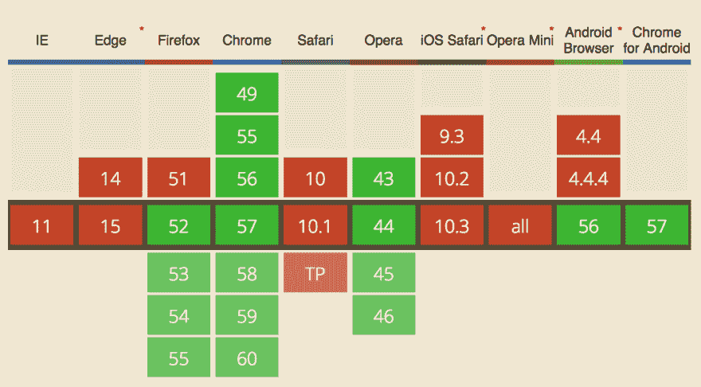

# 使用 requestIdleCallback 创建一个简单的无限滚动

> 原文:[https://dev . to/Ben/using-requestidlecallback-to-create-a-less-janky-infinite-scroll](https://dev.to/ben/using-requestidlecallback-to-create-a-less-janky-infinite-scroll)

我们最近从分页的 home feed 换成了无限滚动的。我们早就应该这么做了，因为这让坐在马桶上浏览主 [dev 到](https://dev.to/) feed 变得更加容易。这难道不是终极目标吗？

但是，当用户滚动页面而不中断帧速率时，向页面添加 30 个元素不会自动发生。我希望我们能尽一切努力确保一次没有恶作剧的经历。这就是我使用 [`requestIdleCallback`](https://developers.google.com/web/updates/2015/08/using-requestidlecallback) 的原因。

API 是一个新的 API，对浏览器的支持有限，但是它非常容易使用，并且支持我们想要达到的目标。当一帧结束时有空闲时间，或者当用户不活动时，API 将安排工作。无限滚动是这种行为的一个很好的用例。这是一种在滚动的同时需要重画浏览器的情况。

[T2】](https://res.cloudinary.com/practicaldev/image/fetch/s--rBVDBTsh--/c_limit%2Cf_auto%2Cfl_progressive%2Cq_auto%2Cw_880/https://thepracticaldev.s3.amazonaws.com/i/vsyq6t0vvamnig63zte3.png)

> 自己安排非必要的工作是非常困难的。不可能准确计算出还剩下多少帧时间，因为在`requestAnimationFrame`回调执行之后，还有样式计算、布局、绘制和其他浏览器内部需要运行。自制的解决方案无法解决这些问题。为了确保用户没有以某种方式进行交互，您还需要为每种交互事件(`scroll`、`touch`、`click`)附加监听器，即使您在功能上不需要它们，这样您就可以绝对确保用户没有进行交互。另一方面，浏览器确切地知道在一帧结束时有多少时间可用，以及用户是否正在交互，因此通过`requestIdleCallback`，我们获得了一个 API，允许我们以最有效的方式利用任何空闲时间。

大约三分之二的[开发者到](https://dev.to/)的访问者是通过支持`requestIdleCallback`的浏览器访问的，这个 API 吸引人的地方在于，很容易添加一个简单的浏览器支持检查，否则就退回到默认行为。

### 这里是我们无限卷轴的代码

```
 if (('requestIdleCallback' in window) && distanceFromBottom > 1400) {
    requestIdleCallback(function(){ appendPosts(newArticlesHTML) }, { timeout: 1500 });
  } else {
    appendPosts(newArticlesHTML);
  } 
```

### 这是怎么回事？

```
('requestIdleCallback' in window) 
```

这将询问 API 是否可用。

```
distanceFromBottom > 1400 
```

这是在问我们是否离底部还足够远，不需要等待。如果我们接近，我们将跳过`requestIdleCallback`部分。因此，如果用户滚动得非常快，他们会马上看到附加的帖子。

```
requestIdleCallback(function(){ appendPosts(newArticlesHTML) }, { timeout: 1500 }) 
```

这要求浏览器尽可能执行`requestIdleCallback`，但等待时间不要超过 1.5 秒。

```
else {
    appendPosts(newArticlesHTML);
  } 
```

如果不满足上述条件，我们就不理会`requestIdleCallback`。在这种情况下，只需调用函数就足够了。在其他情况下，我们可以想出自定义逻辑来引导类似于 requestIdleCallback 的结果。根据你的需要，有一些[聚合填料可用](https://github.com/search?utf8=%E2%9C%93&q=requestidlecallback+polyfill&type=)，但是你的里程数一定会随着这种 API 聚合填料而变化。我不会盲目地依赖这些。

## 最后的想法

这只是字面上的意思，所以我们可能会修改实现，或者意识到我们需要采取不同的方法。不过，我选择这个 API 的一个重要原因是，它易于实现，并且可以优雅地后退。我不需要进行重大的成本效益分析，因为实施成本非常低。如果我们需要采取一种不同的方法，我们不会用过于复杂的 API 出卖自己。

*编辑:关于前面提到的“上厕所”的言论，我给你发这条推文*😳

> beld🎩[@ beld _ pro](https://dev.to/beld_pro)[@ ThePracticalDev](https://twitter.com/ThePracticalDev)[@ bendhalpern](https://twitter.com/bendhalpern)顺便说一句，目前在厕所向下滚动 dev.to🤔所有关于计时2017 年 4 月 13 日下午 16:53[](https://twitter.com/intent/tweet?in_reply_to=852565413393297408)0[](https://twitter.com/intent/like?tweet_id=852565413393297408)0