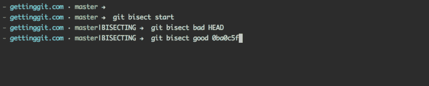
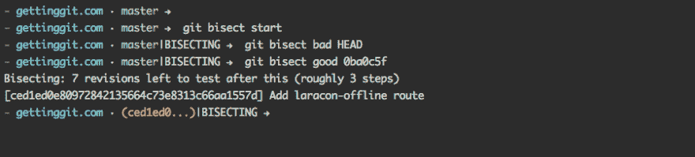
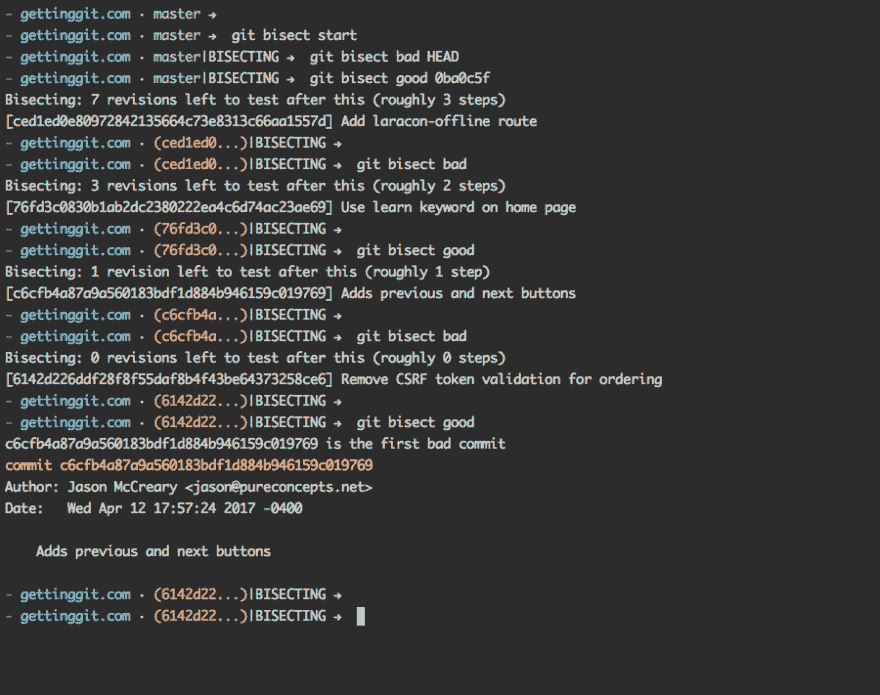

# 使用 git 二等分

> 原文：<https://dev.to/gonedark/using-git-bisect>

几周前，我在[拉拉康在线](https://laracon.net)做了一个题为*你不知道的饭桶*的演讲。在演讲中，我演示了几个不熟悉的 Git 命令。虽然我确实报道了`git bisect`，但我没有提供演示。

演示很有挑战性。它有几个子命令，需要关于代码的上下文。因此，一个人为的例子并不公正。

现在，我承认在我的 Git 生涯中只用过五六次`git bisect`。但是就在前几天，我用它发现了我的应用程序中的一个 bug。我想分享这个场景，作为使用`git bisect`的真实例子。

## 上下文

首先，一点背景。我相信你已经注意到了，我最近在 Git 上发布了一个名为 [Getting Git](https://gettinggit.com) 的视频系列。我使用[条纹收银台](https://stripe.com/docs/checkout/tutorial)处理支付。这使得事情变得非常简单，只需要我在页面上放置一段 JavaScript 代码。Stripe 注入必要的前端代码来创建弹出结账表单的支付按钮。

前几天，有人去结账，当他们点击支付按钮*时，什么也没发生*。幸运的是，他们报告了这一点，所以我开始调查。我在几个不同的浏览器中确认了这个错误。我伸出手去寻求支持。他们这边没有已知的问题。所以我把他们的结帐代码放到了一个新的页面上，它工作得很好。

我的代码中显然有漏洞。但是*在哪里*？查看提交日志，有一段时间没有任何与签出代码相关的内容。事实上，使用`git blame`表明结帐代码已经一个多月没有改变了。我知道这个 bug 并没有存在那么久。

虽然我可以自己继续这项调查工作并最终找到 bug，但我可以使用`git bisect`。

## 命令

基本上，在存在 bug 的地方向`git bisect`提供一个提交(T2 的坏的提交)，在不存在 bug 的地方提供一个提交(T4 的好的提交)。然后系统地遍历这个提交范围，找到引入 bug 的提交。在这个过程中，它会暂停一下，让您测试一下是否有 bug。如果 bug 存在，你输入报告提交为 *bad* 。如果不符合，则报告为*良好*。

我用`git bisect`找我结账 bug 的时候截图了几张。我将回顾一下使用`git bisect`的过程。

首先，我运行`git bisect start`来开始二分过程。

然后，我通过运行`git bisect bad`来提供*错误的*提交。在我的例子中，这是我代码中当前出现的 bug 的顶部提交。

然后，我通过运行`git bisect good`来提供*好的*提交。在我的例子中，我从`git blame`获得了这个提交，因为我知道结帐最初是有效的。找到*好的*提交可能需要一点侦查工作。然而，这不必是精确的。这就是`git bisect`的作用。通常，我会一次跳回几个提交，直到找到一个*好的*提交。

[T2】](https://res.cloudinary.com/practicaldev/image/fetch/s--WqExtcUg--/c_limit%2Cf_auto%2Cfl_progressive%2Cq_auto%2Cw_880/https://jason.pureconcepts.nimg/starting-git-bisect.png)

一旦我提供了两个提交，`git bisect`就开始在这个提交范围内移动。它暂停一下，让我测试当前提交中是否存在 bug。如果是，我输入`git bisect bad`。如果没有，我输入`git bisect good`。

[T2】](https://res.cloudinary.com/practicaldev/image/fetch/s--HnEsINwK--/c_limit%2Cf_auto%2Cfl_progressive%2Cq_auto%2Cw_880/https://jason.pureconcepts.nimg/testing-git-bisect.png)

几次迭代之后，`git bisect`输出第一个*错误的*提交。或者引入 bug 的提交。

[T2】](https://res.cloudinary.com/practicaldev/image/fetch/s--n1uNXwRv--/c_limit%2Cf_auto%2Cfl_progressive%2Cq_auto%2Cw_880/https://jason.pureconcepts.nimg/result-git-bisect.png)

老实说，最初几次我使用`git bisect`时，我不相信这是正确的提交。但是我向您保证，在这个提交中有一些引入了 bug 的更改。

在我的例子中，我添加了一些 JavaScript 来监听 *click* 事件。它阻止了默认行为，因此阻止了结帐表单的启动。

你不会经常使用这个命令。尽管如此，这是最有帮助和最令人印象深刻的 Git 命令之一。下次当你的代码中有 bug 时，不要试图在你的提交历史中寻找需求——使用`git bisect`。

***想看看`git bisect`在行动吗？**在我的视频系列[获取 Git](https://gettinggit.com) 中，我演示了`git bisect`和其他你每天都会用到的 Git 命令。*