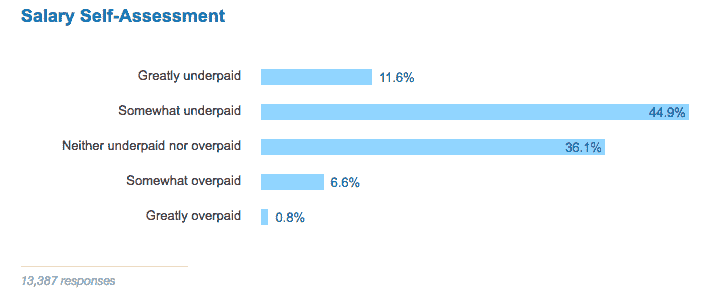
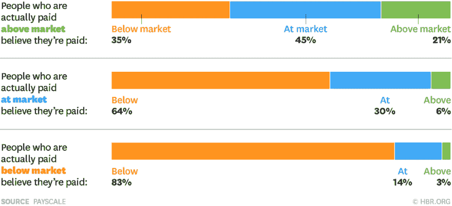
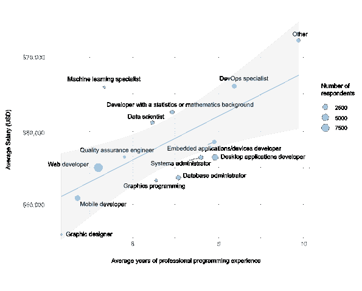
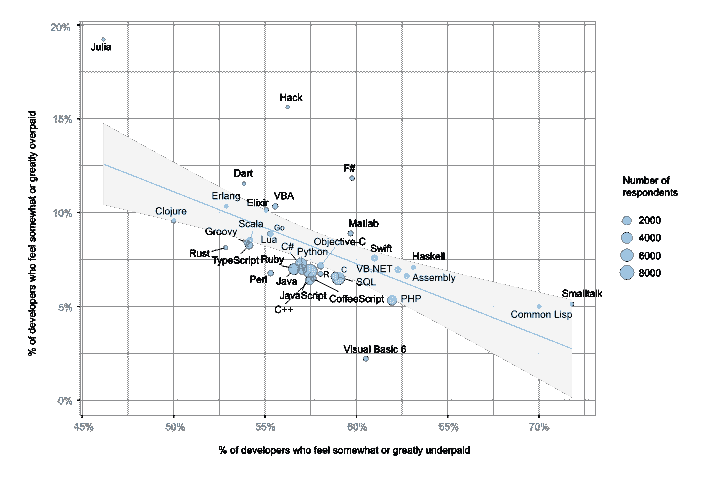
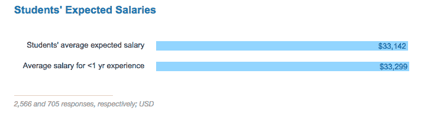

# 开发者工资低吗？根据最近的研究，他们中的许多人是这样认为的

> 原文:[https://dev . to/walker/are-developers-under-payed-they-many-think so-to-from-in-recent-research](https://dev.to/walker/are-developers-underpaid-many-of-them-think-so-according-to-recent-research)

在当今世界，编程通常被认为是获得更高收入职业的捷径。训练营和像 General Assembly 和 earning 这样的编码学校的快速发展很大程度上是基于这样一种想法，即几个月的密集学习可以显著增加你的收入潜力。几年前的夏天,《纽约时报》报道了这一现象:

> 如今，像他这样的故事越来越常见，因为各种职业的人——扑克玩家、簿记员、咖啡师——都在蓬勃发展的科技行业中摆脱过去，寻找未来。技术领域的资金正从投资者和企业家流向更广泛的数字劳动力，尤其是那些能够编写现代代码(数字世界的语言)的人。

那些已经以编码为生的人并不总是认为自己得到了合理的补偿。特别是， [Stack Overflow 的年度开发人员调查](https://stackoverflow.com/insights/survey/2017#salary)的大多数受访者都觉得他们的工资有些偏低或大大偏低:

[T2】](https://res.cloudinary.com/practicaldev/image/fetch/s--EtV9ZHwL--/c_limit%2Cf_auto%2Cfl_progressive%2Cq_auto%2Cw_880/https://cl.ly/0E033p1E313c/Screen%2520Shot%25202017-04-11%2520at%252011.46.45%2520AM.png)

当然，这种情绪并不仅限于开发人员——事实上，大多数人，不管是什么职业，都有这样的印象，即他们的薪酬过低，正如 Dev.to 在 Twitter 上关于这个主题的讨论中提到的那样:

> 邓肯@ cobi 00[@ ThePracticalDev](https://twitter.com/ThePracticalDev)你就需要对比一下了。我认为“大多数人觉得工资太低”永远是对的。2017 年 3 月 22 日下午 17:34016

薪酬软件公司 Payscale 在 2015 年的一项研究中证明[大多数员工认为他们的薪酬过低，即使他们的薪酬是市场水平:](https://hbr.org/2015/10/most-people-have-no-idea-whether-theyre-paid-fairly)

[T2】](https://res.cloudinary.com/practicaldev/image/fetch/s--nwGYdgDs--/c_limit%2Cf_auto%2Cfl_progressive%2Cq_auto%2Cw_880/https://hbr.org/resourcimg/article_assets/2016/03/F1512A_IWNA_TALKABOUTPAY-1024x468.png)

因此，职业经验中存在一些普遍趋势，这使得很难对第一张图表做出任何定论。幸运的是，Stack Overflow 在他们的分析中走得更深，所以我们可以试着理解开发人员的报酬，而不仅仅是他们自己对价值的估计。

正如你所料，经验和薪水是相互关联的:

[T2】](https://res.cloudinary.com/practicaldev/image/fetch/s--wB46UZdu--/c_limit%2Cf_auto%2Cfl_progressive%2Cq_auto%2Cw_880/https://cdn.sstatic.net/Research/Img/2017/SalaryAndExperienceByDeveloperType.svg%3Fv%3D067e77c92197)

但是不同的角色会比其他人更快地看到经验的回报。尽管平均只有几年的编程经验，但机器学习专家在所有类型的开发人员中薪酬最高。与此同时，那些制作桌面或嵌入式应用程序的人，更有可能有几年的经验，但收入却少了近 1 万美元。

语言也是影响开发人员对其薪酬的看法的一个因素。更新、更受欢迎的语言(如 Elixir、Rust 和 Clojure)的用户更经常报告报酬过高，而更成熟的语言(如 Visual Basic 和 PHP)的用户更经常报告报酬过低:

[T2】](https://res.cloudinary.com/practicaldev/image/fetch/s--WulpqyuK--/c_limit%2Cf_auto%2Cfl_progressive%2Cq_auto%2Cw_880/https://cdn.sstatic.net/Research/Img/2017/SalarySelfAssessmentByLanguage.svg%3Fv%3D0813065c47d6)

这里有一些看不见的因素可能有助于解释这些图表，包括按语言和角色划分的年龄和地理位置。但是总的来说，调查的这一部分表明，不仅许多开发人员感觉报酬过低，而且一旦你更深入地了解开发人员的日常工作，这种感觉也不完全一致。

那么我们的介绍性话题——新兵训练营的参与者呢？事实上，他们非常擅长预测自己毕业后的收入:

[T2】](https://res.cloudinary.com/practicaldev/image/fetch/s--nPPxAPfl--/c_limit%2Cf_auto%2Cfl_progressive%2Cq_auto%2Cw_880/https://cl.ly/0C1C1S1A150n/Screen%2520Shot%25202017-04-11%2520at%252012.44.26%2520PM.png)

显然，这是一个可以根据具体情况彻底改变的话题，所以如果你想让讨论继续下去，请在评论区留下你自己的个人想法或经历。