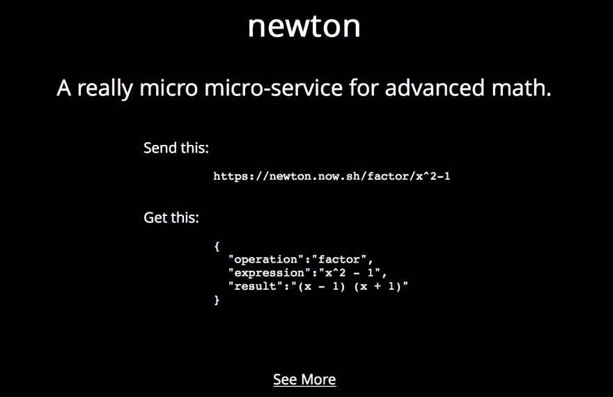
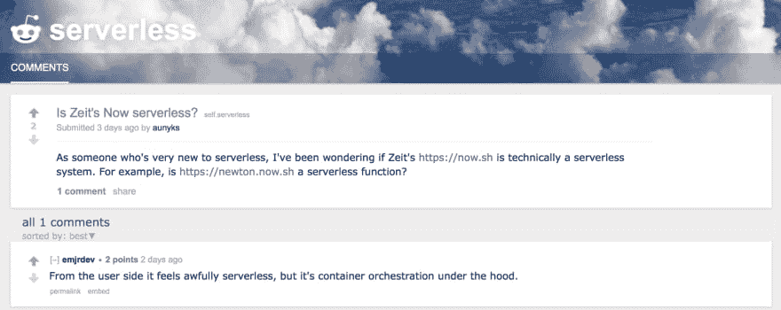

# 我是如何在不知情的情况下构建无服务器功能的，我想*

> 原文:[https://dev . to/aunyks/how-I-build-a-server less-function-without-known-it-I-think](https://dev.to/aunyks/how-i-built-a-serverless-function-without-knowing-it-i-think)

满满一周考试后的周末。我筋疲力尽，只等着高中毕业。但是，像任何其他开发人员一样，我有一种冲动，想继续开始另一个周末项目。我正在学习 AP 微积分中一些非常有趣的东西，但是我有时厌倦了在作业中做代数。我对自己说:*为什么不做一些能帮我做数学作业的东西呢？*

[T2】](https://res.cloudinary.com/practicaldev/image/fetch/s--ZtYgogX_--/c_limit%2Cf_auto%2Cfl_progressive%2Cq_66%2Cw_880/https://cdn-images-1.medium.com/max/1600/1%2A-70TkZq3o32UoAbYzpXwdA.gif)

这就是我想建立牛顿的想法，一个真正的数学微服务。我想让开发人员更容易做数学，而不受代码库大小或他们首选语言中不存在的 API 的约束。

[T2】](https://res.cloudinary.com/practicaldev/image/fetch/s--e1BG0i22--/c_limit%2Cf_auto%2Cfl_progressive%2Cq_auto%2Cw_880/https://cdn-images-1.medium.com/max/1600/1%2AT-e_QTO3qzrBBr004w55Yw.png)

那么是什么让它变得有趣呢？当然，除了超级酷和功能强大之外，Newton 除了源文件之外不需要任何存储空间。它不访问或修改数据库，甚至不动态创建配置文件或任何类似的东西。每个请求和响应都受到 [Zeit Now 的](https://now.sh/) HTTPS 加密的保护。另外，它只运行在简单的 GET 请求上。

我并不认为这些特征有多重要，但是在与技术社区进行了一些互动之后，我认为 Newton 是一个无服务器的功能。

> 向我解释“无服务器架构”,就像我是五岁小孩一样。[# dev discuse](https://twitter.com/hashtag/DevDiscuss?src=hash)
> 
> — The Practical Dev ([@thepracticaldev](https://dev.to/thepracticaldev) ) [April 5, 2017](https://twitter.com/ThePracticalDev/status/849427700192342018)

> [@ThePracticalDev](https://twitter.com/ThePracticalDev) 网络上非常小的机器；他们中的许多人同时工作。但是他们的大脑很小，他们不记得他们做了什么！
> 
> — Eric Elliott (@_ericelliott) [April 5, 2017](https://twitter.com/_ericelliott/status/849431273865084928)

埃里克·埃利奥特给出了一个出人意料但内容丰富的回答。牛顿符合这些特征。Zeit 目前将全球主机抽象化，以满足网络上的机器。Newton 是一个相对较小的包(~3.3kB)，所以它适合小大脑，就像我说的，它不访问或处理持久内存。对我来说好像没有服务器。

[T2】](https://res.cloudinary.com/practicaldev/image/fetch/s--WzDRarYc--/c_limit%2Cf_auto%2Cfl_progressive%2Cq_66%2Cw_880/https://cdn-images-1.medium.com/max/1600/1%2AcklQSFmsnnxoq6a4q2vJHw.gif)

还有别的吗？

> [@ThePracticalDev](https://twitter.com/ThePracticalDev) 把代码写成一堆函数，然后假装基础设施无关紧要。
> 
> — Elliot Blackburn ([@elliotblackburn](https://dev.to/elliotblackburn) ) [April 5, 2017](https://twitter.com/elliotblackburn/status/849559703520780288)

那就成交了。我现在使用，因为除了代码如何运行之外，我不用担心任何事情。牛顿做一件事:数学。

等等，数学是很多东西。

[T2】](https://res.cloudinary.com/practicaldev/image/fetch/s--pDbJKoVf--/c_limit%2Cf_auto%2Cfl_progressive%2Cq_66%2Cw_880/https://cdn-images-1.medium.com/max/1600/1%2AB5F6wHEB1ggA-teT8DhgsA.gif)

我们明白了。但是为了保险起见，我选择了[r/无服务器](https://www.reddit.com/r/serverless/)。

[T2】](https://res.cloudinary.com/practicaldev/image/fetch/s--BpwviKnl--/c_limit%2Cf_auto%2Cfl_progressive%2Cq_auto%2Cw_880/https://cdn-images-1.medium.com/max/1600/1%2ACTh4EJi0b8a_pBh1Nhnfxw.png)

呃，这个答案对我来说已经够好了。

[T2】](https://res.cloudinary.com/practicaldev/image/fetch/s--VWHKwoH_--/c_limit%2Cf_auto%2Cfl_progressive%2Cq_66%2Cw_880/https://cdn-images-1.medium.com/max/1600/1%2A5z9WhbaPEGmuwzvg1Ymb1g.gif)

所以，最后我做了一个小的无服务器功能作为周末项目，帮我做数学作业，帮别人做很酷的东西。牛顿已经变得比我最初预期的更受欢迎，我很想见证它的发展，看看其他人用它做了什么。

别忘了:我认为它是无服务器的。

[T2】](https://res.cloudinary.com/practicaldev/image/fetch/s--xC8nS10L--/c_limit%2Cf_auto%2Cfl_progressive%2Cq_66%2Cw_880/https://cdn-images-1.medium.com/max/1600/1%2AooNmdP20-7HGbe0-Lzbqfw.gif)

感谢阅读！一如既往，你很棒。

*有关无服务器架构的更多信息，请从[这里](https://aws.amazon.com/serverless/)开始。*