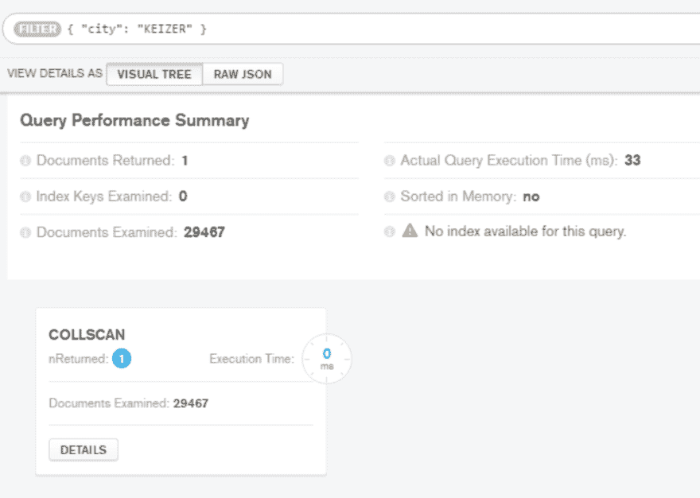
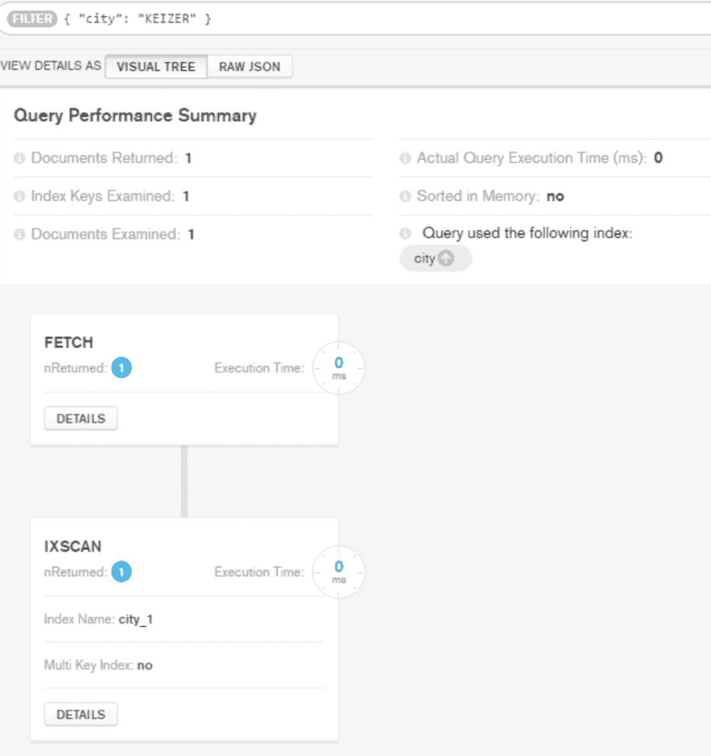

# MongoDB 中的索引

> 原文：<https://dev.to/kenwalger/indexing-in-mongodb>

有人问我，我在网上看到很多帖子和评论说 [MongoDB](http://www.mongodb.com) 在查询读取上没有人们认为的那么快。在这些问题和/或评论之后，通常会根据用户在这种情况下的体验对 MongoDB 本身进行一番审视。在这些情况下，我的第一个问题通常是“在与查询相关的集合上设置了什么索引？”我经常会被车灯照着的鹿回头看着我，结结巴巴地回答通常是“我不知道。”，“无论什么标准。”，或者最流行的“什么是指数？”。

在这篇博客文章中，我想简单介绍一下 MongoDB 中的[索引](https://docs.mongodb.com/manual/indexes/)以及它们如何极大地影响性能。什么是指数？如果我们从 MongoDB 提供的[定义](https://docs.mongodb.com/manual/indexes/)开始:

索引是特殊的数据结构，它以易于遍历的形式存储集合数据集的一小部分。我们从“易于遍历”的陈述中得到一个想法，即它们使复杂的事情变得更简单。在这种情况下，索引使得遍历集合更容易(更快)。

让我们考虑一个包含美国所有邮政编码的数据集。(zips.json 可以在[这里](http://jsonstudio.com/resources/)下载)。如果没有适当的索引，例如，如果我们的应用程序想要查找某个特定城市的邮政编码，比如俄勒冈州[凯泽](https://www.keizer.org/) (97303)，MongoDB 将不得不扫描整个集合来查找该城市，以返回适当的邮政编码。事实上，根据我们的数据集，它必须查看所有 29，467 条记录才能找到并返回一条记录。

为了找到我们的搜索词的正确匹配，需要在数据库中进行大量不必要的查找。想象一下，如果我们的数据集更大，包含一百万或更多的记录。那会有很多开销和搜索。如果我们看看在一个寻找我们的城市“KEIZER”的基本查询中发生了什么，让 MongoDB 解释我们的查询的执行统计，`db.zips.find({"city": "KEIZER"}).explain("executionStats")`，我们可以看到一些性能瓶颈。

[T2】](https://res.cloudinary.com/practicaldev/image/fetch/s--CquQ3gbv--/c_limit%2Cf_auto%2Cfl_progressive%2Cq_auto%2Cw_880/https://thepracticaldev.s3.amazonaws.com/i/9xzilb27mmy33rouzf2k.PNG)

首先，我们看到，即使在我们相对较小的数据库中，查询执行时间也是 34 毫秒，正如预期的那样，我们查看了所有 29，467 个文档，并且执行了集合扫描来执行该查询。再想象一下，扫描一个大得多的数据集会是一个多么缓慢的过程。

现在，如果我们添加一个索引会发生什么？因为我们在这种情况下是通过城市名称进行搜索，所以在该字段上创建一个索引是有意义的。这可以在 Mongo Shell 中用以下命令完成:

 `db.zips.createIndex({"city": 1})` 

这将在我们的集合中的 city 字段上创建一个升序索引。现在，如果我们像以前一样运行相同的查询，我们应该会看到一些东西。首先，我们的查询执行时间和检查的文档数量应该显著减少。

[T2】](https://res.cloudinary.com/practicaldev/image/fetch/s--DvH_dWEQ--/c_limit%2Cf_auto%2Cfl_progressive%2Cq_auto%2Cw_880/https://thepracticaldev.s3.amazonaws.com/i/5ajwc5gfku3bgta3lcpn.PNG)

哇，有了城市字段的索引，搜索一个城市，我们得到了一些惊人的改进。我们的实际查询执行时间从 34 毫秒减少到零，我们现在正在进行索引扫描( [IXSCAN](https://docs.mongodb.com/manual/reference/explain-results/) )而不是集合扫描(COLLSCAN)，检查的文档数量减少到只需检查一个文档。这是非常强大的，并强调了在您的集合上建立索引的必要性。

在向 MongoDB 用户解释了这一点之后，我经常会得到一个“为什么我不索引每个字段呢？”回应。天下没有免费的午餐，对吧？索引会带来开销，一些例子包括内存使用和数据的写入性能，因为必须根据存储的新数据更新索引。

我们也可以在多个字段上创建索引。例如，我们可能不仅要查询单个城市的数据库，还要查询城市和州的组合。在这种情况下，我们可能希望生成一个引用同一索引中多个字段的复合索引。在这个例子中，类似于`db.zips.createIndex({"city": 1, "state": 1})`的东西可能是有用的。

当决定创建一个索引时，通常需要考虑一些常见的事情。首先，创建支持查询的索引。如果您不打算查询基于人口的邮政编码集合(“pop”)，就没有必要为该字段生成索引。其次，如果您的查询正在进行排序操作，请确保您的索引以有效的方式支持这些操作。第三，确保您的查询允许 MongoDB 有选择地提供查询结果，并使用索引完成大部分工作。

索引是 MongoDB 应用程序设计的重要组成部分。拥有一个设计合理的索引可以对应用程序的性能产生巨大的积极影响。我强烈建议[在部署应用程序之前阅读更多关于它们的信息](https://docs.mongodb.com/manual/indexes/#index-types),以确保良好的最终用户体验。