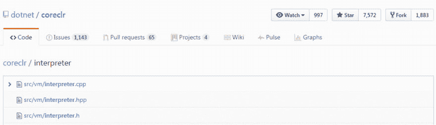

# 的。NET IL(字节码)解释程序

> 原文：<https://dev.to/mattwarren/the-net-il-bytecode-interpreter>

在写之前的博客文章时，我无意中发现了。NET 解释器，藏在源代码中。虽然，如果我做了哪怕是最小的努力去寻找它，我会很容易地通过[*GitHub‘魔法’文件搜索*](https://github.com/dotnet/coreclr/find/master) 找到它:

[T2】](https://res.cloudinary.com/practicaldev/image/fetch/s--xhd0I5bS--/c_limit%2Cf_auto%2Cfl_progressive%2Cq_auto%2Cw_880/http://mattwarren.oimg/2017/03/GitHub%2520file%2520search%2520for%2520%27Interpreter%27.png)

### 使用场景

在我们研究如何使用它和它做什么之前，有必要指出解释器并不是真正为生产代码设计的。据我所知，它的主要目的是让您在新的 CPU 架构上启动和运行 CLR。如果没有解释器，你将无法测试任何 C#代码，除非你有一个功能完整的 JIT 来为你发出机器码。例如，参见['【arm 32/Linux】特性解释器'](https://github.com/dotnet/coreclr/pull/8594)的初始调用和['【aarch 64】在 Linux 上启用解释器](https://github.com/dotnet/coreclr/commit/8c4e60054ddb42298f3eebaf20c970d665474ae3)。

此外，它没有几个关键功能，最值得注意的调试支持，即您不能通过已解释的 C#代码进行调试，尽管您当然可以调试解释器本身。从[‘分层编译步骤 1’](https://github.com/dotnet/coreclr/pull/10478):

> ....-解释器的状态不够好，无法按原样运行生产代码。如果您想让调试和分析工具正常工作(我们确实这样做了)，还有一些重要的问题。

你可以在[“解释器:volatile ldobj 似乎有不正确的语义？”中看到这样的例子](https://github.com/dotnet/coreclr/issues/34)(感谢 [alexrp](https://www.reddit.com/r/programming/comments/62hcde/the_c_interpreter/dfn3ycc/) 告诉我这个问题)。在代码中也有相当数量的`TODO` [注释，尽管我还没有验证是什么(如果有的话)特定的 C#代码由于缺少功能而中断。](https://gist.github.com/mattwarren/a7e567c3aacd1c85da86206ea729c66f)

然而，我认为另一个对解释器真正有用的场景是帮助你了解 CLR 的内部工作方式。它只有 8，000 行长，但都在一个文件中，最重要的是它是用 C++写的。CLR/JIT 在为 real 编译*时使用的代码在多个文件中(JIT 本身超过 200，000 L.O.C，分布在 100 个文件中),并且有大量手写在[原始汇编](https://github.com/dotnet/coreclr/tree/master/src/vm/amd64)中。*

理论上，解释器应该以与*完整*运行时相同的方式工作，尽管没有那么优化。这意味着这要简单得多，我们这些不是 CLR 和/或汇编专家的人也有机会搞清楚到底发生了什么！

## 启用解释器

默认情况下，解释器是禁用的，因此您必须从源代码中[构建 CoreCLR 以使其工作(它曾经是 ARM64](https://github.com/dotnet/coreclr/tree/master/Documentation#build-coreclr-from-source) 的[后备，但现在不再是这样了)，下面是您需要进行的更改的差异:](https://github.com/dotnet/coreclr/commit/8a47eafa69614589eb86bbdf0c2c36aa690c1b15)

```
--- a/src/inc/switches.h +++ b/src/inc/switches.h @@ -233,5 +233,8 @@
 #define FEATURE_STACK_SAMPLING
 #endif // defined (ALLOW_SXS_JIT)

+// Let's test the .NET Interpreter!!
+#define FEATURE_INTERPRETER
+
 #endif // !defined(CROSSGEN_COMPILE) 
```

您还需要启用一些环境变量，我在下表中使用了这些变量。如需完整列表，请查看[主机配置旋钮](https://github.com/dotnet/coreclr/blob/master/Documentation/project-docs/clr-configuration-knobs.md)并搜索“解释器”。

| 名字 | 描述 |
| --- | --- |
| **解读** | 选择性地使用解释器来执行指定的方法 |
| **解释器循环方法** | 如果设置了，不检查循环，从解释*所有*方法开始 |
| **解释者事后打印** | 将有关执行的摘要信息打印到控制台 |
| **转储解释器桶** | 打印所有创建到控制台的解释器存根 |
| **跟踪解释条目** | 将已解释方法的条目记录到控制台 |
| **TraceInterpreterIL** | 将解释方法的单个指令记录到控制台 |
| **tracediaterverbose** | 将解释器进度和详细消息记录到控制台 |
| **trace interpreter JIT transition** | 当解释器决定一个方法应该被 JIT 化时记录日志 |

为了测试解释器，我将使用下面的代码:

```
public static void Main(string[] args)
{
    var max = 1000 * 1000;
    if (args.Length > 0)
        int.TryParse(args[0], out max);
    var timer = Stopwatch.StartNew();
    for (int i = 1; i <= max; i++)
    {
        if (i % (1000 * 100) == 0)
            Console.WriteLine(string.Format("Completed {0,10:N0} iterations", i));
    }
    timer.Stop();
    Console.WriteLine(string.Format("Performed {0:N0} iterations, max);
    Console.WriteLine(string.Format("Took {0:N0} msecs", timer.ElapsedMilliseconds));
    Console.WriteLine();
} 
```

在我的机器上，它给出了下面的`100,000`迭代结果:

| 奔跑 | 已编译(毫秒) | 已解释(毫秒) |
| --- | --- | --- |
| one | Eleven | Four thousand three hundred and ninety-three |
| Two | Eleven | Four thousand and eighty-nine |
| three | nine | Four thousand four hundred and sixteen |

所以，是的，你不希望对任何性能敏感的代码使用解释器！！

### 诊断输出

此外，还会产生一个诊断输出。注意，这是来自循环的单次迭代，否则它会变得太冗长而难以阅读。

```
Generating interpretation stub (# 1 = 0x1, hash = 0x91b7d02e) for ConsoleApplication.Program:Main.
Skipping ConsoleApplication.Program:.cctor
Entering method #1 (= 0x1): ConsoleApplication.Program:Main(class).
 arguments:
         0:      class: 0x0000000002C50568 (System.String[]) [...]

START 1, ConsoleApplication.Program:Main(class)
     0: nop
   0x1: call
Skipping ConsoleApplication.Stopwatch:.cctor
Skipping DomainBoundILStubClass:IL_STUB_PInvoke
Skipping ConsoleApplication.Stopwatch:StartNew
Skipping ConsoleApplication.Stopwatch:.ctor
Skipping ConsoleApplication.Stopwatch:Reset
Skipping ConsoleApplication.Stopwatch:Start
Skipping ConsoleApplication.Stopwatch:GetTimestamp
  Returning to method ConsoleApplication.Program:Main(class), stub num 1.
   0x6: stloc.0
      loc0   :      class: 0x0000000002C50580 (ConsoleApplication.Stopwatch) [...]
      loc1   :        int: 0
      loc2   :       bool: false
   0x7: ldc.i4.1
   0x8: stloc.1
      loc0   :      class: 0x0000000002C50580 (ConsoleApplication.Stopwatch) [...]
      loc1   :        int: 1
      loc2   :       bool: false
   0x9: br.s
  0x27: ldloc.1
  0x28: ldc.i4.2
  0x29: clt
  0x2b: stloc.2
      loc0   :      class: 0x0000000002C50580 (ConsoleApplication.Stopwatch) [...]
      loc1   :        int: 1
      loc2   :       bool: true
  0x2c: ldloc.2
  0x2d: brtrue.s
   0xb: nop
   0xc: ldstr
  0x11: ldloc.1
  0x12: box
  0x17: call
  Returning to method ConsoleApplication.Program:Main(class), stub num 1.
  0x1c: call
Completed          1 iterations
  Returning to method ConsoleApplication.Program:Main(class), stub num 1.
  0x21: nop
  0x22: nop
  0x23: ldloc.1
  0x24: ldc.i4.1
  0x25: add
  0x26: stloc.1
      loc0   :      class: 0x0000000002C50580 (ConsoleApplication.Stopwatch) [...]
      loc1   :        int: 2
      loc2   :       bool: true
  0x27: ldloc.1
  0x28: ldc.i4.2
  0x29: clt
  0x2b: stloc.2
      loc0   :      class: 0x0000000002C50580 (ConsoleApplication.Stopwatch) [...]
      loc1   :        int: 2
      loc2   :       bool: false
  0x2c: ldloc.2
  0x2d: brtrue.s
  0x2f: ldloc.0
  0x30: callvirt
Skipping ConsoleApplication.Stopwatch:Stop
  Returning to method ConsoleApplication.Program:Main(class), stub num 1.
  0x35: nop
  0x36: ldstr
  0x3b: ldloc.0
  0x3c: callvirt
Skipping ConsoleApplication.Stopwatch:get_ElapsedMilliseconds
Skipping ConsoleApplication.Stopwatch:GetElapsedDateTimeTicks
Skipping ConsoleApplication.Stopwatch:GetRawElapsedTicks
  Returning to method ConsoleApplication.Program:Main(class), stub num 1.
  0x41: box
  0x46: call
  Returning to method ConsoleApplication.Program:Main(class), stub num 1.
  0x4b: call
Took 33 msecs
  Returning to method ConsoleApplication.Program:Main(class), stub num 1.
  0x50: nop
  0x51: ret 
```

因此，您可以清楚地看到解释器在运行，执行单独的 IL 指令，并显示任何局部变量的当前值。然后，一旦整个程序运行完毕，您还会得到一些很好的汇总统计数据(这次是完整运行，有`100,000`次迭代):

```
IL instruction profiling:

Instructions (24000085 total, 20000083 1-byte):
Instruction  |   execs   |       % |   cum %
-------------------------------------------
     ldloc.1 |   3000011 |  12.50% |  12.50%
         ceq |   3000001 |  12.50% |  25.00%
    ldc.i4.0 |   3000001 |  12.50% |  37.50%
         nop |   2000013 |   8.33% |  45.83%
     stloc.2 |   2000001 |   8.33% |  54.17%
      ldc.i4 |   2000001 |   8.33% |  62.50%
    brtrue.s |   2000001 |   8.33% |  70.83%
     ldloc.2 |   2000001 |   8.33% |  79.17%
    ldc.i4.1 |   1000001 |   4.17% |  83.33%
         cgt |   1000001 |   4.17% |  87.50%
     stloc.1 |   1000001 |   4.17% |  91.67%
         rem |   1000000 |   4.17% |  95.83%
         add |   1000000 |   4.17% | 100.00%
        call |        23 |   0.00% | 100.00%
       ldstr |        11 |   0.00% | 100.00%
         box |        11 |   0.00% | 100.00%
     ldloc.0 |         2 |   0.00% | 100.00%
    callvirt |         2 |   0.00% | 100.00%
        br.s |         1 |   0.00% | 100.00%
     stloc.0 |         1 |   0.00% | 100.00%
         ret |         1 |   0.00% | 100.00% 
```

* * *

## 解释器代码的主要章节

现在我们已经看到了它的运行，让我们看看解释器中的代码，看看**它是如何工作的**

### 顶层调度员

解释器的核心是一个[巨型开关语句](https://github.com/dotnet/coreclr/blob/48e244855c98c6f280c986d0981238f403a49ff3/src/vm/interpreter.cpp#L2073-L3261)(在`Interpreter::ExecuteMethod(..)`)，差不多有 1200 行长！在里面你会发现*许多*这样的代码:

```
switch (*m_ILCodePtr)
{
case CEE_NOP:
    m_ILCodePtr++;
    continue;
case CEE_BREAK:     // TODO: interact with the debugger?
    m_ILCodePtr++;
    continue;
case CEE_LDARG_0:
    LdArg(0);
    break;
case CEE_LDARG_1:
    LdArg(1);
    break;
    ...
} 
```

总共有 199 条`case`语句，对应于所有可用的 CLR [中间语言(IL)操作码](https://en.wikipedia.org/wiki/List_of_CIL_instructions)，以所有不同的组合，例如`CEE_LDC_??`，即`CEE_LDC_I4`、`CEE_LDC_I8`、`CEE_LDC_R4`和`CEE_LDC_R8`。大多数的`case`语句只是调用另一个做实际工作的函数，尽管也有一些例外，比如`CEE_RET`[。](https://github.com/dotnet/coreclr/blob/48e244855c98c6f280c986d0981238f403a49ff3/src/vm/interpreter.cpp#L2268-L2391)

### 方法调用

另一个在解释器中占用大量代码的任务是处理方法调用，总共超过 2500 个 L.O.C！这分散在几种方法中，每种方法完成工作的一个特定部分:

*   [void 解释器::DoCallWork(..)](https://github.com/dotnet/coreclr/blob/48e244855c98c6f280c986d0981238f403a49ff3/src/vm/interpreter.cpp#L8965-L10027)
    *   `CALL` [调用由传递的方法描述符](https://msdn.microsoft.com/en-us/library/system.reflection.emit.opcodes.call%28v=vs.110%29.aspx?f=255&MSPPError=-2147217396)指示的方法
    *   `CALLVIRT` [调用对象的后期绑定方法，将返回值推送到计算堆栈上。](https://msdn.microsoft.com/en-us/library/system.reflection.emit.opcodes.callvirt%28v=vs.110%29.aspx?f=255&MSPPError=-2147217396)
    *   同样通过`Interpreter::NewObj()`，即`NEWOBJ` IL 操作码
*   [void 解释器::CallI()](https://github.com/dotnet/coreclr/blob/48e244855c98c6f280c986d0981238f403a49ff3/src/vm/interpreter.cpp#L10032-L10427)
    *   `CALLI` [使用调用约定](https://msdn.microsoft.com/en-us/library/system.reflection.emit.opcodes.calli%28v=vs.110%29.aspx?f=255&MSPPError=-2147217396)描述的参数调用评估堆栈上指示的方法(作为指向入口点的指针)
*   [CorJitResult 解释器::GenerateInterpreterStub(..)](https://github.com/dotnet/coreclr/blob/48e244855c98c6f280c986d0981238f403a49ff3/src/vm/interpreter.cpp#L660-L1600)
    *   外部入口点，即 [JIT 向这个方法](https://github.com/dotnet/coreclr/blob/1c4fda612e8a4f0d48346c477d058fa3fddf514e/src/vm/jitinterface.cpp#L11969-L12012)插入一个存根
    *   也可通过`Interpreter::InterpretMethodBody(..)`调用
    *   居然发出**汇编代码**！！
*   [void InterpreterMethodInfo::InitArgInfo(..)](https://github.com/dotnet/coreclr/blob/48e244855c98c6f280c986d0981238f403a49ff3/src/vm/interpreter.cpp#L195-L424)
    *   通过`Interpreter::GenerateInterpreterStub(..)`调用

总之，这项工作包括[动态生成存根](https://github.com/dotnet/coreclr/blob/master/Documentation/botr/virtual-stub-dispatch.md)并确保方法参数在正确的寄存器中(因此是汇编代码)。它处理虚拟方法、静态和实例调用、委托、内部函数，可能还有一些其他场景！此外，如果被调用的方法需要被解释，它也必须确保发生这种情况。

### 创建对象和数组

解释器需要处理运行时的一些关键功能，即创建和初始化对象。为此，它必须在最终调用构造函数之前调用 GC:

*   [void 解释器::NewObj()](https://github.com/dotnet/coreclr/blob/48e244855c98c6f280c986d0981238f403a49ff3/src/vm/interpreter.cpp#L5833-L6012)
    *   `NEWOBJ` [创建一个新的对象或值类型的新实例，将一个对象引用(类型 O)推送到评估堆栈上](https://msdn.microsoft.com/en-us/library/system.reflection.emit.opcodes.newobj%28v=vs.110%29.aspx?f=255&MSPPError=-2147217396)
*   [void 解释器::NewArr()](https://github.com/dotnet/coreclr/blob/48e244855c98c6f280c986d0981238f403a49ff3/src/vm/interpreter.cpp#L6015-L6085)
    *   `NEWARR` [将对一个新的从零开始的一维数组的对象引用推送到计算堆栈上](https://msdn.microsoft.com/en-us/library/system.reflection.emit.opcodes.newarr%28v=vs.110%29.aspx?f=255&MSPPError=-2147217396)
*   [void 解释器::InitObj()](https://github.com/dotnet/coreclr/blob/48e244855c98c6f280c986d0981238f403a49ff3/src/vm/interpreter.cpp#L5761-L5811)
    *   `INITOBJ` [将指定地址的值类型的每个字段初始化为空引用或适当基元类型的 0](https://msdn.microsoft.com/en-us/library/system.reflection.emit.opcodes.initobj%28v=vs.110%29.aspx?f=255&MSPPError=-2147217396)

### 装箱和拆箱

另一大块代码专门用于装箱/拆箱，即在需要时将“值类型”(`structs`)转换成`object`引用。的。NET IL 提供了特定的操作码来处理这种情况:

*   [void 解释器::Box()](https://github.com/dotnet/coreclr/blob/48e244855c98c6f280c986d0981238f403a49ff3/src/vm/interpreter.cpp#L8497-L8562)
    *   `BOX` [将值类型转换为对象引用(O 型)](https://msdn.microsoft.com/en-us/library/system.reflection.emit.opcodes.box%28v=vs.110%29.aspx?f=255&MSPPError=-2147217396)
*   [void 解释器::Unbox()](https://github.com/dotnet/coreclr/blob/48e244855c98c6f280c986d0981238f403a49ff3/src/vm/interpreter.cpp#L8602-L8693)
    *   `UNBOX` [将值类型的装箱表示转换为其未装箱形式](https://msdn.microsoft.com/en-us/library/system.reflection.emit.opcodes.unbox%28v=vs.110%29.aspx?f=255&MSPPError=-2147217396)
*   [void 解释器::UnboxAny()](https://github.com/dotnet/coreclr/blob/48e244855c98c6f280c986d0981238f403a49ff3/src/vm/interpreter.cpp#L8747-L8871)
    *   `UNBOX_ANY` [将指令中指定类型的装箱表示转换为其未装箱形式](https://msdn.microsoft.com/en-us/library/system.reflection.emit.opcodes.unbox_any%28v=vs.110%29.aspx?f=255&MSPPError=-2147217396)

### 加载和存储数据

也就是说，读取/写入对象中的字段或数组中的元素:

*   [void 解释器::StFld()](https://github.com/dotnet/coreclr/blob/48e244855c98c6f280c986d0981238f403a49ff3/src/vm/interpreter.cpp#L7533-L7690)
    *   `STFLD` [用新值](https://msdn.microsoft.com/en-us/library/system.reflection.emit.opcodes.stfld(v=vs.110).aspx)替换对象引用或指针字段中存储的值
*   [void 解释器::StElem()](https://github.com/dotnet/coreclr/blob/48e244855c98c6f280c986d0981238f403a49ff3/src/vm/interpreter.cpp#L8246-L8385)
    *   `STELEM` [用评估堆栈上的值替换给定索引处的数组元素，其类型在指令](https://msdn.microsoft.com/en-us/library/system.reflection.emit.opcodes.stelem(v=vs.110).aspx)中指定
*   [void 解释器::LdFld(FieldDesc* fldIn)](https://github.com/dotnet/coreclr/blob/48e244855c98c6f280c986d0981238f403a49ff3/src/vm/interpreter.cpp#L7248-L7477)
    *   `LDFLD` [查找对象中某个字段的值，该字段的引用当前在评估堆栈中](https://msdn.microsoft.com/en-us/library/system.reflection.emit.opcodes.ldfld(v=vs.110).aspx)
*   [void 解释器::LdElem()](https://github.com/dotnet/coreclr/blob/48e244855c98c6f280c986d0981238f403a49ff3/src/vm/interpreter.cpp#L8120-L8243)
    *   `LDELEM` [按照指令](https://msdn.microsoft.com/en-us/library/system.reflection.emit.opcodes.ldelem(v=vs.110).aspx)中指定的类型，将指定数组索引处的元素加载到计算堆栈的顶部

### 其他特定的 IL Op 代码

还有大量代码(超过 1000 行)只处理低级操作，即“比较”、“分支”和“基本算术”:

*   INT32 解释器::比较器(..)
    *   `CEQ`，`CGT`，`CGT_UN`，`CLT` & `CLT_UN`通过[解释器调用::CompareOp()](https://github.com/dotnet/coreclr/blob/48e244855c98c6f280c986d0981238f403a49ff3/src/vm/interpreter.cpp#L6694-L6710)
    *   `BEQ`，`BGE`，`BGT`，`BLE`，`BLT`，`BNE_UN`，`BGE_UN`，`BGT_UN`，`BLE_UN`，`BLT_UN`通过[解释器调用::BrOnComparison()](https://github.com/dotnet/coreclr/blob/48e244855c98c6f280c986d0981238f403a49ff3/src/vm/interpreter.cpp#L7199-L7245)
*   [void 解释器::BinaryArithOp()](https://github.com/dotnet/coreclr/blob/48e244855c98c6f280c986d0981238f403a49ff3/src/vm/interpreter.cpp#L4353-L4608)
    *   `ADD`、`SUB`、`MUL`、`DIV`和`REM`
    *   进而调用[解释器::BinaryArithOpWork(..)](https://github.com/dotnet/coreclr/blob/48e244855c98c6f280c986d0981238f403a49ff3/src/vm/interpreter.hpp#L266-L313)
*   [void 解释器::BinaryArithOvfOp()](https://github.com/dotnet/coreclr/blob/48e244855c98c6f280c986d0981238f403a49ff3/src/vm/interpreter.cpp#L4612-L4823)
    *   `ADD_OVF`、`ADD_OVF_UN`、`MUL_OVF`、`MUL_OVF_UN`、`SUB_OVF`、`SUB_OVF_UN`
    *   依次调用[解释器::BinaryArithOvfOpWork(..)](https://github.com/dotnet/coreclr/blob/48e244855c98c6f280c986d0981238f403a49ff3/src/vm/interpreter.cpp#L4825-L4866)

### 使用垃圾收集器(GC)

此外，解释器必须向 GC 提供它需要的信息。当 GC 调用[解释器::GCScanRoots(..)](https://github.com/dotnet/coreclr/blob/48e244855c98c6f280c986d0981238f403a49ff3/src/vm/interpreter.cpp#L3667-L3762)，附加工作谈话地点在[解释器::GCScanRootAtLoc(..)](https://github.com/dotnet/coreclr/blob/48e244855c98c6f280c986d0981238f403a49ff3/src/vm/interpreter.cpp#L3765-L3795)。很简单，解释器必须让 GC 知道任何当前“活动”的“根”对象。这包括静态变量和当前正在执行的函数中的任何局部变量。

当解释器定位到“根”对象时，它通过回调(`pf(..)`)通知 GC:

```
void Interpreter::GCScanRootAtLoc(Object** loc, InterpreterType it, promote_func* pf, ScanContext* sc, bool pinningRef)
{
    switch (it.ToCorInfoType())
    {
    case CORINFO_TYPE_CLASS:
    case CORINFO_TYPE_STRING:
        {
            DWORD flags = 0;
            if (pinningRef) flags |= GC_CALL_PINNED;
            (*pf)(loc, sc, flags);
        }
        break;
    ....
    }
} 
```

## 与虚拟机的集成

最后，虽然解释器是相当独立的，但有时它需要与运行时的其他部分一起工作

*   运行时负责[启动](https://github.com/dotnet/coreclr/blob/1c4fda612e8a4f0d48346c477d058fa3fddf514e/src/vm/ceemain.cpp#L816-L818)和[停止](https://github.com/dotnet/coreclr/blob/1c4fda612e8a4f0d48346c477d058fa3fddf514e/src/vm/ceemain.cpp#L1824-L1826)解释器
*   JIT [连接解释器存根](https://github.com/dotnet/coreclr/blob/1c4fda612e8a4f0d48346c477d058fa3fddf514e/src/vm/jitinterface.cpp#L11969-L12012)或者在 JIT 编译失败时使用它们作为后备。此外，当调用 JIT 本身和当[执行“前存根”时](https://github.com/dotnet/coreclr/blob/1c4fda612e8a4f0d48346c477d058fa3fddf514e/src/vm/prestub.cpp#L1146-L1633)，JIT“前存根”允许解释的方法
*   堆栈遍历[通过利用](https://github.com/dotnet/coreclr/blob/master/src/vm/stackwalk.cpp#L80-L158)[解释器帧数据结构](https://github.com/dotnet/coreclr/blob/1c4fda612e8a4f0d48346c477d058fa3fddf514e/src/vm/frames.cpp#L1030-L1049)来考虑解释器帧
*   当查找给定代码地址的`MethodDesc`时，[解释器存根被计入](https://github.com/dotnet/coreclr/blob/1c4fda612e8a4f0d48346c477d058fa3fddf514e/src/vm/methodtable.cpp#L7524-L7535)

* * *

帖子[’了。NET IL(字节码)解释器' T1 '首先出现在我的博客上【mattwarren.org T2】](http://mattwarren.org/2017/03/30/The-.NET-IL-Interpreter/)