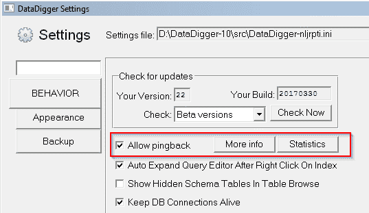

# Pingback

> 原文:[https://dev.to/patricktingen/pingback-65k](https://dev.to/patricktingen/pingback-65k)

从 DataDigger 版本 23 开始，DataDigger 将“打电话回家”。这样做是为了跟踪使用 DataDigger 的人数。

因为我对打电话回家的申请有些过敏，所以我想在这件事上尽可能保持透明。这就是为什么我选择使用一种允许您选择退出并自己查看收集的统计数据的方法

## 它是如何工作的？

每天当你第一次启动 DataDigger 时，它会检查新的更新。在同一次运行中，它还将调用 goo.gl 上的一个 URL(URL 的简称)。goo.gl 链接会把你带到 GitHub 上 build.i 的原始版本。这样做是因为该文件非常小(8 字节),所以不会减慢启动速度。

## 收藏的是什么？

最好的答案是自己去看。打开设置屏幕，转到“行为”选项卡，然后按“统计”按钮。然后你会在[这一页](https://goo.gl/24deK3+)结束

[T2】](https://res.cloudinary.com/practicaldev/image/fetch/s--iCXuBlwa--/c_limit%2Cf_auto%2Cfl_progressive%2Cq_auto%2Cw_880/https://datadigger.files.wordpress.com/2017/04/5h61xai.png%3Fw%3D840)

如果您不想参与，只需取消勾选复选框，您的数据将不会被收集。如果你不相信我，检查来源。位于 [wDataDigger.w](https://github.com/patrickTingen/DataDigger/blob/master/wDataDigger.w) ，搜索“PINGBACK”