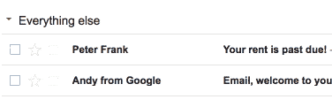
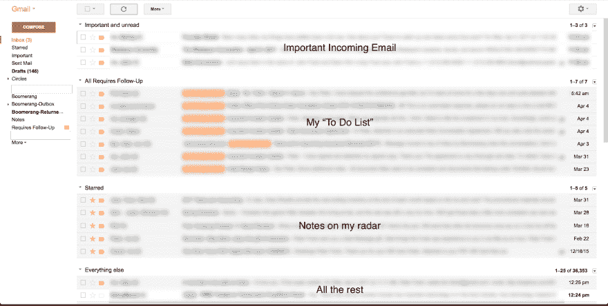

# 程序员也应该擅长电子邮件。这是我的 Gmail 游戏升级指南。

> 原文：<https://dev.to/peter/programmers-should-be-good-at-email-too-here-is-my-guide-to-leveling-up-your-gmail-game>

我共事的一些开发人员非常不擅长电子邮件。我明白，他们很忙，而且他们往往比其他人有更长的约束，因为他们的技能非常重要。还有一个公认的刻板印象，让他们不要优先处理电子邮件。而懈怠等人。艾尔。虽然电子邮件的重要性有所降低，但毫无疑问，它仍然是商务交流的重要工具，所以养成良好的习惯对职业发展至关重要。

我一天中的大部分时间都在发送和回复信息，我为自己拥有一个帮助我保持组织性和高效性的好系统而自豪。我希望这些建议能帮助你重新获得一些电子邮件的理智。

## 1)打开优先收件箱

进入你的 Gmail [收件箱设置](https://mail.google.com/mail/#settings/inbox)，将你的“收件箱类型”从**默认**改为**优先**。这样做可以摆脱那些如今默认的愚蠢标签，取而代之的是用多个“文件夹”来构建你的收件箱，你可以一眼就能看到。

想一想:在工作中使用多台显示器不是很有帮助吗？或者在文本编辑器旁边打开命令行？在同样的逻辑下，拆分收件箱的视图可以让你在同一个屏幕上看到不同的邮件“桶”。

**优先收件箱**[也会随着时间的推移了解哪些电子邮件是重要的](https://support.google.com/mail/answer/186543)，这有助于你立即识别对你最重要的电子邮件。老实说，它做得相当不错，但你仍然应该通过标记/取消标记电子邮件来帮助训练它的理解能力，尤其是在早期。

[T2】](https://res.cloudinary.com/practicaldev/image/fetch/s--kmCwohxl--/c_limit%2Cf_auto%2Cfl_progressive%2Cq_66%2Cw_880/https://d3uepj124s5rcx.cloudfront.net/items/3z1U300X1F0M2u2s2s3Z/Screen%2520Recording%25202017-04-05%2520at%252011.31%2520AM.gif)

## 2)定义你的收件箱结构

我建议设置四个不同的收件箱:

*   重要且未读
*   需要跟进
*   担任主角的
*   其他一切

**重要的和未读的**:这是你的标准“接收”收件箱。这是大多数电子邮件将到达的地方；在你做这些改进之前，把它想象成你的旧收件箱。我认为 Gmail 倾向于将电子邮件看得过于重要，这肯定是有道理的，因为我宁愿看到太多的电子邮件，也不愿错过一条重要的信息。

**需要跟进**:这个收件箱储存了你需要回复的邮件。每当你有一封需要回复的重要邮件时，只需**给邮件加上这个标签**。把它想象成你的电子邮件“待办事项清单”这个文件夹应该放满真正需要回复的邮件，而不仅仅是那些你想保持警惕的邮件。那些应该属于...

标有星号的:标有星号的信息应该是你想关注的笔记，但不需要明确的回复。这些可以是像门票确认，运动队的开始时间表，你想要的方便的推荐，你现在不需要但最终想结帐的东西，等等。

**其他一切**:这是你做其他一切事情的退路；无论是一封已经阅读过、回复过、处理过的邮件，还是一开始就不重要的事情。您也可以将这个区域视为您的“存档”，即使您不会明确地使用这个内置函数。虽然合法重要的电子邮件最初可能会出现在这里，但这种情况非常罕见——尤其是如果你在早期勤于手动将事情标记为重要/不重要。就我现在的系统而言，我真的不记得上一次因为邮件错误地落在这里而错过邮件是什么时候了。

您将会看到一个如下所示的收件箱:

[T2】](https://res.cloudinary.com/practicaldev/image/fetch/s--CBY13QrO--/c_limit%2Cf_auto%2Cfl_progressive%2Cq_auto%2Cw_880/https://thepracticaldev.s3.amazonaws.com/i/l8jtk83l5qonlmcnm103.png)

## 3)批量选择>滤镜清除垃圾

现在你已经设置好了你的“其他一切”文件夹，让我们进一步清理它。如果你像我一样，你可能会收到一大堆你根本不在乎的邮件，但你一直懒得退订或处理这些邮件。你也可能想继续收到这些电子邮件，因为偶尔会有优惠券或交易，或者你想偶尔对特定术语进行搜索。对于这样的电子邮件，我有一个系统可以帮助我把它们放在一边，同时仍然把它们放在我的收件箱里。

只需选择符合您标准的每封邮件，并创建一个过滤器进行存档，标记为已读，从不标记为重要。

[T2】](https://res.cloudinary.com/practicaldev/image/fetch/s--CagKCJ9y--/c_limit%2Cf_auto%2Cfl_progressive%2Cq_66%2Cw_880/https://thepracticaldev.s3.amazonaws.com/i/sdewlp88c9gpodgztq45.gif)

这个过滤器将确保你仍然拥有所有这些电子邮件，但他们远离你的方式。

## 4)回旋镖消息用于以后

我有时会收到一封既不符合“需要跟进”也不符合“已标星”的短信这是我不想忘记的事情，但这不是我现在想处理的事情。在这些情况下，我使用了一个很棒的 Chrome 扩展，叫做 [Boomerang](http://www.boomeranggmail.com/) 。Boomerang 有几个功能，但我只用一个:**稍后把这个放回我的收件箱**。

这个简单的功能是一个非常强大的工具，可以帮助你保持有条理，同时避免在日历/计划中写东西，或者把事情放在你的大脑缓存中。

我倾向于“自食其果”的事情，比如:

*   试用到期通知(提醒自己在续订前取消订阅)
*   提醒某人晚些时候会在镇上(我会在他们来访前一两周联系他们，这样我们可以安排时间)
*   我应该跟进的记录(我给某人发了电子邮件，但他们没有回复，所以一周后邮件会重新出现)
*   我目前被阻止的事情(我现在没有足够的信息，但我很快就会知道)
*   我想在特定日期回顾的东西(在活动开始前一个小时，与会者的名单会重新出现)
*   等等。

一旦你把 Boomerang 整合到你的电子邮件工作流程中，你会想没有它你怎么生活。

## (奖金提示)搜索运算符

我要分享的最后一个技巧是关于在你的收件箱中查找邮件的。很多人没有意识到 Gmail 的搜索功能非常强大，尤其是当你使用搜索操作符和通配符的时候。我发现自己在利用这些类型的查询:

*   发件人:我关键字 1
*   to:*@domain.com 阴性关键字
*   has:附件关键字 3
*   年龄大于:3m("年龄大于 3 个月")
*   newer_than:5d("最近 5 天内到达")

## 结论

当然，这个系统并不是处理 Gmail 收件箱的唯一“正确”方法。但它对我来说工作得很好，我认为这是一个可维护的过程，有利于额外的改进。希望你能够实施这些建议来帮助你的电子邮件游戏。

如果您有其他 Gmail 提示，请发表评论！