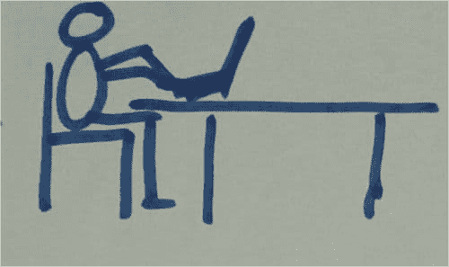
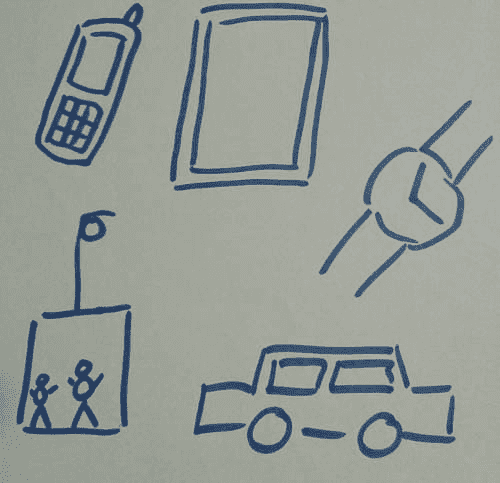
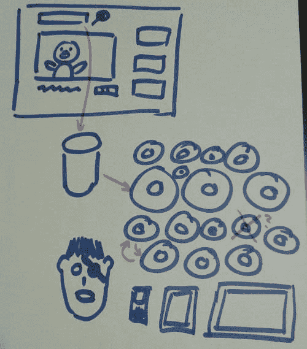
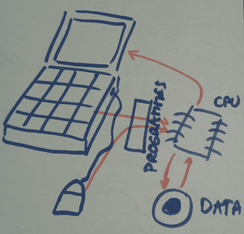
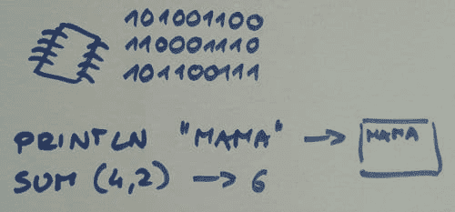

# 向 6 岁的孩子解释编程

> 原文:[https://dev . to/tkaczanowski/向 6 岁的孩子解释编程](https://dev.to/tkaczanowski/explaining-programming-to-6-years-old-kids)

任务:**向一群 6 岁的孩子解释你在工作中做什么。**

级别:高(我自己的女儿也在孩子当中)。

[T2】](https://res.cloudinary.com/practicaldev/image/fetch/s--u3D6D-Tl--/c_limit%2Cf_auto%2Cfl_progressive%2Cq_auto%2Cw_880/http://tomek.kaczanowscy.pl/wp-content/uploads/2016/05/challenge_accepted.png)

许多人分享了他们对这种“讲座”的想法——你可以找到一些关于堆栈溢出的非常有趣的例子(例如[这里](http://stackoverflow.com/questions/2455786/career-day-in-kindergarten-how-to-demonstrate-programming-in-20-minutes))。他们中的许多人都是基于展示**电脑是多么愚蠢**的想法，你需要非常精确地告诉他们做什么和如何做才能成功。乐趣是有保证的，但我严重怀疑之后的孩子们是否了解编程。

我对成功演示的想法是:

*   通过提问和绘画让他们参与进来。原图很大(挂图),我是边讲边画的——顺便说一句，这是吸引年轻观众的好方法(他们嘲笑程序员稻草人或指出粉红猪小妹长得不像这样，等等)。我没有原图(忘记拍照了)，但我又画了一遍，所以你明白了。

*   **利用他们已经知道的东西** (YouTube、笔记本电脑、平板电脑、DVD)。如今，每个孩子都在 YouTube 上看卡通，在平板电脑上玩游戏，观察妈妈或爸爸在笔记本电脑上工作。他们还知道电影保存在 CD/DVD 上，智能手机和平板电脑非常相似(当涉及到游戏和电影时)。

我从最基本的问题开始， ***“谁知道程序员是做什么的？”*** 我知道他们昨天对此进行了一些讨论，所以我对他们有所想法并不感到惊讶。我给了他们我自己的定义:*“程序员是写计算机程序的人，他知道用来告诉计算机应该做什么的语言。一个程序员很懂电脑。”*

然后我画一个上班的程序员。

[T2】](https://res.cloudinary.com/practicaldev/image/fetch/s--IzsBHVK2--/c_limit%2Cf_auto%2Cfl_progressive%2Cq_auto%2Cw_880/http://tomek.kaczanowscy.pl/wp-content/uploads/2016/05/programista.jpg)

下一步是讨论电脑。所有的孩子都开始谈论他们父母的笔记本电脑(他们一遍又一遍地提到同样的事情真的很有趣)。过了一会儿，我指着他们说**在不同的地方有很多电脑**——比如智能手机或手表，但也有在汽车和电梯里的。我画出了每一个提到的项目，并用几句话讨论了计算机在每种情况下的用途。我还问他们认为天气预报是如何工作的(一个聪明的孩子回答:*“卫星知道第二天的天气”*)，并告诉他们计算机根据来自数千台测量设备的数据计算预测。

[T2】](https://res.cloudinary.com/practicaldev/image/fetch/s--tMfNG83G--/c_limit%2Cf_auto%2Cfl_progressive%2Cq_auto%2Cw_880/http://tomek.kaczanowscy.pl/wp-content/uploads/2016/05/komputery.jpg)

接下来我想讲讲**计算机程序**,所以我提到计算机之所以能做它们所做的事情，是因为程序指导它们做某些事情。

我转到 YouTube，因为我知道他们会知道很多。我从画他们都很熟悉的 UI 开始。

我问 YouTube 上有多少部电影。有些人感到困惑，但有几个人喊着*【百万】*或*【无限】*。所以我问是否有可能把所有的电影都放在一张光盘上。然后我看了许多光盘，问*“你告诉 YouTube 看《粉红猪小妹》的某一集后，它怎么会找到正确的光盘？”他们的反应是沉默，所以我画了一个数据库，并快速描述了它的作用。*

[T2】](https://res.cloudinary.com/practicaldev/image/fetch/s--dppeLskt--/c_limit%2Cf_auto%2Cfl_progressive%2Cq_auto%2Cw_880/http://tomek.kaczanowscy.pl/wp-content/uploads/2016/05/youtube.jpg)

我想让他们知道，他们所看到的只是冰山一角，程序员要承担更多的责任。我解释了我们必须如何处理各种事情，例如:

*   保护电影免受坏人的伤害(*)“如果有人改变了数据库，让你看到的不是粉红猪小妹而是足球比赛，会发生什么？”*–以恐怖的沉默回答)
*   制作备份(*"一张光盘损坏会发生什么？那你就永远看不到爸爸猪试图挂一幅画的这一集了？”*–再次恐怖沉默)
*   这样 YouTube 就可以在不同的设备上运行(智能手机、平板电脑、笔记本电脑)
*   展示广告
*   计算观看每部电影的人数
*   显示相似电影的缩略图等。

这是提醒他们**编程是团队合作**的好时机。这些程序很大，需要不同领域的知识，因此许多人都参与了它们的创建。在这一点上，我更新了第一幅图，添加了另一个程序员，这样两个人坐得很近。

下一个话题是**计算机如何工作**——当然非常粗略。我只告诉他们:

*   鼠标和键盘是用来给计算机下达命令的
*   电脑屏幕是让电脑做出反应的
*   每台计算机内部都有一个处理器(你可以把它想象成计算机的大脑)
*   也有一些磁盘允许计算机存储信息

[T2】](https://res.cloudinary.com/practicaldev/image/fetch/s--T2Gg20wI--/c_limit%2Cf_auto%2Cfl_progressive%2Cq_auto%2Cw_880/http://tomek.kaczanowscy.pl/wp-content/uploads/2016/05/procesor.jpg)

我把注意力集中在处理器上，告诉他们它使用的是一种有趣的语言，只包含 0 和 1。然后，当我假装用一种只用 As 和 Bs 的语言交谈时，我们开了一点玩笑。然后我解释说，程序员使用的编程语言是为了更容易与处理器对话而创建的。

我接下来用最简单的编程语言语句的例子(使用一些伪代码)。我想向他们展示更多，但我觉得他们失去了他们的重点，所以我甚至没有提出 for 循环。

[T2】](https://res.cloudinary.com/practicaldev/image/fetch/s--aS0IXJW1--/c_limit%2Cf_auto%2Cfl_progressive%2Cq_auto%2Cw_880/http://tomek.kaczanowscy.pl/wp-content/uploads/2016/05/jezyki.jpg)

为了结束我的演讲，我又一次画出了我们讨论过的符号。我把它们一个个画出来，问了类似*“这是什么？”*和*“你还记得什么？”*以此类推。进行得相当顺利。

[T2】](https://res.cloudinary.com/practicaldev/image/fetch/s--yqf43nN---/c_limit%2Cf_auto%2Cfl_progressive%2Cq_auto%2Cw_880/http://tomek.kaczanowscy.pl/wp-content/uploads/2016/05/przypomnienie.jpg)

其他评论、注意事项、提示和技巧:

*   这比我想象的更有趣！我很认真地对待这件事，我做了充分的准备，它得到了回报。孩子们很感兴趣，我想他们可能还记得一些事情。🙂
*   **画图**才是正道。它抓住了他们的注意力，让我通过指着某幅画来提醒他们我们几分钟前讨论过的事情。
*   做好**一遍又一遍重复事情的准备**。当我问他们懂什么语言时，一个人举手说:*“我懂一点英语。”然后他的同事也这么做了。然后再来一个。另一个。然后其他人一个接一个地(或者几个一起)加入。关于英语，他们说的完全一样。当你像触摸卡通一样触摸他们喜爱的主题时，它会变得更加混乱。*
*   无论你做什么，有些孩子都会感到无聊。他们的注意力持续时间太短了。
*   小心书写——例如，当你把 1 写得看起来像 7 时，他们会抗议。
*   在演示过程中，我明白了**纠正它们是没有意义的**——例如，我认为他们明白 YouTube 在 DVD 上保存卡通，当你要求一个时，计算机会选择正确的光盘并播放它。我认为这很好。我希望他们理解这个概念(搜索看起来像什么，数据库做什么)，而不是技术细节。我觉得这是正确的方向。
*   演示花了我大约 25 分钟。没必要让它更长。