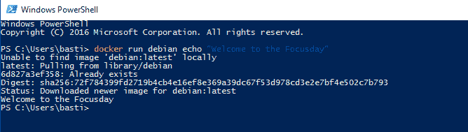
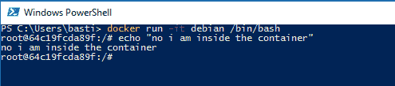
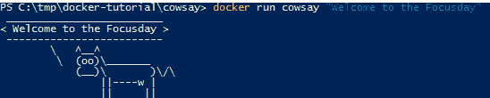
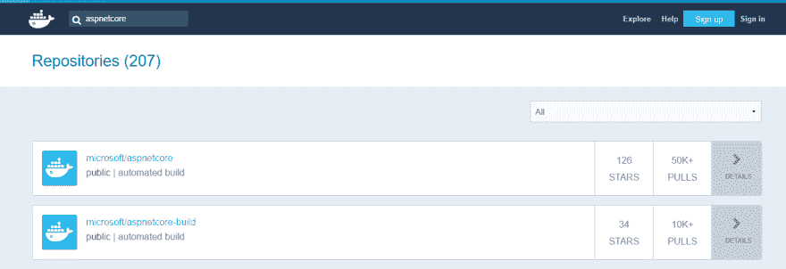
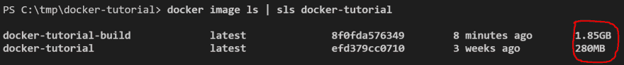
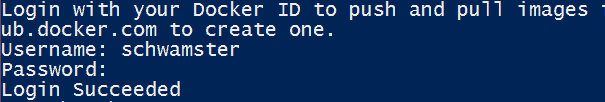
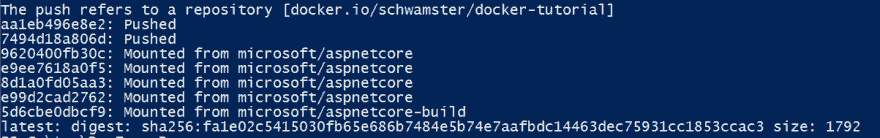

# 初学者教程:ASP.NET 核心的 Docker

> 原文:[https://dev . to/schwamster/docker-tutorial-with-for-aspnet-core](https://dev.to/schwamster/docker-tutorial-with-for-aspnet-core)

# 初学者教程:带 ASP.NET 芯的 Docker

-更新至。net core 2.0 -
-更新了多阶段构建-

在本教程中，您将学习如何构建和运行您的第一个 ASP.NET 核心 docker 映像。我们从一个非常简短的 docker 简介开始。之后，我们选择“正确的”图片。我们将首先创建一个 docker 容器，它负责构建我们的源文件。为此，我们将源文件复制到构建容器中。构建完成后，我们将把发布的项目复制回主机系统，并创建一个运行时映像。之后，我们探索方便的附加“多阶段”构建来简化构建。

你可以在这里找到所有相关代码: [github](https://github.com/schwamster/docker-tutorial)

在你开始本教程之前，你需要在你的机器上安装[点网核心](https://www.microsoft.com/net/core)和 [docker](https://docs.docker.com/engine/installation/) 。

如果你在代理后面运行，一些命令可能不起作用，所以一定要检查下面的[代理部分](#proxy)。

## docker file

如果你已经有了 Docker 的基本知识，跳过这个介绍，直接进入[“选择一个图像”](#choose_image)。

你可以在[hub.docker.com](https://hub.docker.com)上运行许多现成可用的图像中的一个。例如，
可以用下面的命令在 Debian(一个流行的 Linux 发行版)的实例上运行一个命令:

```
docker run debian echo "Welcome to Docker" 
```

[T2】](https://res.cloudinary.com/practicaldev/image/fetch/s--Z8FJ5rPi--/c_limit%2Cf_auto%2Cfl_progressive%2Cq_auto%2Cw_880/https://thepracticaldev.s3.amazonaws.com/i/cfmy9bgf5z7o8xh5uxl1.PNG)

这第一次可能需要一段时间，因为 docker 必须提取图像。第二次运行应该在几分之一秒内启动该命令。

除了运行“抛弃式”容器，您还可以像这样交互式地使用容器:

```
docker run -it debian /bin/bash 
```

[T2】](https://res.cloudinary.com/practicaldev/image/fetch/s--QsNtsDUY--/c_limit%2Cf_auto%2Cfl_progressive%2Cq_auto%2Cw_880/https://thepracticaldev.s3.amazonaws.com/i/l0qh6qsbk2foxgctq9jk.PNG)

查看对接运行参考以了解更多信息:[对接运行](https://docs.docker.com/engine/reference/run/)

您可以通过键入“exit”并按 enter 键来退出容器。

但是你不仅可以运行其他人的图像，你也可以创建你自己的图像。为此，您需要创建一个*docker 文件*。 *Dockerfile* 分步描述了一个图像及其所有依赖关系。

我们可以从一个简单的 docker 文件开始，它扩展了我们的 hello world 示例。

创建一个名为 cowsay 的新文件夹，并添加一个名为 Dockerfile 的文件。将以下内容添加到文件中:

```
FROM debian

RUN apt-get update && apt-get install -y cowsay

ENTRYPOINT ["/usr/games/cowsay"] 
```

在这个 docker 文件中，我们做了以下工作:

1.  定义我们想要使用的基本映像=> debian
2.  在映像中运行一个命令来更新 packagemanager 并安装一个名为 cowsay 的应用程序
3.  定义运行映像时要运行的应用程序

关于 Dockerfile 中可用指令的完整参考，请点击此处 [Dockerfile](https://docs.docker.com/engine/reference/builder/)

现在让我们使用 build 命令从创建的文件夹中构建映像:

```
docker build -t cowsay . 
```

如果这个挂起，并且你在一个代理后面运行，检查这个。

[T2】](https://res.cloudinary.com/practicaldev/image/fetch/s--77g_d4JX--/c_limit%2Cf_auto%2Cfl_progressive%2Cq_auto%2Cw_880/https://thepracticaldev.s3.amazonaws.com/i/i48dpvzp98cytb078678.PNG)

现在我们已经建立了我们映像，我们可以运行它了:

```
docker run cowsay "Welcome to Docker" 
```

[T2】](https://res.cloudinary.com/practicaldev/image/fetch/s--yPv45eYf--/c_limit%2Cf_auto%2Cfl_progressive%2Cq_auto%2Cw_880/https://thepracticaldev.s3.amazonaws.com/i/in6io43lbh9621h2mjqi.png)

## 选择一幅图像

去[hub.docker.com](https://hub.docker.com)搜索 aspnetcore
你会找到很多不同的选择。如果没有非常特殊的原因，我会选择官方图片或相关公司上传的图片。有两个图像很有趣:

[T2】](https://res.cloudinary.com/practicaldev/image/fetch/s--TlzLOium--/c_limit%2Cf_auto%2Cfl_progressive%2Cq_auto%2Cw_880/https://thepracticaldev.s3.amazonaws.com/i/9dhraesaf7gbku4065j5.PNG)

微软提供了两种不同的图像。其中一个只包含运行时，另一个也包含 SDK 参见下面的描述

### ASP.NET 核心码头工人形象

这个存储库包含运行**发布的**ASP.NET 核心应用程序的映像。这些图像使用
微软/点网图像作为其基础。

### ASP.NET 核心打造码头工人形象

这个存储库包含用于在容器内部编译/发布 ASP.NET 核心应用程序的映像。这不同于编译 ASP.NET 核心应用程序，然后将编译后的输出添加到映像，这是使用 microsoft/aspnetcore 映像时要做的事情。这些 docker 文件使用 microsoft/dotnet 映像作为其基础。

## 创建 ASP.NET 核心项目

创建一个名为 docker-tutorial 的文件夹并导航到它，然后执行以下命令:

```
dotnet new webapi 
```

## 第一次建造

让我们从简单开始，在我们的计算机上编译应用程序，然后将输出添加到运行时映像中。

在项目的根目录下运行以下命令:

```
dotnet restore
dotnet publish -o ./publish 
```

您现在应该有一个发布文件夹，其中包含您编译的应用程序。

现在在应用程序的根目录下创建一个新的 Dockerfile

```
FROM microsoft/aspnetcore:2.0
WORKDIR /app
COPY ./publish .
ENTRYPOINT ["dotnet", "docker-tutorial.dll"] 
```

这个 Dockerimage 会将项目根目录下的 publish 文件夹的内容复制到映像上的 app 文件夹中。

建立形象:

```
docker build -t docker-tutorial . 
```

你可以在这里找到更多关于构建命令的信息

测试图像:

```
docker run -p 8181:80 docker-tutorial 
```

现在您可以导航到托管的应用程序:[http://localhost:8181/API/values](http://localhost:8181/api/values)

您应该会得到这样的回应:

```
["value1","value2"] 
```

您的 docker 引擎可能无法通过本地主机访问。如果是这样，请更改为正确的 url。如果您使用 docker-machine 的 docker 工具箱，您可以使用以下命令获得 ip:

```
docker-machine ip default 
```

## 在 aspnetcore 内编译-构建镜像

建议在 docker 映像中编译您的项目，因为这将产生更可靠的构建管道。开发机器上的构建与构建服务器上的构建工作方式相同。

因此，让我们创建另一个名为 Dockerfile.build 的 Dockerfile

```
FROM microsoft/aspnetcore-build:2.0
WORKDIR /app

COPY *.csproj .
RUN dotnet restore

COPY . .
RUN dotnet publish --output /out/ --configuration Release 
```

我们这里使用的新指令是 *COPY* 。这会将文件从我们的主机复制到映像中。
还要注意重建映像时会发生什么。如果你不做任何改变，什么都做不了。如果你改变了代码中的某些内容，发布指令将被执行，但不会执行*点网恢复*。只有改变一些依赖关系，才会执行*点网恢复*指令。
要了解这个“分层”构建过程的更多详细描述，请查看[这个](https://docs.docker.com/engine/userguide/storagedriver/imagesandcontainers/)。

在构建“构建映像”之前，我们需要再添加一个文件，以避免主机上的 dotnet 命令(dotnet restore/build)干扰构建上下文。更多信息见[本](https://codefresh.io/blog/not-ignore-dockerignore/)。添加一个名为。将以下内容添加到项目的根:

```
bin
obj 
```

现在让我们建立图像。注意我们必须明确指定我们想要使用的 docker 文件:

```
docker build -f Dockerfile.build -t docker-tutorial-build . 
```

我们现在已经建立了图像中的应用程序。我们现在可以从该映像运行容器，但首先要运行以下命令:

```
docker image ls | sls docker-tutorial 
```

[T2】](https://res.cloudinary.com/practicaldev/image/fetch/s--yuspSLvx--/c_limit%2Cf_auto%2Cfl_progressive%2Cq_auto%2Cw_880/https://thepracticaldev.s3.amazonaws.com/i/dtcus3yjab2rcdqv1izq.PNG)

正如您所看到的，构建图像比我们之前创建的图像要大得多。这是因为构建映像绝对拥有构建映像所需的一切(SDK)。当我们运行我们的容器时，我们不需要它。解决方案是创建一个运行时映像。

所以下一步是将编译好的应用程序从构建映像中取出。首先，我们用 [create](https://docs.docker.com/engine/reference/commandline/create/) 命令创建容器。这几乎与 *docker run* 类似，只是容器从未真正启动过。然而，我们可以复制编译后的应用程序。

```
docker create --name docker-tutorial-build-container docker-tutorial-build 
```

！删除先前创建的发布文件夹——我们现在将把容器编译结果复制到该文件夹中:

```
docker cp docker-tutorial-build-container:/out ./publish 
```

很好，现在我们可以像以前一样构建运行时映像了:

```
docker build -t docker-tutorial . 
```

当然还要运行它:

```
docker run -p 8181:80 docker-tutorial 
```

！您可能必须停止我们之前启动的容器，因为那个容器已经在使用端口 8181。为此，首先列出正在运行的进程:

```
docker ps 
```

复制容器 ID，例如 ba51e5dc4036

并运行以下命令:

```
docker rm $(docker stop ba51e5dc4036) 
```

# 多阶段构建

在 Docker 版本中，我们有了一个新的特性，使得构建过程更加容易。我们有一个构建映像和一个运行时映像的原因是，因为我们想要一个运行时更苗条的映像。由于这是许多语言的一个非常普遍的需求，Docker 为我们提供了多阶段
构建= > [见文档](https://docs.docker.com/engine/userguide/eng-image/multistage-build/)。这意味着我们现在可以在一个 docker 文件中定义构建和运行时映像，并且我们可以将生成的二进制文件从构建映像复制到
我们的运行时映像中。

如果容器仍在运行，首先停止它:

```
docker stop $(docker ps --filter "ancestor=docker-tutorial" -q) 
```

添加一个名为 Dockerfile.multistage 的新 Dockerfile，其内容如下:

```
# build image
FROM microsoft/aspnetcore-build:2.0 as build
WORKDIR /app

COPY *.csproj .
RUN dotnet restore

COPY . .
RUN dotnet publish --output /out/ --configuration Release

# runtime image
FROM microsoft/aspnetcore:2.0
WORKDIR /app
COPY --from=build /out .
ENTRYPOINT [ "dotnet", "docker-tutorial.dll" ] 
```

构建映像现在容易多了。您所要做的就是运行以下代码:

```
docker build -f .\Dockerfile.multistage -t docker-tutorial . 
```

再次检查图像的图像大小:

```
docker image ls | sls docker-tutorial 
```

由于多阶段构建中的中间映像不会进入最终映像，因此最终的运行时映像仍然占用更少的内存。

运行它:

```
docker run -p 8181:80 docker-tutorial 
```

太好了！现在，我们大大简化了构建过程，并仍然保持图像小！此时，我将删除现有的 Dockerfile 和 Dockerfile.build，并将 Dockerfile.multistage 重命名为 Dockerfile。然后，构建命令看起来像这样:

```
docker build -t docker-tutorial . 
```

# 发布&拉图片

既然我们已经构建了映像，如果我们可以在其他 docker 主机上使用它就好了。为此，我们可以将我们的图像上传到 docker 注册表。docker 注册表有许多不同的选择:hub.docker.com、AWS ECR、Artifactory...
为简单起见，我们将使用免费的 hub.docker.com 公开图片。

如果您还没有这样做，[创建一个帐户](https://hub.docker.com/)。

然后，您可以登录 powershell:

```
docker login 
```

[T2】](https://res.cloudinary.com/practicaldev/image/fetch/s--nCwa-A_5--/c_limit%2Cf_auto%2Cfl_progressive%2Cq_auto%2Cw_880/https://thepracticaldev.s3.amazonaws.com/i/b9xzx8hdxs8m9qx6hfrk.PNG)

为了能够上传(推)我们的图像，我们必须用我们的用户名前缀我们的图像。我的用户名是 schwamster，因此我必须运行以下命令:

```
docker tag docker-tutorial schwamster/docker-tutorial 
```

现在我可以推送图像了

```
docker push schwamster/docker-tutorial 
```

[T2】](https://res.cloudinary.com/practicaldev/image/fetch/s--RsHWF4tl--/c_limit%2Cf_auto%2Cfl_progressive%2Cq_auto%2Cw_880/https://thepracticaldev.s3.amazonaws.com/i/557wy32zlx2crl9eol34.PNG)

图像推送后，我可以通过打开以下网址来验证它是否工作:[https://hub.docker.com/r/schwamster/docker-tutorial/](https://hub.docker.com/r/schwamster/docker-tutorial/)

要提取图像，请运行以下命令:

现在你也可以这样运行我的图像:

```
docker run -p 8182:80 schwamster/docker-tutorial 
```

我的图像现在将被提取并在您的机器上运行。在[http://localhost:8182/API/values](http://localhost:8182/api/values)下查看(将端口改为 8182)

# 代理

如果你被迫通过代理，你将不得不调整我们上面使用的一些命令。

## 代理和对接运行

如果您需要从您的容器中访问 internet，您必须将代理设置添加到容器实例的各个环境变量中。这些可能会有所不同，取决于您使用的应用程序。一般来说，我会设置以下内容:

*   http_proxy
*   https_proxy

我注意到一些应用程序希望变量设置为大写-> HTTP_PROXY，HTTPS_PROXY。其他应用程序可能需要专用的环境变量，甚至需要更改配置文件。

要添加代理环境变量，请使用参数[-e](https://docs.docker.com/engine/reference/run/#env-environment-variables)添加每个环境变量

这里有一个例子:

```
docker run -it -e https_proxy=http://someproxy:8080 -e http_proxy=http://someproxy:8080 debian /bin/bash 
```

要对此进行测试，请在您的容器中运行以下命令:

```
apt-get update 
```

apt-get 更新现在应该正常工作，不会超时。

## 代理和 docker 构建

如果您在构建映像时需要访问互联网，您需要使用 [- build-arg 参数](https://docs.docker.com/engine/reference/builder/#arg)传递环境变量，就像您使用运行时环境变量一样。这就是所谓的不同的论点。

示例:

```
docker build --build-arg http_proxy=http://someproxy:8080 --build-arg https_proxy=http://someproxy:8080 -t cowsay . 
```

# 回执

请查看这本由阿德里安·穆特(奥赖利)所著的伟大的[书](http://shop.oreilly.com/product/0636920035671.do)《使用 Docker》，ISBN 978-1-491-91576-9

你可以在 GitHub 上找到我，我的名字是 [schwamster](https://github.com/schwamster)