# Ubuntu + Windows +。点文件

> 原文：<https://dev.to/suckup_de/ubuntu-windows-dotfiles-j3l>

[Ubuntu + Windows +。点文件](http://suckup.de/2017/04/ubuntu-windows-dotfiles/?pk_campaign=feed&pk_kwd=ubuntu-windows-dotfiles)

**1。**打开【更新&安全】>【开发者】>激活“开发者模式”。

[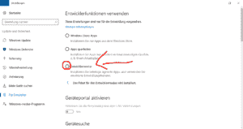T2】](https://suckup.de/wp-content/uploads//2017/04/windows_ubuntu_3.png)

**2。**在“程序”>“程序和功能”下，点击“打开或关闭 Windows 功能”。

[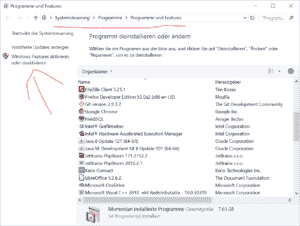T2】](https://suckup.de/wp-content/uploads//2017/04/windows_ubuntu_1-1.png)

**3。**启用列表中的“Windows Subsystem for Linux (Beta)”选项，点击“确定”。

[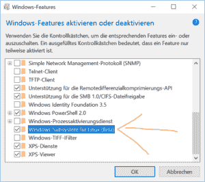T2】](https://suckup.de/wp-content/uploads//2017/04/windows_ubuntu_2.png)

**4。**在一次“重启”之后，你打开命令行(cmd)并键入“bash”然后按[Enter]。

[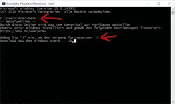T2】](https://suckup.de/wp-content/uploads//2017/04/windows_ubuntu_4.png)

**5。**输入“用户名”和“密码”。(您需要“sudo”命令的密码)

[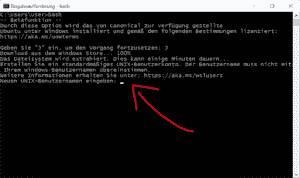T2】](https://suckup.de/wp-content/uploads//2017/04/windows_ubuntu_5.png)

**6。**现在可以打开“Bash on Ubuntu on Windows”了。

[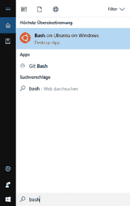T2】](https://suckup.de/wp-content/uploads//2017/04/windows_ubuntu_6.png)

**7。**通过
安装“git”

```
sudo apt-get install git 
```

Enter fullscreen mode Exit fullscreen mode

[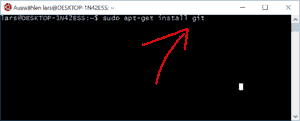T2】](https://suckup.de/wp-content/uploads//2017/04/windows_ubuntu_7.png)

**8。**得到了”。点文件" via:

```
cd ~ ; git clone https://github.com/voku/dotfiles.git; cd dotfiles 
```

Enter fullscreen mode Exit fullscreen mode

[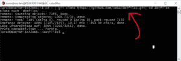T2】](https://suckup.de/wp-content/uploads//2017/04/windows_ubuntu_8.png)

**9。**通过
安装依赖项

```
./firstInstallDebianBased.sh 
```

Enter fullscreen mode Exit fullscreen mode

[T2】](https://suckup.de/wp-content/uploads//2017/04/windows_ubuntu_9.png)

10。安装 zsh(可选，但推荐)。

[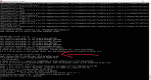T2】](https://suckup.de/wp-content/uploads//2017/04/windows_ubuntu_10.png)

**11。**使用“.点文件" via:

```
./bootstrap.sh 
```

Enter fullscreen mode Exit fullscreen mode

[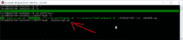T2】](https://suckup.de/wp-content/uploads//2017/04/windows_ubuntu_11.png)

**12。**下载、安装和配置“ConEmu”…

Windows 的替代“命令行 GUI”。代替默认的 GUI，我们用“ConEmu”来支持 UTF-8，所以我们可以使用像“1000”这样的字符。

->[http://conemu . github . io](http://conemu.github.io)

安装好之后，我们可以在配置中将“bash”强制设置为“zsh”。

[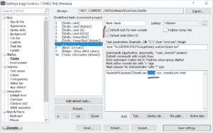T2】](https://suckup.de/wp-content/uploads//2017/04/windows_ubuntu_12.png)

13。添加一些“符号链接”,以便于导航，例如

```
sudo ln -s /mnt/c /c

sudo ln -s /mnt/d /d 
```

Enter fullscreen mode Exit fullscreen mode

[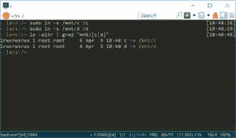T2】](https://suckup.de/wp-content/uploads//2017/04/windows_ubuntu_13.png)

**14。**将当前的“主机名”添加到“/etc/hosts”-文件中。

```
sudo su

echo "127.0.0.1 $(hostname)" >> /etc/hosts

exit 
```

Enter fullscreen mode Exit fullscreen mode

* * *

现在你可以编辑你的”。点文件”-设置和调整您的配置。

下面是我的例子-config:[https://github . com/voku/dot files # add-custom-commands-without-creating-a-new-fork](https://github.com/voku/dotfiles#add-custom-commands-without-creating-a-new-fork)

[T2】](https://res.cloudinary.com/practicaldev/image/fetch/s--D-icbRnc--/c_limit%2Cf_auto%2Cfl_progressive%2Cq_auto%2Cw_880/https://suckup.de/piwik/piwik.php%3Fidsite%3D1%26rec%3D1%26url%3Dhttp%253A%252F%252Fsuckup.de%252F2017%252F04%252Fubuntu-windows-dotfiles%252F%253Fpk_campaign%253Dfeed%2526pk_kwd%253Dubuntu-windows-dotfiles%26action_name%3DUbuntu%2B%252B%2BWindows%2B%252B%2B.dotfiles%26urlref%3Dhttp%253A%252F%252Fsuckup.de%252Ffeed%252F)

[](http://feeds.feedburner.com/~ff/suckup?a=R5cAjP-UgIk:-z2FH--WEpY:NOtau7UU-s0)[](http://feeds.feedburner.com/~ff/suckup?a=R5cAjP-UgIk:-z2FH--WEpY:yIl2AUoC8zA)[](http://feeds.feedburner.com/~ff/suckup?a=R5cAjP-UgIk:-z2FH--WEpY:qj6IDK7rITs)[](http://feeds.feedburner.com/~ff/suckup?a=R5cAjP-UgIk:-z2FH--WEpY:I9og5sOYxJI)[](http://feeds.feedburner.com/~ff/suckup?a=R5cAjP-UgIk:-z2FH--WEpY:-BTjWOF_DHI)
[](https://res.cloudinary.com/practicaldev/image/fetch/s--z3ZaiWGK--/c_limit%2Cf_auto%2Cfl_progressive%2Cq_auto%2Cw_880/http://feeds.feedburner.com/%257Er/suckup/%257E4/R5cAjP-UgIk)