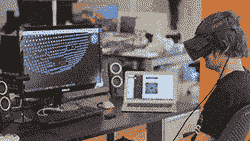
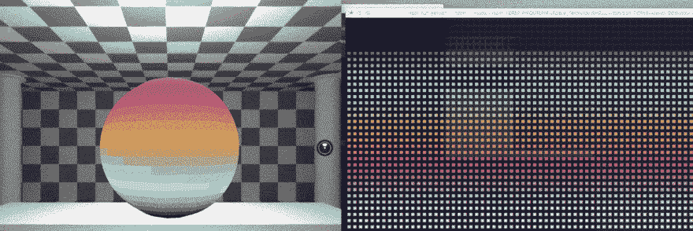
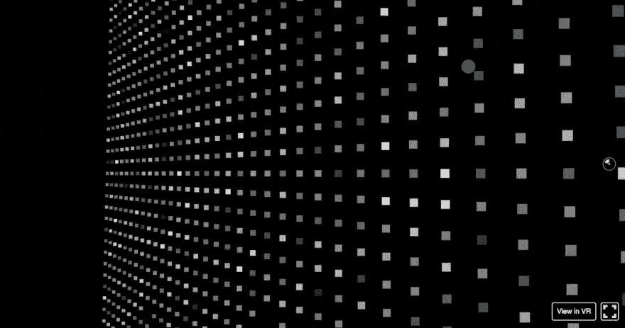
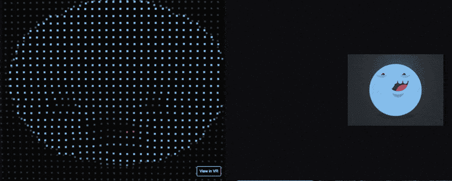

# 用 React VR 和 RIO 在虚拟现实中搭建像素墙！我们的第一印象

> 原文:[https://dev . to/kylessg/building-a-pixel-wall-in-virtual-react-VR-and-Rio-our-first-impressions](https://dev.to/kylessg/building-a-pixel-wall-in-virtual-reality-with-react-vr-and-rio-our-first-impressions)

[T2】](https://res.cloudinary.com/practicaldev/image/fetch/s--dsTXe21O--/c_limit%2Cf_auto%2Cfl_progressive%2Cq_66%2Cw_880/https://storage.googleapis.com/ssg-website-images/react-vr/react-vr.gif)

我们的项目 [RIO](https://github.com/SolidStateGroup/rio) 获得了巨大的反响，我们非常兴奋地看到它被像 [Adafruit](https://blog.adafruit.com/2017/03/17/play-games-post-videos-and-share-gifs-on-this-giant-led-wall-piday-raspberrypi-raspberry_pi/) 、[主板](https://motherboard.vice.com/en_us/article/hey-wanna-play-mario-kart-on-a-giant-lite-brite-wall)和[树莓派](https://www.raspberrypi.org/blog/giant-led-wall/)这样的人发布，我们决定在虚拟现实中模拟我们办公室的 3d 墙。这篇文章总结了我们对 React VR 的第一印象，并为你们这些可爱的人开源了所有代码，这样你们就可以开始了！

在 SXSW 2017 期间，我们被介绍到脸书的孵化器项目， [React VR](https://github.com/facebook/react-vr) 。我们决定直接进入并创建一个 3D 虚拟像素墙，并在办公室的 oculus rift 上检查它。

成为一个新技术的早期采纳者很有趣，但也很艰难。没有太多的资源，可能会有错误或性能问题，但是当你得到一个可靠的结果时，这是非常令人满意的，有时可以为你的开发过程添加一个重要的工具。如果项目受到欢迎，你很快就会成为社区中更有经验的开发团队之一——我们在 2015 年的 React Native 中发现了这一点。

## 跳入 VR -入门

React VR 是一个库，可以让你使用 JavaScript 构建 web VR 应用。您可以创建动画 3d 场景，并在浏览器中以及使用 Oculus/Gear VR 耳机进行查看/调试。

对于 web 开发人员来说，从标准 web 开发过渡到 React VR 可能不像使用 React Native 创建第一个移动应用程序那样简单。这是因为 3d 开发的概念与网络和移动开发有很大的不同，尽管它给了我们一个很好的开端。

开始非常简单，只需几个命令，我们就可以看到 Hello World 应用程序。我们可以插上我们的虚拟现实耳机，环顾一个 3d 房间，非常酷！

[T2】](https://res.cloudinary.com/practicaldev/image/fetch/s--lV62cMt7--/c_limit%2Cf_auto%2Cfl_progressive%2Cq_auto%2Cw_880/https://storage.googleapis.com/ssg-website-images/react-vr/image_1.jpg)

## 第一次迭代——实时从图像中创建 3d 形状

接下来的步骤是从 RIO 获取实时数据并以 3D 形式显示，这非常简单，因为我们之前已经允许使用 JavaScript 对任何技术进行非常简单的集成。我们的第一个可演示的想法紧随其后，每当我们有新的东西要展示时，我们就创建一个 3d 材料，并将其应用到一个球形物体上。

[T2】](https://res.cloudinary.com/practicaldev/image/fetch/s--n4C-VlUG--/c_limit%2Cf_auto%2Cfl_progressive%2Cq_66%2Cw_880/https://storage.googleapis.com/ssg-website-images/react-vr/image_2.gif)

## 第二次迭代——实时从图像中创建动态粒子效果

这是一个很好的开始，但是我们真正做的是在一个球体周围包裹一个 2d 图像，我们决定移动到一些更有趣的东西上。

我们的下一个演示采用任何图像或视频，并将每个像素显示为 VR 中的一个粒子，更强的颜色被动画化，以更接近你。

[T2】](https://res.cloudinary.com/practicaldev/image/fetch/s--Wjc8nCwZ--/c_limit%2Cf_auto%2Cfl_progressive%2Cq_66%2Cw_880/https://storage.googleapis.com/ssg-website-images/react-vr/image_3.gif)

## 第三次迭代——借力里约的力量

RIO 提供了许多开箱即用的功能，一旦添加了粒子效果，我们现在可以添加更多有趣的功能，如发送推文、Slack 消息、gif、youtube 视频甚至玩游戏——这些都可以在虚拟现实中看到！

[T2】](https://res.cloudinary.com/practicaldev/image/fetch/s--NE-VhDYS--/c_limit%2Cf_auto%2Cfl_progressive%2Cq_66%2Cw_880/https://storage.googleapis.com/ssg-website-images/react-vr/image_4.gif)

## 第一印象

React VR 展示了很多前景，能够在 VR 中利用 React 的力量真是太棒了。社区本身仍然很小，网上很少有使用这项技术的例子，看看它在对比 Native 的巨大成功时获得了多少动力将会很有趣。

环顾四周，几乎没有使用 React-VR 的例子，但不要担心，我们已经覆盖了你-检查一下 rio 上的 [vr 分支。](https://github.com/SolidStateGroup/rio)