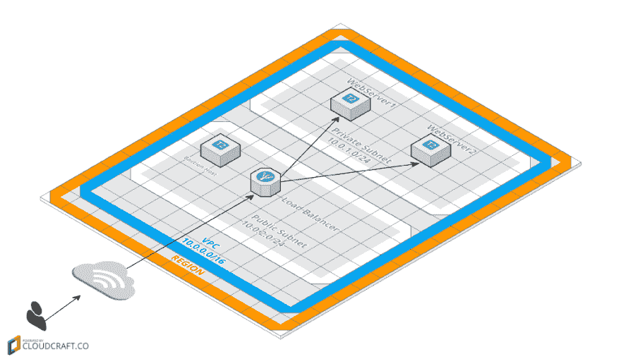

# 使用 Terraform 创建您的云服务器

> 原文:[https://dev . to/caduribeiro/creating-your-cloud-servers-with-terraform-2 lpd](https://dev.to/caduribeiro/creating-your-cloud-servers-with-terraform-2lpd)

<figure>[](https://res.cloudinary.com/practicaldev/image/fetch/s--lnsc5XXa--/c_limit%2Cf_auto%2Cfl_progressive%2Cq_auto%2Cw_880/https://cdn-images-1.medium.com/max/800/1%2A2QvMO07P4smlK-GE45EROA.jpeg) 

<figcaption>地球化火星</figcaption>

</figure>

有时，当您在云中处理大量服务器时，很容易迷失在您的基础架构中。"我找不到的那个该死的服务器在哪里？"，甚至“为什么这个实例是为？”。

在这篇文章中，我将介绍一个我发现自己非常喜欢的工具:在我的应用程序中有一个作为代码流的基础设施的引导。[地形](https://www.terraform.io/)。基础设施即代码(IaC)允许我们拥有一个包含描述基础设施的代码的存储库。这样，我们可以避免提醒如何为应用程序重建整个基础结构。它将出现在代码中，可以进行版本控制和测试。如果出了问题，我们可以恢复它。基础设施的持续集成非常有用。整个团队都知道它是如何建造的，以及所有的部件。您可以将应用程序代码中使用的相同流程应用到您的基础架构，即:有人做出更改，打开一个拉式请求，有人对其进行审核，在批准后，您进行合并，您的 CI 工具将更改应用到您的环境中。

#### 为什么是 Terraform？厨师，木偶，Ansible 有什么区别？

Chef、Puppet 和 Ansible 也是 IaC 工具，但它们专注于**配置**操作系统和应用程序。它们被称为配置管理工具，它们也可以在插件的帮助下在云上构建基础设施，但通常很难配置，有时很有限。使用 Terraform，您可以从服务到网络部分进行构建。您可以使用 Terraform 来创建基础设施，并使用配置管理工具来配置应用程序。Terraform 不能取代你的配置管理工具，但它可以与之协同工作。

[T2】](https://res.cloudinary.com/practicaldev/image/fetch/s--8bIp6qSn--/c_limit%2Cf_auto%2Cfl_progressive%2Cq_auto%2Cw_880/https://cdn-images-1.medium.com/max/400/1%2AsS6MVPyxzhn3O8pA3nw0kg.jpeg)

### 实际例子

为了阅读本文，您需要一个 AWS 帐户。

让我们为我们的 web 应用程序创建服务器。看看这张我们将要建立的资源图。

[T2】](https://res.cloudinary.com/practicaldev/image/fetch/s--rbRMYm-5--/c_limit%2Cf_auto%2Cfl_progressive%2Cq_auto%2Cw_880/https://cdn-images-1.medium.com/max/1024/1%2AnYWHvlp87BBsE6gI2TbKYA.png)

我们将创建 2 个子网(一个用于公共访问，另一个用于私有访问)。我们在公共子网中使用弹性负载平衡器来处理 web 服务器的流量。我们的 web 服务器将位于专用子网上，只能通过负载平衡器访问。这意味着我们不能直接访问服务器来建立连接(例如 SSH)。为了通过 SSH 访问私有子网上的实例，您需要一个 bastion 主机，并通过它连接到 web 服务器。因此，我们将在公共子网上创建堡垒主机。

在动手之前，你需要安装 Terraform。按照[该链接](https://www.terraform.io/intro/getting-started/install.html)的说明将其安装到您的机器中。

#### 目录结构

让我们创建一个文件夹来处理我们的基础设施代码。

```
mkdir ~/terraform 
```

我喜欢在使用 Terraform 时遵循这种模式:

```
├── modules
│ ├── networking
│ └── web
├── production
└── staging 
```

让我们创建这个文件夹结构

```
cd ~/terraform
mkdir -p modules/{networking,web} production staging 
```

我们的 modules 文件夹包含所有的**共享代码**来创建基础设施的各个部分(web 服务器、应用服务器、数据库、vpc 等)。模块文件夹中的每个文件夹都与一个特定的模块相关。

接下来，我为我的环境(试运行、生产、qa、开发等)创建了文件夹。每个文件夹都包含使用我们的共享模块的代码，并为每个环境创建不同的架构(这是我个人使用 Terraform 的方法，但也可以随意使用不同的方法)。

#### 我们的第一个模块:网络

让我们创建我们的网络模块。这将负责创建我们基础设施的网络部分，如 VPC、子网、路由表、NAT 服务器和 bastion 实例。

在深入研究代码之前，我想解释一下 terraform 是如何工作的:

Terraform 会给我们提供一些命令。其中一些是:

**计划**:显示 Terraform 对我们的基础设施进行的所有更改

**应用**:执行对基础设施的所有更改

**销毁**:销毁用 Terraform 创建的所有内容

当您在一个目录中运行 Terraform 时，它会加载所有。tf 文件并执行它们(不会加载到子文件夹中)。Terraform 将首先创建一个仅在最后阶段应用的资源图，因此您不需要以任何特定的顺序指定资源。该图将确定资源之间的关系，并确保 Terraform 以正确的顺序创建它们。

#### 继续我们的网络模块

进入联网模块

```
cd modules/networking 
```

让我们创建我们的第一个 tf 文件。指定模块所需的所有变量。

```
touch variables.tf 
```

在 variables.tf 文件中插入以下内容: