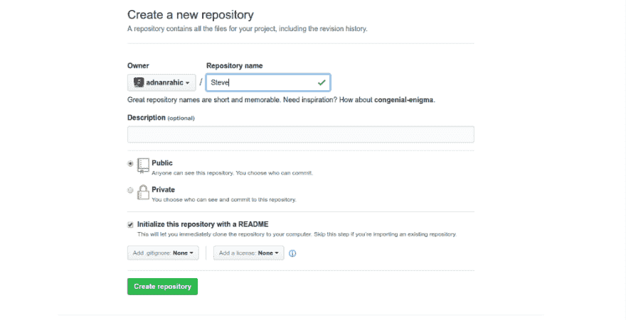

# 如何掌握 Git 的艺术

> 原文:[https://dev.to/adnanrahic/how-to-master-the-art-of-git](https://dev.to/adnanrahic/how-to-master-the-art-of-git)

这篇文章最初发表在 Medium 上。你可以在这里看一看它[。](https://hackernoon.com/how-to-master-the-art-of-git-68e1050f3147)

你有没有想过一个人如何学习使用好 Git？很长一段时间你用 Git 都很差。最终，你会找到窍门的。这就是我来这里的原因。我将带你踏上启蒙之旅。这些是我关于如何显著加快学习 Git 过程的基本指南。我将介绍 Git 实际上是什么，以及我最常用的 7 个 Git 命令。本文主要面向有抱负的开发人员和大学新生，他们需要 Git 是什么以及如何掌握基础知识的介绍性解释。

* * *

**TLDR；**

你可以继续读整篇文章，或者只读 TLDR 的作品来伤害我的感情；

在学习 Git 的过程中，请养成遵循以下步骤的习惯:

1.  `git status`无时无刻！
2.  只尝试更改您真正想要更改的文件。
3.  `git add -A`是你的朋友。
4.  请随意`git commit -m "meaningful messages"`。
5.  总是在做任何推之前，但在你做出任何改变之后。
6.  最后，`git push`提交的变更。

* * *

不要温柔地走进那个美好的夜晚。
对于任何开发者来说，普遍的第一步是选择一个公共的地方来存放他或她的代码库。瞧，GitHub！关于代码的所有事情的会议场所。为了能够理解 GitHub 的概念，你首先需要理解 Git 到底是什么。

Git 是一个版本控制软件，基于命令行，有一些桌面应用程序可用于 Windows 和 Mac。由 Linux 之父 Linus Torvalds 创建，他是计算机科学史上最有影响力的人之一。利用这一优点，Git 已经成为绝大多数软件开发人员共享和维护代码的标准。那些是一堆大词。我们来分解一下。版本控制软件，就是它所说的意思。Git 允许你预览你曾经写过的所有版本的代码。真的，永远！开发人员拥有的每一个代码库都将被存储在各自的存储库中，存储库可以被命名为从菠萝到 express 的任何名称。在这个库内开发代码的过程中，你会做无数的修改，直到第一次正式发布。这就是版本控制软件如此重要的核心原因。它使开发人员能够清楚地看到对代码库所做的所有更改、修订和改进。这反过来使得协作、下载代码进行编辑以及将更改上传到存储库变得更加容易。然而，尽管这些都很棒，有一件事是最不可思议的。你可以下载和使用这些文件，即使你与开发过程无关！

让我们回到故事的 GitHub 部分。它只是所有储存库的枢纽，可以在线存储和查看。志趣相投的人的中心聚会点。

让我们开始使用它吧！
好的，记住，Git 是一个软件，和其他软件一样，你首先需要安装它:
[下载并安装 Git](https://git-scm.com/book/en/v2/Getting-Started-Installing-Git)

***主持人声音***
请点击上面的链接，并按照说明进行…
安装完毕，太好了。现在你需要在浏览器的地址栏中输入 github.com。如果您还没有帐户，请创建一个帐户，这样您就可以尽情摇滚了！跳进去创建一个新的存储库，毫无理由地将其命名为 Steve，只是因为有一个名为 Steve 的存储库很有趣。继续选中“使用自述文件初始化此存储库”复选框，然后单击“创建”按钮。您现在有了一个名为 Steve 的新存储库。为你自己感到骄傲，我当然是。

[T2】](https://res.cloudinary.com/practicaldev/image/fetch/s---5x0At4k--/c_limit%2Cf_auto%2Cfl_progressive%2Cq_auto%2Cw_880/https://cdn-images-1.medium.com/max/1000/1%2AHw0s4yAfViZQNXO7YB0X8A.png)

**这次开始真正使用 Git 了。**
现在有趣的部分来了。您已经准备好将 Steve 克隆到您的本地机器上。把这个过程看做是简单地把资源库从 GitHub 复制到你的电脑上。点击“克隆”或“下载”按钮，你会看到一个如下所示的 URL:

```
https://github.com/yourGithubAccountName/Steve.git 
```

复制这个 URL 并打开一个命令提示符。现在编写并运行这个命令:

```
git clone https://github.com/yourGithubAccountName/Steve.git 
```

阿布拉卡达布拉！史蒂夫已经被自动克隆到你的电脑上了。在您克隆存储库的目录中，您会看到一个名为 Steve 的文件夹。这个本地文件夹现在与它的来源(Github 上的原始存储库)相链接。记住这个过程，在你的软件开发生涯中，你一定会重复很多次。完成所有这些正式的工作后，您就可以开始使用最常用的 Git 命令了。

[T2】](https://res.cloudinary.com/practicaldev/image/fetch/s--4dQpBmu0--/c_limit%2Cf_auto%2Cfl_progressive%2Cq_auto%2Cw_880/https://cdn-images-1.medium.com/max/800/1%2AtxfAZdt3U0u9V9WTEZiyNQ.jpeg)

你现在才真正开始使用 Git。
打开 Steve 目录，在同一个目录中打开命令提示符。运行命令:

```
git status 
```

这将输出您的工作目录的状态，显示您已经编辑的所有文件。这意味着它向您展示了源文件和您的本地工作目录之间的区别。status 命令旨在用作提交模板。在本教程的后面，我将回头讨论提交。简而言之，git status 向您显示您已经编辑了哪些文件，从而让您大致了解您希望将哪些文件上传回原始位置。

但是，在您做任何事情之前，首先您需要选择您希望将哪些文件发送回原点。这是通过
完成的

```
git add 
```

请在 Steve 目录下创建一个新的文本文件。命名为菠萝. txt 只是为了好玩。在这个文件中写下你想要的任何东西。切换回命令提示符，再次运行 git status。现在，您会看到该文件以红色显示在未跟踪文件的标题下。

```
On branch master
Your branch is up-to-date with 'origin/master'.
Untracked files:
  (use "git add <file>..." to include in what will be commited)
pineapple.txt 
```

下一步是将文件添加到暂存中。Staging 可以被看作是一个上下文，在这个上下文中，当提交它们的时候，您选择的所有更改将被捆绑成一个。现在，您可以将该文件添加到暂存:

```
git add -A 
```

-A 标志意味着所有已更改的文件都将进行提交。然而，git add 非常灵活，可以一个一个地添加文件。就像这样:

```
git add pineapple.txt 
```

这种方法使您能够挑选您希望上传的每个文件，而不必担心会更改您不应该更改的内容。

再次运行 git status 后，您应该会看到类似这样的内容:

```
On branch master
Your branch is up-to-date with 'origin/master'.
Changes to be committed:
  (use "git reset HEAD <file>..." to unstage)
new file:   pineapple.txt 
```

准备好提交更改了吗？我确实是。

```
git commit -m "Write your message here" 
```

Git commit 命令将暂存的当前文件存储在一个新的 commit 中，同时还有一条来自用户的描述更改的日志消息。-m 标志包括提交中用双引号括起来的消息。

再次检查状态将显示:

```
On branch master
Your branch is ahead of 'origin/master' by 1 commit.
  (use "git push" to publish your local commits)
nothing to commit, working directory clean 
```

现在，所有更改都被捆绑到一个 commit 中，并带有一条关于您所做工作的专用消息。现在，您已经准备好将这个提交推送到原点。push 命令确实如其所指。它会将您提交的更改从本地机器上传到 GitHub 上的存储库源。返回到命令提示符并运行:

```
git push 
```

它会要求你输入你的 GitHub 用户名和密码，之后你会看到类似这样的内容:

```
Counting objects: 3, done.
Delta compression using up to 4 threads.
Compressing objects: 100% (2/2), done.
Writing objects: 100% (3/3), 280 bytes | 0 bytes/s, done.
Total 3 (delta 0), reused 0 (delta 0)
To https://github.com/yourGithubUserName/Steve.git
   c77a97c..08bb95a  master -> master 
```

就是这样。您已经上传了本地更改。继续在 GitHub 上查看您的存储库，您会看到它现在包含一个名为菠萝. txt 的文件。

如果你在一个开发团队中工作呢？它们都将提交推送到原点。接下来会发生什么？这就是 Git 开始展示其真正威力的地方。您可以通过一个简单的命令轻松地将最新版本的代码库下载到您的本地机器上。

```
git pull 
```

但是 Git 有其局限性。您需要有匹配的版本才能将更改推送到原始版本。这意味着您本地拥有的版本需要与原始版本完全相同。当从原点提取时，工作目录中不应该有文件，因为在这个过程中它们会被覆盖。因此我给出了这个简单的建议。在学习 Git 的过程中，请养成遵循以下步骤的习惯:

1.  `git status`无时无刻！
2.  只尝试更改您真正想要更改的文件。
3.  `git add -A`是你的朋友。
4.  请随意`git commit -m "meaningful messages"`。
5.  总是在做任何推之前，但在你做出任何改变之后。
6.  最后，git 推送提交的更改。

* * *

唷，你还和我在一起吗？你已经走了很长的路。休息一下。

[T2】](https://res.cloudinary.com/practicaldev/image/fetch/s--fai2Woan--/c_limit%2Cf_auto%2Cfl_progressive%2Cq_auto%2Cw_880/https://cdn-images-1.medium.com/max/800/1%2AvrNe9wt2zHczmXx-tkGipw.jpeg)

休息好了？太好了！您已经为一些错误处理做好了准备。万一你不小心更改了一些不该碰的文件呢？不用抓狂，用`git checkout`就好。我们来修改一下菠萝. txt 文件里的东西。在这里再加一行文字，比如说，“史蒂夫棒极了！”。继续，保存更改并检查`git status`。

```
On branch master
Your branch is up-to-date with 'origin/master'.
Changes not staged for commit:
  (use "git add <file>..." to update what will be committed)
  (use "git checkout -- <file>..." to discard changes in working directory)
modified:   pineapple.txt
no changes added to commit (use "git add" and/or "git commit -a") 
```

不出所料，它已被登记为变更。但是如果史蒂夫真的没有那么牛逼呢？如果史蒂夫是超级瘸子呢？不要担心！恢复更改的最简单方法是运行:

```
git checkout -- pineapple.txt 
```

现在，您将看到文件已恢复到其先前的状态。但是如果你真的搞砸了怎么办。我的意思是，就像把事情搞砸了，需要把所有东西都重置回原点的状态。不用担心，在这种紧急情况下，我们有这种美:

```
git reset --hard 
```

带有 *- hard* 标志的 Git reset 命令会丢弃自上次提交以来的所有更改。有时候很方便。

* * *

最后，我想鼓励您尽可能多地使用 Git。这是迄今为止学习如何自信地使用它的最好方法。除此之外，养成阅读 Git 文档的习惯。虽然一开始看起来很困惑，但读了一会儿之后，你就会找到窍门了。

希望你们和我写这篇文章时一样开心。如果你认为这对某人有帮助，请随意分享，或者你可以在 Twitter 或 Medium 上关注我，了解我的更多写作。