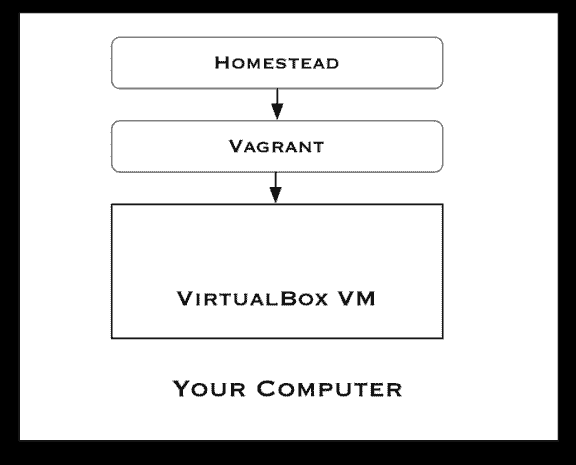

# 有流浪者/家园的地方发展

> 原文:[https://dev . to/gaijinity/local-development-with-flower-homestead-2kn 7](https://dev.to/gaijinity/local-development-with-vagrant-homestead-2kn7)

# 当地开发用的游民/宅基地

### 一个拥有流浪者/家园的本地开发环境可以让您更安全有效地开展项目

安德鲁·韦尔奇

[T2】](https://res.cloudinary.com/practicaldev/image/fetch/s--G_ZV6bD7--/c_limit%2Cf_auto%2Cfl_progressive%2Cq_auto%2Cw_880/https://nystudio107-ems2qegf7x6qiqq.netdna-ssl.com/img/blog/_1200x675_crop_center-center_82_line/homestead-prairie-schooner.jpg)

Home stead 是一个专业的工具，它建立了一个本地开发环境，允许你在 web 开发项目中无忧无虑地工作。您将获得一个拥有开发所需一切的现代堆栈，包括一系列功能强大的调试工具。

我们将讨论为什么我使用 Home stead 进行本地开发，但是在我们进入具体细节之前，让我们先讨论一下为什么我们使用本地开发环境。

*注意:*虽然 [Craft CMS](https://craftcms.com/) 在本文中被提及，但是 Home stead 对于任何类型的 CMS 或开发栈(Lar avel，Node JS，whatevs)的任何类型的 web 开发都很有效。

<aside>You don’t work on a car’s engine while it’s run­ning, bar­rel­ing down the high­way at 100km/​h</aside>

在过去糟糕的日子里，web 开发是通过直接在服务器上编辑文件来完成的。然后人们开始意识到这是一个坏主意，文件在本地编辑，然后在一些初步测试后用 FTP 应用程序复制到服务器上。

问题是现代 web 开发不再仅仅是编辑标记。现代 web 开发与软件工程和信息架构技术有冲突。有些人会说——我认为很对——我们已经到了那一步。

[T2】](https://res.cloudinary.com/practicaldev/image/fetch/s--JtY3XuNX--/c_limit%2Cf_auto%2Cfl_progressive%2Cq_auto%2Cw_880/https://nystudio107-ems2qegf7x6qiqq.netdna-ssl.com/img/blog/_1200x675_crop_center-center_82_line/car-servicing-engine.jpg)

这意味着我们必须认真对待我们的工具。我们需要一种方法来使用现代工具设计、开发和调试我们的项目，并且不干扰公共网站。

[Craft CMS 的多环境配置](https://dev.to/gaijinity/multi-environment-config-for-craft-cms-3952-temp-slug-5514305)这篇文章更深入地讨论了如何在有`local`开发、`staging`和`live`生产环境的地方设置这种类型的 Craft CMS。

如果你没有使用某种本地开发环境，你会发现跟上速度变得越来越困难。所以让我们开始吧。

## 为什么流浪/宅基地？

有很多方法可以建立一个本地开发环境，就像剥一只猫的皮一样。我之所以喜欢使用 Home stead 来设置我的本地开发环境，是因为它会在你的计算机中创建一个完整的虚拟机(VM)。

这有几个优点:

*   你可以在你家里安装任何尤尔想要的东西，而不会影响你的电脑
*   您可以轻松创建和销毁任意数量的虚拟机，因此“哎呀”一瞬间意味着几分钟，而不是几小时
*   您将获得一个尽可能接近镜像您的产品服务器的 real Lin UX box
*   您可以预装所需的所有工具，而不必一点一点地添加它们

拥有一些与生产环境非常相似的东西，意味着在部署生产环境时很少会遇到意外的压力，也意味着您在使开发环境正常工作的“元工作”上花费的时间会更少。

您可以快速轻松地创建预配置的虚拟机，这意味着您可以放心地进行开发。如果你真的搞砸了你的开发环境，没什么大不了的，你只是把另一个环境搞砸了。

它看起来是这样的:

[T2】](https://res.cloudinary.com/practicaldev/image/fetch/s--JODTGg6E--/c_limit%2Cf_auto%2Cfl_progressive%2Cq_auto%2Cw_880/https://nystudio107-ems2qegf7x6qiqq.netdna-ssl.com/img/blog/_576x465_crop_center-center_100_line/homestead-vagrant-virtualbox.png)

Home stead 是一个流浪者**盒子**(还有一些设置好的& pro vi sion 脚本)。流浪者是一个 pro vi sion 软件，它使用一个预先配置好的“盒子”来设置一个来自**供应商**的虚拟机。“提供者”是真正运行虚拟机的，可以是[虚拟盒子](https://www.virtualbox.org/wiki/Downloads)(免费)、 [VMware](https://www.vmware.com/) (不免费)，或者 [Par al lels](http://www.parallels.com/products/desktop/) (也不免费)。

我会假设你和我一样便宜，你会用 Vir tu al Box，因为它是免费的。但这三个中的任何一个都可以，事实上， [VMware](https://www.vmware.com/products/personal-desktop-virtualization.html) 提供的信号比免费的虚拟盒更好，所以你可能会想尝试一下。

<aside>So Home­stead is the recipe, Vagrant is the chef, and Vir­tu­al­Box is the wait­er that serves you up the scrump­tious dish.</aside>

所有这些都在你的计算机中作为虚拟机运行。这个虚拟机中的任何东西都不会伤害您的实际计算机，它是完全隔离的。

[T2】](https://res.cloudinary.com/practicaldev/image/fetch/s--SxGGG1M3--/c_limit%2Cf_auto%2Cfl_progressive%2Cq_auto%2Cw_880/https://nystudio107-ems2qegf7x6qiqq.netdna-ssl.com/img/blog/_1200x675_crop_center-center_82_line/russian-matryoshka-doll.jpg)

你的电脑里有自己的小服务器，结合 Craft CMS 文章中的[数据库&环境间的资产同步中描述的设置，你就有了一个可以在任何地方使用的移动环境。即使没有互联网接入。](https://dev.to/gaijinity/database-asset-syncing-between-environments-in-craft-cms-3fca-temp-slug-480513)

此外，如果您与其他人合作，那么您的虚拟机的主版本意味着您可以确保他们也拥有与您完全相同的本地开发环境。

在你的团队中，工具的一致性意味着更少的摩擦，更少的问题。

## 成为自耕农

所以说够了！让我们有一个稳定的家庭环境。如果你提供视频指导，可以看看 YouTube 视频上的[建立 Craft CMS。](https://www.youtube.com/watch?v=DfUqciZ91oU)

首先，您需要下载并安装:

*   [流浪者](https://www.vagrantup.com/downloads.html)

它们都带有 Mac、Win dows 和 Lin ux 的本地安装程序。您不需要为它们中的任何一个做任何设置，只需安装它们。然后我们需要通过下面的
添加`laravel/homestead`框到流浪者

```
 vagrant box add laravel/homestead 
```

接下来，我们需要通过克隆回购协议
来安装 [Home stead](https://laravel.com/docs/master/homestead)

```
 git clone https://github.com/laravel/homestead.git Homestead 
```

…并检查所需的版本(`v5.1.0`是撰写本文时的最新版本):

```
 cd Homestead
git checkout v5.1.0 
```

*谭根特:*关于版本的一句话。正如我们之前提到的，Home stead 由两部分组成，Home stead 流浪者盒子，以及组成 Home stead 本身的脚本。每种都有单独的价格版本号。截至本文撰写时，Home stead 流浪盒的最新版本为`2.0.0`，Home stead 本身的最新版本为`5.1.0`。只是在[回家的时候要记住一些事情。](http://www.darwinbiler.com/keeping-your-homestead-box-up-to-date/)

最后，第一次安装 Home stead 时，我们还需要从`Homestead`目录初始化它。在 Mac/ Linux 上，我们做到了:

```
 bash init.sh 
```

…在 Win dows 上，我们会:

```
 init.bat 
```

这将在`Homestead/`目录下创建一个`Homestead.yaml`文件。这是我们将用来配置我们的主页设置的文件。这里有一个简单的例子(编辑你的`Homestead.yaml`文件以适应你自己的需要，以此为指导):

```
 ---
ip: "192.168.10.10"
memory: 2048
cpus: 1
provider: virtualbox
mariadb: true

authorize: ~/.ssh/id_rsa.pub

keys:
    - ~/.ssh/id_rsa

folders:
    - map: /Users/andrew/webdev/sites
      to: /home/vagrant/sites
      type: nfs

sites:
    - map: nystudio107.dev
      to: /home/vagrant/sites/nystudio107/public

    - map: craft3.dev
      to: /home/vagrant/sites/craft3/public

databases:
    - nystudio
    - craft3

variables:
    - key: APP_ENV
      value: local

# blackfire:
# - id: foo
# token: bar
# client-id: foo
# client-token: bar

# ports:
# - send: 93000
# to: 9300
# - send: 7777
# to: 777
# protocol: udp 
```

这将使我们的虚拟机拥有 2048mb 内存，并使用 1 个虚拟 CPU。一个不错的经验法则是使用 1/8 的计算机内存来分配给虚拟机。

我们使用`mariadb`而不是`mysql`,因为它没有 MySQL 5.7 中的[问题。Mari aDB 没有抱怨](http://craftcms.stackexchange.com/questions/12084/getting-this-sql-error-group-by-incompatible-with-sql-mode-only-full-group-by)[警告:在命令行界面上使用密码是不安全的](http://stackoverflow.com/questions/20751352/suppress-warning-messages-using-mysql-from-within-terminal-but-password-written)，而且它是一个更活跃的代码库。

不要担心，Mari aDB 是 MySQL 的 100%替代产品，它是 100%可移植的(它是相同代码库的一个分支，由 MySQL 的原始作者开发)。如果出于某种原因，你真的不想使用 Mari aDB，只需省略这一行，默认情况下它会使用 MySQL。

允许你将目录从你的计算机映射到你的虚拟机。这允许您使用 Sub lime 或 Php Storm 等本地编辑器来编辑代码，同时也允许 VM 访问文件。

记住，VM 是一个有效的独立的计算机，所以这个直接映射是两者之间的桥梁。所以你可以在你的电脑或虚拟机上编辑相同的文件。一个关键的设置是使用`nfs`作为`type`,因为这是一个更适合 mant 的文件共享/同步方式。

让你在网站所在的虚拟机上设置从域名到目录的映射。您可以在同一个虚拟机中添加任意数量的虚拟机。

让您告诉 Home stead 为您创建 mysql 数据库。同样，您可以在同一个 VM 中拥有任意多的数据库。

然后我们需要通过我们的`hosts`文件告诉我们的程序员在哪里可以找到这些网站，在 Mac/ Linux 上这个文件在`/etc/hosts`，在 Windows 上在【T2:】在

```
 192.168.10.10 nystudio107.dev
192.168.10.10 craft3.dev 
```

在 Mac 上编辑 hosts 文件最简单的方法就是:`sudo nano /etc/hosts`这将弹出一个非常简单的编辑器。因为这是一个系统文件，你需要输入你的管理员密码来编辑它。

在 Win dows 上，您只需用管理员权限编辑`hosts`文件。例如，用`right click > run as admin`运行记事本，然后编辑`hosts`文件。

如果你厌倦了手工编辑你的主机文件，你可以随时使用[主机更新程序](https://github.com/cogitatio/vagrant-hostsupdater)来帮你完成。

最后，让我们做一点小小的布置，这并不十分必要，但会让你的日常生活变得更加美好。

Home stead 是一种特殊的 cif ic 型流浪乞讨箱；所以我们可以在使用我们的家用机顶盒时使用标准的流浪指令。但是，建立一个与我们本地环境相适应的命令*要方便得多。*

在 Mac 上这样做来编辑你的 Bash pro 文件:nano `~/.bash_profile`并把它添加到它的末尾:

```
 function homestead() {
    ( cd ~/Homestead && vagrant $* )
} 
```

确保将功能中的`~/Homestead`路径调整到实际主安装的位置。

当您在那里时，如果您希望命令行提示告诉您当前所在的 git repo & branch，也将这个添加到您的`~/.bash_profile`的末尾:

```
 parse_git_branch() {
     git branch 2> /dev/null | sed -e '/^[^*]/d' -e 's/* \(.*\)/ (\1)/'
}
export PS1="\u@\h \[\033[32m\]\w\[\033[33m\]\$(parse_git_branch)\[\033[00m\] $ " 
```

您必须关闭您的终端窗口，然后重新打开它，以便对您的`~/.bash_profile`所做的更改生效，所以现在就做吧。

在 Win dows 上，在机器的任何地方创建一个`homestead.bat`批处理文件，包含以下内容:

```
 @echo off

set cwd=%cd%
set homesteadVagrant=C:\Homestead

cd /d %homesteadVagrant% && vagrant %*
cd /d %cwd%

set cwd=
set homesteadVagrant= 
```

确保将脚本中的示例路径调整到您的主安装的实际位置。创建文件后，将文件位置添加到您的`PATH`

你可以用 Home stead 做更多的事情，包括通过 Com pos 在每个项目的基础上安装它，等等。查看[首页文档](https://laravel.com/docs/master/homestead)了解更多详情。

## 女士们&先生们，发动你们的引擎

唷！这是一个很大的设置工作，但幸好我们只需要做一次。让我们启动虚拟机吧！类型:

```
 homestead up 
```

实际上发生的是`homestead`命令将当前的工作更改为我们安装 Home 的位置，然后将其余的参数映射到`vagrant`,因为我们之前设置了这个命令。

vanguard 的工作方式是，如果当您执行`vagrant`命令时，当前工作目录中有一个`Vagrantfile`来尝试，它会假设您想要使用该 VM，并使用它。

所以设置这个`homestead`命令可以让我们在每次想用它做一些事情的时候，不用切换到`Homestead/`目录来尝试(或者知道虚拟机 ID)。仅此而已。

第一次执行`homestead up`需要一点时间，你必须输入你的管理员密码才能让`nfs`目录尝试映射 ping 工作。

[T2】](https://res.cloudinary.com/practicaldev/image/fetch/s--x7PoA5I8--/c_limit%2Cf_auto%2Cfl_progressive%2Cq_auto%2Cw_880/https://nystudio107-ems2qegf7x6qiqq.netdna-ssl.com/img/blog/_1200x675_crop_center-center_82_line/smooth-sailing.jpg)

不过，之后就一帆风顺了。我通常只让我的虚拟机一直运行，因为我每天都在使用它，当它在后台空闲时，它对 CPU/电池的影响很小。

我对它进行了设置，以便我从事的每个项目都存在于同一个虚拟机中。启动一个新项目只需要在`Homestead.yaml`文件的`sites`和`databases`中添加适当的行，在`hosts`文件中添加域名，然后通过
来提供虚拟机

```
 homestead reload --provision 
```

不要担心，无论是`homestead reload`还是`homestead reload --provision`都不会影响你虚拟机上存储的文件或数据。

为您创建的所有数据基础具有以下凭证:

*   用户:`homestead`
*   传话:`secret`

所以你要把它输入到你的多环境配置中，这样你就可以访问你的数据库。到目前为止，把你的产品数据库拉下来的最简单的方法是通过 [Craft-Scripts](https://github.com/nystudio107/craft-scripts) 来做，正如在 Craft CMS 文章中的[数据库&环境之间的资产同步所讨论的。](https://dev.to/gaijinity/database-asset-syncing-between-environments-in-craft-cms-3fca-temp-slug-480513)

如果你想从你的虚拟机上访问你的网站，只需把域名放在你的浏览器中，然后你就可以访问了，例如:`nystudio107.dev`

您通过`Homestead.yaml`文件中的`sites`指定的网站导致`/etc/nginx/sites-available`中虚拟主机的相应 Nginx `.conf`文件(以及`/etc/nginx/sites-enabled`中的符号链接)。您可以根据需要编辑它们，但是如果您选择`homestead up --provision`或`homestead reload --provision`，它们将被重置。

如果您想 ssh 到您的虚拟机，只需输入:

```
 homestead ssh 
```

…你成功了！没有口令什么的。这是一个真正的 Lin ux 系统，运行的是 16.04 版本(在我写这篇文章的时候)，所以你可以安装任何喜欢的东西。

如果你运行的是 ning Craft 2.x，你需要安装的一个东西是 PHP 的`mycrypt`包。`mycrypt`是从 PHP 7.1 开始发布的(虽然它仍然可以工作)，Craft 3.x 不使用它，但是我们需要 Craft 2.x 的这个合法包，所以让我们安装它。

当我们这样做的时候，让我们也安装 Imagemag ick，用于进行图像转换等等。默认情况下，Home stead 会安装 GD，但我们也可以轻松添加 Imagemag ick。从虚拟机内部，模拟执行:

```
 sudo apt-get install php7.1-mcrypt php-imagick 
```

**重要提示:**如果在安装东西时，它问你是否要替换现有的`.conf`文件，你总是说**不**(或者直接按`Return`键，默认为最安全的选项)。

你也可以安装其他东西！

比方说，你想按照 Craft CMS 文章中的[创建优化图像来使用`.webp`图像；只需通过
在你的虚拟机上安装`cwebp`](https://dev.to/gaijinity/creating-optimized-images-in-craft-cms-2hc5-temp-slug-2354251)

```
 sudo apt-get install webp 
```

…你可以走了。如果你想编辑你的文件，你知道，实际上做一些开发工作，就像尤尔和马利做的那样。

这些文件会在您的计算机和虚拟机之间自动同步。在你的电脑上用 Sub lime 或 Php Storm 编辑它们。在虚拟机上的`nano`或`vim`中编辑它们。Home stead 不在乎。

如果您确实计划使用 Php Storm 进行本地开发，请查看文章[使用 Php Storm 和流浪者/家庭站点](https://dev.to/gaijinity/using-phpstorm-with-vagrant-homestead-4phk-temp-slug-8513070)了解如何设置。

## 回家出马像亲

现在我们已经有了自己的主页，下面是我发现的一些能让它真正唱歌的小技巧。你不一定要做这些事情，它们是完全可选的，但是有些会让你的旅途更加轻松。

[T2】](https://res.cloudinary.com/practicaldev/image/fetch/s--hkwD3Piw--/c_limit%2Cf_auto%2Cfl_progressive%2Cq_auto%2Cw_880/https://nystudio107-ems2qegf7x6qiqq.netdna-ssl.com/img/blog/_1200x675_crop_center-center_82_line/american-gothic-homestead.jpg)

我们已经在使用`nfs`进行目录映射，这很好，因为其他虚拟框在同步文件时可能会非常慢。然而，有一个恼人的副作用，那就是你所有的共享文件看起来都像这样:

```
 vagrant@homestead /htdocs/nystudio107 (develop) $ ls -al gulpfile.js
-rw-r--r-- 1 501 dialout 11269 Feb 15 04:51 gulpfile.js 
```

这里发生的事情是，它在 VM 中使用来自你的计算机的 UID 和 GID 它的用户和组与你的电脑不同。如果您对 Unix 用户、组和操作系统不熟悉，请查阅关于操作系统的文章。

所以在这种情况下，虚拟机中没有 UID 为`501`的用户，我的 com 上的`staff` GID 可能会成为虚拟机上的`dialout`用户的 GID。

虽然这看起来有点烦人，但有时它会变成一个真正的问题。所以让我们解决它。为此，我们将使用[vagger-bindfs](https://github.com/gael-ian/vagrant-bindfs)vagger plug in；只需通过
把它安装到你的电脑上

```
 vagrant plugin install vagrant-bindfs 
```

如果存在的话，Home stead 会自动使用这个流浪者 plu in，所以没有必要改变你的`Vagrantfile`。然后使用
重新加载您的虚拟机配置

```
 homestead reload 
```

…宇宙一切都会好起来:

```
 vagrant@homestead /htdocs/nystudio107 (develop) $ ls -al gulpfile.js
-rw-r--r-- 1 vagrant vagrant 11269 Feb 15 04:51 gulpfile.js 
```

接下来，`Homestead/`文件夹中有一个方便的 shell 脚本，叫做`after.sh`。这个脚本是在 Home stead 完成了对虚拟机的验证之后执行的，所以你可以添加尤尔想要的东西，它会在一个`homestead up --provision`或者`homestead reload --provision`之后执行。

例如，我为我的网站使用定制版本的 Nginx `.conf`文件，通过 [Nginx-Craft](https://github.com/nystudio107/nginx-craft) 建立。这些通常会在`homestead up --provision`或`homestead reload --provision`后重置为默认值。所以我们可以把定制的版本藏在`Homestead/`文件夹里的`setup/sites`目录下，通过`after.sh` :
恢复

```
 # -- Copy over customized nginx configs
# As per: https://laracasts.com/discuss/channels/requests/homestead-provision-deletes-custom-nginx-settings

# define your sites config directory located on your host machine
SITES=/home/vagrant/setup/sites/*

# copy every site file from /home/vagrant/setup/sites/ to your Nginx sites-available folder
yes | sudo cp -rf $SITES /etc/nginx/sites-available

# enable each site by creating a symbolic link to each file
for p in $SITES
do
    FILE=$(basename $p)
    sudo ln -s /etc/nginx/sites-available/$FILE /etc/nginx/sites-enabled/
done

# restart the nginx service
sudo service nginx restart 
```

我们还需要添加一个额外的目录到我们的`Homestead.yaml`地图中的`folders`:

```
 - map: /Users/andrew/Homestead/setup
      to: /home/vagrant/setup
      type: nfs 
```

确保您将第一个路径更改为指向您的`Homestead/setup`目录。

接下来，让我们对我们的 nfs 挂载进行一些调整，以便在处理大量文件时加快它们的速度(比如 git repos、node _ modules folder 等)。).将此添加到您的流浪档案的底部:

```
 # Speed up NFS as per: https://www.jverdeyen.be/vagrant/speedup-vagrant-nfs/
Vagrant.configure(VAGRANTFILE_API_VERSION) do |config|
    # …
    config.vm.synced_folder "/Users/andrew/webdev/sites", "/home/vagrant/sites", type: "nfs", mount_options: ['rw', 'vers=3', 'tcp', 'fsc' ,'actimeo=2']
end 
```

将路径更改为尤尔在你的`Homestead.yaml`文件中设置的路径。请注意，第一个目录是您计算机上的目录，第二个目录是您虚拟机上的目录。然后用
重新加载你的虚拟机

```
 homestead reload 
```

最后一个技巧与 per for mance 有关，这里有一些调整，你可以把它添加到你的`Vagrantfile` :
的 bot tom 中

```
 # As per https://www.mkwd.net/improve-vagrant-performance/
Vagrant.configure(VAGRANTFILE_API_VERSION) do |config|
    # …
    config.vm.provider "virtualbox" do |v|
        # change the network card hardware for better performance
        v.customize ["modifyvm", :id, "--nictype1", "virtio"]
        v.customize ["modifyvm", :id, "--nictype2", "virtio"]

        # enable IO APIC so that the virtual machine can make use of the additional cores
        v.customize ["modifyvm", :id, "--ioapic", "on"]
    end
end

# Speed up VirtualBox i/o as per: https://joeshaw.org/terrible-vagrant-virtualbox-performance-on-mac-os-x/
Vagrant.configure(VAGRANTFILE_API_VERSION) do |config|
    # …
    config.vm.provider "virtualbox" do |v|
        v.customize [
            "storagectl", :id,
            "--name", "SATA Controller",
            "--hostiocache", "on"
        ]
    end
end 
```

然后使用
重启您的虚拟机

```
 homestead reload 
```

## 那么坏消息是什么？

那么使用 Home stead VM 的缺点是什么呢？如果你已经读到这里，你会意识到其中涉及到一些设置工作。但是考虑到这是一次性的事情，而且它一次性安装了你需要的所有东西的现代版本，我觉得这并不麻烦。

选择一个下午，喝杯咖啡，提前花一点时间让你余下的工作生活变得更好。

[T2】](https://res.cloudinary.com/practicaldev/image/fetch/s--Nle0-YmE--/c_limit%2Cf_auto%2Cfl_progressive%2Cq_auto%2Cw_880/https://nystudio107-ems2qegf7x6qiqq.netdna-ssl.com/img/blog/_1200x675_crop_center-center_82_line/cup-of-coffee.jpg)

虚拟机的另一个缺点是，它会比使用“本地”本地开发环境慢，比如[代客](https://laravel.com/docs/master/valet)、 [Mamp](https://www.mamp.info/en/) 等等。

这些“本地”工具将开发环境安装在您的计算机本身上，因此不需要经过 VM 层。我发现实际虚拟机提供的便利和功能是值得的；不要浪费时间，让它与您的生产环境相匹配，不要到处摆弄一些奇怪的球设置。

一般来说，不管您使用什么工具，本地开发 para dox 通常比您的产品服务器要慢。那是因为你正在运行类似于 [XDe bug](https://xdebug.org/) 、 [dev Mode](https://craftcms.com/support/dev-mode) 开启、`templateCaching`关闭之类的东西，一般来说，这些东西是为开发/调试而不是性能而设置的。

当然，您的里程可能会有所不同。使用有用的工具；一半是因为你在用一些东西来促进当地的发展。

工具举起来。要牛逼。

## 进一步阅读

如果你想获得新文章的通知，请在 Twitter 上关注[纽约时报 107](https://twitter.com/nystudio107) 。

版权所有 2020 nystudio107。由 nystudio107 设计