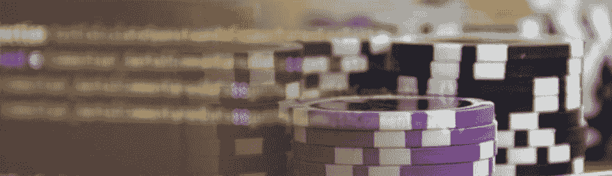

# 复习轮盘赌:每个人都是赢家！

> 原文:[https://dev . to/moxio/review-roulette-every one-is-a-winner-2599](https://dev.to/moxio/review-roulette-everyone-is-a-winner-2599)

[T2】](https://res.cloudinary.com/practicaldev/image/fetch/s--egiIydwq--/c_limit%2Cf_auto%2Cfl_progressive%2Cq_auto%2Cw_880/https://cdn-images-1.medium.com/max/1024/1%2AFFFxaa8gac_EMwOKoPQt_g.jpeg)

在之前的博客文章中，我介绍了我们的评审轮盘(Review Roulette)的想法，这是一个随机的代码评审过程，目的是促进学习和增加集体代码所有权。我解释说，我们将把这个想法作为一个实验试行两个月，然后进行评估。我还承诺分享这次评估的结果。在这篇文章中，我会这样做，并描述我们采取的步骤，使审查轮盘赌工作更好地为我们服务。

### 评估…

为了进行评估，我们要求所有参与者填写一份简短的问卷，从三个不同的角度提出问题:

*   作为评审者的经历
*   作为被评审者的经历
*   总体印象

这些问题集中在审查轮盘作为发现缺陷、提高内部质量和分享知识的一种手段的(感知的)有用性上。此外，我们还询问了一些我们认为是良好运行流程的潜在障碍的方面，如时间消耗和沟通方面。

从结果我们可以得出结论，总的来说，审查轮盘收到了真正积极的反馈。100%的参与者同意我们应该将实验作为一个结构化过程继续下去，“我认为做复习轮盘赌是有用的”这句话平均得到了 4.75 分(满分 5 分)。对我们来说，这足以让我们决定继续做《回顾轮盘赌》,直到今天我们还在做。根据反馈，我们做了一些小的调整。

### …并调整

在问卷调查结果中，我们注意到“我被分配的提交对审查是有用的”这句话的平均得分只有 3.38 分(满分 5 分)，63%的参与者得分为 3 分或更低。这主要是由随机选择进行审查的具有琐碎的单行文本更改的提交造成的。为了改进这一点，我们添加了一个过滤器，只选择相关源文件(php、js、css、json 等)中至少有 3 行更改的提交。)为符合审核条件。使用 [diffstat](http://linuxcommand.org/man_pages/diffstat1.html) 来分析提交，这种过滤器的实现相当简单。这应该剔除掉大多数琐碎的更改，只留下更有趣的提交供审查。作为一个副作用，这也修复了二进制文件的导入被提交审查的问题。

我们发现的另一个障碍是做轮盘赌复习所需的时间。虽然我们在开始实验时同意每周一小时的时间限制，但“我能够找到足够的时间来审查分配给我的提交”这句话平均只得到 5 分中的 3 分，63%的参与者得到 3 分或更低。这主要是受我们数量相对较多的学生员工的影响，他们除了学习之外，每周还要工作一到两天。虽然一周一小时对于全职工作来说几乎可以忽略不计，但当你的工作时间只有 8-16 小时时，这是一项重大的时间投资。根据这些反馈，我们为兼职员工引入了双周计划(每两周只给他们分配一次评估)，同时让全职员工保持原来的周计划。这确保了我们仍然可以从与学生员工的双向知识共享中受益，同时限制他们需要花费在 it 上的时间。

### 最后一次观察

问卷调查结果中一个有趣的观察结果是，从被审查者的角度来看，审查轮盘的感知有用性高于从审查者的角度来看，无论是在发现的错误(3.38 比 2.63，满分 5 分)还是改进的设计(4.50 比 3.13，满分 5 分)方面。从中得出的教训是，我们不能低估我们给予他人的反馈的价值。对我们自己来说可能看起来微不足道或属于特定领域的事情，对同事来说可能是全新的。这正是我们旨在利用“回顾轮盘”扩大的知识共享类型。

### 结论

这种实验和评估与敏捷软件开发有很多相似之处:从一个小而简单的实验开始，然后进行评估和调整通常是有用的。我们已经使用了 4 个月的轮盘赌，并且对它带来的附加价值非常满意。

*原载于 2017 年 3 月 30 日*[*【www.moxio.com】*](https://www.moxio.com/blog/15/review-roulette-everyone-is-a-winner)*。*

* * *