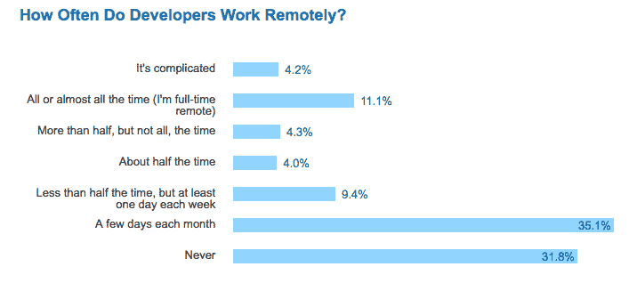
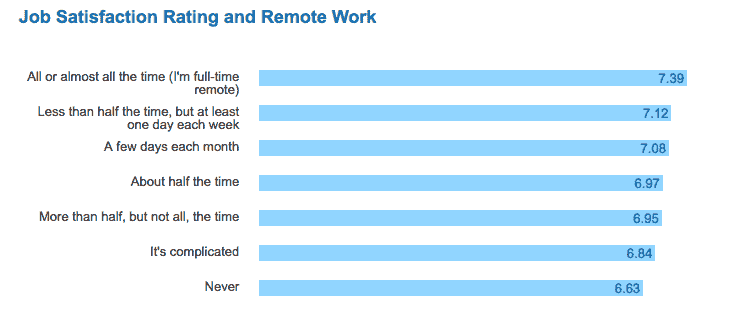
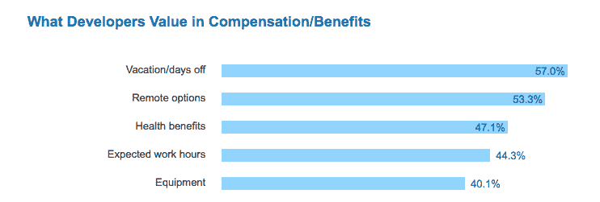

# 三分之二的开发人员至少有时远程工作，这个数字与工作满意度高度相关。

> 原文：<https://dev.to/walker/two-thirds-of-developers-work-remotely-at-least-some-of-the-time-and-this-number-is-highly-correlated-with-job-satisfaction>

远程工作，或者更通俗地说，在家工作(WFH)的地位目前还不确定。虽然这种自由在创业环境中几乎是假定的，但近年来一些科技巨头已经废除了这种做法。

特别是，让员工走进实体办公室似乎是大公司摆脱停滞的一种方式:玛丽莎·梅耶尔在接管雅虎时禁止了 WFH 从上周开始 [IBM 的营销部门正式要求他们的员工到六个中心地点之一报到](http://www.businessinsider.com/ibm-slashes-work-from-home-policy-2017-3)。

根据 Stack Overflow 的年度调查，这些变化与大多数开发者的偏好直接对立。三分之二的受访者表示至少有时会远程工作:

[T2】](https://res.cloudinary.com/practicaldev/image/fetch/s--0c7zBVQ7--/c_limit%2Cf_auto%2Cfl_progressive%2Cq_auto%2Cw_880/https://d1ax1i5f2y3x71.cloudfront.net/items/1a3e41091C2W0S3G0q3I/Screen%2520Shot%25202017-03-24%2520at%252012.28.09%2520PM.png%3FX-CloudApp-Visitor-Id%3D2119651)

支持远程工作的理由很多。它对环境友好，节省公司建立和维护大型物理设施的时间和金钱，并使残疾人或居住在远处的人更容易工作:

液体错误:内部

Stack Overflow 的调查还提供了一些初步迹象，表明工作满意度与远程选项相关:

[T2】](https://res.cloudinary.com/practicaldev/image/fetch/s--43siF-6p--/c_limit%2Cf_auto%2Cfl_progressive%2Cq_auto%2Cw_880/https://d1ax1i5f2y3x71.cloudfront.net/items/37322t060z3h3d270118/Screen%2520Shot%25202017-03-24%2520at%252012.34.57%2520PM.png%3FX-CloudApp-Visitor-Id%3D2119651)

毫不奇怪，在家里工作的选择是开发人员在估算工作报酬时的一个重要考虑因素。休假后，这是调查受访者最看重的好处:

[T2】](https://res.cloudinary.com/practicaldev/image/fetch/s--okLaNnOA--/c_limit%2Cf_auto%2Cfl_progressive%2Cq_auto%2Cw_880/https://d1ax1i5f2y3x71.cloudfront.net/items/0N1c3M220d2u1j321n0f/Screen%2520Shot%25202017-03-24%2520at%252012.41.35%2520PM.png%3FX-CloudApp-Visitor-Id%3D2119651)

在决定是否允许员工去 WFH 时，每家公司都有自己的文化和组织特质需要考察。有可能雅虎！IBM 最近反对增加远程选项趋势的行动将被证明是明智的决定。但是，如果我们把这项调查的结果作为更广泛的模式的任何迹象，他们可能会因为要求员工到办公室来而疏远潜在的雇员:

> 大卫·哈尼@ Haney codes我认为选择不拥抱远程工作的科技公司在人才方面会远远落在后面…[twitter.com/i/web/status/8…](https://t.co/NK3yxsEurY)下午 17:15-2017 年 3 月 22 日实用开发[@ The Practical Dev](https://dev.to/thepracticaldev)

当然，在家工作也有一些陷阱。除非你一个人住，否则你总是有被室友打扰的风险，这在最糟糕的情况下也会发生...

[T2】](https://i.giphy.com/media/3oKIPoAP1wLvewc7QI/giphy.gif)