# 我们建造了一个巨大的像素墙来取乐，但是我们学到了更多。

> 原文:[https://dev . to/kylessg/we-build-a-giant-pixel-wall-for-fun-but-what-we-learned-a-lot-beyond](https://dev.to/kylessg/we-built-a-giant-pixel-wall-for-fun-but-what-we-learnt-went-a-lot-further)

每个科技公司都有副业，固态公司也不例外。它让开发人员保持动力，并灵活运用日常编码有时达不到的大脑。有时这些附带项目变成了产品，有时我们打开一瓶啤酒，问“我们到底在想什么”，但我们总能学到一些东西——关于过程，也许还有我们自己。我们已经深入客户软件开发项目几个月了，并决定下一个内部项目需要是一个实体的东西——建造我们大声呼喊的墙。事实上，我们在 Slack 上喊过这个，直到 pixel wall 成为一个东西。随着这个东西在几周内成形，我意识到尽管有很酷的技术，深夜编码和解决问题，它从来不只是关于墙。在这里，我记录了我们做了什么，我们学到了什么，以及我对这个项目的感受。

## 灵感

我们受到了谷歌创意实验室 [anypixel.js](https://googlecreativelab.github.io/anypixel/) 的启发。project(一个用于创建大型交互式显示器的开源软件和硬件库)。
我们查看了所有可用的工具包，最终得到的是 RIO:渲染-输入-输出。由一个定制的移动应用程序驱动，RIO 邀请玩家通过 LED 互动墙体验一系列高保真视频游戏。它还允许用户即时发布 gif、视频和排版——这毕竟很有趣。

[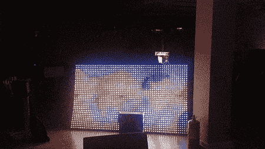T2】](https://res.cloudinary.com/practicaldev/image/fetch/s--j-jw30cw--/c_limit%2Cf_auto%2Cfl_progressive%2Cq_66%2Cw_880/https://storage.googleapis.com/ssg-website-images/rio/rio-vid.gif)

## 保持事物简单轻便

我们喜欢试验和融合各种技术，但看不出过度工程化的意义。最初，我们尝试实现谷歌的图书馆，但很快意识到这是一个过度工程化的方法来满足我们的需求。我们觉得我们可以自己创建一个库，对于那些想做一些很酷的东西的好奇的开发者来说，这个库更容易构建和理解。

## 软件

我们需要一种向像素发送数据的方法，所以我们开始开发一个简单的 api 来“绘制”我们的像素。我们使用 Slack 作为接口，从互联网上传递 gif 或视频，并将其转换为与我们显示器上的像素数量相匹配。我们还制作了一个 web 应用程序，它使用 HTML5 Canvas 元素作为一种直接向 pixel wall 绘制和发送数据的方式。

[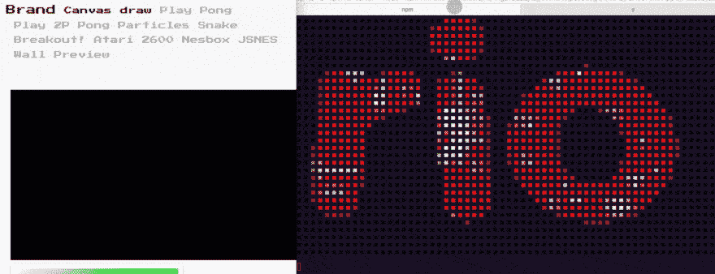T2】](https://res.cloudinary.com/practicaldev/image/fetch/s--n8kAtqhQ--/c_limit%2Cf_auto%2Cfl_progressive%2Cq_66%2Cw_880/https://storage.googleapis.com/ssg-website-images/rio/rio-webapp-example.gif)

然后，我们可以解释所有这些数据，并将其输出到 LED 本身。
[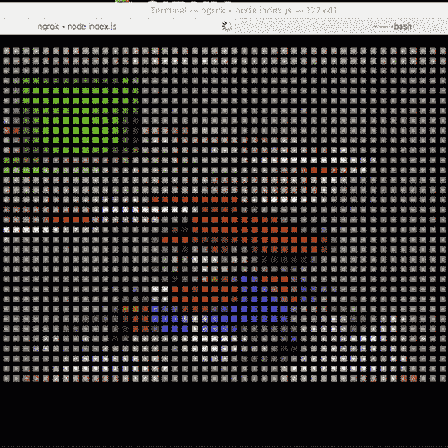](https://res.cloudinary.com/practicaldev/image/fetch/s--b9T8ZaxB--/c_limit%2Cf_auto%2Cfl_progressive%2Cq_66%2Cw_880/https://storage.googleapis.com/ssg-website-images/rio/mario-terminal.gif)
[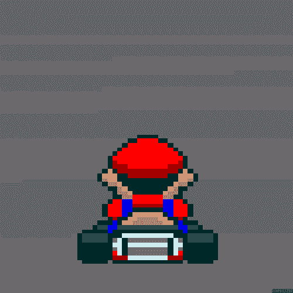](https://res.cloudinary.com/practicaldev/image/fetch/s--JDlOBMR1--/c_limit%2Cf_auto%2Cfl_progressive%2Cq_66%2Cw_880/https://storage.googleapis.com/ssg-website-images/rio/mario-giphy.gif)

将彩色像素写入终端，作为将在我们的 LED 上显示的预览

## 硬件

在[谷歌的安装](https://www.youtube.com/watch?v=58pxJ8z1Vow)中，他们的文档显示他们使用定制的 PCB 和几个定制的微控制器来驱动他们的像素。我们决定简化我们这边的硬件，所以让我们的 API 与一个典型的 Arduino 设置和一些 WS2812B(行业标准可链接 led)一起工作。

[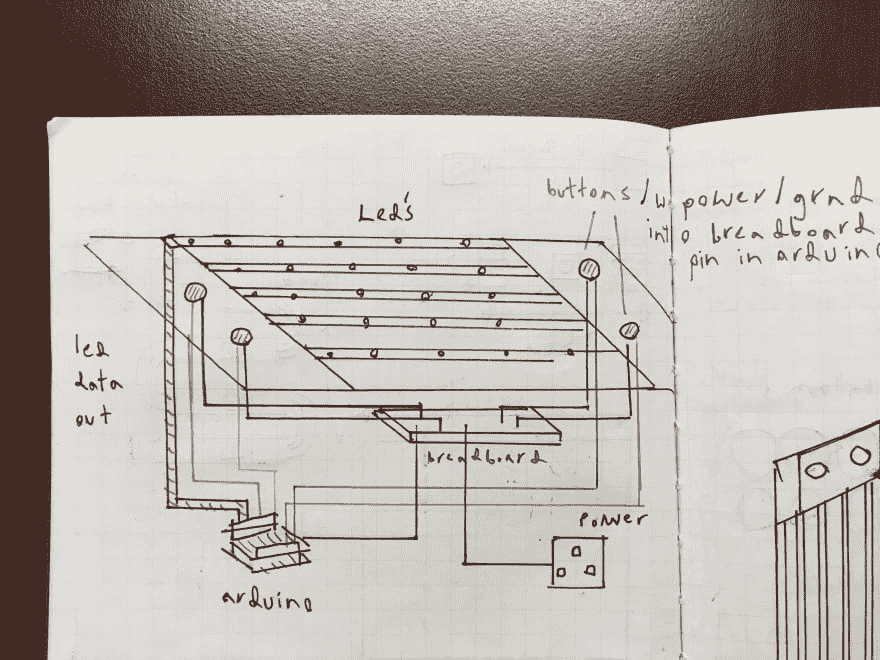T2】](https://res.cloudinary.com/practicaldev/image/fetch/s--WHKiHCth--/c_limit%2Cf_auto%2Cfl_progressive%2Cq_auto%2Cw_880/https://storage.googleapis.com/ssg-website-images/rio/image_5.jpg)

[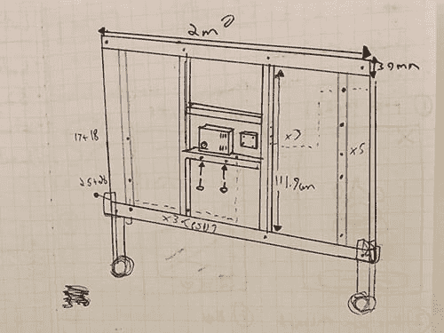T2】](https://res.cloudinary.com/practicaldev/image/fetch/s--lab_EZSe--/c_limit%2Cf_auto%2Cfl_progressive%2Cq_auto%2Cw_880/https://storage.googleapis.com/ssg-website-images/rio/IMG_2002-new.jpg)

实际计划——所有事情都写在纸上

[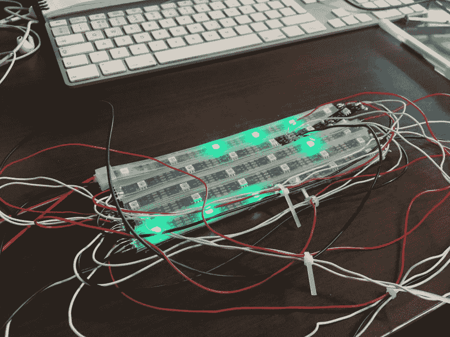T2】](https://res.cloudinary.com/practicaldev/image/fetch/s--kFZOyDnh--/c_limit%2Cf_auto%2Cfl_progressive%2Cq_auto%2Cw_880/https://storage.googleapis.com/ssg-website-images/rio/image_7.jpg)

[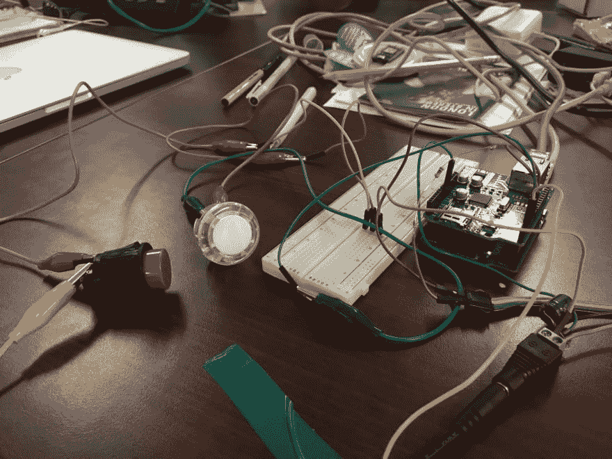T2】](https://res.cloudinary.com/practicaldev/image/fetch/s--dvKE46jK--/c_limit%2Cf_auto%2Cfl_progressive%2Cq_auto%2Cw_880/https://storage.googleapis.com/ssg-website-images/rio/image_8.jpg)

[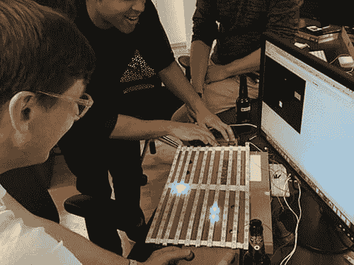T2】](https://res.cloudinary.com/practicaldev/image/fetch/s--8rags-L0--/c_limit%2Cf_auto%2Cfl_progressive%2Cq_auto%2Cw_880/https://storage.googleapis.com/ssg-website-images/rio/IMG_1016-square.jpg)

看看我们的兴奋——它是活的

## 我们需要一堵更大的墙

我们很快就厌倦了我们粗糙的 6 x 5 led 原型，并升级到 15 x 10 矩阵，配有一些按钮，所以我们当然可以玩 LED pong。

[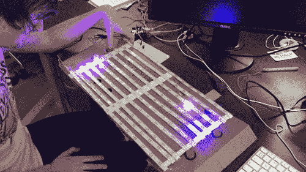T2】](https://res.cloudinary.com/practicaldev/image/fetch/s--04yv3xej--/c_limit%2Cf_auto%2Cfl_progressive%2Cq_66%2Cw_880/https://storage.googleapis.com/ssg-website-images/rio/prototype-led-pong.gif)

## 放大比例

一旦我们完成了最初的原型，我们必须开始考虑扩大规模。然而，随着像素的增加，问题也越来越多，LED 吞噬 RAM 并消耗大量电力，所以我们从 Arduino 切换到 Raspberry Pi，并为自己提供了相当强大的电源。我们将 led(确切地说是 2040 个)安装在一块两米宽的丙烯酸板上，确保我们的像素彼此等距。

[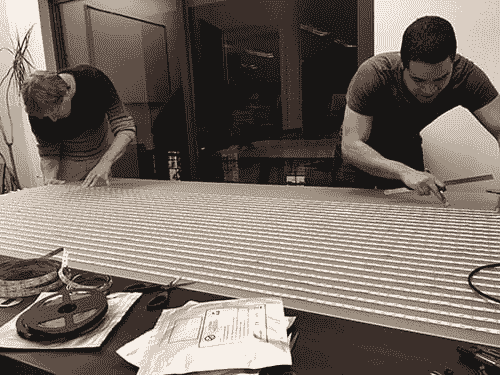T2】](https://res.cloudinary.com/practicaldev/image/fetch/s--NFf1dXGx--/c_limit%2Cf_auto%2Cfl_progressive%2Cq_auto%2Cw_880/https://storage.googleapis.com/ssg-website-images/rio/IMG_1550.jpg)

[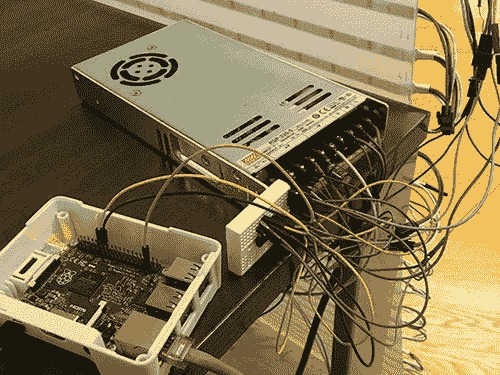T2】](https://res.cloudinary.com/practicaldev/image/fetch/s--lisqSNra--/c_limit%2Cf_auto%2Cfl_progressive%2Cq_auto%2Cw_880/https://storage.googleapis.com/ssg-website-images/rio/IMG_1833.jpg)

[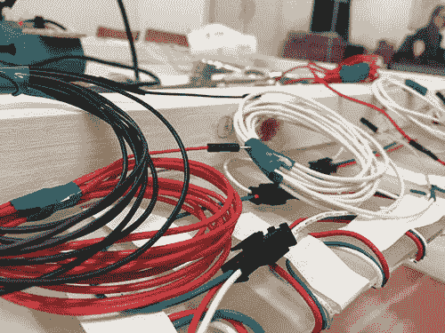T2】](https://res.cloudinary.com/practicaldev/image/fetch/s--z3Z6MEhO--/c_limit%2Cf_auto%2Cfl_progressive%2Cq_auto%2Cw_880/https://storage.googleapis.com/ssg-website-images/rio/IMG_2029.jpg)

这是我们这种墙

## 控制？这需要一个手机 App

当谈到与墙壁的互动时，我们希望保持它的灵活性。我们用街机按钮做了原型，甚至让它用 RFID 阅读器“加载”新游戏。我们擅长的一件事是开发移动应用程序，因此开发一个程序来控制显示器的输出似乎是明智的。

该应用程序包括一个受 SNES 启发的控制器，用于玩复古视频游戏，一个向墙壁发送文本的信息功能，一个实时绘图应用程序和一个虚拟预览墙上正在显示的内容。我们修改了 arcade classics 的开源 HTML5 Canvas 版本，以便与我们的 API 一起工作。他们中的大多数碰巧使用了 React，这真的很方便(我们喜欢 React，见我们的另一篇[帖子](https://dev.to/kylessg/its-cross-platform-and-massively-reduces-app-dev-costs-but-wtf-is-react-native/))。

我们增加了一些其他游戏，如贪吃蛇，突围和超级马里奥兄弟。

[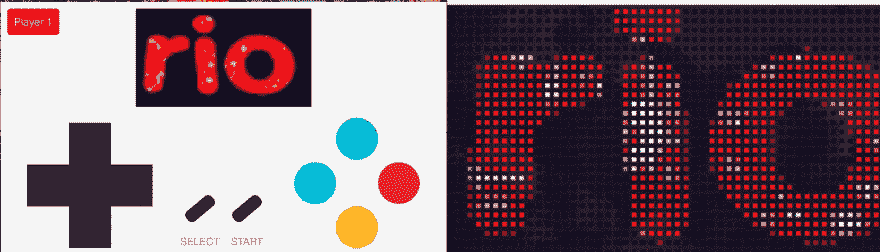T2】](https://res.cloudinary.com/practicaldev/image/fetch/s--g9XN-PkV--/c_limit%2Cf_auto%2Cfl_progressive%2Cq_66%2Cw_880/https://storage.googleapis.com/ssg-website-images/rio/rio-mobile-example.gif)

## 我们学到了什么？

**做自己喜欢的事情:**除了所有技术上的优点，对我来说最重要的是我们提醒自己最初是什么让我们对开发感到兴奋。我们了解到，在一两杯啤酒的刺激下，3 devs 会很乐意熬夜一起做些有趣的事情。

**知道你不知道的:**我们还提醒自己，有很多东西我们不知道——尤其是在硬件方面。建造物质需要时间。

善良，倒带:在我过去参与的项目中，我花了几个小时摆弄电子设备，结果却遭遇了失败。这个项目没有什么不同，特别是当我们开始扩大规模的时候。就像构建一个软件一样，有必要及时构建来废弃和迭代概念和设计。
所以，总之…

我们认为没有必要过度设计。我们最终得到的是一个轻量级的替代方案，用于构建您自己的连接显示器。我们包含了一个[链接，链接到一个存储库](https://github.com/SolidStateGroup/rio) ，里面有我们所有的零碎信息，希望其他人可以从中学习。你需要做的就是买你自己的硬件，也许还有几瓶啤酒；)玩得开心。

你可以在这里看到身体构造[的所有照片。](https://photos.google.com/share/AF1QipNE6GI4yR7Xrj-BhyxLmDCA498l7PvgQ-71pDI70WiOFIKoqHnMmzYIydt_a2q4AA?key=RnRaRVdpVHpDQTIxMHl5SzBVemd6ZjU1WWRIejZ3)