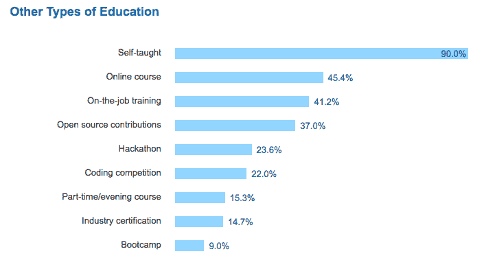
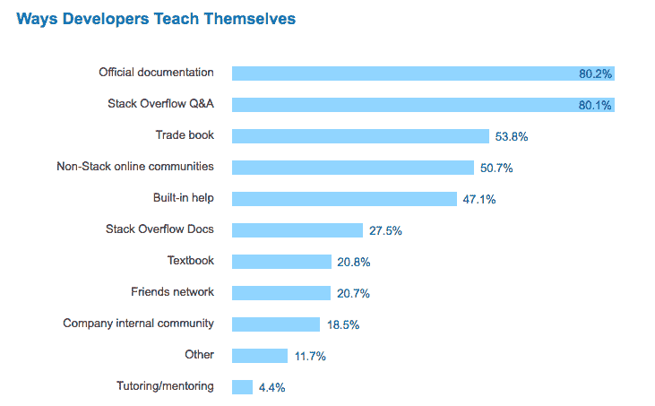
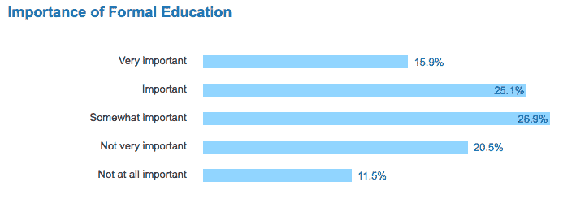

# 自学:绝大多数程序员依靠自学和在线资源

> 原文：<https://dev.to/walker/bootstrapping-your-education-vast-majority-of-coders-rely-on-self-teaching-and-online-resources>

计算机科学和软件开发长期以来一直致力于非传统形式的教育。进入门槛低(有互联网连接？)，以及寻找更好更快的方式来共享信息的精神，编程感觉比法律或医学更灵活。对于一位科技名人来说，拒绝传统培训，支持自己的个性化追求几乎已经成为老生常谈。

来自 [Stack Overflow 的 2017 年开发者调查](https://stackoverflow.com/insights/survey/2017#education)的结果支持这一观点，因为 90%的受访者报告称依靠自学来磨练技能，近一半的受访者参加了在线课程:

[T2】](https://res.cloudinary.com/practicaldev/image/fetch/s--eUgU17EK--/c_limit%2Cf_auto%2Cfl_progressive%2Cq_auto%2Cw_880/https://d1ax1i5f2y3x71.cloudfront.net/items/1S1v230C3d2f1f3x3z0N/Screen%2520Shot%25202017-03-24%2520at%252011.20.19%2520AM.png%3FX-CloudApp-Visitor-Id%3D2119651)

这当然是 Stack Overflow 的好消息，Stack Overflow 是一个问答论坛，其前提是开发人员既足智多谋又慷慨大方，如果他们不明白某件事，愿意询问编程社区，如果他们明白了，愿意提供指导。

事实上，80%的受访者认为堆栈溢出是自我教育的主要资源:

[T2】](https://res.cloudinary.com/practicaldev/image/fetch/s--tndiLxin--/c_limit%2Cf_auto%2Cfl_progressive%2Cq_auto%2Cw_880/https://d1ax1i5f2y3x71.cloudfront.net/items/2Y3m3y3n0R2e3x203F1Z/Screen%2520Shot%25202017-03-24%2520at%252011.24.15%2520AM.png%3FX-CloudApp-Visitor-Id%3D2119651)

但是，人们应该毫不犹豫地将整个行业描述为一群自学成才的辍学者，他们共同揭示了高价正规教育的无用性。事实上，教育背景是整个调查中最不明确的领域之一。整整四分之一的受访者获得了硕士或博士学位，但另有 30%的人最多完成了高中水平的教育。

这些不同的方法反映在参与者对正规教育到底有多重要的看法上，从“一点也不重要”到“非常重要”的每一个同意程度都至少得到 10%的投票:

[T2】](https://res.cloudinary.com/practicaldev/image/fetch/s--scun-fvS--/c_limit%2Cf_auto%2Cfl_progressive%2Cq_auto%2Cw_880/https://d1ax1i5f2y3x71.cloudfront.net/items/2M1d2d3R003t3F2D2c2k/Screen%2520Shot%25202017-03-24%2520at%252011.36.41%2520AM.png%3FX-CloudApp-Visitor-Id%3D2119651)

显然，学习如何编码的方法不止一种，很可能受访者更喜欢他们碰巧选择的任何一种方法。此外，你的工作性质也是一个重要因素，因为一些角色，如数据科学家，似乎比其他人更重视正规教育，如平面设计师:

> 数据科学家/ML 开发者最有可能认为正规教育很重要；图形设计师和系统管理员最不可能[# stack survey 17](https://twitter.com/hashtag/stacksurvey17?src=hash)【pic.twitter.com/Ed3STfLyez】T2
> 
> — David Robinson (@drob) [March 22, 2017](https://twitter.com/drob/status/844620736652300290)

当然，传统的课堂学习和谷歌搜索错误信息并不相互排斥。通常两种方法之间的相互作用是最有效的学习策略。

因此，无论你是在听课还是在钻研习题集，共享在线资源似乎都很重要，这也是 Stack Overflow(以及 dev.to！)会不断要求你们让彼此成为更好的开发者。