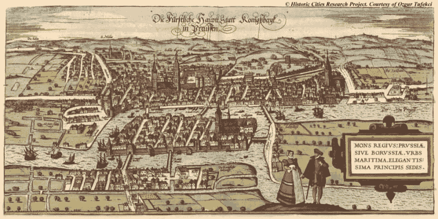
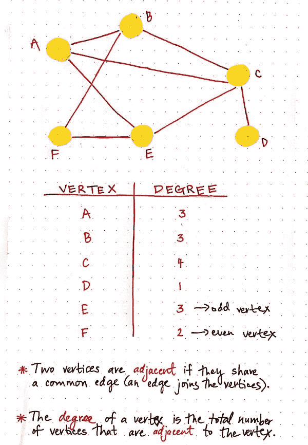
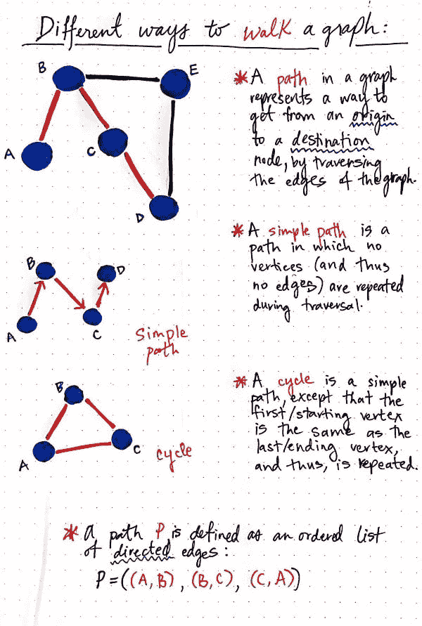
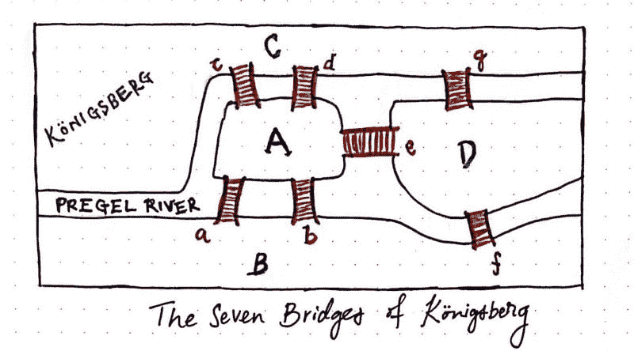
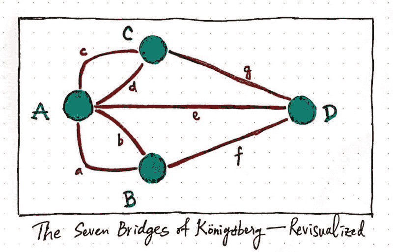
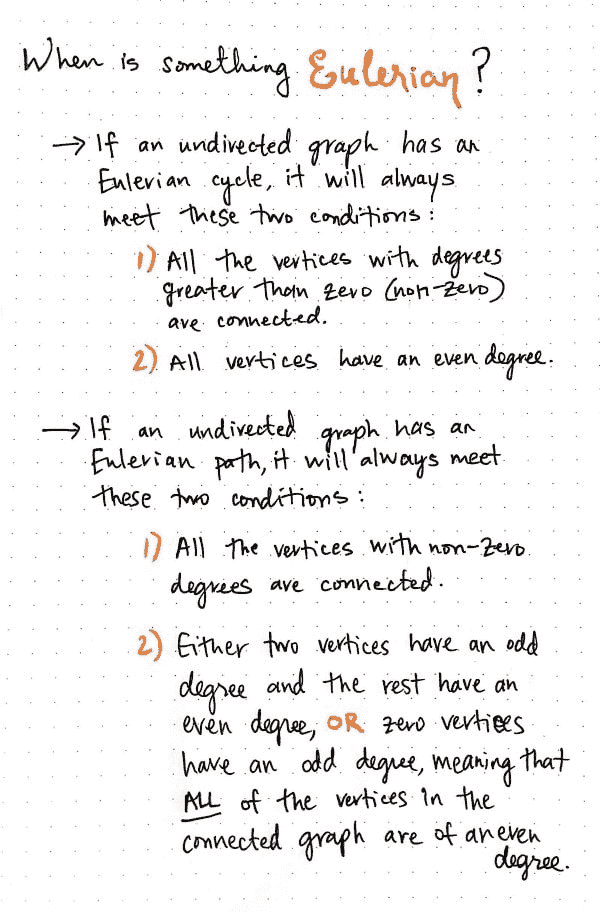
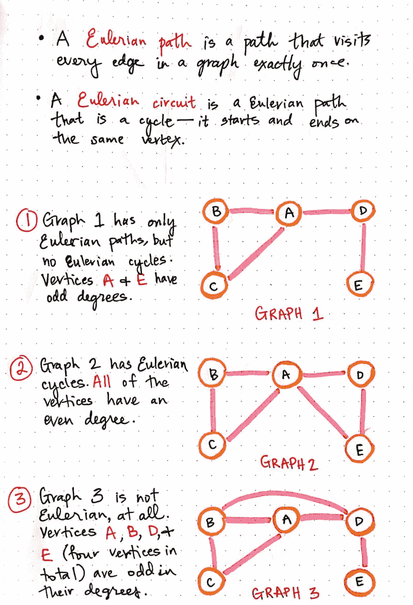
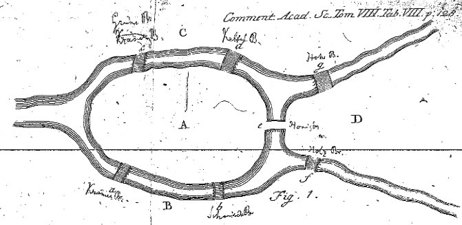

# 柯尼斯堡:七座小桥，一个巨型图问题

> 原文：<https://dev.to/vaidehijoshi/knigsberg-seven-small-bridges-one-giant-graph-problem>

如果你喜欢电脑——尤其是喜欢编程电脑——那么你肯定知道勇气的价值。你知道坚韧不拔、不断前进、勇往直前有多重要，并说服自己一定有(更好的)方法去做某事。但是还有一个同样重要的特质，如果不是比这个更重要的话:转换视角的能力。

重新定位一个人的视角当然是一个伟大程序员的标志性特征。我钦佩和尊敬的所有开发人员都是这一特点的典范。然而，不仅仅是工程师从中受益——所有问题解决者和创造性思考者似乎每天都在这样做。事实上，我敢说，正是他们从另一个角度和不同的角度看待事物的能力使他们成为了创新者。

也许没有比莱昂哈德·欧拉更好的例子了，他是数学家、天文学家和工程师(只是他众多头衔中的少数几个)，对微积分做出了重大贡献，实际上是[创造了我们每天都依赖的图论](https://dev.to/vaidehijoshi/a-gentle-introduction-to-graph-theory)。

但是他是怎么做到的呢？

首先，他肯定不是这样做的，他某天醒来想:*好了，伙计们，我要建立一个新的数学分支，它最终将成为 300 年后网络如何工作的基石！没有。相反，事实是:他面临一个简单的问题。欧拉如何解决这个问题的故事围绕着他如何转换视角，以一种前无古人的方式来解决这个问题。*

### 在康尼斯堡散步

早在 1735 年，欧拉就听说了柯尼斯堡镇面临的一个有趣的问题。

当时，柯尼斯堡是德国的一座城市，这座城市是围绕着一条名为普雷格尔河的河流而建的。这座城市因其商业经济而繁荣，其繁荣的部分原因是因为它的结构非常有趣。普雷格尔河中间有两个大岛，它们彼此相连，并与两边的河岸相连，构成了城市的大部分。他们是如何联系在一起的？当然是在桥边！实际上是七个。

这是一幅美丽的版画，它比我想象的更好地描绘了柯尼斯堡:

[T2】](https://res.cloudinary.com/practicaldev/image/fetch/s--Hr0o5zN6--/c_limit%2Cf_auto%2Cfl_progressive%2Cq_auto%2Cw_880/https://cdn-images-1.medium.com/max/1000/1%2ARjE1EQs2LCJrnysAHYZrWg.png)

柯尼斯堡的市民们周日在镇上漫步，享受他们美丽的城市。在这个过程中，他们想出了一个游戏———,事实证明，这个游戏非常难以完成。目标是一次走过所有七座穿过岛屿的桥，而不重复走过任何一座桥。

起初，当人们要求欧拉解决这个问题时，他不予理会，认为这与数学无关，因此不值得他花费时间。但是他越想越感兴趣。在给一位数学家朋友的信中，他写道:

> 这个问题如此平庸，但在我看来却值得关注，因为无论是几何、代数，甚至是计数艺术都不足以解决这个问题。

他被迷住了。事实上，欧拉是如此着迷，以至于他在那年晚些时候写了一篇论文，其中包含了桥梁问题的解决方案。但是在我们理解欧拉是如何解决这个问题之前，我们需要先了解一些基本的图论规则。

### 度和路径和周期，啊呀！

我们已经通过图论了解了一些不同类型的图，比如有向图和无向图。但是，我们仍然只是触及了图表工作原理的表面。

例如，正如边可以被分类为*有向*或*无向*一样，顶点(有时也称为节点)也可以根据它们如何链接到图中的*和其他*节点来分类。

[T2】](https://res.cloudinary.com/practicaldev/image/fetch/s--D0xuT4-d--/c_limit%2Cf_auto%2Cfl_progressive%2Cq_auto%2Cw_880/https://cdn-images-1.medium.com/max/600/1%2Ab08yrU1xxWfotpiYSsyIdQ.jpeg)

让我们看看旁边的图表。

乍一看，我们已经可以从这个看似简单的结构中收集到很多信息。我们知道顶点 C 与顶点 d 相连，我们也可以知道顶点 B 是*而不是*与顶点 d 相连，很简单，对吗？

嗯，随着图形的增长，这些连接变得越来越重要，能够很容易地识别哪些顶点与其他顶点相连接会很有帮助。我们用来描述两个相连顶点的术语是**邻近**。例如，顶点 F 和 E 相邻，因为它们有一条公共边(连接它们的边 FE)。

另一个有用的(也是重要的！)顶点的分类方式是根据它们的度数。顶点的**度**是与该顶点相邻的顶点的总数。

> TL；定义顶点度数的 dr 版:这个节点有多少个邻居顶点？

顶点 D 只与另外一个节点相连，所以它的度为 1。另一方面，顶点 C 有另外四个相邻节点，这意味着它的度为 4。重要的是要注意:一个顶点可能有偶数或奇数的度数——但是我们稍后会深入探讨。

好的，我们可以根据边是有向的还是无向的来分类。我们也可以根据顶点与多少其他顶点相连来对顶点进行分类。

酷毙了。

但是等等:还有更多！(很明显)。还有另一种识别图形的方式，它与我们如何遍历图形有关——也就是说，我们从一个顶点到另一个顶点的方式。

通常，当我们使用图来实现数据结构时，我们关心的是我们的数据如何相互关联。也就是说，我们*关心*节点如何连接到其他节点，因为我们通常想从一个节点到另一个节点。这就是图遍历的用武之地。对于遍历，有不同的算法可以派上用场，这取决于您所拥有的图形类型。但是我们今天不讨论这些。相反，让我们从简单的开始，讨论我们在讨论遍历一个图时使用的单词。

大多数时候，当人们提到遍历一个图时，他们使用术语“路径”。图中的**路径**就是指从一个顶点(起点)到另一个顶点(终点)的路径。为了从一个顶点到另一个顶点，我们必须穿过图中的一些边。

> 路径表示我们从哪个节点开始，经过哪些边，以及在哪个节点结束。

然而，很多时候人们把“路径”和“简单路径”混淆了。它们实际上有一点不同，重要的是要认识到是什么将这两个术语区分开来。路径不必遵循任何规则——我们可以从您喜欢的任何地方开始，以我们喜欢的任何方式遍历图形，只要我们最终到达目的节点。简单的路径有更多必须遵循的规则。

> 简单路径是一种更受限制的独特路径类型:在**简单路径**中，遍历图形时没有节点或边可以重复。

[T2】](https://res.cloudinary.com/practicaldev/image/fetch/s--Rg_8rdvW--/c_limit%2Cf_auto%2Cfl_progressive%2Cq_auto%2Cw_880/https://cdn-images-1.medium.com/max/600/1%2AbjfpJgF3MeOMVJshzLEBMg.jpeg)

如果你发现自己面临一个图形问题，一定要弄清楚并理解你是在处理通过图形寻找一条*路径*还是一条*简单路径*——因为它们会深刻地影响你处理数据结构的方式。

最后，还有**循环**，这是一个简单的路径，除了我们必须在我们开始的同一个节点结束我们的遍历。也就是说，开始的“原点”节点和结束的“目的地”节点是完全一样的，我们在过程中遍历了图的所有节点和边。

我们已经知道[图的正式定义](https://dev.to/vaidehijoshi/a-gentle-introduction-to-graph-theory)是一个有序对，包含一组顶点和一组边。我们可以用类似的方式**定义一条路径**(或者一条简单的路径，或者一个循环):作为一个有序的*有向边列表*。这里的有向边很重要，因为我们需要能够显示哪个节点是起点，哪个节点是终点，以及当我们从一个节点穿越到另一个节点时要穿越的边。

好吧，好吧——我们已经讨论了所有这些术语和规则，但是我想知道的是……欧拉到底怎么了？！好吧，是时候(最终)找出答案了。

### 走在欧拉的道路上

当欧拉解决他的七桥问题时，他把它分解成更小的，一口大小的部分。他将问题简化成几个部分，并以不同的方式将柯尼斯堡的桥梁形象化。

最终，他用不同的视角解决了这个问题。他没有写出每一个可能的路径交叉点(欧拉指出这是不可持续的/不可扩展的，也是低效的)，而是通过可视化来简化问题。在他的笔记本中，我们很幸运地保留了下来，直到今天，欧拉把桥梁问题描述成这样:

[T2】](https://res.cloudinary.com/practicaldev/image/fetch/s--GN2n6uB8--/c_limit%2Cf_auto%2Cfl_progressive%2Cq_auto%2Cw_880/https://cdn-images-1.medium.com/max/800/1%2AEnntiaJYoXdz2swncIpFJQ.jpeg)

根据美国[数学协会](http://www.maa.org/press/periodicals/convergence/leonard-eulers-solution-to-the-konigsberg-bridge-problem)对欧拉笔记的分析，欧拉用大写字母——A、B、C、D——来表示陆块，并决定追踪陆块之间的桥梁“交叉点”,起点和终点都在那里。例如，从大陆 A 到 B，桥上的行程称为 AB。如果一个人从 B 大陆穿越到 D 大陆，整个旅程将被想象为:ABD。这将代表跨越两座桥，触及三块大陆。

在做这个练习的过程中，欧拉意识到，为了跨越*七*座桥梁——就像在柯尼斯堡市的情况一样——这个问题至少需要八个“陆块”,或者字母序列才能解决。

> 欧拉意识到*不可能*只穿过一次柯尼斯堡的七座桥！

欧拉解决这个问题的方法是改变他的方法，创造一种前无古人的表现形式。他将七桥问题形象化为一个网络，最终成为我们今天所知的图形结构的基础。在欧拉解决这个问题几个世纪后，数学家们以图表的形式重新绘制了他的相同表示，这对我们来说应该很熟悉:

[T2】](https://res.cloudinary.com/practicaldev/image/fetch/s--35sSYxA6--/c_limit%2Cf_auto%2Cfl_progressive%2Cq_auto%2Cw_880/https://cdn-images-1.medium.com/max/800/1%2A94Ex37b-oFyV8Dc_Okp2nQ.jpeg)

尽管欧拉解开了谜题，证明了穿越柯尼斯堡是不可能的，但他并不完全满意。所以他继续研究，发现在特定的情况下，完全有可能只通过一次“网络”的桥梁。

今天，我们经常将这种类型的图遍历称为具有**欧拉路径**或**欧拉回路**的图。

> 欧拉路径是这样一种路径，其中我们只对图中的每条边访问一次，而欧拉回路是一种循环的欧拉路径——我们只对每条边访问一次，并且我们在与开始时完全相同的节点上结束。

欧拉确定，给定图/网络中的一组特定环境，可以找到一条简单的路径。因为他，我们又有了另一种分类图的方法:基于它们是否是 T2、欧拉、T4 和 T5。

[T2】](https://res.cloudinary.com/practicaldev/image/fetch/s--wvMKfyVR--/c_limit%2Cf_auto%2Cfl_progressive%2Cq_auto%2Cw_880/https://cdn-images-1.medium.com/max/600/1%2AHL6ns9DJ00Lrx06zfewsmQ.jpeg)

欧拉的数学证明确定了如果我们只遍历一次一个图的边，它必须满足某些条件。

例如，为了使无向图具有**欧拉循环**，图中所有具有度数的顶点都必须连接——也就是说，图中所有连接的顶点都必须具有大于零的度数*——并且图中所有顶点 ***都必须具有偶数度数*** 。*

 *类似地，为了让一个无向图有一条**欧拉路径**(但不是一个圈)，所有度数不为零的顶点必须被连接，并且必须发生以下两种情况中的一种:1)两个顶点的度数必须是奇数，或者 2)连通图中的所有顶点的度数必须是偶数。

这可能有点令人困惑，除非我们真的停下来想一想。我喜欢剑桥大学 NRICH 项目的教授解释为什么这个桥问题不可能基于欧拉证明的方式:

> 欧拉证明了这是不可能的，因为他发现要有一个奇数顶点，你必须在那个顶点开始或结束旅行。(想想吧)。由于只能有一个起点和一个终点，如果你只能在每条弧线上追踪一次，那么只能有两个奇数顶点。因为桥的问题有 4 个奇数顶点，这是不可能的！

最终，一切都归结于顶点的度数！(记得我说过这很重要吗？)如果有四个奇数度的顶点，就不可能解决桥接问题。

根据欧拉的证明，只有当图中的*所有*顶点都是偶数，或者只有*两个*顶点是奇数时，我们才能求解。但是四个奇怪的顶点？没有。不会吧。

在左下图中，你会注意到欧拉证明经得起考验的一些情况。

[T2】](https://res.cloudinary.com/practicaldev/image/fetch/s--FbEP4YWJ--/c_limit%2Cf_auto%2Cfl_progressive%2Cq_auto%2Cw_880/https://cdn-images-1.medium.com/max/800/1%2AOis6sIMOneer-BV-UiiOHA.jpeg)

在图 1 中，有两个奇数度的顶点(A 和 E ),因此可以遍历每条边一次。然而，我们不会在我们开始的同一个顶点结束。

在图 2 中，所有的顶点都是偶数，所以我们不能只遍历每条边一次，而是可以在开始的地方结束。

尽管图 3——不幸的是,*没有可能的方法*在欧拉水平上实现这一点。这个图和柯尼斯堡问题有着完全相同的问题:有四个奇数的顶点，因为我们知道我们永远不会有超过两个奇数度的顶点，所以我们可以确定这个图一点也不是欧拉图！

### 柯尼斯堡——及其桥梁到底怎么了？

欧拉把柯尼斯堡放在地图上后发生在它身上的故事很有趣(也有点悲伤！).1875 年，这座城市在节点 B 和 c 之间又建了一座桥。这导致只有两个奇数度的顶点，解决了不可能的步行问题！

[T2】](https://res.cloudinary.com/practicaldev/image/fetch/s--kLbxh7ZE--/c_limit%2Cf_auto%2Cfl_progressive%2Cq_auto%2Cw_880/https://cdn-images-1.medium.com/max/800/1%2ASbAPfSXjcYyD2bC0qZR82A.png)

但不幸的是，在柯尼斯堡事件中，一切都没有那么好。普鲁士解体后，柯尼斯堡最终成为俄罗斯的一部分。1942 年二战期间，两座原有的桥梁被盟军炸毁。为了给高速公路腾出空间，另外两座桥后来被拆除了。这座城市后来被重新命名为加里宁格勒。

今天，你仍然可以参观加里宁格勒，走过你自己的欧拉道路，穿过现存的五座桥。因为，你猜怎么着——现在，这是可能的！我想欧拉可能会因此大笑一场。

### 资源

围绕欧拉解决七桥问题的方法有大量的研究和著述。我无法了解所有的细节，但细节就在那里！如果你想独自跨越所有七座桥，我建议从这些便利的资源开始。

1.  [关于图论的早期著作:欧拉回路和柯尼斯堡桥问题](http://www-users.math.umn.edu/~reiner/Classes/Konigsberg.pdf)，珍妮特·海因·巴尼特教授
2.  [无向图的欧拉路径与回路](http://www.geeksforgeeks.org/eulerian-path-and-circuit/)，GeeksForGeeks
3.  柯尼斯堡的七座桥，杰里米·马丁教授
4.  莱纳德·尤勒斯对康尼斯堡大桥问题的解决方案
5.  [图论](http://webwhompers.com/graph-theory.html)，WebWhompers*