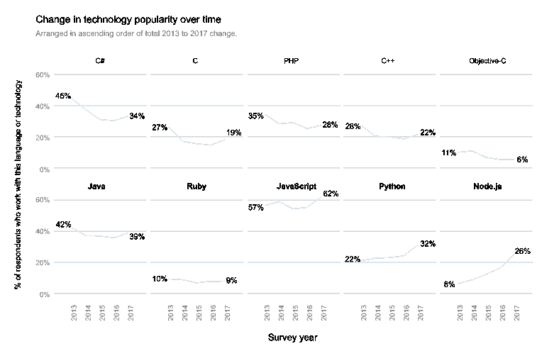

# Javascript 的持续流行:似乎没有人特别喜欢这种语言，但是每个人都在使用它

> 原文：<https://dev.to/walker/javascripts-persistent-popularity-no-one-seems-to-particularly-enjoy-the-language-but-everyone-is-using-it>

Stack Overflow 上周发布了他们的年度开发者调查结果，Javascript 连续第五年成为最受欢迎的语言。今年，62.5%的开发人员报告使用了 Javascript，大大超过了下一个非查询语言 Java (39.7%)。

Javascript 不仅受欢迎，而且越来越受欢迎，比 2015 年的 54%有所上升。它的五年趋势，以及其他主要语言的趋势可以从这个图表中看出:

[T2】](https://res.cloudinary.com/practicaldev/image/fetch/s--uHNFMJC_--/c_limit%2Cf_auto%2Cfl_progressive%2Cq_auto%2Cw_880/https://cdn.sstatic.net/Research/Img/2017/HistoricalLanguages.svg%3Fv%3D250eedb72493)

JavaScript 的流行有几个简单的原因。这种语言足够简单，可以很快学会，足够灵活，可以在客户端和服务器端使用，并且内置在您的 web 浏览器中。Stack Overflow 的联合创始人杰夫·阿特伍德(Jeff Atwood)大约十年前在博客中写道:“任何可以用 JavaScript 编写的应用程序，最终都会用 JavaScript 编写。”

不过，我们不应该急于将 JavaScript 冠上最伟大的语言的桂冠，来装点我们的硬盘。该调查的受访者绝大多数是 web 开发人员，这使得他们对 JavaScript 的偏好在某种程度上成为一个预料之中的结论。另外，成为最流行的语言并不直接意味着最令人愉快或最有利可图。

事实上，40%的 Javascript 用户没有报告继续使用这种语言的愿望，相比之下，只有 27%的 Rust 用户和 33%的 Smalltalk 用户(这是一种很可能在 bootcamp 课程中找不到的小众语言)。虽然 Clojure 开发人员的平均工资接近 80，000 美元，但 JavaScript 开发人员的平均工资接近中间水平，约为 55，000 美元。

[T2】](https://res.cloudinary.com/practicaldev/image/fetch/s--ACzSM4qM--/c_limit%2Cf_auto%2Cfl_progressive%2Cq_auto%2Cw_880/https://cdn.sstatic.net/Research/Img/2017/SalaryAndExperienceByLanguage.svg%3Fv%3D620358b56236)

这些都不足为奇。经济学 101 告诉我们，JavaScript 无处不在，这使得它不太可能是一项要求顶级工资的技能，而且这种语言的缺点长期以来一直是开发社区的喜剧素材:

> 1+2
> 
> 【1+【2】
> 【12】
> 【1】【2】
> 
> 【1+2+【3】
> 
> — The Practical Dev ([@thepracticaldev](https://dev.to/thepracticaldev) ) [March 20, 2017](https://twitter.com/ThePracticalDev/status/843651913635844096)

当然，我用来嵌入推文的代码依赖于 Javascript。因此，尽管我们可能会取笑这种语言，但明年这个时候，当 Stack Overflow 发布 2018 年的结果时，我们大多数人可能仍会使用它。