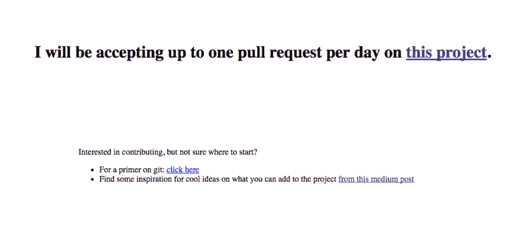
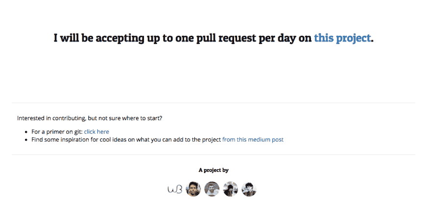

# 1pr 第 3 天:添加样式和项目贡献者列表

> 原文:[https://dev . to/Ben/1pr-day-3-added-styles-and-a-project-contributor-list](https://dev.to/ben/1pr-day-3-added-styles-and-a-project-contributor-list)

这是关于这个项目的第二个帖子。万一你错过了，就是[解释](https://dev.to/ben/as-one-does-at-three-oclock-in-the-morning-i-started-a-funky-side-project)。今天，我合并了[这个公关](https://github.com/thepracticaldev/1pr/pull/12)，增加了造型和贡献者名单。这个项目的主页从看起来:

### 由此而来:

[T2】](https://res.cloudinary.com/practicaldev/image/fetch/s--V3bMqkTB--/c_limit%2Cf_auto%2Cfl_progressive%2Cq_auto%2Cw_880/https://thepracticaldev.s3.amazonaws.com/i/gx74k61yrlydp7rhk7st.png)

### 到此:

[T2】](https://res.cloudinary.com/practicaldev/image/fetch/s--BzPmGdgN--/c_limit%2Cf_auto%2Cfl_progressive%2Cq_auto%2Cw_880/https://thepracticaldev.s3.amazonaws.com/i/uj8y76qooawq2ik9omu6.png)

### 耶！

我得说事情进展得很顺利。请考虑提交一份简历。请记住，这个项目可能会变成任何东西，但随着时间的推移，它会变得更加明确。这很有趣。