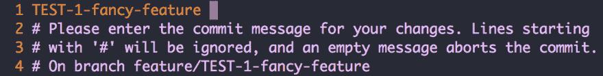

# 如何定制你的 git 提交消息

> 原文:[https://dev . to/ebud 7/how-to-customize-your-git-commit-message-](https://dev.to/ebud7/how-to-customise-your-git-commit-message-)

**1。添加默认模板目录**

```
git config --global init.templatedir '~/.git-templates' 
```

<svg width="20px" height="20px" viewBox="0 0 24 24" class="highlight-action crayons-icon highlight-action--fullscreen-on"><title>Enter fullscreen mode</title></svg> <svg width="20px" height="20px" viewBox="0 0 24 24" class="highlight-action crayons-icon highlight-action--fullscreen-off"><title>Exit fullscreen mode</title></svg>

*默认模板目录中的文件和目录(~/。git-templates)在创建后将被复制到特定的$GitDir 中。*

*见[git-init](https://git-scm.com/docs/git-init)T3*

**2。添加默认钩子目录**

```
mkdir -p ~/.git-templates/hooks 
```

<svg width="20px" height="20px" viewBox="0 0 24 24" class="highlight-action crayons-icon highlight-action--fullscreen-on"><title>Enter fullscreen mode</title></svg> <svg width="20px" height="20px" viewBox="0 0 24 24" class="highlight-action crayons-icon highlight-action--fullscreen-off"><title>Exit fullscreen mode</title></svg>

*钩子存储在默认模板目录的钩子子目录中。*

*见见*

**3。添加你的第一个钩子(例如准备-提交-消息)**

```
vi ~/.git-templates/hooks/prepare-commit-msg 
```

<svg width="20px" height="20px" viewBox="0 0 24 24" class="highlight-action crayons-icon highlight-action--fullscreen-on"><title>Enter fullscreen mode</title></svg> <svg width="20px" height="20px" viewBox="0 0 24 24" class="highlight-action crayons-icon highlight-action--fullscreen-off"><title>Exit fullscreen mode</title></svg>

*添加一个自定义挂钩，将您的分支名称放在提交消息的顶部。*
(不含硕士，培养)

```
#!/bin/sh

if [ -z "$BRANCHES_TO_SKIP" ]; then BRANCHES_TO_SKIP=(master develop test)
fi BRANCH_NAME=$(git symbolic-ref --short HEAD)
BRANCH_NAME="${BRANCH_NAME##*/}"

BRANCH_EXCLUDED=$(printf "%s\n" "${BRANCHES_TO_SKIP[@]}" | grep -c "^$BRANCH_NAME$")
BRANCH_IN_COMMIT=$(grep -c "\[$BRANCH_NAME\]" $1)

if [ -n "$BRANCH_NAME" ] && ! [[ $BRANCH_EXCLUDED -eq 1 ]] && ! [[ $BRANCH_IN_COMMIT -ge 1 ]]; then sed -i.bak -e "1s/^/$BRANCH_NAME /" $1
fi 
```

<svg width="20px" height="20px" viewBox="0 0 24 24" class="highlight-action crayons-icon highlight-action--fullscreen-on"><title>Enter fullscreen mode</title></svg> <svg width="20px" height="20px" viewBox="0 0 24 24" class="highlight-action crayons-icon highlight-action--fullscreen-off"><title>Exit fullscreen mode</title></svg>

*见见*

**4。使钩子可执行**

```
chmod +x ~/.git-templates/hooks/* 
```

<svg width="20px" height="20px" viewBox="0 0 24 24" class="highlight-action crayons-icon highlight-action--fullscreen-on"><title>Enter fullscreen mode</title></svg> <svg width="20px" height="20px" viewBox="0 0 24 24" class="highlight-action crayons-icon highlight-action--fullscreen-off"><title>Exit fullscreen mode</title></svg>

默认情况下，Git 钩子不是可执行的。

**5。在每个现有的存储库中重新初始化 git**

```
git init 
```

<svg width="20px" height="20px" viewBox="0 0 24 24" class="highlight-action crayons-icon highlight-action--fullscreen-on"><title>Enter fullscreen mode</title></svg> <svg width="20px" height="20px" viewBox="0 0 24 24" class="highlight-action crayons-icon highlight-action--fullscreen-off"><title>Exit fullscreen mode</title></svg>

要使用你的新钩子，你必须重新初始化 git。

*见[git-init](https://git-scm.com/docs/git-init)T3*

**6。提交**

```
git commit -v 
```

<svg width="20px" height="20px" viewBox="0 0 24 24" class="highlight-action crayons-icon highlight-action--fullscreen-on"><title>Enter fullscreen mode</title></svg> <svg width="20px" height="20px" viewBox="0 0 24 24" class="highlight-action crayons-icon highlight-action--fullscreen-off"><title>Exit fullscreen mode</title></svg>

它看起来怎么样？

[T2】](https://res.cloudinary.com/practicaldev/image/fetch/s--evSu1TSW--/c_limit%2Cf_auto%2Cfl_progressive%2Cq_auto%2Cw_880/https://github.com/codeBud7/articles/blob/master/img/how-to-customise-your-git-commit-message.png%3Fraw%3Dtrue)

**7。自动化**
如果你想为每个 git 项目添加相同的提交消息，你可以这样配置:

首先创建您的模板文件。(例如`~/.gitmessage` )

```
Why:
* 
```

<svg width="20px" height="20px" viewBox="0 0 24 24" class="highlight-action crayons-icon highlight-action--fullscreen-on"><title>Enter fullscreen mode</title></svg> <svg width="20px" height="20px" viewBox="0 0 24 24" class="highlight-action crayons-icon highlight-action--fullscreen-off"><title>Exit fullscreen mode</title></svg>

之后，您可以简单地将此文件添加到您的`~/.gitconfig`

```
[commit]
    template = ~/.gitmessage 
```

<svg width="20px" height="20px" viewBox="0 0 24 24" class="highlight-action crayons-icon highlight-action--fullscreen-on"><title>Enter fullscreen mode</title></svg> <svg width="20px" height="20px" viewBox="0 0 24 24" class="highlight-action crayons-icon highlight-action--fullscreen-off"><title>Exit fullscreen mode</title></svg>

# 提示

ðÿ'‰如果一个钩子已经在你的本地 git 库中定义了，新的钩子不会覆盖它。ðÿ'‰你可能需要为你的新钩子设置权限。(须藤 chmod 775。git/hooks/prepare-commit-msg)

##### 相关:

[Chris 关于 git 提交消息的消息](https://chris.beams.io/posts/git-commit/)