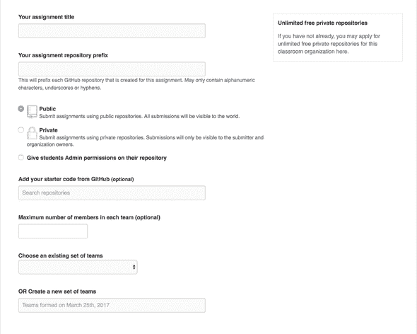

# Github classroom -要测试的工具

> 原文:[https://dev . to/slashgear _/github-classroom-un-outil-a-tester-224 a](https://dev.to/slashgear_/github-classroom-un-outil-a-tester-224a)

**去年 9 月开始教书的时候，我正在寻找一个解决办法，以便能够轻松跟踪学生在 TP 期间的进步情况。我最初想让他们访问 Github/Bitbucket 存储库……但我很快意识到，这是无法持续管理的。于是我想出了一个现成的解决办法。**

于是，我偶然发现了我在 Github 上的‘t0’社区论坛上的研究。一个非常活跃的社区，主要讨论对象是**【github 教室】**。然后，我对 githubafin 提出的解决方案进行了解码，以便尽快与我的学生进行测试。

# 注意到，TP on 设备非常差

在向您介绍该工具如何与您的学生一起使用和部署之前，我想先简单地列举一下作为一名欧洲教师，甚至作为一名学生在进行 TP 时可能遇到的问题。

*   **5 分钟内和学生一起开始你的 TP，不可能。**很明显，将 usb 闪存盘从 PC 传输到 PC 以分发主题 TP 或 soit 的源是不方便的。可以很容易地看出，一些学生在 15/20 分钟后才开始其 TP。
*   **难以跟踪学生的进步。**学生们有时希望得到帮助来解决他们项目中的一个问题。在没有工具的情况下，我们往往不得不进行多次交流，以最终相互理解并成功地提供帮助。如果你阅读一封学生只丢了一个‘T2’的邮件，你会觉得很糟糕！很不容易。
*   **报告、项目代码、与学生交流的邮件，在不同的地方。**TP 的渲染，不得不承认，这真是最让人恼火的阶段。在那些忘记一半东西要归还的学生中，拖延、学习工具不奏效、集中注意学生的实际工作很快就成了一个真正的痛苦，需要花好几天时间来学习。
*   ***【没有先生我没有抄】:*** 学生太多时候自己控制自己-c/ctrl-v TPS，要核实一个学生不仅仅收集同事的代码可能会很困难。
*   ***【你在这 TP 上做了什么？】*** 而且有的时候，学生们成群结队的时候，一个失败者可能会躲在中间。因此，很难真正评估个人在这种情况下的理解。
*   **如何验证他们的 TP 是否正常工作？我要安装吗？** 40 名学生，每两分制 TP，这使得 20 TP 需要安装和验证。有时学生的项目设置有点奇怪，你至少需要 10 分钟才能明白他做了什么。

# 准备带 Github 教室的 TP

所以已经很清楚，使用像 **Github Classroom** 这样的工具需要额外的准备时间。和他的学生第一次见面之前有很多事情要设置但是，一旦 TP 开始，这种准备时间将会得到很大的回收

## 一个解释清楚的工具

该工具拥有相当明显的控制能力，但 Github 仍提供了足够的解释视频，足以让我们了解其用途。

> 入门指南
> 
> 如何设置组分配

## 制约因素

这种工具并不神奇，它施加了一些约束，这些约束对您和您的学生来说可能会很有吸引力。

*   你需要 Github 帐户
*   所有学生都要有 Github 账户，可能很难把这个强加给学生
*   你要掌握 Git，熟悉 Github 的接口
*   你的学生需要靠 Git 自主
*   您必须在 Github 上创建组织(单击几下)
*   如果您不在 Github 上为您的学校申请私人组织，那么 TP 的来源和您学生的成绩将是公开的。

## 应遵守的步骤

### 1 .准备好你的消息来源和陈述

首先，你必须把你的消息来源放在一个叫 Github 的网站上，然后再找到它。此外，还应注意不要在 IDE 的配置文件中标记 TP。您的学生不一定会使用与您相同的文件，这些文件可能会妨碍/打扰您 _(很快)

我还建议您将陈述直接写在文件[【markdown】](https://guides.github.com/features/mastering-markdown/)中。

最后，把一切集中在一个地方的故事，我鼓励你定义一个文件`Rapport.md`，这样学生们也可以用 Markdown 写他们的报告。(经过第一次考试，同学们都很喜欢 Markdown 很容易理解，他提醒他们在报告中插入代码和图像，而不注意版面)

最后，[下面是我为学生设置的 TP 的一个例子。](https://github.com/PolytechLyon/isi3-tp1-graph)

### 2。设置您的*分配*

将 TP 存放在 Github 存储库中后，您只需从 Github Classroom 接口定义 TP 的“T0”。

 [<source type="image/webp">
<source type="image/png">
](///static/038e52072fd39b5c797e3ffef7dc7148/720e3/create-assignement.png) 

创建您的〔t0〕分配〔t1〕的一些小技巧:

*   在标题中明确说明班级、组、年份。
*   S7-1200 可编程控制器。
*   您可以阻止每个组的最大学生数。
*   您可以在同一材料的不同 TP 之间恢复班次。

### 3。把你的 TP 发给你的学生

这一步将为您节省宝贵的时间，因为一旦您的“T0”分配创建了该工具，您就可以创建一个链接，使学生能够登录并聚集到该工具中。

对于集体 TP，学生必须登录并创建自己的团队，其他学生也可以加入。

然后将按团队创建一个存储库。

### 4。跟随你的学生发展

你的学生们会觉得你是国安局的人但请放心这是为了他们好。一旦创建了电子邮件，您就可以在 github 主页上查看您的学生所做的所有工作。这将使你能够在有时间的情况下在水面上进行‘t0’复习。

你也可以和他们一起去看，如果他们需要你的帮助，就开一个出口。在这种情况下，您将收到电子邮件通知。学生甚至可以在“_ issue _ code”中向您报告问题代码。

### 5。评估他们的成就

评估有两种解决方案:

*   检查他们的*资料档案库*并阅读他们的代码。为此，我只能建议您使用扩展名[【octotree】](https://chrome.google.com/webstore/detail/octotree/bkhaagjahfmjljalopjnoealnfndnagc)，这样您就可以查看仓库的文件树。
*   在基础项目上进行单元测试，并将 CI 工具连接到 SaaS(如 travis-ci)。