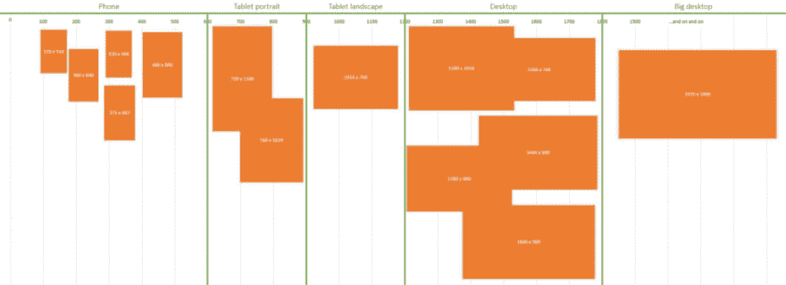

# 新鲜 CSS 的诞生

> 原文:[https://dev.to/shashi_lo/the-birth-of-fresh-css-5c3b](https://dev.to/shashi_lo/the-birth-of-fresh-css-5c3b)

我应该每周写一篇文章参加 [**为期 52 周的写作挑战**](https://writingcooperative.com/the-52-week-writing-challenge-55210b483a21#.6b0sc7j59)**，但是我整个星期都在生病。所以，我下周要加倍努力写两篇文章。这是 52 条中的第 2 条。**

 **在我的上一篇文章[我的 CSS 框架之旅](https://medium.com/@shashilo0428/my-journey-to-a-better-css-framework-72bf6dd068bc#.ij7i6en5f)的基础上，我们 [Creed Interactive](http://creedinteractive.com) 觉得有必要创建一个符合我们团队需求的 CSS 框架。我们开始就我们需要什么以及如何弥合设计和开发之间的差距进行了深入的讨论。我们遇到的一个冲突是不一致的组件布局。有些部分没有与网格对齐，而其他部分超出了容器。随着进一步的讨论，这些是我们决定的一些功能。

#### 12 列网格

我们决定使用 12 列网格，因为测量是有意义的。理论上，1200 可以被 2，3，4，5，6，8，10，12，15，16，20，24，30，40，48，60，80，120，150，200，240 和 400 整除。这为创建组件提供了很大的灵活性。所以，总的来说，我们的网格由 12 列组成，80px 列宽，20px 装订线，10px 填充在网格的外侧。

<figure> 

<figcaption>1200px 宽度配 20px 装订线</figcaption>

</figure>

对于某些设计，我们会删除每边额外的 10px，但这是我们想要推进的标准。现在，我们有一个良好的基础来开始我们的项目。

Susy 网格系统

延续了不需要加载未使用样式的精益框架的趋势，我决定使用 [Susy](http://susy.oddbird.net/) 。起初，它与我习惯的东西真的不一样，但在用它工作了几个月后，我真的很喜欢它。按需构建网格是我的魔术行的关键。这个想法不仅仅是用行构建相同的列，而是构建各种不同的列组合。如果您可以使用“row-md-363”创建一个 3 列网格，第一列和最后一列的宽度为 3，中间一列的宽度为 6，这不是很棒吗？删除任何和所有列尺寸标注将允许更大的灵活性。我们不打算完全删除它，但保留它作为退路。

帮助我完成这个任务的一个 Susy 特性是 [*span 嵌套上下文*](http://susydocs.oddbird.net/en/latest/toolkit/#span-function) *。起初我很困惑，直到我不断尝试。如果你看这个例子，它将允许我和 Susy 一起建立我的行魔法。下一步是创建一个全局变量，它将生成我需要的行类，而不需要为所有屏幕尺寸手动创建它们。*

[https://medium . com/media/6 c 85 b 9311 c 27 e 16 e 34208 f 08 cf 2 f 7 cc 1/href](https://medium.com/media/6c85b9311c27e16e34208f08cf2f7cc1/href)

**有意义的断点**

媒体查询断点可能很困难。您可以使用最小和/或最大宽度，您可以为断点定义一个范围，或者您可以针对特定的屏幕，如 retina 监视器。在阅读了大卫·吉尔伯森的“[100%正确的 CSS 断点方法](https://medium.freecodecamp.com/the-100-correct-way-to-do-css-breakpoints-88d6a5ba1862#.esjsvshkg)”之后，屏幕断点变得更有意义了。当 NSYNC 是首屈一指的男孩乐队时，我们用老方法根据流行的东西来确定屏幕尺寸。如今，我们有许多不同的手机和平板电脑屏幕尺寸。如果你看看下面的例子，你就会明白为什么这个新的断点视图是有意义的。

<figure> 

<figcaption>图片由大卫·吉尔伯特</figcaption>

</figure>

提供

**下一步是什么**

我们将查看框架的实际代码，并继续构建它。建立一个 github 页面将是一个良好的开端，并对其进行开源。**