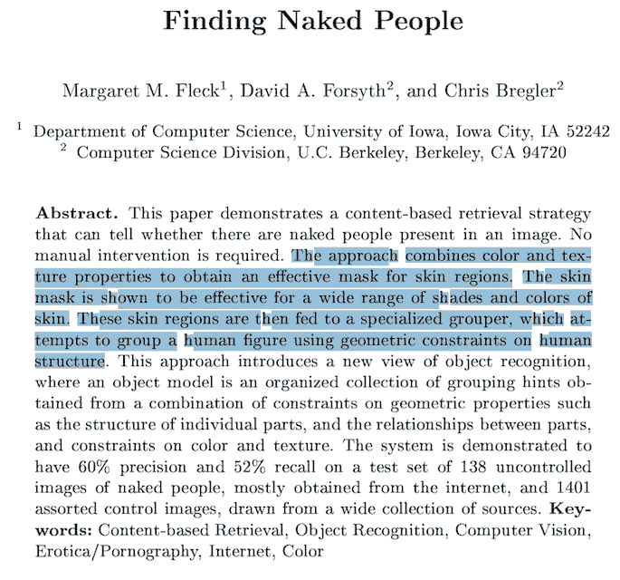
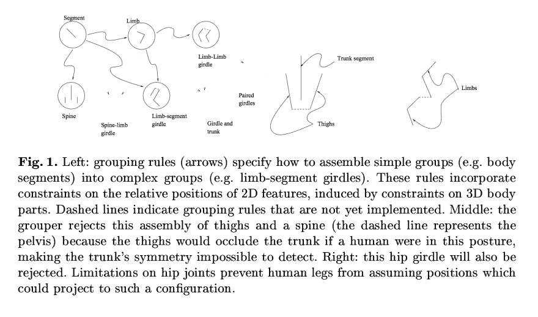
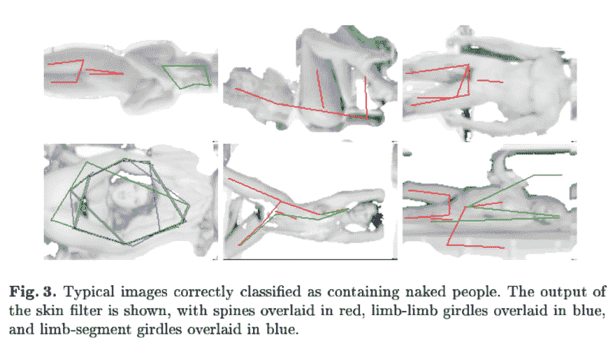
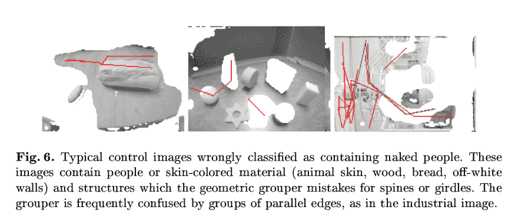
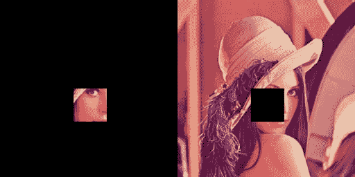
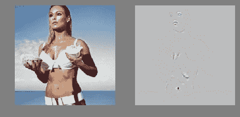
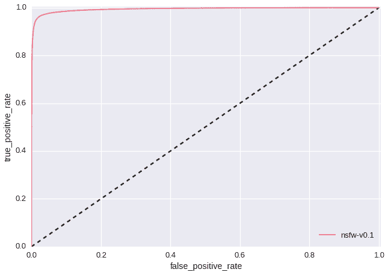
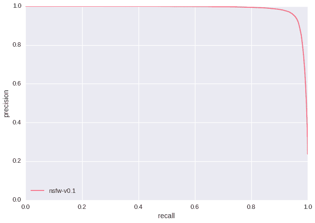
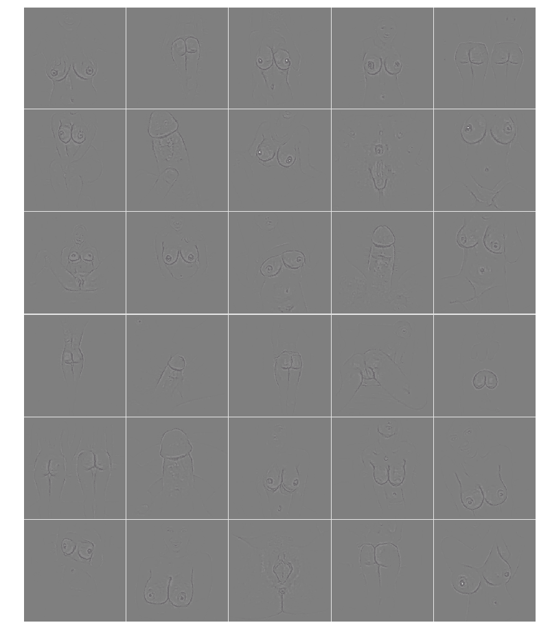

# 卷积神经网络在看到裸体时会看什么

> 原文:[https://dev . to/clari fai/what-convolutionary-neural-networks-look-at-when-see-when-see-nautility](https://dev.to/clarifai/what-convolutional-neural-networks-look-at-when-they-see-nudity)

警告&免责声明:本帖包含出于科学目的的裸体图像。如果你未满 18 岁，或者你被裸体冒犯，我们要求你不要继续阅读。

二十多年来，自动发现裸照一直是计算机视觉中的一个核心问题，并且由于其丰富的历史和简单明了的目标，成为该领域如何发展的一个很好的例子。在这篇博文中，我将使用裸体检测问题来说明训练现代卷积神经网络(convnets)与过去所做的研究有何不同。

#### 回到 1996 年...

[T2】](https://res.cloudinary.com/practicaldev/image/fetch/s--pl4CLllf--/c_limit%2Cf_auto%2Cfl_progressive%2Cq_auto%2Cw_880/https://clarifai-img.s3.amazonaws.com/blog/finding_naked_title.png)

该领域的一项开创性工作是 Fleck 等人的名为“寻找裸体的人”的著作。它发表于 90 年代中期，为计算机视觉研究人员在 convnet 被收购之前所做的工作提供了一个很好的例子。在论文的第 2 部分，他们总结了这种技术:

> 算法:
> 
> -首先定位包含大面积肤色区域的图像；
> 
> -然后，在这些区域内，使用包含大量物体结构信息的专用分组器，找到拉长的区域，并将其分组为可能的人类肢体和相连的肢体组

皮肤检测是通过在颜色空间中进行过滤来完成的，而对皮肤区域进行分组是通过将人体建模为“近似圆柱形部分的组合体，其中各个部分的几何形状以及各个部分之间的关系都受到骨架几何形状的约束”(参见第 2 节)。为了更好地理解构建这种算法的工程，我们转到论文中的图 1，作者在图 1 中展示了一些他们手工构建的分组规则:

[T2】](https://res.cloudinary.com/practicaldev/image/fetch/s--l2vQlMtR--/c_limit%2Cf_auto%2Cfl_progressive%2Cq_auto%2Cw_880/https://clarifai-img.s3.amazonaws.com/blog/finding_naked_figure.png)

该论文报告了“在 138 张未受控制的裸体图像的测试集上，60%的准确率和 52%的召回率。它们还提供了真阳性和假阳性的示例，以及算法发现的特征的可视化叠加:

[](https://res.cloudinary.com/practicaldev/image/fetch/s--xQjsWGV8--/c_limit%2Cf_auto%2Cfl_progressive%2Cq_auto%2Cw_880/https://clarifai-img.s3.amazonaws.com/blog/finding_naked_good.png)
[T6】](https://res.cloudinary.com/practicaldev/image/fetch/s--CeuTYUKd--/c_limit%2Cf_auto%2Cfl_progressive%2Cq_auto%2Cw_880/https://clarifai-img.s3.amazonaws.com/blog/finding_naked_problems.png)

手工构建要素的一个主要问题是，它们的复杂性受到研究人员的耐心和想象力的限制。在下一节中，我们将看到一个训练来执行相同任务的 convnet 如何学习相同数据的更复杂的表示。

#### 然后到了 2014 年...

深度学习研究人员不是设计正式的规则来描述输入数据应该如何表示，而是设计网络架构和数据集，使人工智能系统能够直接从数据中学习表示。然而，由于深度学习研究人员没有具体说明网络在给定输入下应该如何表现，一个新的问题出现了:人们如何理解卷积网络在激活什么？

[T2】](https://res.cloudinary.com/practicaldev/image/fetch/s--52YNiPXo--/c_limit%2Cf_auto%2Cfl_progressive%2Cq_auto%2Cw_880/https://clarifai-img.s3.amazonaws.com/blog/zeiler_fergus.png)

理解 convnet 的操作需要解释不同层中的特性活动。在这篇文章的剩余部分，我们将通过将活动从顶层向下映射到输入像素空间来检查我们的 NSFW 模型的早期版本。这将允许我们看到什么输入模式最初导致了特征图中的给定激活(即为什么图像被标记为“NSFW”)。

**遮挡敏感度**

下图显示了 Lena s derberg { T1 }在 64x64 滑动窗口(步幅为 3)将我们的 NSFW 模型应用于原始图像的裁剪/遮挡版本后的照片。

[T2】](https://res.cloudinary.com/practicaldev/image/fetch/s--hqSNEyzG--/c_limit%2Cf_auto%2Cfl_progressive%2Cq_auto%2Cw_880/https://clarifai-img.s3.amazonaws.com/blog/lena_heatmap.png)

为了构建左侧的热图，我们将每个窗口发送到我们的 convnet，并平均每个像素的“NSFW”分数。当 convnet 看到长满皮肤的作物时，它往往会预测“NSFW ”,这会导致 Lena 的身体上出现大片红色区域。为了创建右侧的热图，我们系统地遮挡原始图像的部分，并报告 1 减去平均“NSFW”分数(即“SFW”分数)。当大部分 NSFW 地区被遮挡时,“SFW”得分会增加，我们会在热图中看到更高的值。为了清楚起见，下图举例说明了上述两个实验中的每一个实验都将哪种图像输入到了 convnet 中:

[T2】](https://res.cloudinary.com/practicaldev/image/fetch/s--GVa02BNK--/c_limit%2Cf_auto%2Cfl_progressive%2Cq_auto%2Cw_880/https://clarifai-img.s3.amazonaws.com/blog/lfaceblack.png)

这些遮挡实验的一个好处是，当分类器是一个完整的黑盒时，它们是可能执行的。下面是通过我们的 API 重现这些结果的代码片段:

```
# NSFW occlusion experiment 
from StringIO import StringIO

import matplotlib.pyplot as plt
import numpy as np
from PIL import Image, ImageDraw
import requests
import scipy.sparse as sp

from clarifai.client import ClarifaiApi

CLARIFAI_APP_ID = '...'
CLARIFAI_APP_SECRET = '...'
clarifai = ClarifaiApi(app_id=CLARIFAI_APP_ID,
                       app_secret=CLARIFAI_APP_SECRET,
                       base_url='https://api.clarifai.com')

def batch_request(imgs, bboxes):
  """use the API to tag a batch of occulded images"""
  assert len(bboxes) < 128
  #convert to image bytes
  stringios = []
  for img in imgs:
    stringio = StringIO()
    img.save(stringio, format='JPEG')
    stringios.append(stringio)
  #call api and parse response
  output = []
  response = clarifai.tag_images(stringios, model='nsfw-v1.0')
  for result,bbox in zip(response['results'], bboxes):
    nsfw_idx = result['result']['tag']['classes'].index("sfw")
    nsfw_score = result['result']['tag']['probs'][nsfw_idx]
    output.append((nsfw_score, bbox))
  return output

def build_bboxes(img, boxsize=72, stride=25):
  """Generate all the bboxes used in the experiment"""
  width = boxsize
  height = boxsize
  bboxes = []
  for top in range(0, img.size[1], stride):
    for left in range(0, img.size[0], stride):
      bboxes.append((left, top, left+width, top+height))
  return bboxes

def draw_occulsions(img, bboxes):
  """Overlay bboxes on the test image"""
  images = []
  for bbox in bboxes:
    img2 = img.copy()
    draw = ImageDraw.Draw(img2)
    draw.rectangle(bbox, fill=True)
    images.append(img2)
  return images

def alpha_composite(img, heatmap):
  """Blend a PIL image and a numpy array corresponding to a heatmap in a nice way"""
  if img.mode == 'RBG':
    img.putalpha(100)
  cmap = plt.get_cmap('jet')
  rgba_img = cmap(heatmap)
  rgba_img[:,:,:][:] = 0.7 #alpha overlay
  rgba_img = Image.fromarray(np.uint8(cmap(heatmap)*255))
  return Image.blend(img, rgba_img, 0.8)

def get_nsfw_occlude_mask(img, boxsize=64, stride=25):
  """generate bboxes and occluded images, call the API, blend the results together"""
  bboxes = build_bboxes(img, boxsize=boxsize, stride=stride)
  print 'api calls needed:{}'.format(len(bboxes))
  scored_bboxes = []
  batch_size = 125
  for i in range(0, len(bboxes), batch_size):
    bbox_batch = bboxes[i:i + batch_size]
    occluded_images = draw_occulsions(img, bbox_batch)
    results = batch_request(occluded_images, bbox_batch)
    scored_bboxes.extend(results)
  heatmap = np.zeros(img.size)
  sparse_masks = []
  for idx, (nsfw_score, bbox) in enumerate(scored_bboxes):
    mask = np.zeros(img.size)
    mask[bbox[0]:bbox[2], bbox[1]:bbox[3]] = nsfw_score 
    Asp = sp.csr_matrix(mask)
    sparse_masks.append(Asp)
    heatmap = heatmap + (mask - heatmap)/(idx+1)    
  return alpha_composite(img, 80*np.transpose(heatmap)), np.stack(sparse_masks)

#Download full Lena image r = requests.get('https://clarifai-img.s3.amazonaws.com/blog/len_full.jpeg')
stringio = StringIO(r.content)
img = Image.open(stringio, 'r')
img.putalpha(1000)

#set boxsize and stride (warning! a low stride will lead to thousands of API calls) boxsize= 64
stride= 48
blended, masks = get_nsfw_occlude_mask(img, boxsize=boxsize, stride=stride)

#viz blended.show() 
```

虽然这些种类的实验提供了显示分类器输出的直接方式，但是它们有一个缺点，即所产生的可视化常常非常模糊。这使我们无法获得对网络实际运行情况的有意义的了解，也无法理解在培训过程中可能出现的问题。

**去进化网络**

一旦我们在给定的数据集上训练了一个网络，我们希望能够获取一个图像和一个类，并向 convnet 询问类似于“我们如何改变这个图像以使其看起来更像给定的类？”。为此，我们使用解卷积网络(deconvnet)，参见泽勒和弗格斯 2014 年的第 2 节:

> deconvnet 可以被认为是一个 convnet 模型，它使用相同的组件(过滤、池化)但方向相反，因此它不是将像素映射到要素，而是相反。为了检查给定的 convnet 激活，我们将该层中的所有其他激活设置为零，并将特征映射作为输入传递给附加的 deconvnet 层。然后，我们连续地(I)取消 pool，(ii)校正和(iii)过滤，以重建引起所选激活的下层中的活动。然后重复这一过程，直到到达输入像素空间。
> 
> [...]
> 
> 该过程类似于反向传播单个强激活(而不是通常的梯度)，即计算 *dh/dXn* ，其中 *h* 是具有强激活的特征图的元素， *Xn* 是输入图像。

以下是我们在使用 deconvnet 可视化我们应该如何修改 Lena 的照片以使其看起来更像色情图片时得到的结果(注意:这里使用的 deconvnet 需要一个正方形图像才能正常工作-我们填充了完整的 Lena 图像以获得正确的纵横比):

[T2】](https://res.cloudinary.com/practicaldev/image/fetch/s--_Nv56-Jp--/c_limit%2Cf_auto%2Cfl_progressive%2Cq_auto%2Cw_880/https://clarifai-img.s3.amazonaws.com/blog/len_4x4.jpeg)

[芭芭拉](https://dsp.stackexchange.com/questions/18631/who-is-barbara-test-image)是 G 级版本的莉娜。根据我们的 deconvnet，我们可以通过给芭芭拉的嘴唇添加红色来改变她，让她看起来更 PG:

[T2】](https://res.cloudinary.com/practicaldev/image/fetch/s--P4RYJ-mk--/c_limit%2Cf_auto%2Cfl_progressive%2Cq_auto%2Cw_880/https://clarifai-img.s3.amazonaws.com/blog/barbara_deconv.jpeg)

2003 年，[英国的一项调查将詹姆斯·邦德电影《诺博士》中乌苏拉·安德斯](http://news.bbc.co.uk/2/hi/entertainment/3250386.stm)饰演的蜂蜜骑士评为“银幕史上 100 个最性感的时刻”之首:

[T2】](https://res.cloudinary.com/practicaldev/image/fetch/s--Hq57YQSM--/c_limit%2Cf_auto%2Cfl_progressive%2Cq_auto%2Cw_880/https://clarifai-img.s3.amazonaws.com/blog/ursula_deconv.jpeg)

上述实验的一个显著特征是，convnet 将红唇和肚脐学习为“NSFW”的指示。这可能意味着我们在“SFW”训练数据中没有包括足够多的红唇和肚脐图像。如果我们只通过检查精度/召回率和 ROC 曲线(如下所示-测试集大小:428，271)来评估我们的模型，我们将永远不会发现这个问题，因为我们的测试数据也会有同样的缺点。这凸显了训练基于规则的分类器和现代人工智能研究之间的根本区别。我们不再手工重新设计特征，而是重新设计我们的训练数据，直到发现的特征得到改进。

[](https://res.cloudinary.com/practicaldev/image/fetch/s--W_pdDrvx--/c_limit%2Cf_auto%2Cfl_progressive%2Cq_auto%2Cw_880/https://clarifai-img.s3.amazonaws.com/blog/roc.png)
[T6】](https://res.cloudinary.com/practicaldev/image/fetch/s--tNqkeDrr--/c_limit%2Cf_auto%2Cfl_progressive%2Cq_auto%2Cw_880/https://clarifai-img.s3.amazonaws.com/blog/prec_recall.png)

最后，作为健全性检查，我们对核心色情内容运行 deconvnet，以确保学习到的功能激活确实对应于明显的 nsfw 对象:

[T2】](https://res.cloudinary.com/practicaldev/image/fetch/s--t_KWtvZV--/c_limit%2Cf_auto%2Cfl_progressive%2Cq_auto%2Cw_880/https://clarifai-img.s3.amazonaws.com/blog/deconv_porno.png)

在这里，我们可以清楚地看到，convnet 正确地学习了阴茎、肛门、外阴、乳头和臀部——我们的模型应该标记的对象。更重要的是，发现的特征远比研究人员手工设计的更加详细和复杂，这有助于解释我们通过使用 convnets 识别 NSFW 图像所获得的重大改进。如果你对使用 convnets 过滤 NSFW 图像感兴趣，试试我们主页上的演示，然后在[注册一个免费的开发者账户。](https://developer.clarifai.com/signup/?utm_campaign=devto-org-account&utm_medium=blog&utm_source=dev-to&utm_content=article-link&utm_term=sign-up-free-account??????)

<center>

## [试试演示吧！](https://clarifai.com/demo?utm_campaign=devto-org-account&utm_medium=blog&utm_source=dev-to&utm_content=article-link&utm_term=demo)

</center>