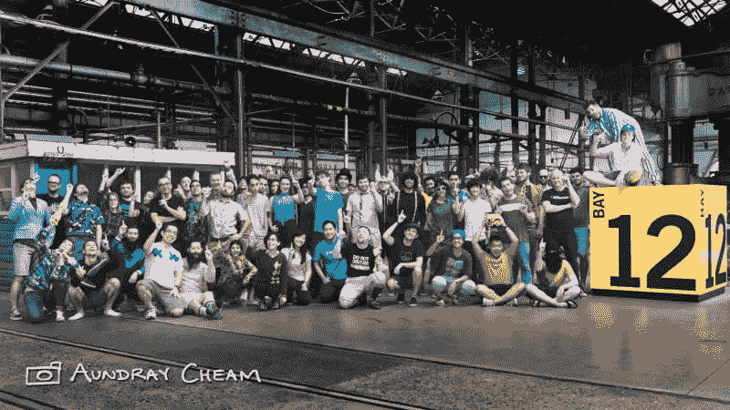
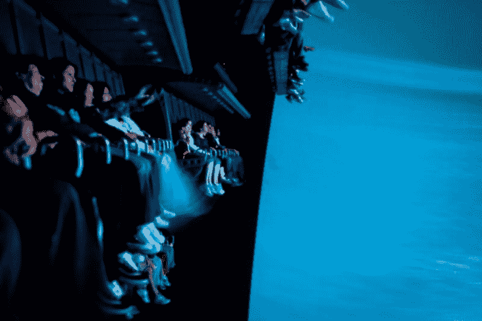

# 软件想象工程

> 原文:[https://dev.to/joshua/software-imagineering](https://dev.to/joshua/software-imagineering)

如果你在迪斯尼主题公园工作，你可能就是他们所说的幻想工程师。

“Imagineer 是想象力和工程学的结合体，这个词是用来描述融合了这两个概念的角色的。想象工程师*设计*主题公园的游乐设施、景点和整体体验——但他们也*设计*它们。

这一过程始于所谓的“蓝天推测”，或者我听说它被称为“前往疯狂小镇”。设计过程的这一部分是纯粹的想象——没有限制，无视现实。就问“如果呢？"

举个例子:想象一个能让人们真正相信他们正在飞行的游乐设施。没有轨道，没有附加条件。那会是什么感觉？交易体验会是怎样的？但是，这个游乐设施实际上是如何工作的呢？人们要坐在哪里？如果我能看到飞行，我不会相信我在飞。

推迟你头脑中可能有的任何问题或疑虑。想想理想的体验。

我是 Atlassian 设计团队的开发人员。当我加入这个团队的时候，我不知道我将会进入什么样的领域——我喜欢前端开发，我的团队坐在设计的保护伞下。我买了几本关于设计的书，但我不知道我报了什么。

[T2】](https://res.cloudinary.com/practicaldev/image/fetch/s--zNIjqBst--/c_limit%2Cf_auto%2Cfl_progressive%2Cq_auto%2Cw_880/https://cdn-images-1.medium.com/max/800/1%2AX1yi1Z7mkYV129_IbMTprg.jpeg)

[aundra cheam，flickr](https://www.flickr.com/photos/doctordray/)

我工作的一部分是从 [Atlassian 设计指南](https://design.atlassian.com/latest/)中提取设计，并将其转化为[用户界面库](http://docs.atlassian.com/aui/latest/)供我们的开发人员使用。我每天都看到想象和现实之间的差异。我们的设计师想象的体验是奇妙的，但我经常看到设计师和工程师在实现设计时无法妥协。如果不能做出妥协，就会导致糟糕的、错误的实现，或者不符合用户需求的笨拙的体验。

我们的设计师必须与工程师紧密合作，工程师也必须与设计师紧密合作，以便在必要的时候做出明智而有意识的妥协。

### 妥协

设计的大规模实施是困难的。web 应用程序和前端的开发尤其困难。理论上，我们可以通过改变 CSS 规则来调整设计，但现实并非如此简单。覆盖、攻击和边缘情况是大量的，工程师需要永远意识到这些，以保持无 bug 的体验。

软件工程师被训练为他们设计的软件考虑边缘情况。当谈到与设计师交谈时，这种类型的思维很容易影响我们的谈话。工程师需要现实，但他们也应该知道什么时候反馈是合适的，以及如何给出反馈。

我记得有一个例子，一个设计师在我们的产品中为新的用户体验做了一些概念性的工作。最终结果是惊人的——它包括自动发现和运行测试，以及为您设置一切的智能存储库。然而，我对他们的反馈却戳穿了这个想法的漏洞——我问，“这怎么工作呢？现实根本不是这样。这是做不到的”。

但后来，我意识到这不是练习的重点——我用错误的方式给出了反馈。我在考虑工程工作(我自己的体验)，而我本应该考虑最终用户的体验。从用户的角度来看，这是一个很棒的想法。首先考虑用户的体验，我将能够妥协来实现与设计师相同的目标——为我们的用户提供最好的体验。

[T2】](https://res.cloudinary.com/practicaldev/image/fetch/s--NI7AXAPB--/c_limit%2Cf_auto%2Cfl_progressive%2Cq_auto%2Cw_880/https://cdn-images-1.medium.com/max/800/1%2Awc93l-OCYuPtDcziryTc2A.jpeg)

[aundra cheam，flickr](https://www.flickr.com/photos/doctordray/)

同样，设计师在设计时需要注意工程问题。这些问题通常是技术上的限制。一个好的设计师不害怕约束——如果设计师愿意妥协，并且充分理解技术约束，设计师和工程师可以为所有用户创造更好的用户体验。

在这种类型的谈话中，双方都必须知道对方的目标，并且知道什么时候妥协是明智的。实现这一点的方法是通过同理心——设计师必须愿意理解工程师的目标、关切和恐惧，工程师应该知道设计师为什么要创造他们所做的设计。最终，工程师和设计师应该关心用户的体验。

迪斯尼乐园的幻想工程师们能够创造出一种模拟飞行感觉的游乐设施。这个旅程叫做“飞越加利福尼亚”。该游乐设备由参与者面前的大屏幕构成，完全覆盖视野。他们坐在升高的椅子上，椅子会随着旅程的进行而移动。

[T2】](https://res.cloudinary.com/practicaldev/image/fetch/s--_ABtM44J--/c_limit%2Cf_auto%2Cfl_progressive%2Cq_auto%2Cw_880/https://cdn-images-1.medium.com/max/800/1%2AShi8mxp77jt5GvSAtT23jg.jpeg)

[来自美国佛罗里达州温特黑文的乔希·哈雷特](http://www.flickr.com/photos/12734746@N00)—[翱翔——迪士尼加州冒险](http://www.flickr.com/photos/hyku/4741725097/)

像这样的想法是工程和设计之间的妥协。参与者实际上不会飞，他们甚至不会动。然而，核心体验，飞行的感觉，在整个设计和实施过程中都得到了保持，乘坐者也因此更加高兴。

设计和开发，或者想象力和工程学，通常被认为是对立的力量，或者是一条可以进行权衡的线——但如果这两个学科都愿意充分理解目标和限制，我们就可以为每个人提供更好的产品、体验和主题公园游乐设施。

### 约书亚·纳尔逊

*   [https://twitter.com/nelsonjoshpaul](https://twitter.com/nelsonjoshpaul)
*   [https://www.linkedin.com/in/joshua-nelson-a0156523/](https://www.linkedin.com/in/joshua-nelson-a0156523/)

开发者在 [@Atlassian](http://twitter.com/Atlassian)

*( [跨岗](https://medium.com/@joshuanelson/software-imagineering-aa41874fda67#.ox0m34ugb) )*