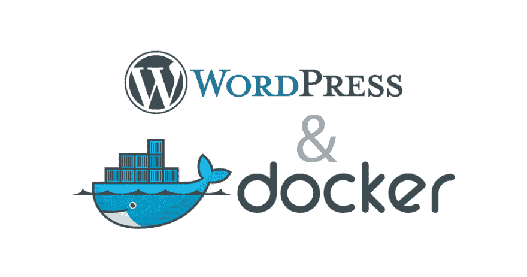

# 将 WordPress 站点移动到 Docker 容器中

> 原文：<https://dev.to/stephenafamo/moving-a-wordpress-site-into-a-docker-container-di2>

[T2】](https://res.cloudinary.com/practicaldev/image/fetch/s--bV60rERo--/c_limit%2Cf_auto%2Cfl_progressive%2Cq_auto%2Cw_880/https://i1.wp.com/stephenafamo.com/blog/wp-content/uploads/2017/03/docker-wordpress.png%3Ffit%3D944%252C496%26ssl%3D1)

WordPress 是一个非常流行和灵活的内容管理系统(CMS)。如果你建立网站，你很可能和 WordPress 合作过(或者有人要求你这么做)。

有几个教程是关于如何用 docker 建立一个新的 WordPress 站点的。这里有[一个非常好的](https://www.sitepoint.com/how-to-use-the-official-docker-wordpress-image/)。然而，没有人真正说明如何将现有的 WordPress 站点移入 docker 容器。

我在 [Digital Ocean](http://bit.ly/DOSSD1) 、 [Linode](http://bit.ly/Linode1) 和 [Vultr](http://bit.ly/VultrSSD1) 上有几个服务器，我决定将我的几个网站，包括这个，从一个共享服务器转移到我服务器上的 docker 容器中。

下面是我平时的流程。

## 事情要注意

1.  在本文中，我将使用 _ * * example.com * * _ 作为域名。
2.  我将使用 _**12.34.56.78**_ 作为服务器的 IP 地址。
3.  我使用的是 Ubuntu 16.04 服务器。

## 先决条件

在服务器上安装 Nginx。我们将使用 Nginx 作为 docker 容器的反向代理，因此我们必须使用以下命令来安装它。

```
sudo apt install nginx 
```

Enter fullscreen mode Exit fullscreen mode

## 第一步:了解 Docker 撰写

在[的最后一篇文章](https://blog.stephenafamo.com/docker-container-nginx-lets-encrypt/)中，我们使用了直接的`docker --run`命令，但是因为我们将处理不止一个容器，所以使用`docker-compose`会容易得多。

Docker compose 是一个用来一次配置几个容器的工具。来自[官方文件](https://docs.docker.com/compose/overview/)

> Compose 是一个定义和运行多容器 Docker 应用程序的工具。使用 Compose，您可以使用合成文件来配置应用程序的服务。然后，使用一个命令，从您的配置中创建并启动所有服务。

要将您的 docker 版本更新(或安装)到最新版本并安装 docker-compose，您可以运行以下命令。

```
wget -O - https://bit.ly/docker-install| bash 
```

Enter fullscreen mode Exit fullscreen mode

使用 docker-compose，我们将为整个堆栈定义一个 docker-compose.yml 文件。

## 第二步:导出 WordPress 站点

在你开始移动你的 WordPress 站点之前，最好先关闭所有插件。

我们需要从当前网站的以下内容。

1.  WordPress 站点全部内容的 zip 存档。(我将此称为 _ **site.zip** _)
2.  MySQL 数据库的转储。(我把这个称为 ***database.sql)***
3.  数据库名称。(我将此称为 _ * *示例数据库名称** _)
4.  数据库密码。(我将把这个称为 _ **example_db_password** _)
5.  数据库用户。(我将此称为 _ * *示例 _ 数据库 _ 用户** _)

一旦你有了它们，把它们放在你当前站点的根目录下。即***【example.com/database.sql】****。*

 *## 第三步:设置站点源代码

确保`/var/www/example.com`文件夹是空的，然后在其中创建一个`src/`文件夹来包含我们的站点代码。您可以使用下面的命令
来完成这两项任务

```
rm -r /var/www/example.com/*
mkdir -pv /var/www/example.com/src 
```

Enter fullscreen mode Exit fullscreen mode

现在我们将把我们创建的站点档案下载到我们的站点。

```
cd /var/www/example.com
wget "http://example.com/site.zip" --no-check-certificate 
```

Enter fullscreen mode Exit fullscreen mode

接下来，我们将把 _ **site.zip** _ 归档文件解压缩到`src`文件夹
中

```
unzip site.zip -d src/ 
```

Enter fullscreen mode Exit fullscreen mode

现在，我们应该将我们的 WordPress 站点代码完全复制到我们的服务器上

## 第四步:建立站点数据库

WordPress 需要一个数据库来工作，因为我们想要保存我们的数据，我们将把数据存储在一个目录卷中，我们将把这个目录卷装载到 docker 容器中。

接下来，我们将创建文件夹`/var/www/example.com/database`来包含我们的数据库数据和配置。

```
mkdir -pv /var/www/example.com/database 
```

Enter fullscreen mode Exit fullscreen mode

我们将把数据库数据存储在`database/data`文件夹中，所以我们使用下面的命令
创建它

```
mkdir -pv /var/www/example.com/database/data 
```

Enter fullscreen mode Exit fullscreen mode

MySQL 容器将执行任何。嘘，。容器内的`/docker-entrypoint-initdb.d`文件夹中的 sql 或. sql.gz 文件。因此，我们将把我们的 sql 转储放在一个文件夹中，并将其挂载到容器的`/docker-entrypoint-initdb.d`文件夹中。

```
mkdir -pv /var/www/example.com/database/initdb.d
cd /var/www/example.com/database/initdb.d
wget "http://example.com/database.sql" --no-check-certificate 
```

Enter fullscreen mode Exit fullscreen mode

## 步骤 5:使用 docker-compose 启动 Docker 容器

我们将使用官方的 WordPress docker 镜像来保存我们的代码，官方的 MySQL 镜像用于我们的数据库。为了准备 docker-compose，我们需要创建 docker-compose.yml 文件

现在，我们将创建`docker-compose.yml`文件。

```
touch /var/www/example.com/docker-compose.yml 
```

Enter fullscreen mode Exit fullscreen mode

编辑 docker-compose.yml 并添加以下内容

```
version: '2'

services:
  example_db:
    image: mysql:5.7
    container_name: example_db
    volumes:
      - ./database/data:/var/lib/mysql
      - ./database/initdb.d:/docker-entrypoint-initdb.d
    restart: always
    environment:
      MYSQL_ROOT_PASSWORD: aieububsnlVUOBWHLEINA # any random string will do
      MYSQL_DATABASE: example_db_name # the name of your mysql database
      MYSQL_USER: example_db_user # the name of the database user
      MYSQL_PASSWORD: example_db_password # the password of the mysql user

  example:
    depends_on:
      - example_db
    image: wordpress:php7.1 # we're using the image with php7.1 
    container_name: example
    ports:
      - "1234:80"
    restart: always
    links:
      - example_db:mysql
    volumes:
      - ./src:/var/www/html 
```

Enter fullscreen mode Exit fullscreen mode

我们将使用 docker-compose 命令打开 docker 容器。

```
cd /var/www/example.com
docker-compose up -d 
```

Enter fullscreen mode Exit fullscreen mode

## 步骤 6:使用 Nginx 作为 Docker 容器的反向代理

我们的 Docker 容器现在正在运行，但是我们的站点还没有上线。让我们为我们的网站设置 Nginx 配置文件，以提供 docker 容器中的内容。

```
cd /etc/nginx/sites-available
touch example.com.conf 
```

Enter fullscreen mode Exit fullscreen mode

现在编辑 example.com，让它看起来像这样。

```
server {
    listen 80;
    listen [::]:80;

    server_name example.com www.example.com;
    location / {
        proxy_pass http://0.0.0.0:1234;
        proxy_set_header Accept-Encoding "";
        proxy_set_header Host $host;
        proxy_set_header X-Real-IP $remote_addr;
        proxy_set_header X-Forwarded-For $proxy_add_x_forwarded_for;
        proxy_set_header X-Forwarded-Proto $scheme;
    }
} 
```

Enter fullscreen mode Exit fullscreen mode

启用站点配置，以便 Nginx 可以加载它

```
ln -s /etc/nginx/sites-available/example.com.conf /etc/nginx/sites-enabled/example.com.conf 
```

Enter fullscreen mode Exit fullscreen mode

重新加载 Nginx 以使我们的配置生效。

```
/etc/init.d/nginx reload 
```

Enter fullscreen mode Exit fullscreen mode

## 步骤七:搞定 wp-config.php

如果你现在尝试访问这个网站，你很可能会看到一个数据库错误。要解决这个问题，请在`/var/www/example.com/src/wp-config.php`编辑`wp-config`文件，并更改

```
/** MySQL hostname */
define('DB_HOST', 'localhost'); 
```

Enter fullscreen mode Exit fullscreen mode

至

```
/** MySQL hostname */
define('DB_HOST', 'mysql'); 
```

Enter fullscreen mode Exit fullscreen mode

另外，在`/* That's all, stop editing! Happy blogging. */`的正上方，添加以下

```
if (isset($_SERVER['HTTP_X_FORWARDED_PROTO']) 
    && $_SERVER['HTTP_X_FORWARDED_PROTO'] === 'https') {
    $_SERVER['HTTPS'] = 'on';
} 
```

Enter fullscreen mode Exit fullscreen mode

恭喜你！你应该能够访问你的网站，看到一切正常工作。

## 步骤 8:安装免费的 SSL 证书并使用 HTTPS(可选)

要做到这一点，请遵循我的[上一篇文章](https://blog.stephenafamo.com/docker-container-nginx-lets-encrypt/)中的步骤 4 到 7。

请随意提出任何问题，并留下您对此的评价。

将 WordPress 网站移入 Docker 容器的帖子最先出现在 [Stephen AfamO 的博客](https://stephenafamo.com/blog)上。*