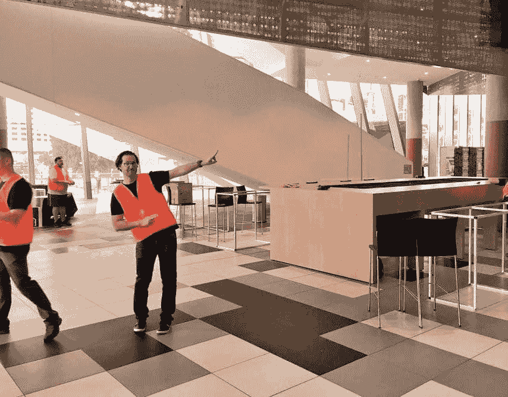
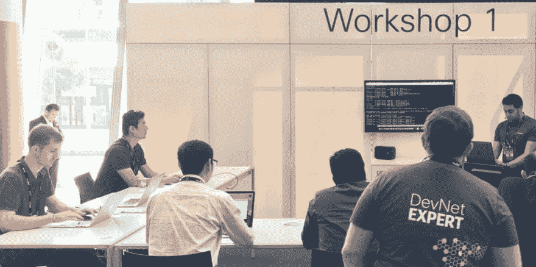
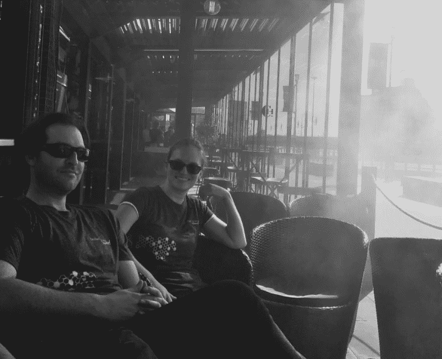

# DevNet Create:应用程序与基础设施的交汇点！

> 原文:[https://dev . to/a roach/devnet-create-where-applications-meet-code 基础设施](https://dev.to/aroach/devnet-create-where-applications-meet-codefrastructure)

在 DevOps 圈子里(甚至更远)，有一个概念叫做基础设施即代码，或者我喜欢称之为 Codefrastructure！:-)

在过去，大概五年前，与编写应用程序相比，安装和堆叠硬件是完全不同的流程和技能。(坦率地说，在出现问题之前，infra 和 app 人员从未有过交集。)

[T2】](https://res.cloudinary.com/practicaldev/image/fetch/s--JFmhvxup--/c_limit%2Cf_auto%2Cfl_progressive%2Cq_auto%2Cw_880/https://cdn-images-1.medium.com/max/854/1%2AB3d9pn2db2WqJPX14Znh9g.jpeg)

随着公共云和私有云的出现，创建应用程序的基本编程技能正在与启动和配置环境以及部署应用程序的技能融合在一起。这是因为，作为一个行业，工作负载正在变得抽象，API 可用于运行应用程序的基础架构的每一层。它变成了赌桌赌注。接下来，这个行业正在迅速发展成不用担心服务器的编程。今天，这是“无服务器”和工作流类型系统的形式，如 IFTTT、Stamplay、Built.io 和 Zapier。

这让我想到了 [DevNet Create](https://www.devnetcreate.io/2017/) 。我期待着与与会者讨论共同基础设施。也就是说，与那些也在研究应用程序如何更好地利用基础设施中的功能的人会面和交谈。如果我们能搞清楚这些概念，我们的应用程序就能变得更有弹性、更容错、更有价值，提供更好的整体用户体验。

[T2】](https://res.cloudinary.com/practicaldev/image/fetch/s--uQFOpk10--/c_limit%2Cf_auto%2Cfl_progressive%2Cq_auto%2Cw_880/https://cdn-images-1.medium.com/max/1024/1%2Azz9WpmLmCrtk2gpp5EMqLw.jpeg)

我希望你能坚持到 [DevNet 创建](https://www.devnetcreate.io/2017/)！我们计划让它充满精彩的内容、演讲者和活动，以帮助我们探索应用程序和基础架构的交集。

现已开放注册，请利用[早鸟定价](https://www.eventbrite.com/e/devnet-create-2017-registration-32833321348)！邀请你最酷的朋友一起来。

[T2】](https://res.cloudinary.com/practicaldev/image/fetch/s--avG3AzPX--/c_limit%2Cf_auto%2Cfl_progressive%2Cq_auto%2Cw_880/https://cdn-images-1.medium.com/max/1024/1%2A4exctEwWMyyzk1N5ASEm7A.jpeg)

在 Twitter [@aroach](https://twitter.com/aroach) 上关注我，使用这个标签:#Codefrastructure！

* * *

*本帖最初发表于[medium.com](https://blog.devnetcreate.io/codefrastructure-f8ff673d32ba)T3】*