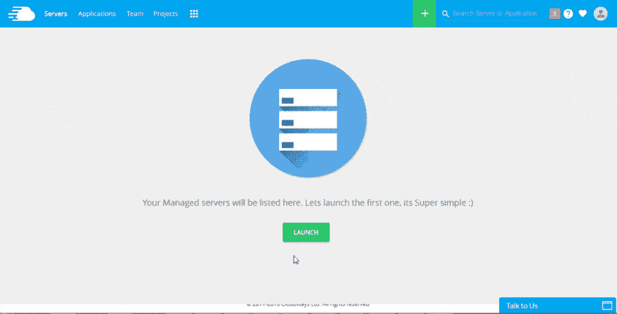
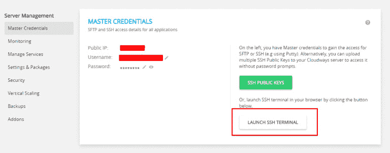
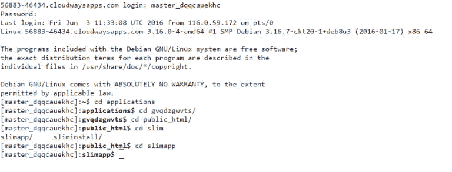
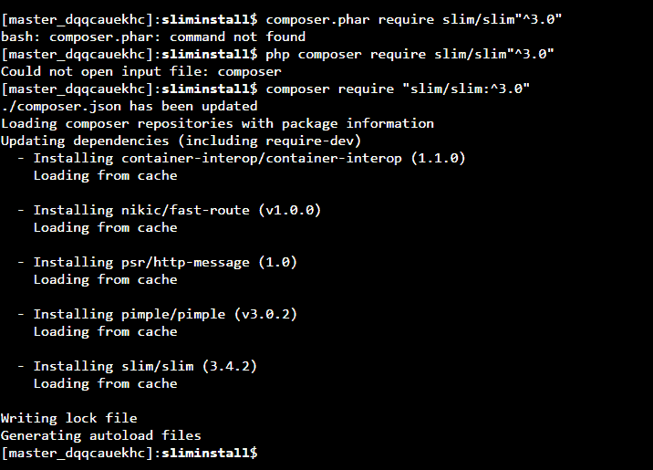
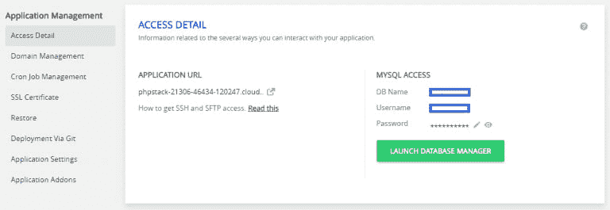
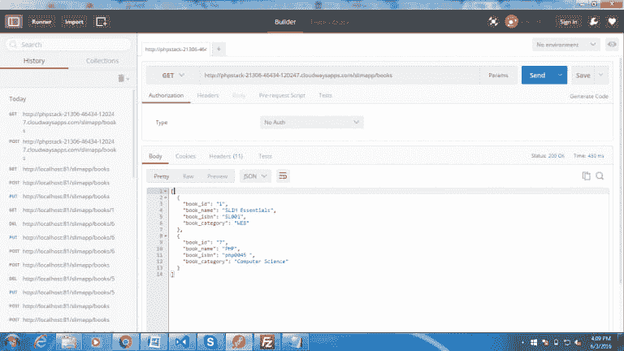
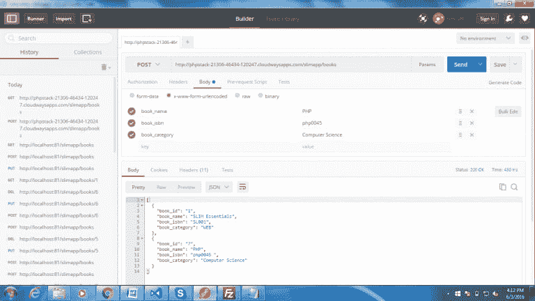
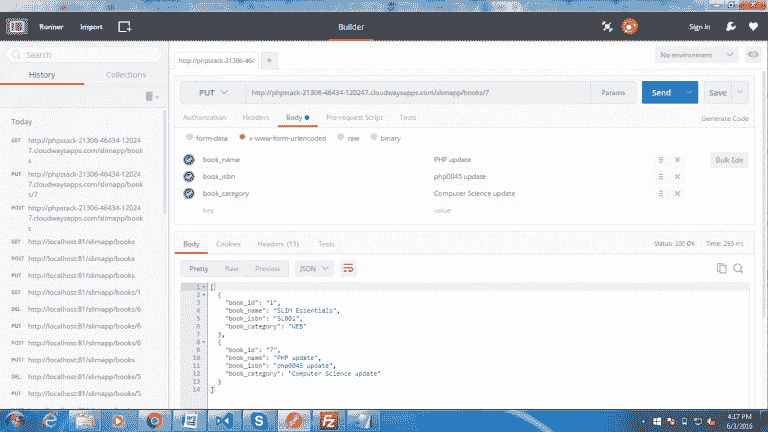

# 使用 Slim 微框架创建 RESTful API

> 原文:[https://dev . to/cloudways/creating-restful-API-using-slim-micro-framework](https://dev.to/cloudways/creating-restful-api-using-slim-micro-framework)

*本文最初发表于 Cloudways: [用 Slim 框架创建一个简单的 REST API](https://www.cloudways.com/blog/simple-rest-api-with-slim-micro-framework/)*

互联网上充斥着提供广泛功能的第三方和自定义 API。PHP 为 web 应用程序的快速开发提供了几个框架。然而，时间总是 web 开发者的敌人，应用程序需要在一个不可能的截止日期推出。在这种情况下，框架是快速应用程序开发的最佳选择。

在本教程中，我将向您介绍 PHP 的 Slim 框架。Slim 正迅速成为 API 开发和小型 web 应用程序最受欢迎的框架。尽管您可以在其他几个框架中创建 REST API，如 CakePHP、Symfony Laravel、Codeigniter，但它们的学习曲线很陡，而且在快速开发场景中使用起来往往过于繁琐。

## 了解苗条框架

Slim 是超级轻量级框架，非常适合快速 web 应用程序开发。一个重要的用途是在 REST API 开发中。Slim 支持所有 HTTP 方法(GET、POST、PUT、DELETE)。Slim 包含非常方便的 URL 结构，包括路由器、中间件、bodyparser、页面模板、flash 消息、加密 cookies 等等。

此时，理解 REST API 的结构很重要。

## 了解 REST API

REST 是具象状态转移的缩写。这是数据资源和应用程序接口之间的桥梁或媒介，无论是在移动设备上还是在桌面上。REST 提供了一组用于修改数据的 HTTP 方法。以下是常见的 HTTP 方法:

GET 用于读取和检索数据。
POST 用于插入数据。
PUT 用于更新数据。
删除用于删除数据。

基本上，REST 现象作用于动作和资源。每当调用任何操作 URL 时，它都会在该 URL 上执行一个单独的方法(或一组方法)。我将在下面用例子进一步讨论这个问题。

首先，我们需要为 REST API 项目安装 Slim 框架。

我假设你已经用 PHPstack 启动了你的 [Cloudways 服务器，如果你没有启动你的服务器注册来获得它。](https://platform.cloudways.com/signup)

[T2】](https://res.cloudinary.com/practicaldev/image/fetch/s--6kmhzYnw--/c_limit%2Cf_auto%2Cfl_progressive%2Cq_66%2Cw_880/http://www.cloudways.com/blog/wp-content/uploads/phpstactnew-resize.gif)

创建服务器后，启动 SSH 终端。

[T2】](https://res.cloudinary.com/practicaldev/image/fetch/s--goE8nsOg--/c_limit%2Cf_auto%2Cfl_progressive%2Cq_auto%2Cw_880/https://www.cloudways.com/blog/wp-content/uploads/launch-ssh-terminal-768x301.png)

## 步骤 1:从 Composer 安装 Slim Framework

从 Cloudways 面板打开 SSH 终端，并使用您的用户名和密码登录。现在转到您想要安装 SLIM with cd 命令的文件夹

[T2】](https://res.cloudinary.com/practicaldev/image/fetch/s--lVBCoo3r--/c_limit%2Cf_auto%2Cfl_progressive%2Cq_auto%2Cw_880/https://www.cloudways.com/blog/wp-content/uploads/terminal-command-768x293.png)

在终端中输入以下命令，通过 composer 安装 Slim。

T2`composer require slim/slim"^3.0"`

[T2】](https://res.cloudinary.com/practicaldev/image/fetch/s--RpxEGnaJ--/c_limit%2Cf_auto%2Cfl_progressive%2Cq_auto%2Cw_880/https://www.cloudways.com/blog/wp-content/uploads/terminal-installation.png)

安装 Slim 后，下面这段代码将要求它在 index.php 文件中要求自动加载文件并实例化 Slim。

```
<?php

require 'vendor/autoload.php';
$app = new Slim\App(); 
```

Composer 预装在 Cloudways 服务器上。如果您在本地主机上工作，您需要安装它。如果您还没有安装它，只需转到以下链接并按照说明进行操作。

## 第二步:为干净的 URL 结构制作一个. htaccess 文件

为了让您的生活更轻松，您应该创建一个定义干净的 URL 结构的. htaccess 文件。在根目录下，创建一个. htaccess 文件，并在其中添加以下代码。这将为 PHP 文件提供一个干净的 URL 结构。(这只是意味着您不想在 URL 调用中包含 PHP 文件名)。

```
RewriteEngine On

RewriteCond %{Request_Filename} !-F

RewriteCond %{Request_Filename} !-d

RewriteRule ^ index.php [QSA,L] 
```

如果您的索引文件位于不同的文件夹中(例如，“public”文件夹)，那么您可以在最后一行插入索引文件的完整路径:

T2`RewriteRule ^ public/index.php [QSA,L]`

## 第三步:在 MySQL 中创建数据库

对于 Cloudways 上的每个 PHP 堆栈，您会得到一个空数据库。

[T2】](https://res.cloudinary.com/practicaldev/image/fetch/s--G-Y2-B43--/c_limit%2Cf_auto%2Cfl_progressive%2Cq_auto%2Cw_880/https://www.cloudways.com/blog/wp-content/uploads/image01-25-768x265.png)

单击启动数据库管理器。若要创建必需的表，请在 SQL 命令框中运行以下查询:

[T2】](https://res.cloudinary.com/practicaldev/image/fetch/s--862cU_P5--/c_limit%2Cf_auto%2Cfl_progressive%2Cq_auto%2Cw_880/https://www.cloudways.com/blog/wp-content/uploads/image00-27-768x283.png)

```
CREATE TABLE IF NOT EXISTS `library` (

 `book_id` int(11) NOT NULL,

 `book_name` varchar(100) NOT NULL,

 `book_isbn` varchar(100) NOT NULL,

 `book_category` varchar(100) NOT NULL

) ENGINE=InnoDB AUTO_INCREMENT=9 DEFAULT CHARSET=utf8;

INSERT INTO `library` (`book_id`, `book_name`, `book_isbn`, `book_category`) VALUES

(1, 'PHP', 'bk001', 'Server Side'),

(3, 'javascript', 'bk002', 'Client Side'),

(4, 'Python', 'bk003', 'Data Analysis'); 
```

现在是第一个 API 调用的时候了。让我们把它系统化。

## 第四步:检索所有图书

在 index.php 文件中输入以下代码，从数据库中获取所有书籍。GET 调用用于检索。

```
$app->get('/books', function() {

 require_once('db.php');

 $query = "select * from library order by book_id";

 $result = $connection->query($query);

 // var_dump($result);

 while ($row = $result->fetch_assoc()){

$data[] = $row;

 }

 echo json_encode($data);

}); 
```

为了简化 API 调用，我推荐使用 [Postman](https://chrome.google.com/webstore/detail/postman/fhbjgbiflinjbdggehcddcbncdddomop?hl=en) (可从 Chrome 应用商店获得)。这个插件对 API 的管理和使用有很大的帮助。

在 postman 中，使用 API URL 进行 GET 调用。

[T2】](https://res.cloudinary.com/practicaldev/image/fetch/s--_hlglKcT--/c_limit%2Cf_auto%2Cfl_progressive%2Cq_auto%2Cw_880/https://www.cloudways.com/blog/wp-content/uploads/image04-17-768x432.png)

## 第五步:创建图书的记录

通过以下代码在 index.php 中进行新的 API 调用:

```
$app->post('/books', function($request){

 require_once('db.php');

 $query = "INSERT INTO library (book_name,book_isbn,book_category) VALUES (?,?,?)";

 $stmt = $connection->prepare($query);

 $stmt->bind_param("sss",$book_name,$book_isbn,$book_category);

 $book_name = $request->getParsedBody()['book_name'];

 $book_isbn = $request->getParsedBody()['book_isbn'];

 $book_category = $request->getParsedBody()['book_category'];

  $stmt->execute();

}); 
```

打开邮差，点击正文。选择 x.www-form-urlencoded。现在通过 POST call 添加要插入的记录。

[T2】](https://res.cloudinary.com/practicaldev/image/fetch/s--Xl6Aykgh--/c_limit%2Cf_auto%2Cfl_progressive%2Cq_auto%2Cw_880/https://www.cloudways.com/blog/wp-content/uploads/image05-14-768x432.png)

## 第六步:更新图书的记录

进行如下所示的新 API 调用，以更新数据库中的记录。

```
$app->put('/books/{book_id}', function($request){

 require_once('db.php');

 $get_id = $request->getAttribute('book_id');

 $query = "UPDATE library SET book_name = ?, book_isbn = ?, book_category = ? WHERE book_id = $get_id";

 $stmt = $connection->prepare($query);

 $stmt->bind_param("sss",$book_name,$book_isbn,$book_category);

 $book_name = $request->getParsedBody()['book_name'];

 $book_isbn = $request->getParsedBody()['book_isbn'];

 $book_category = $request->getParsedBody()['book_category'];

 $stmt->execute();

}); 
```

在 Postman 中，添加数据以更新特定的图书记录。

[T2】](https://res.cloudinary.com/practicaldev/image/fetch/s--LwJKex4t--/c_limit%2Cf_auto%2Cfl_progressive%2Cq_auto%2Cw_880/https://www.cloudways.com/blog/wp-content/uploads/image03-20-768x432.png)

## 第七步:删除图书的记录

要删除具有特定 ID 的记录，需要 delete 调用。

```
$app->delete('/books/{book_id}', function($request){

 require_once('db.php');

 $get_id = $request->getAttribute('book_id');

 $query = "DELETE from library WHERE book_id = $get_id";

 $result = $connection->query($query);

}); 
```

在邮递员上，像这样运行呼叫

[T2】](https://res.cloudinary.com/practicaldev/image/fetch/s--hQLS7yQY--/c_limit%2Cf_auto%2Cfl_progressive%2Cq_auto%2Cw_880/https://www.cloudways.com/blog/wp-content/uploads/image02-21.png)

这都是为了 Slim 框架中的基础 REST API。但是，只有在代码末尾添加了这个命令之后，这个 API 才会起作用。

`$app->run();`

## 结论

用 Slim framework 创建和使用 REST API 非常容易。框架最大的优点是易用性和轻量级。锦上添花的是，它非常容易学习，一个好的开发人员可以在几个小时内学会这个框架。总的来说，Slim 接收 HTTP 请求，检查它们，并为 HTTP 请求调用适当的回调例程，然后返回适当的响应。

如果你需要澄清这篇文章，或者对 Slim 框架有任何其他疑问，请通过评论部分告诉我。