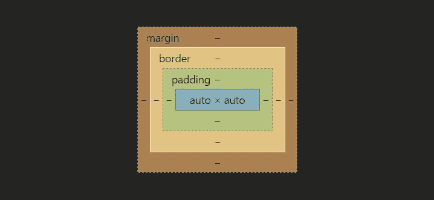
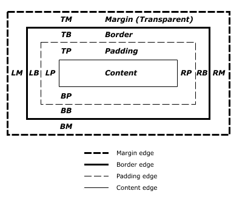
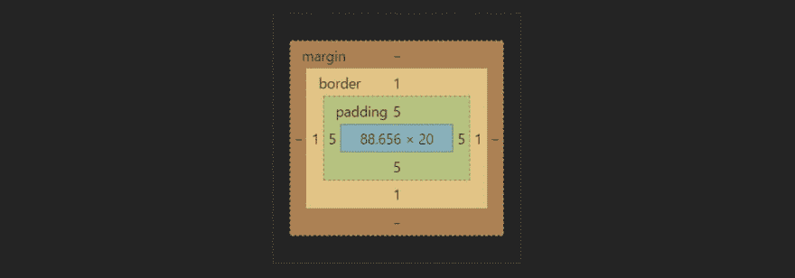
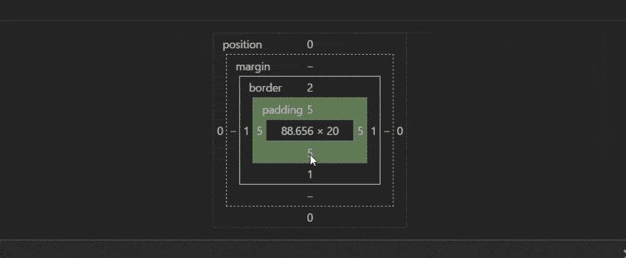

# TIL -使用 Chrome 开发工具的“盒子模型”

> 原文:[https://dev.to/amit_merchant/til 使用 chrome 开发工具的盒子模型](https://dev.to/amit_merchant/til---using-box-model-of-chrome-dev-tools)

说到网络调试功能，我们都知道 Chrome Dev Tools 有多好。开发工具中有许多非常有用的特性，但是我们没有意识到。

我今天发现的一个特征是“盒子模型”。那么，到底是什么呢？

这是 Chrome Dev Tools 提供的一项功能，它向我们展示了 HTML 页面上一个元素的可视化表示，包括相对于其他元素的边距、填充和边框

[T2】](https://res.cloudinary.com/practicaldev/image/fetch/s--mR-K-byO--/c_limit%2Cf_auto%2Cfl_progressive%2Cq_auto%2Cw_880/https://raw.githubusercontent.com/amitmerchant1990/amitmerchant1990.github.io/mastimg/box-model.JPG)

你可能在日常调试中多次看到这种情况，但没有尝试，因为你可能没有完全意识到这一点，或者只是跳过了它。

基本上，它向我们展示了特定元素的以下信息:

[T2】](https://res.cloudinary.com/practicaldev/image/fetch/s--me8HKGJz--/c_limit%2Cf_auto%2Cfl_progressive%2Cq_auto%2Cw_880/https://raw.githubusercontent.com/amitmerchant1990/amitmerchant1990.github.io/mastimg/box-model-described.jpg)

如图所示，它通过颜色向我们展示了相对边距、填充、边框。所以，每样东西都用不同的颜色来表示。主元素为蓝色，填充为绿色，边框为棕色，等等。它还以数字的形式显示每边的填充量/边距。即顶部、底部、左侧和右侧。

[T2】](https://res.cloudinary.com/practicaldev/image/fetch/s--5nVux8_Z--/c_limit%2Cf_auto%2Cfl_progressive%2Cq_auto%2Cw_880/https://raw.githubusercontent.com/amitmerchant1990/amitmerchant1990.github.io/mastimg/box-model-2.JPG)

在上面的图片中，你可以看到，一个元素每边有 5px 的填充，1px 的边框，两边没有空白。关于这个盒子模型的一个有趣的事情是，你实际上可以修改其中的任何数字，并且可以看到相应的变化。

[T2】](https://res.cloudinary.com/practicaldev/image/fetch/s--eWTcQzE5--/c_limit%2Cf_auto%2Cfl_progressive%2Cq_66%2Cw_880/https://raw.githubusercontent.com/amitmerchant1990/amitmerchant1990.github.io/mastimg/box-model.gif)

当我们想要看到跨元素的填充和边距的实际行为，而不是仅仅在 CSS 中随机改变它们时，这非常方便。但不幸的是，尽管它给了我们更精确的元素表示，但在其他工具中，它很少被使用。所以，从现在开始，让我们试着多使用它。

感谢阅读！这篇文章最初发表在我的网站[这里](https://www.amitmerchant.com/TIL-Chrome-Dev-Tools-Box-Model/)。