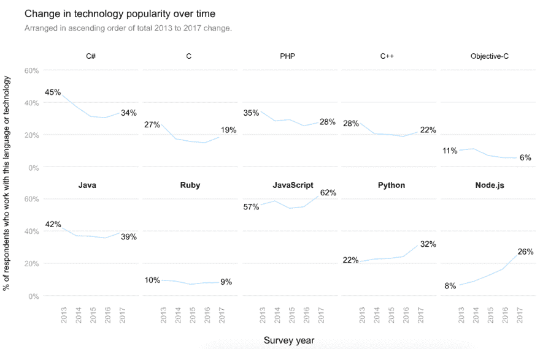
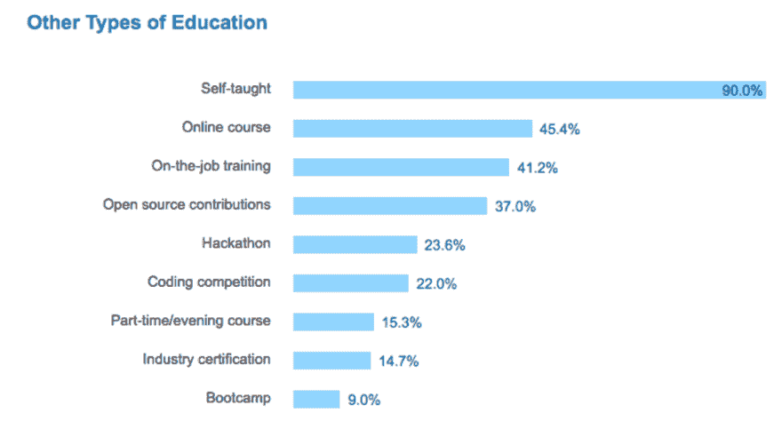
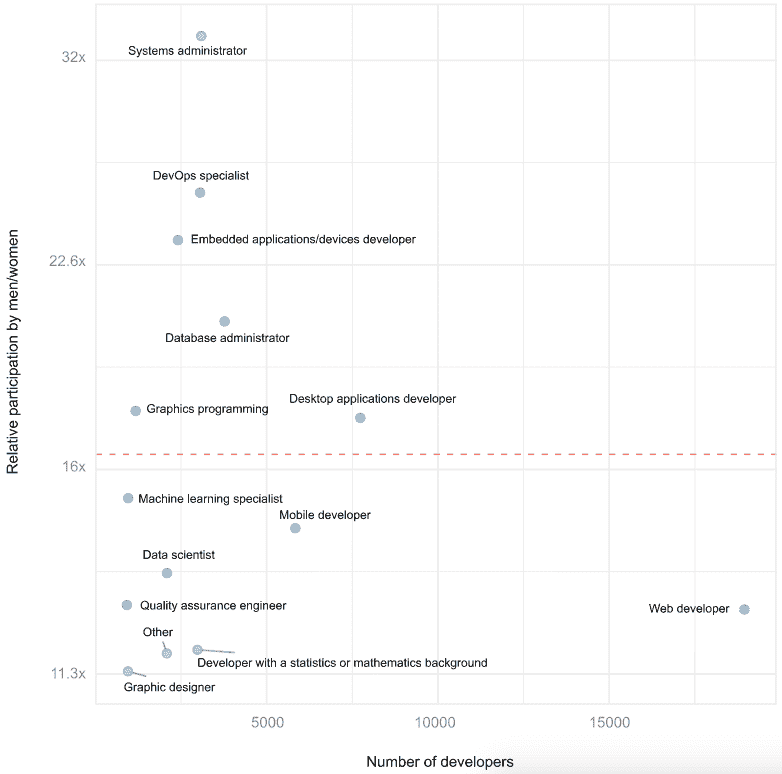
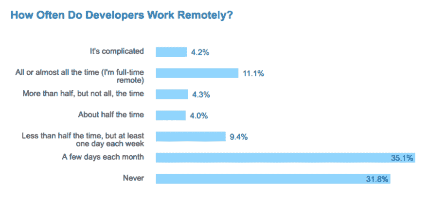
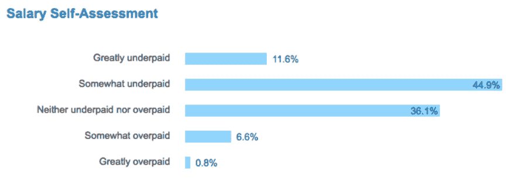

# 深入了解 2017 年堆栈溢出开发者调查的结果

> 原文:[https://dev . to/walker/diving-into-the-results-of-the-2017-stack-overflow-developer-survey](https://dev.to/walker/diving-into-the-results-of-the-2017-stack-overflow-developer-survey)

*来自**开发者对**的通知:我们将在今天(3 月 22 日)美国东部时间下午 1 点举行一次 Twitter 聊天来讨论结果。跟随标签 [#StackSurvey17](https://twitter.com/hashtag/stacksurvey17)*

作为有需要的程序员和那些愿意提供帮助的人的首要目的地，Stack Overflow 拥有了解开发人员社区集体脉搏的独特途径。因此，他们今天发布的年度调查的[结果，挖掘了超过 60，000 名开发者的经验，总感觉像是行业当前趋势的可靠反映。](https://stackoverflow.com/insights/survey/2017/)

看看这份报告，你很快就会意识到有大量的模式可供探索。此外，Stack Overflow 将匿名化并发布原始结果，这将为程序员创造一个很好的递归机会，让他们使用自己的编程技能来分析程序员创建的关于程序员的结果，在此过程中确认调查揭示的编程技能，同时……好吧，你明白了。

然而，在这一切发生之前，甚至堆栈溢出强调的基本趋势也值得讨论一下。这里有五个特别的，每个都将在本周晚些时候在一个专门的帖子中详细阐述。

## 1。不断变化的语言流行度

[T2】](https://res.cloudinary.com/practicaldev/image/fetch/s--XxDu5G-O--/c_limit%2Cf_auto%2Cfl_progressive%2Cq_auto%2Cw_880/http://i.imgur.com/h0yyBtY.png)

Stack Overflow 的调查的优势之一是，它正在慢慢变成一个纵向项目。他们现在有了从 2013 年开始开发人员正在使用的语言的信息，这让我们看到一些旧语言，如 C 和 C#，正在变得不那么流行，而 Javascript 和 Python 已经成熟为行业中坚力量。

## 2。自学

[T2】](https://res.cloudinary.com/practicaldev/image/fetch/s--NC98qpT2--/c_limit%2Cf_auto%2Cfl_progressive%2Cq_auto%2Cw_880/http://i.imgur.com/RgXmAB5.png)

毫不奇怪，经常与扩大共享信息和经验有关的技术被那些利用现有资源自学的人所淹没。因此，虽然互动、面对面的方式，如训练营或兼职课程肯定发挥了作用，但十分之九的开发人员仍然依赖于坐下来自己解决问题。

## 3。科技界的女性

[T2】](https://res.cloudinary.com/practicaldev/image/fetch/s--jXk3JAXW--/c_limit%2Cf_auto%2Cfl_progressive%2Cq_auto%2Cw_880/http://i.imgur.com/mXZWnlg.png)

软件行业的组织正试图(并成功地，尽管缓慢地)纠正开发人员中巨大的性别差距。有趣的是，除了基本的数字之外，还有最大的改进空间:虽然男性系统管理员与女性系统管理员的比例超过 30 比 1，但图形设计和数据科学的比例更平衡一些。

堆栈溢出表明，在完整的数据发布之前，他们将对这一数据领域进行进一步的研究，因此我建议在此之前不要过多地研究这一领域。

## 4。远程控制

[T2】](https://res.cloudinary.com/practicaldev/image/fetch/s--O92QA6q6--/c_limit%2Cf_auto%2Cfl_progressive%2Cq_auto%2Cw_880/http://i.imgur.com/o8QaPSj.png)

即使像 IBM 和雅虎这样的科技巨头。在将他们的协议从 WFH 选项中转移出来后，三分之二的开发人员仍然每月至少花几天时间远程工作，大约五分之一的人至少有一半的时间这样做。随着调查的持续增长，看看这种趋势是否已经达到饱和点将是一个有趣的后续点。

## 5。给我看看钱

[T2】](https://res.cloudinary.com/practicaldev/image/fetch/s--iU9-5ofc--/c_limit%2Cf_auto%2Cfl_progressive%2Cq_auto%2Cw_880/http://i.imgur.com/ESddfrl.png)

学习编程通常被认为是一个有利可图的职业重新定位，但是那些已经可以的人并不觉得他们得到了足够的爱。超过一半的发展中国家认为他们的工资有些或很低，而只有大约 8%的人认为他们的工资过高。

* * *

这些图表中的每一个都值得进行更长时间的讨论，特别是当与 SO 的大量报告中的其他一些有趣的点一起检查时。在这一周的时间里，请查看 [dev.to](https://dev.to/) 来深入了解这些问题，我鼓励你使用 [dev.to](https://dev.to/) 上的 [#stacksurvey17](https://dev.to/t/stacksurvey17) 来制作你自己的数据细目表，包括现在和完全转储可用时。