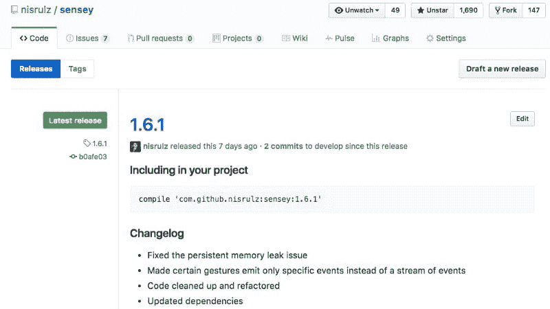

# 我希望在开始构建 Android SDK/库时就知道的事情

> 原文：<https://dev.to/nisrulz/things-i-wish-i-knew-when-i-started-building-android-sdklibraries>

*注:本帖原载于[媒体。](https://android.jlelse.eu/things-i-wish-i-knew-when-i-started-building-android-sdk-libraries-dba1a524d619)还登上了[安卓周刊](http://androidweekly.net/issues/issue-249)T5】*

[T2】](https://res.cloudinary.com/practicaldev/image/fetch/s--xG3lH7M1--/c_limit%2Cf_auto%2Cfl_progressive%2Cq_auto%2Cw_880/http://crushingcode.github.img/posts/things-i-wish-i-knew-when-i-started-building-android-sdk-libraries/header.png)

这一切都始于某个 android 开发者试图找出他/她在构建他们的**“棒极了的 Android 应用”**时遇到的问题的解决方案。在这个过程中，大多数开发人员会遇到一些问题，然后，他们会想出可能的解决方案。

现在有一件事，如果你像我一样，认为如果问题大到足以让我花一些时间来解决，并且没有现成的解决方案，我会以模块化的方式抽象整个解决方案，最终形成一个 android 库。这样无论何时我再次遇到这个问题，我都可以轻松地重用这个解决方案。

到目前为止，一切顺利。所以你已经建立了这个库，并且可能开始完全私人地使用它，或者如果你认为其他人可以使用相同的解决方案，你可以将代码作为 android 库发布，也就是说，你将代码开源。我相信(..或者更确切地说，这就是它看起来的样子..)至此大家都以为大功告成了。

**错了！**这正是大多数人通常会忽略的一点，即这个 android 库代码将会被不在你身边的其他开发人员使用，对他们来说，这只是一些他们希望用来解决类似问题的 android 库。你设计 API 的方法越好，你就越有机会确保这个库能按照预期的方式使用，无论谁在使用它都不会感到困惑。从一开始就应该清楚开始使用这个库需要做些什么。

##### *为什么会这样？*

编写这些 android 库的开发人员通常是那些在构建 API 时不关心 API 设计的人。至少大部分人不会。不是因为他们漠不关心，而是我认为他们中的大多数人只是初学者，没有固定的规则可以让他们更好地设计 API。前一段时间我也遇到过同样的情况，所以我能理解在这个领域没有太多信息的沮丧。

所以我有我的经验，我碰巧发布了一些代码作为 android 库([你可以在这里查看](https://github.com/nisrulz/android-tips-tricks#extra--android-libraries-built-by-me))。我已经提出了一个要点的快速列表，每个以 Android 库的形式设计 API 的开发人员都应该记住这些要点(其中一些可能也适用于一般的 API 设计)。

> 这里要指出的是，我的列表并不详尽，我可能没有涵盖所有内容。它涵盖了我遇到的事情，我希望我在开始的时候就知道，因此当我在未来学到更多经验时，我会继续更新这个帖子。

在我们深入讨论任何事情之前，让我们首先回答每个人都会有的关于构建 Android SDK/库的最基本的问题。所以现在开始

### 为什么会创建 Android SDK/库？

[T2】](https://res.cloudinary.com/practicaldev/image/fetch/s--BpVKoOXs--/c_limit%2Cf_auto%2Cfl_progressive%2Cq_66%2Cw_880/http://crushingcode.github.img/posts/things-i-wish-i-knew-when-i-started-building-android-sdk-libraries/question.gif)

当然是...你不必在所有情况下都创建一个 SDK/库。更有意义的做法是，基于对你能带来什么价值的理解来决定建立一个。问问你自己下面的问题

有没有一些现有的解决方案可以解决这个问题？
如果你的答案是肯定的，那么尽可能尝试使用现有的解决方案。
假设这并不能解决您的具体问题，即使在这种情况下，最好从分叉代码开始，修改代码以解决问题，然后使用它，而不是从头开始。

> 如果您提交一个 Pull 请求，将您所做的修复推送到现有的库代码中，这样社区就可以从中受益，您将获得额外的积分。

如果你的答案是否定的，那么继续构建 Android SDK/库。稍后与世界分享它，以便其他人可以在他们的项目中使用它。

### 你的神器有哪些包装选择？

甚至在你开始构建你的库之前，你需要决定你想要如何将你的工件交付给开发者。让我从描述一些我们可能会在帖子中用到的术语开始。首先让我描述一下什么是人工制品，

> 在一般的软件术语中，一个**“工件”**是由软件开发过程产生的东西，无论它是软件相关的文档还是可执行文件。
> 在 maven 术语中，工件是 Maven 构建的结果输出，通常是`jar`、`war`、`aar`或其他可执行文件。

让我们看看你有哪些选择

*   **库项目**:您必须签出并链接到您的项目中的代码。这是最灵活的方法，因为一旦代码中有了它，您就可以修改它，但是也会引入一些问题，比如与上游的更改保持同步。
*   **JAR**:**J**ava**AR**chive 是一种包文件格式，通常用于将许多 Java 类文件和相关元数据聚集成一个文件进行分发。
*   **AAR**:**A**n roid**AR**chive 类似于 JAR，但功能有所增加。与 JAR 文件不同，AAR 文件可以包含 Android 资源和一个 manifest 文件，这允许您捆绑共享资源，如 layouts 和 drawable，以及 Java 类和方法。

### 我们有了神器，现在怎么办？这些人工制品存放在哪里？

[T2】](https://res.cloudinary.com/practicaldev/image/fetch/s--LvOLzQ8B--/c_limit%2Cf_auto%2Cfl_progressive%2Cq_66%2Cw_880/http://crushingcode.github.img/posts/things-i-wish-i-knew-when-i-started-building-android-sdk-libraries/trickquestion.gif)

不见得...原来你也有几个选择，每个都有自己的利弊。让我们看一看每一个

##### 本地 AAR

如果您非常明确地不想将您的 android 库工件放入任何存储库中，您可以生成您的本地 aar 文件并直接使用它。阅读[这个 stackoverflow 回答](http://stackoverflow.com/a/28816265/2745762)来理解如何做。

简言之，您需要将`aar`文件放在`libs`目录中(如果需要，可以创建它)，然后，在您的`build.gradle`中添加以下代码:

```
dependencies {
   compile(name:'nameOfYourAARFileWithoutExtension', ext:'aar')
 }
repositories{
      flatDir{
              dirs 'libs'
       }
 } 
```

Enter fullscreen mode Exit fullscreen mode

..随之而来的是，现在无论何时你想要分享你的 android 库，你都要传递你的`aar`文件(…这不是分享你的 android 库的最佳方式)。

> **尽可能避免这样做**，因为这样容易出现很多问题，其中最大的问题是代码库的可管理性和可维护性。
> 这种方法的另一个问题是你不能确保这个工件的用户与最新的代码同步。
> 且不说整个过程冗长且容易出现人为错误，光是在一个 android 项目中集成库。

##### 本地/远程 Maven 知识库

*如果你想私下使用 android 库怎么办？*
解决方案是部署你自己的 artifactory 实例(在这里阅读如何实现[)或者使用 Github 或 Bitbucket 存储库作为你自己的 maven 存储库(在这里](http://jeroenmols.com/blog/2015/08/06/artifactory/)阅读如何实现[)。](http://crushingcode.nisrulz.com/own-a-maven-repository-like-a-bosspart-1/)

> 同样，这是针对你私下使用你的 android 库的。如果你想与他人分享，这不是你想要坚持的方法。

这种方法的第一个问题是，您的工件在一个私有存储库中，要访问这个库，您必须访问这个私有存储库，这可能是一个安全问题。
第二个问题是，要使用你的 android 库，你需要在他们的根文件`build.gradle`中增加一行

```
allprojects {
    repositories {
        ...
        maven { url 'http://url.to_your_hosted_artifactory_instance.maven_repository' }
    }
} 
```

Enter fullscreen mode Exit fullscreen mode

..公平地说，这是一个额外的步骤，我们都在这里使这个过程更简单。对于创建者来说，快速推出 android 库更容易，但增加了用户使用库代码的额外步骤。

##### Maven Central、Jcenter 或 JitPack

现在最简单的方法是通过 **JitPack** 立即推出它。所以你会想这么做。JitPack 从一个公共的 git 存储库中取出您的代码，检查最新的发布代码，构建它以生成工件，然后发布到他们自己托管的 maven 存储库中。
然而，手头的问题与本地/远程 maven 库的问题相同，android 库的用户需要在他们的根`build.gradle`文件
中包含一个额外的行

```
allprojects {
    repositories {
        ...
        maven { url 'https://www.jitpack.io' }
    }
} 
```

Enter fullscreen mode Exit fullscreen mode

你可以在这里阅读如何将你的 android 库发布到 JitPack [。](http://crushingcode.co/publish-your-android-library-via-jitpack/)

另一个选择是 Maven Central 或 Jcenter。

就我个人而言，我建议你继续使用 Jcenter ，因为它有据可查，管理得更好。它也是在 Android 项目中查找依赖项的默认存储库(…除非有人更改了它)。

如果您发布到 Jcenter，bintray(它背后的公司)会让您选择从他们的发布平台内与 Maven Central 同步。一旦发布，只需在 build.gradle 文件中添加下面一行就可以在任何 android 项目中使用该库

```
dependencies {
      compile 'com.github.nisrulz:awesomelib:1.0'
  } 
```

Enter fullscreen mode Exit fullscreen mode

你可以在这里阅读如何将你的 android 库发布到 Jcenter。

抛开所有这些基本问题，让我们看看在构建 Android SDK/库时应该注意的事情

### 避免多重争论

每个 android 库通常都需要用一些参数来初始化，为此，你通常会将一组参数传递给一个构造函数或一个 init 函数来设置你的库。无论何时这样做，请考虑以下事项

向 init()函数传递 2-3 个以上的参数肯定会带来更多的麻烦，而不是易用性。T3】

只是因为很难记住这些参数的确切映射以及它们在库代码中的声明顺序。它还容易出现更多的错误，因为任何人都可能犯在`String`字段中传递`int`值的错误，反之亦然。

```
// DONOT DO THIS
void init(String apikey, int refresh, long interval, String type);
// DO this
void init(ApiSecret apisecret); 
```

Enter fullscreen mode Exit fullscreen mode

其中 ApiSecret 是一个实体类，声明如下

```
public class ApiSecret{
    String apikey;
    int refresh;
    long interval;
    String type;
    // constructor
    /* you can define proper checks(such as type safety) and
     * conditions to validate data before it gets set
     */

    // setter and getters
} 
```

Enter fullscreen mode Exit fullscreen mode

或者你也可以使用`Builder Pattern`作为上述方法的替代方法。

你可以在这里阅读更多关于构建器模式[的内容。](https://sourcemaking.com/design_patterns/builder) [JOSE LUIS ORDIALES](https://jlordiales.me/about/) 深入讲述了如何在你的代码中实现它，看看[这里](https://jlordiales.me/2012/12/13/the-builder-pattern-in-practice/)。

### 易用性

在构建你的 android 库的时候，记住库的可用性和你公开的方法。应该是

*   **直观**

    对于 android 库代码中发生的所有事情，应该在日志或视图中有一些反馈。取决于正在构建的 android 库是什么样的。如果它做了一些不容易理解的事情，android 库基本上“不能用开发者的语言工作”。它应该做 android 库的用户期望它做的事情，而不必查阅文档。

*   **一致**

    android 库的代码应该是经过深思熟虑的，不应该在不同版本之间有很大的变化。遵循[语义版本化](http://semver.org/)。

*   **易于使用，难以误用**

    乍一看，它的实现和用法应该很容易理解。公开的公共方法应该有足够的验证检查，以确保人们不能滥用它的功能，除了它的编码和预期目的。提供合理的默认值，并处理不存在依赖关系的情况。

简而言之…

[T2】](https://res.cloudinary.com/practicaldev/image/fetch/s--ukJttSdo--/c_limit%2Cf_auto%2Cfl_progressive%2Cq_66%2Cw_880/http://crushingcode.github.img/posts/things-i-wish-i-knew-when-i-started-building-android-sdk-libraries/easy.gif)

### 最小化权限

在当前时代，当每个人都想跳过这条路并要求尽可能多的权限时，你应该停下来想想你真的需要额外的权限吗？请特别注意这些要点

*   尽可能减少你的权限。
*   使用 Intents 让专门的应用程序为您完成工作，并返回处理结果。
*   如果您有权限，可以启用和禁用您的功能。不要因为你没有上述权限就让你的代码崩溃。如果有的话，你必须在请求许可之前教育好用户，告诉他们为什么需要许可。如果可能的话，如果许可没有被批准，有一个回退功能。

这就是你如何检查你是否有一个被授予的许可:

```
public boolean hasPermission(Context context, String permission) {
  int result = context.checkCallingOrSelfPermission(permission);
  return result == PackageManager.PERMISSION_GRANTED;
} 
```

Enter fullscreen mode Exit fullscreen mode

一些开发人员会说他们真的需要那个特定的许可，在那种情况下该怎么做。好吧，你的库代码应该对需要特定功能的所有类型的应用程序通用。如果你能提供诸如函数之类的钩子，让你的 android 库的用户传递你需要危险许可的数据。这样，您就不会强迫开发人员要求他们不想要的权限。如果没有权限，请提供一个回退实现。简单。

```
/* Requiring GET_ACCOUNTS permission (as a requisite to use the 
 * library) is avoided here by providing a function which lets the 
 * devs to get it on their own and feed it to a function in the 
 * library.
 */
MyAwesomeLibrary.getEmail("username@emailprovider.com"); 
```

Enter fullscreen mode Exit fullscreen mode

### 尽量减少必需品

我们都经历过。我们有一个特定的功能，要求设备具有特定的功能。通常的方法是在清单文件
中定义以下内容

```
<uses-feature android:name="android.hardware.bluetooth" /> 
```

Enter fullscreen mode Exit fullscreen mode

..这样做的问题是，当这在 android 库代码中定义时，这将在`build`的清单合并阶段被合并到应用清单文件中，从而在 Play Store 中为没有蓝牙单元的设备隐藏应用(这是 Play Store 作为过滤所做的事情)。因此，基本上一个以前对较大受众可见的应用程序现在会对较小的受众可见，只是因为你将它添加到了库代码中。

这不是我们想要的，不是吗？没有。那么我们如何解决这个问题呢？
*你需要做的不是将`uses-feature`包含在 android 库的清单文件中，而是在运行时检查代码中的特性，如下图*

```
String feature = PackageManager.FEATURE_BLUETOOTH;
public boolean isFeatureAvailable(Context context, String feature) {
 return context.getPackageManager().hasSystemFeature(feature);
} 
```

Enter fullscreen mode Exit fullscreen mode

..这种方式在清单中没有条目，一旦它合并到应用程序中，它就不会让应用程序在 Play Store 中被过滤。

作为一个额外的特性，如果这个特性不可用，你可以在你的库代码中禁用这个特性，并在适当的地方设置一些后备功能。对于构建库的 android 开发人员和将库集成到应用程序中的开发人员来说，这是一个双赢的局面。

### 支持不同版本

[T2】](https://res.cloudinary.com/practicaldev/image/fetch/s--UF92XjOy--/c_limit%2Cf_auto%2Cfl_progressive%2Cq_66%2Cw_880/http://crushingcode.github.img/posts/things-i-wish-i-knew-when-i-started-building-android-sdk-libraries/howmany.gif)

<center>*How many are out there exactly?*</center>

如果你有一个在某个版本的 android 中可用的特性，你应该在代码中检查这个特性，如果版本低于支持的版本，就禁用这个特性。
根据经验，通过在`minSdkVersion`和`targetSdkVersion`中定义来支持所有版本。您应该在库代码内部做的是在运行时检查 android 版本，并启用/禁用该功能或使用回退。

```
// Method to check if the Android Version on the device is greater than or equal to Marshmallow.
public boolean isMarshmallow(){
    return Build.VERSION.SDK_INT>= Build.VERSION_CODES.M;
} 
```

Enter fullscreen mode Exit fullscreen mode

### 不登录生产

[T2】](https://res.cloudinary.com/practicaldev/image/fetch/s--GikJZ1xx--/c_limit%2Cf_auto%2Cfl_progressive%2Cq_66%2Cw_880/http://crushingcode.github.img/posts/things-i-wish-i-knew-when-i-started-building-android-sdk-libraries/no.gif)

<center>*Just DO NOT.*</center>

几乎每次我被要求测试一个应用程序或一个 android 库项目时，我看到的第一件事就是他们把所有东西都公开记录在他们的发布代码中。
根据经验，永远不要登录生产。您应该使用[构建变体](https://developer.android.com/studio/build/build-variants.html)和[木材](https://github.com/JakeWharton/timber)来帮助您在生产和调试构建中分离日志信息。一个简单的解决方案是提供一个`debuggable`标志，开发者可以翻转这个标志来启用/禁用 android 库的日志记录

```
// In code 
boolean debuggable = false;
MyAwesomeLibrary.init(apisecret,debuggable);
// In build.gradle 
debuggable = true 
```

Enter fullscreen mode Exit fullscreen mode

### 不要无声无息的崩溃，快速失败

[T2】](https://res.cloudinary.com/practicaldev/image/fetch/s--EMMEMVvo--/c_limit%2Cf_auto%2Cfl_progressive%2Cq_auto%2Cw_880/http://crushingcode.github.img/posts/things-i-wish-i-knew-when-i-started-building-android-sdk-libraries/crash.png)

我已经看过很多次了。一些开发人员不会在 logcat 中记录他们的错误和异常！这基本上增加了 android 库用户在调试代码时的头痛。与关于不在生产中记录日志的最后一个技巧相呼应，您必须理解无论是在调试还是生产中，都需要记录异常和错误。如果您不想在生产中登录，至少在初始化库时通过传递一些标志来提供启用日志的功能。即

```
void init(ApiSecret apisecret,boolean debuggable){
      ...
      try{
        ...
      }catch(Exception ex){
        if(debuggable){
          // This is printed only when debuggable is true
          ex.printStackTrace();
        }
      }
      ....
} 
```

Enter fullscreen mode Exit fullscreen mode

重要的是，你的 android 库会立即失败，并向你的 android 库的用户显示一个异常，而不是被挂起。避免编写会阻塞主线程的代码。

### 在发生错误时优雅地降级

我的意思是，当你的 android 库代码失败时，尝试进行检查，这样代码就不会使应用程序崩溃，而是只有你的库代码提供的功能被禁用。

### 捕捉特定的异常

继续上一个技巧，您可能会注意到，在我的上一个代码片段中，我使用了一个`try-catch`语句。Catch 语句专门捕捉所有的`Exception`,因为它是一个基类。一个例外与另一个例外之间没有具体的区别。所以你必须做的是根据手头的需求定义特定类型的`Exception`。即`NUllPointerException`、`SocketTimeoutException`、`IOException`等。

### 处理恶劣的网络条件

[T2】](https://res.cloudinary.com/practicaldev/image/fetch/s--bG3h_p4j--/c_limit%2Cf_auto%2Cfl_progressive%2Cq_66%2Cw_880/http://crushingcode.github.img/posts/things-i-wish-i-knew-when-i-started-building-android-sdk-libraries/loading.gif)

<center>*…this gets on my nerves, seriously!*</center>

如果你写的 android 库处理网络调用，一个通常被忽视的简单的事情是，你应该总是考虑如果网络很慢或者没有响应会发生什么。

我所观察到的是，库代码开发人员假设正在进行的网络调用将总是能够通过。一个很好的例子是如果你的 android 库从服务器获取一些配置文件来初始化自己。现在，当开发库时，开发人员假设配置文件总是会被下载。他们忘记的是，在一个脆弱的网络上，库代码将无法下载配置文件，因此会使整个代码库崩溃。如果简单的检查和处理这种情况的策略被内置到 android 库代码中，它将为相当多的人省去他们原本会遇到的麻烦。

只要有可能，就分批进行网络通话，避免多次通话。这也[节省了大量电池](https://developer.android.com/training/monitoring-device-state/index.html)，[阅读此处](https://developer.android.com/training/efficient-downloads/efficient-network-access.html)
通过从 JSON 和 XML 转移到 [Flatbuffers](https://google.github.io/flatbuffers/) 来减少通过网络传输的数据量。

[在此阅读更多关于管理网络的信息](https://developer.android.com/topic/performance/power/network/index.html)

### 不愿包含大型库作为依赖项

这个不用多解释了。正如大多数 android 开发人员所知，Android 应用程序代码有 65K 个方法的方法计数限制。现在假设你对一个大的库有一个可传递的依赖，你会给包含你的库的 android 应用带来两个不良影响

1.  您将大大增加 android 应用程序的方法数量，即使您自己的库代码库的方法数量很少，因为您会过渡性地下载更大的库，因此它也会增加方法数量。
2.  如果方法计数达到 65K 的限制，仅仅是因为你的库代码临时下载了更大的库，应用程序开发人员将被迫进入 multi-dexing 领域。相信我，没有人想进入多德兴的世界。在这种情况下，你的库引入了一个比解决最初问题更大的问题。所以很有可能你的库会被其他不增加方法计数或者基本上以更好的方式处理所有事情的库所取代。

### 除非万不得已，否则不需要依赖

这个规则我想每个人都知道，对吧？不要用你不需要的依赖来膨胀你的 android 库。但是这里要注意的一点是，即使你需要依赖项，你也不需要让库的用户通过传递来下载它。也就是说，依赖关系不需要和你的 android 库捆绑在一起。

那么，问题来了，如果它不与我们的库捆绑在一起，我们该如何使用它？

好吧，简单的答案是你要求你的用户在编译时提供依赖给你。这意味着不是每个用户都需要依赖的功能。对于那些用户来说，如果你找不到提供给你的依赖项，你只需在你的代码中禁用该功能。但是对于那些需要它的人，他们会通过将它包含在他们的构建中来为你提供依赖。
如何实现这一点？签入类路径

```
private boolean hasOKHttpOnClasspath() {
   try {
       Class.forName("com.squareup.okhttp3.OkHttpClient");
       return true;
   } catch (ClassNotFoundException ex) {
       ex.printStackTrace();
   }
   return false;
} 
```

Enter fullscreen mode Exit fullscreen mode

接下来，您可以使用`provided` (Gradle v2.12 及以下版本)或`compileOnly` (Gradle v2.12+)( [阅读此处了解完整信息](https://blog.gradle.org/introducing-compile-only-dependencies))，以便能够在编译时获得依赖关系定义的类。

```
dependencies {
   // for gradle version 2.12 and below
   provided 'com.squareup.okhttp3:okhttp:3.6.0'
   // or for gradle version 2.12+
   compileOnly 'com.squareup.okhttp3:okhttp:3.6.0'
} 
```

Enter fullscreen mode Exit fullscreen mode

> 这里需要注意的是，只有当它是一个完整的 java 依赖项时，才能使用这个需要依赖项的功能。也就是说，如果你想在编译时包含一个 android 库，你不能引用它的可传递库以及需要在编译前存在的资源。另一方面，纯 java 依赖项只有 java 类，它们是编译过程中唯一会添加到类路径中的类。

### 尽量不要抢着启动

[T2】](https://res.cloudinary.com/practicaldev/image/fetch/s--8lrBWlA---/c_limit%2Cf_auto%2Cfl_progressive%2Cq_66%2Cw_880/http://crushingcode.github.img/posts/things-i-wish-i-knew-when-i-started-building-android-sdk-libraries/worst.gif)

<center>*no kidding…*</center>

我的意思是，一旦应用程序启动，不要贪婪地初始化你的 android 库。这往往会增加应用程序本身的启动时间，即使应用程序在启动时除了初始化你的 android 库之外什么也不做。

解决这个问题的方法是在主线程之外做所有的初始化工作，也就是在一个新的线程中，异步。如果你使用`Executors.newSingleThreadExecutor()`并保持线程的数量只有一个会更好。

另一个解决方案是按需初始化你的 android 库的组件，也就是说，只有在需要的时候，T2 才会加载/初始化它们。

### 优雅地删除功能和特性

不要在不同版本之间删除你的公共函数，因为这将导致你的 android 库的许多用户的构建中断，他们甚至不知道为什么会发生这种情况。

解决方案:通过将这些函数标记为 [@deprecated](https://dev.to/deprecated) 来弃用它们，然后定义一个在未来版本中移除它们的路线图。

### 使你的代码可测试

确保你的代码中有测试实际上并不是一个需要遵循的规则。不用说，你应该在任何地方为每个项目应用程序或库这样做。

通过利用模拟、避免最终类、没有静态方法等来测试你的库代码。

围绕你的公共 API 编写带有接口的代码也使你的 android 库能够容易地交换实现，反过来，使代码更易测试。也就是说，你可以在测试时容易地提供模拟实现。

### 记录一切！

[T2】](https://res.cloudinary.com/practicaldev/image/fetch/s--jHGh42dU--/c_limit%2Cf_auto%2Cfl_progressive%2Cq_66%2Cw_880/http://crushingcode.github.img/posts/things-i-wish-i-knew-when-i-started-building-android-sdk-libraries/davinci.gif)

作为 android 库的创建者，你应该知道你的代码，但是将要使用它的人不会知道它，除非你希望他们通过阅读你的源代码来弄清楚(你应该永远不需要)。

很好地记录你的库，包括如何使用它的每一个细节，以及你已经实现的每一个特性。

1.  创建一个 Readme.md 文件，并将其放在存储库的根目录下。
2.  在代码中加入 Javadoc 注释，覆盖所有公共函数。他们应该掩盖和解释
    *   公共方法的目的
    *   争论通过了
    *   返回类型
3.  捆绑一个示例应用程序，它演示了如何使用该库及其功能的工作示例。
4.  确保为您的更改保留详细的更改日志。这样做的一个好地方是在您的发布部分为特定的版本标签添加信息。

[T2】](https://res.cloudinary.com/practicaldev/image/fetch/s--Ty7yB1FS--/c_limit%2Cf_auto%2Cfl_progressive%2Cq_auto%2Cw_880/http://crushingcode.github.img/posts/things-i-wish-i-knew-when-i-started-building-android-sdk-libraries/changelog.jpeg)

<center>*Screenshot of Github Releases section for Sensey android library*</center>

…这里是[感知](https://github.com/nisrulz/sensey)的发布部分的链接

### 提供一个最简约的样例 App

这不言而喻。总是提供带有库代码的最简单的示例应用程序，因为这是其他开发人员了解使用你的 android 库的工作示例的第一件事。

越简单越容易理解。让示例应用程序看起来花哨和代码复杂只会破坏示例应用程序的实际目标，即提供一个使用 android 库的工作示例。

### 考虑贴出许可证

大多数时候，开发人员忘记了许可部分。这是决定采用你的 android 库的一个因素。

假设你决定以一种限制性的方式许可你的 android 库，即使用 **GPL** 许可，这将意味着无论谁使用你的库并进行修改，都必须贡献回你的代码库，以便继续使用 android 库。设置这样的限制阻碍了 android 库的采用，开发者倾向于避免这样的代码库。
解决这个问题的办法是你坚持更多的开放许可，比如**麻省理工**或者**阿帕奇 2** 。

在这个简单的网站阅读关于许可的信息，在这里阅读关于你的代码需要[版权的信息](http://jeroenmols.com/blog/2016/08/03/copyright/)

### 最后，获得反馈

[T2】](https://res.cloudinary.com/practicaldev/image/fetch/s--iXXmrg8P--/c_limit%2Cf_auto%2Cfl_progressive%2Cq_66%2Cw_880/http://crushingcode.github.img/posts/things-i-wish-i-knew-when-i-started-building-android-sdk-libraries/feedback.gif)

是的，你没听错！您的 android 库最初是为了满足您的需求而构建的。一旦你把它拿出来给别人用，你就会知道里面的很多问题。倾听你的开发伙伴并收集反馈。考虑和权衡引入或修复的功能，同时保持 android 库的目标不变。

### 总结

简而言之，你需要注意以下几点

*   避免多重争论
*   易用性
*   最小化权限
*   尽量减少必需品
*   支持不同版本
*   不要登录生产
*   不要无声无息地崩溃和快速失败
*   出现错误时适度降级
*   捕捉特定的异常
*   处理恶劣的网络条件
*   不愿意将大型库作为依赖项包含进来
*   除非非常必要，否则不要要求依赖
*   尽量不要霸占初创公司
*   优雅地删除特性和功能
*   让你的代码可测试
*   记录一切
*   提供一个最简单的示例应用程序
*   考虑张贴许可证
*   获得反馈，很多反馈

根据经验，遵循破坏你的图书馆的规则

*   简单——简单而清晰地表达
*   有目的的——具有或表现出决心
*   开源——通用访问，免费许可
*   惯用的——对自然环境来说是自然的
*   逻辑——清晰、合理的推理

> 我曾在一次演讲中读到过这个，作者是谁，我不记得了。我记下了它，因为它很有意义，并以非常简洁的方式提供了一个清晰的画面。如果你知道作者是谁，请评论它，我会添加他的链接，并给予应有的信任。

### 结束思绪

我希望这篇文章能帮助其他 android 开发者建立更好的 android 库。android 社区从使用 android 开发伙伴每天发布的 android 库中受益匪浅，如果每个人都开始关注他们的 API 设计过程，并牢记最终用户(其他 Android 开发人员)，我们将离更好的生态系统更近一步。

这些指南是根据我开发 android 库的经验编写的。我很想知道你对上述几点的看法。请留下评论，让我知道！

如果你有建议或者想让我给这里的内容添加一些东西，请告诉我。

检查我的 [Github](https://github.com/nisrulz) 或者简单地在 [Twitter](https://twitter.com/nisrulz) 上关注我，继续粉碎代码！ðŸ " ðŸ˜