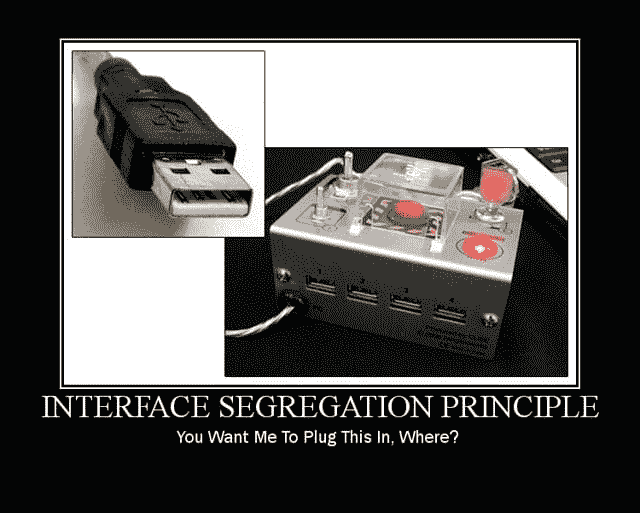

# 固体和其他编程术语

> 原文:[https://dev . to/funkysi 1701/solid-and-other-programming-terms-5533](https://dev.to/funkysi1701/solid-and-other-programming-terms-5533)

这个星期，我一直在寻求提高我对一些编程术语的理解，比如 SOLID，我将尝试定义它们，这样当我感到困惑时，我可以回头看看这里。

### MVC

我以前写过关于 MVC 的博客，但是我的理解并不是 100%正确，所以我将在这里完善一下。

型号——这就是我理解不太正确的地方。我认为模型是实际的源数据，例如 XML 文件、SQL 数据库等。模型是业务逻辑，所以这是源数据的处理版本。MVC 不关心数据存储在哪里，它可以是平面文件、SQL、XML 或任何东西。

**视图**–向用户显示数据，通常是 HTML/CSS 标记。只有与显示相关的逻辑才会包含在视图中。

控制器——这是另一个让我有点困惑的地方。我原以为所有的逻辑都在这里。这是不正确的控制器只关心获取模型和视图之间的数据。

### 固体

固体是面向对象编程和设计的五个原则。

S 代表单一责任原则。一个类或一段代码应该负责做一件事。

[T2】](https://res.cloudinary.com/practicaldev/image/fetch/s--MZ11nLdK--/c_limit%2Cf_auto%2Cfl_progressive%2Cq_auto%2Cw_880/https://storageaccountblog9f5d.blob.core.windows.net/blazor/wp-content/uploads/2017/03/SingleResponsibilityPrinciple2_71060858.jpg%3Fresize%3D300%252C240%26ssl%3D1)

**O** 为开/关原理。代码应该对扩展开放，但对修改关闭。通常这指的是你实现一个接口和增加额外功能的方式。

[T2】](https://res.cloudinary.com/practicaldev/image/fetch/s--vpT_OYjl--/c_limit%2Cf_auto%2Cfl_progressive%2Cq_auto%2Cw_880/https://storageaccountblog9f5d.blob.core.windows.net/blazor/wp-content/uploads/2017/03/ocp.jpg%3Fresize%3D300%252C240%26ssl%3D1)

**L** 为利斯科夫替代原理。程序中的对象可以用该对象的子类型替换，而不改变功能。

[T2】](https://res.cloudinary.com/practicaldev/image/fetch/s--LecNTNSS--/c_limit%2Cf_auto%2Cfl_progressive%2Cq_auto%2Cw_880/https://storageaccountblog9f5d.blob.core.windows.net/blazor/wp-content/uploads/2017/03/LiskovSubtitutionPrinciple_52BB5162.jpg%3Fresize%3D300%252C240%26ssl%3D1)

**I** 为界面偏析原理。大的接口应该被分解成小的接口，这样客户只知道感兴趣的方法。

[T2】](https://res.cloudinary.com/practicaldev/image/fetch/s--j5UIgGwz--/c_limit%2Cf_auto%2Cfl_progressive%2Cq_auto%2Cw_880/https://storageaccountblog9f5d.blob.core.windows.net/blazor/wp-content/uploads/2017/03/isp.jpg%3Fresize%3D300%252C240%26ssl%3D1)

**D** 为依存倒置原则。高级和低级模块应该依赖于抽象。

[T2】](https://res.cloudinary.com/practicaldev/image/fetch/s--rfG7TnAy--/c_limit%2Cf_auto%2Cfl_progressive%2Cq_auto%2Cw_880/https://storageaccountblog9f5d.blob.core.windows.net/blazor/wp-content/uploads/2017/03/dip.jpg%3Fresize%3D300%252C240%26ssl%3D1)

我需要更深入地了解 SOLID，但这里有一些例子。

### 干

干的就是干脆不重复自己。当一个函数调用帮助你不需要在不同的地方使用相同的代码时，通常很容易发现。我经常发现我可以把它付诸行动的地方。