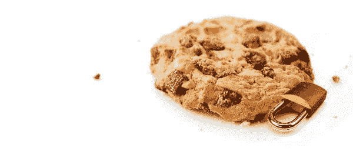
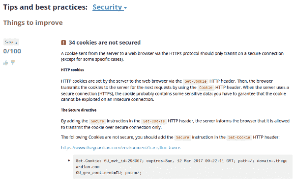

# 保护您的 Cookies(安全和 HttpOnly 标志)

> 原文:[https://dev . to/damienjubeau/secure-your-cookies-secure-and-http only-flags](https://dev.to/damienjubeau/secure-your-cookies-secure-and-httponly-flags)

Cookies 在网络上无处不在，因为它们让发布者直接在用户的网络浏览器上存储数据。cookies 通常包含敏感数据，特别是用于识别用户会话，使 web 服务器能够在用户浏览的整个过程中识别用户。你必须妥善保护他们。 [](https://res.cloudinary.com/practicaldev/image/fetch/s--v6CG0eDr--/c_limit%2Cf_auto%2Cfl_progressive%2Cq_auto%2Cw_880/https://blog.dareboost.com/wp-content/uploads/2016/12/how-to-secure-cookies.jpg)

## Set-Cookie HTTP 头

提醒一下，在服务器响应之后，通常会在 web 浏览器上创建一个 cookie 来存储状态，该状态将在下一个请求中传输。为此，web 服务器在 HTTP 响应中使用 Set-Cookie 头。下面是这种标题的语法:

```
_Set-Cookie: =[; =] [; expires=][; domain=] [; path=][; secure][; HttpOnly]_
```

cookie 由与值相关联的名称来标识。可以设置寿命和/或截止日期。请注意，如果同时设置了这两个属性，则以生存期值(最大年龄)为准。

web 服务器还可以定义用于 cookie 的路径和域。这些域和路径属性允许限制它的范围…或者扩展它(例如，允许它在任何子域上使用)。因此，关于 Cookies 安全性的第一个最佳实践是正确处理它们的范围。

最后两个属性 secure 和 HttpOnly 专门处理安全性。请注意，它们不接受值。它们的存在仅仅意味着浏览器对 cookie 的行为。

## 禁止使用 cookie 用户端感谢 HttpOnly

cookie 可以由 web 服务器放置和使用，也可以通过 Javascript 直接在 web 浏览器上使用。

在 XSS 事件中，攻击者可以注入一些 Javascript，并可能访问 cookiess，提醒一下，这些 cookie 通常包含敏感信息。首先，防止 XSS 违约显然更好。然后，您可以通过定义一个[内容安全策略](https://blog.dareboost.com/en/2016/08/content-security-policy-secure-your-website/)来避免这些弱点被利用。

“HttpOnly”标志阻止通过 javascript 使用 cookie:如果攻击者不顾您的所有预防措施成功地注入了一些 Javascript，他将无法访问 cookie。这将大大限制攻击范围。

## 由于安全标志，禁止使用没有 HTTPs 的 cookie

我们定期在这个博客上推荐:[你的网站要用 HTTPs](https://blog.dareboost.com/en/2016/03/https-requirement-for-your-website/) 。

如果你已经采用了这个协议，并且应用了我们之前的建议，你可能会认为你的 cookies 是受保护的，因为它们是通过安全通信传输的，并且用 Javascript 无法到达。不幸的是，一个值得注意的问题仍然存在。如果一个用户通过 HTTP 访问你的网站，仅仅是因为他没有提到“https://”就输入了你的网址，那该怎么办？

如果你的网页包含混合内容，也会发生这种情况。设置 HSTS (HTTP 严格传输安全)头，将对所有即将到来的访问强制使用 HTTPS，这将限制与第一种情况相关的风险。但是所有的浏览器都不支持这个标题…尽管如此，第一次访问仍然是一个问题。关于第二种情况，内容安全策略可以防止支持“升级不安全请求”策略的浏览器的任何混合内容风险。

实际上，只有安全属性允许您禁止 cookie 通过简单的 HTTP 传输。RFC [HTTP 状态管理机制](https://tools.ietf.org/html/rfc6265)中明确提到了这个标志的意义:

```
_Servers that require a higher level of security SHOULD use the Cookie and Set-Cookie headers only over a secure channel. When using cookies over a secure channel, servers SHOULD set the Secure attribute (see [Section 4.1.2.5](https://tools.ietf.org/html/rfc6265#section-4.1.2.5)) for every cookie. If a server does not set the Secure attribute, the protection provided by the secure channel will be largely moot._
```

显然，请记住，使用此安全标志的 cookie 在任何情况下都不会在您网站的 HTTP 版本上发送。所以，如果你的网站仍然有 HTTPS 和 HTTP 区域，要小心。

作为结论，请随意尝试 Dareboost [网页分析工具](https://www.dareboost.com/)。它将通过检查 HttpOnly 和 secure 是否被正确使用来确保您所有的 cookies 是安全的:
[](https://res.cloudinary.com/practicaldev/image/fetch/s--zd02APed--/c_limit%2Cf_auto%2Cfl_progressive%2Cq_auto%2Cw_880/https://blog.dareboost.com/wp-content/uploads/2016/12/tip-cookie-secure-dareboost.png)