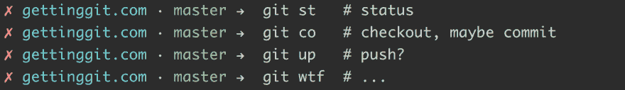
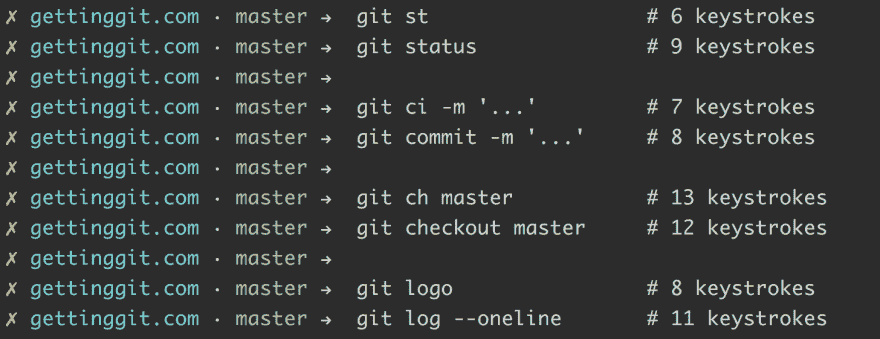
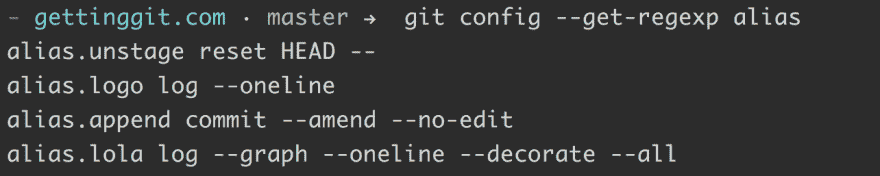

# 停止混淆核心 Git 命令

> 原文:[https://dev.to/gonedark/stop-aliasing-core-git-commands](https://dev.to/gonedark/stop-aliasing-core-git-commands)

Git 的一个核心特性是创建*别名*的能力。这有效地允许您定制 Git 的命令集。作为一名开发人员，当然，你会想要这样做。

然而，最近我遇到了许多声称别名核心命令是使用 Git 的正确方式。不幸的是，甚至 [Pro Git](https://git-scm.com/book/en/v2/Git-Basics-Git-Aliases) 也在他们的例子中使用了核心 Git 命令的别名。

不管怎样，这是**不是**正确的方式是*。*

为什么？两个原因:混淆和速度。

## 混淆视听

虽然别名给了我们自由，但是没有别名核心命令的惯例。所以都是主观的。

[T2】](https://res.cloudinary.com/practicaldev/image/fetch/s--b-L0JfqL--/c_limit%2Cf_auto%2Cfl_progressive%2Cq_auto%2Cw_880/https://jason.pureconcepts.nimg/aliases-core-git-commands.png)

虽然这些命令展示了我们的个人魅力，但它们已经失去了意义。当然，听起来很酷，可能会给你的同事留下深刻印象。但是他们不知道它是做什么的，并且在他们的系统中也没有。

## 速度

混淆核心命令的主要动机是速度。哦，对速度的需求。只要能省下几个按键就行。但是，通过别名化核心 Git 命令，您真正节省了多少击键次数呢？

让我们将一些常见的别名与命令完成进行比较。

[T2】](https://res.cloudinary.com/practicaldev/image/fetch/s--1W0dL8c3--/c_limit%2Cf_auto%2Cfl_progressive%2Cq_auto%2Cw_880/https://jason.pureconcepts.nimg/keystrokes-git-aliases-vs-command-completion.png)

除`git status`外，命令完成并列或节拍别名。此外，命令补全还会补全引用和选项。因此，命令完成保存所有命令的击键，而不仅仅是别名。

最后，别名是一个有用的特性。但是不要混淆核心 Git 命令。相反，使用命令补全作为一种更清晰、更快速的替代方法。

为经常运行且需要选项的 Git 命令保留别名。例如，以下是我目前的别名。两个 alias long `git log`命令和其他命令用额外的定制命令补充 Git 的命令集。

[T2】](https://res.cloudinary.com/practicaldev/image/fetch/s--jp-514dE--/c_limit%2Cf_auto%2Cfl_progressive%2Cq_auto%2Cw_880/https://jason.pureconcepts.nimg/jmac-git-aliases.png)

**更新**
关于范围似乎有些混乱。我的建议是不要为核心 Git 命令**创建 **Git 别名**。这包括像`git st`、`git co`、`git ci`分别作为`git status`、`git checkout`、`git commit`的简称。它不包括一般的 Git 别名或系统别名。**

***想掌握 Git？** [获取 Git](https://gettinggit.com) 包含超过 60 个视频，涵盖 Git 命令以及您每天都会遇到的使用 Git 的场景。*